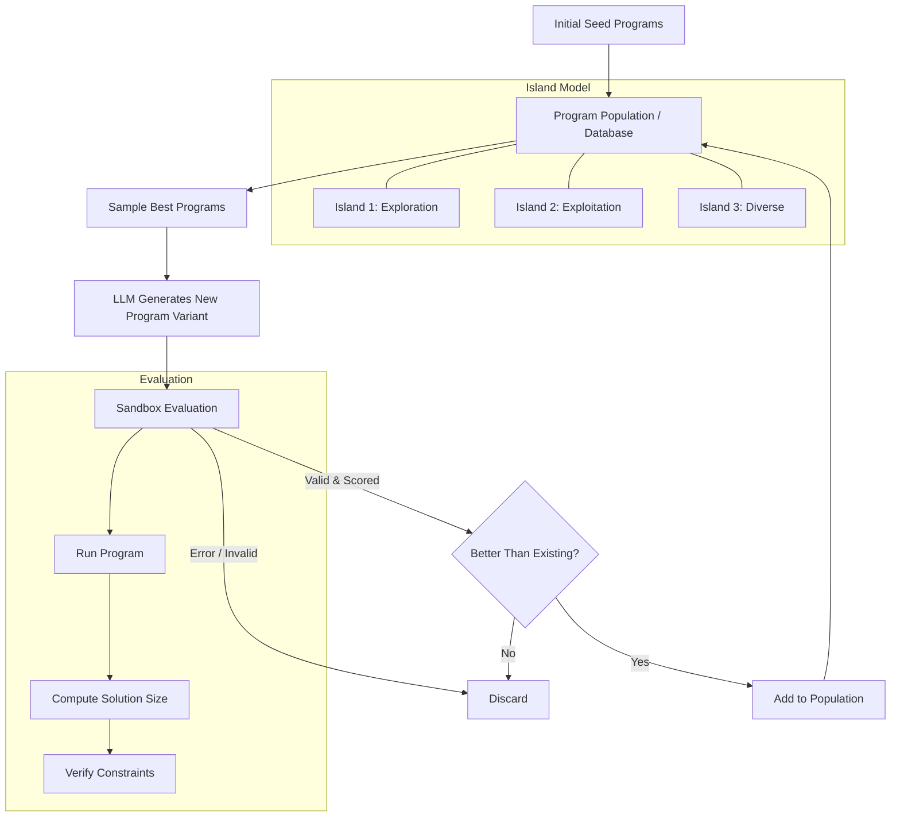

## FunSearch: Evolutionary AI for Combinatorial Mathematics

## Overview

In December 2023, Google DeepMind published FunSearch in Nature, introducing a system that uses large language models within an evolutionary framework to discover new mathematical results. The name "FunSearch" stands for "searching in the space of functions" — rather than evolving fixed solutions, the system evolves Python functions that generate solutions. This distinction is crucial: by operating at the level of programs, FunSearch produces interpretable, generalizable strategies rather than opaque numerical answers.

FunSearch's headline result was discovering the largest known cap set in $\mathbb{F}_3^8$ (dimension 8 of the cap set problem), improving on a bound that had stood for decades. It also found new constructions for the online bin packing problem that outperformed existing heuristics. These are genuine mathematical discoveries — not rediscoveries of known results — made by an AI system.

## The Cap Set Problem

The cap set problem asks: what is the maximum number of points in $\mathbb{F}_3^n$ (vectors of length $n$ with entries in $\{0, 1, 2\}$) such that no three points are collinear (i.e., no three form an arithmetic progression modulo 3)?

For dimension $n$, define the cap set number $a(n)$ as:

$$a(n) = \max \left\{ |S| : S \subseteq \mathbb{F}_3^n, \text{ no three elements of } S \text{ are collinear} \right\}$$

Three points $x, y, z \in \mathbb{F}_3^n$ are collinear if $x + y + z = \mathbf{0} \pmod{3}$. The known values begin:

$$a(1) = 2, \quad a(2) = 4, \quad a(3) = 9, \quad a(4) = 20, \quad a(5) = 45, \quad a(6) = 112$$

The upper bound was dramatically tightened by Ellenberg and Gijswijt (2017) using the polynomial method:

$$a(n) \leq O(2.756^n)$$

FunSearch attacked the constructive lower bound side, finding explicit large cap sets by evolving the construction functions.

## Architecture: Evolutionary LLM Search

FunSearch combines evolutionary algorithms with LLM-based code generation. The system maintains a population of Python programs, each representing a candidate solution strategy. An LLM mutates and recombines programs to create new candidates, which are then evaluated and selected based on fitness.



Key design choices in FunSearch:

- **Evolving functions, not solutions**: The LLM modifies Python functions that produce solutions. This means successful strategies generalize — a function that works for dimension 6 might be adapted for dimension 8.
- **Island model**: The population is split into separate "islands" with different selection pressures. Some islands favor exploration (diverse solutions), others exploitation (refining the best). Periodic migration between islands prevents premature convergence.
- **Sandboxed evaluation**: Every generated program runs in a sandbox with strict time limits. This prevents infinite loops and ensures safety.
- **Best-shot prompting**: The LLM receives the best-performing programs from the database as context, encouraging it to build on successful strategies.

## Code Example: Evolutionary Function Search

The following demonstrates the core FunSearch pattern — evolving Python functions via an LLM-in-the-loop evolutionary algorithm applied to a combinatorial optimization problem:

```python
"""
Simplified FunSearch-style evolutionary algorithm for combinatorics.
This example evolves heuristic functions for a maximum independent set problem.
"""
import itertools
import random
from typing import List, Set, Callable

def evaluate_cap_set(candidate_fn: Callable, dimension: int) -> int:
    """
    Evaluate a candidate cap set construction function.
    Returns the size of the valid cap set produced.
    """
    from itertools import product

    # Generate all points in F_3^n
    all_points = list(product(range(3), repeat=dimension))

    # Use the candidate function to select points
    selected = candidate_fn(all_points, dimension)

    # Verify no three points are collinear (sum to 0 mod 3)
    selected_list = list(selected)
    for i in range(len(selected_list)):
        for j in range(i + 1, len(selected_list)):
            for k in range(j + 1, len(selected_list)):
                p, q, r = selected_list[i], selected_list[j], selected_list[k]
                if all((p[d] + q[d] + r[d]) % 3 == 0 for d in range(dimension)):
                    return 0  # invalid: contains collinear triple
    return len(selected_list)

# --- Example candidate functions (these would be LLM-generated) ---

def greedy_cap_set_v1(points, dim):
    """Greedy construction: add points that don't create collinear triples."""
    cap = []
    random.shuffle(points)
    for p in points:
        valid = True
        for i in range(len(cap)):
            for j in range(i + 1, len(cap)):
                q, r = cap[i], cap[j]
                if all((p[d] + q[d] + r[d]) % 3 == 0 for d in range(dim)):
                    valid = False
                    break
            if not valid:
                break
        if valid:
            cap.append(p)
    return cap

def priority_cap_set_v2(points, dim):
    """
    Priority-based construction: score points by how many collinear
    triples they would block, prefer points that block fewer.
    """
    import numpy as np
    pts = [tuple(p) for p in points]

    # Precompute collinearity relationships
    conflict_count = {p: 0 for p in pts}
    for i, p in enumerate(pts):
        for j in range(i + 1, len(pts)):
            q = pts[j]
            # The third point that would complete a collinear triple
            r = tuple((-(p[d] + q[d])) % 3 for d in range(dim))
            if r in conflict_count:
                conflict_count[p] += 1
                conflict_count[q] += 1

    # Sort by fewest conflicts (most "compatible" points first)
    sorted_pts = sorted(pts, key=lambda p: conflict_count[p])
    return greedy_from_ordering(sorted_pts, dim)

def greedy_from_ordering(ordered_points, dim):
    """Build a cap set greedily from a given point ordering."""
    cap = []
    cap_set = set()
    blocked = set()
    for p in ordered_points:
        if p in blocked:
            continue
        cap.append(p)
        cap_set.add(p)
        # Block points that would create collinear triples
        for q in cap[:-1]:
            r = tuple((-(p[d] + q[d])) % 3 for d in range(dim))
            blocked.add(r)
    return cap

# --- Evolutionary loop (simplified) ---

def evolutionary_search(dimension: int, generations: int = 50,
                        population_size: int = 20) -> int:
    """
    Simplified evolutionary search over cap set construction strategies.
    In real FunSearch, the LLM would generate new function variants;
    here we simulate mutation by randomizing parameters.
    """
    best_size = 0
    best_fn = None

    for gen in range(generations):
        results = []
        for _ in range(population_size):
            # In real FunSearch: LLM generates a new function variant
            # Here we simulate by running greedy with random shuffles
            size = evaluate_cap_set(greedy_cap_set_v1, dimension)
            results.append(size)

        gen_best = max(results)
        if gen_best > best_size:
            best_size = gen_best
            print(f"Generation {gen}: new best cap set size = {best_size}")

    return best_size

# Run for small dimensions
for dim in [3, 4, 5]:
    print(f"\n--- Dimension {dim} ---")
    print(f"Known optimal: a({dim}) = {[0,0,0,9,20,45][dim]}")
    found = evolutionary_search(dim, generations=30, population_size=10)
    print(f"Best found: {found}")
```

## Why Functions, Not Solutions?

The decision to evolve functions rather than raw solutions is what makes FunSearch mathematically meaningful. A cap set of size 512 in $\mathbb{F}_3^8$ is just a list of vectors — useful but opaque. A function that constructs that cap set reveals the underlying structure and strategy. Mathematicians can inspect the evolved functions to extract new insights about the problem.

In the cap set case, FunSearch discovered construction functions that used novel symmetry-based decompositions of $\mathbb{F}_3^n$. These constructions were interpretable enough that mathematicians could verify and extend them, leading to genuine new mathematical understanding.

## Connections to Program Synthesis

FunSearch can be viewed as a form of program synthesis guided by evolutionary pressure. The search space is the space of all Python programs (restricted to a given function signature), and the fitness function is the quality of the mathematical object each program produces. The LLM acts as a powerful mutation operator that understands code structure, making it far more efficient than random code mutation.

The fitness landscape for combinatorial problems is often rugged with many local optima. The island model helps navigate this landscape by maintaining diverse solution strategies simultaneously. Migration between islands allows successful strategies from one niche to cross-pollinate with strategies from another.

## Key Takeaways

- FunSearch evolves Python functions (not raw solutions) using an LLM as the mutation operator within an evolutionary algorithm
- It discovered the largest known cap set in $\mathbb{F}_3^8$, a genuine new result in combinatorial mathematics
- The island model maintains population diversity, balancing exploration and exploitation
- Evolving functions produces interpretable, generalizable construction strategies that mathematicians can analyze
- Sandboxed evaluation ensures safety and correctness — every candidate is verified before entering the population
- The approach is domain-general: any problem where solutions can be evaluated programmatically is amenable to FunSearch
