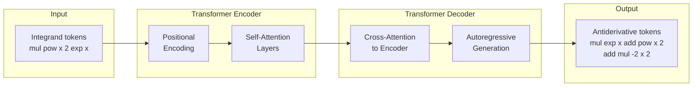

# Neural Network Approaches to Symbolic Mathematics

## Overview

For centuries, symbolic mathematics -- integration, differentiation, simplification, equation solving -- has been the province of human mathematicians and, more recently, computer algebra systems (CAS) like Mathematica, Maple, and SymPy. These systems apply deterministic rewriting rules: pattern matching, heuristic search, and algorithmic procedures like the Risch algorithm for integration. They are exact, reliable, and well-understood.

But in 2019, a landmark paper by Lample and Charton at Facebook AI Research demonstrated something unexpected: a neural network, trained as a sequence-to-sequence model, could learn to perform symbolic integration and solve ordinary differential equations -- often outperforming traditional CAS on difficult problems. This opened an entirely new paradigm: treating symbolic mathematics as a **language translation** problem, where mathematical expressions are sequences of tokens and the task is to translate from "problem" to "solution."

This lesson explores how deep learning approaches symbolic math tasks, compares them with classical CAS methods, and examines the growing field of symbolic regression -- discovering formulas from numerical data.

---

## Symbolic Math as Machine Translation

### The Key Insight

A mathematical expression like $\int x^2 e^x \, dx$ can be written as a tree (an abstract syntax tree) or serialized into a token sequence. Lample and Charton's insight was that integration is structurally similar to language translation: given an input sequence (the integrand), produce an output sequence (the antiderivative).

The integrand $\int x^2 e^x \, dx$ becomes a prefix-notation token sequence:

$$\texttt{mul}\ \texttt{pow}\ x\ 2\ \texttt{exp}\ x$$

And the solution $e^x(x^2 - 2x + 2)$ becomes:

$$\texttt{mul}\ \texttt{exp}\ x\ \texttt{add}\ \texttt{pow}\ x\ 2\ \texttt{add}\ \texttt{mul}\ -2\ x\ 2$$

A Transformer trained on millions of such pairs learns to map input sequences to output sequences, effectively learning integration rules, integration by parts, substitution techniques, and more -- all implicitly from data.



### Training Data Generation

A critical challenge is obtaining training data. Lample and Charton solved this elegantly: instead of integrating random expressions (which is hard), they **generated random antiderivatives and differentiated them**. Since differentiation is algorithmic and always succeeds, this produces unlimited (integrand, antiderivative) pairs. The same backward-generation approach works for ODE solving -- generate an ODE solution, compute the corresponding ODE, and train the model to go from ODE to solution.

### Results

The Transformer model achieved over 99% accuracy on integration problems drawn from the same distribution as training data, and significantly outperformed Mathematica and Matlab on specific classes of difficult integrals. It solved problems in milliseconds that CAS could not solve within a 30-second timeout.

---

## Neural Expression Simplification

Beyond integration, neural networks have been applied to **simplifying** mathematical expressions. Given a complex expression, the goal is to produce an equivalent but simpler form. For example:

$$\frac{\sin^2(x) + \cos^2(x)}{1} + \frac{x^2 - 1}{x - 1} \quad \longrightarrow \quad x + 2$$

Traditional CAS rely on collections of rewriting rules applied in a fixed order. Neural approaches learn simplification strategies end-to-end, potentially discovering non-obvious simplification paths that rule-based systems miss.

Recent work combines reinforcement learning with tree-structured representations: an agent repeatedly selects which sub-expression to rewrite and which rule to apply, receiving reward for reducing expression complexity. This approach, sometimes called **neural-guided rewriting**, can outperform greedy rule application by planning ahead.

---

## Symbolic Regression

Symbolic regression is the task of discovering a mathematical formula $f(x)$ from data points $\{(x_i, y_i)\}$. Unlike standard regression (which fits parameters of a fixed functional form), symbolic regression searches over the space of all possible formulas.

Classical approaches use genetic programming -- evolving populations of expression trees via mutation and crossover. Modern neural approaches include:

- **AI Feynman** (Udrescu & Tegmark, 2020): Uses neural networks to detect properties like symmetry, separability, and compositionality, then recursively decomposes the problem.
- **Deep Symbolic Regression** (Petersen et al., 2021): Uses reinforcement learning with an RNN to generate expression trees token by token.
- **SymbolicGPT** (Valipour et al., 2021): A Transformer pre-trained on synthetic datasets that predicts symbolic expressions from numerical observations in a single forward pass.

The promise of symbolic regression is **interpretability**: instead of a black-box neural network, you get a closed-form formula like $F = G \frac{m_1 m_2}{r^2}$ that reveals the underlying structure of the data.

---

## Comparison with Traditional CAS

| Feature | Traditional CAS | Neural Approaches |
|---|---|---|
| Correctness guarantee | Exact, provably correct | Approximate, may produce errors |
| Speed on hard problems | Can be slow or fail | Fast (single forward pass) |
| Generalization | Limited to implemented algorithms | Can generalize to unseen patterns |
| Interpretability of method | Transparent rule application | Black-box learned behavior |
| Training data needed | None (algorithmic) | Large datasets required |
| Handling novel problem types | Requires new algorithm design | May learn from examples |

The most promising direction is **hybrid systems** that combine neural networks for proposing candidate solutions with CAS for verification. The neural model generates a candidate antiderivative, and a CAS checks whether its derivative equals the original integrand. This gives both speed and correctness.

---

## Code Example

The following example demonstrates both the classical CAS approach using SymPy and a sketch of how a neural approach tokenizes and processes expressions.

```python
"""
Symbolic integration: CAS vs. neural-style tokenization.
Demonstrates SymPy integration and expression tree serialization
that would be used to train a seq2seq model.
"""
import sympy as sp

x = sp.Symbol('x')

# --- Classical CAS Integration with SymPy ---
integrands = [
    x**2 * sp.exp(x),
    sp.sin(x)**2,
    1 / (1 + x**2),
    sp.sqrt(1 - x**2),
]

print("=== SymPy Symbolic Integration ===")
for expr in integrands:
    result = sp.integrate(expr, x)
    # Verify by differentiating the result
    check = sp.simplify(sp.diff(result, x) - expr)
    print(f"  integral of {expr} dx = {result}")
    print(f"  verification (should be 0): {check}\n")

# --- Neural-style: prefix tokenization of expression trees ---
def expr_to_prefix(expr):
    """Convert a SymPy expression to prefix-notation tokens,
    mimicking the tokenization used by Lample & Charton (2019)."""
    if expr.is_Symbol:
        return [str(expr)]
    if expr.is_Integer:
        return [str(expr)]
    if expr.is_Rational and not expr.is_Integer:
        return ['div', str(expr.p), str(expr.q)]

    op = type(expr).__name__  # Add, Mul, Pow, sin, exp, etc.
    args = expr.args

    if len(args) == 1:
        return [op.lower()] + expr_to_prefix(args[0])
    elif len(args) == 2:
        return [op.lower()] + expr_to_prefix(args[0]) + expr_to_prefix(args[1])
    else:
        # Reduce n-ary ops to binary
        tokens = [op.lower()]
        tokens += expr_to_prefix(args[0])
        remaining = type(expr)(*args[1:])
        tokens += expr_to_prefix(remaining)
        return tokens

print("=== Prefix Tokenization (for seq2seq training) ===")
integrand = x**2 * sp.exp(x)
antideriv = sp.integrate(integrand, x)

input_tokens = expr_to_prefix(integrand)
output_tokens = expr_to_prefix(antideriv)

print(f"  Integrand: {integrand}")
print(f"  Input tokens:  {' '.join(input_tokens)}")
print(f"  Antiderivative: {antideriv}")
print(f"  Output tokens: {' '.join(output_tokens)}")

# --- Generate training data (backward generation) ---
print("\n=== Backward Data Generation ===")
import random
random.seed(42)

def random_antiderivative(depth=2):
    """Generate a random symbolic expression to use as an antiderivative."""
    if depth == 0:
        return random.choice([x, sp.Integer(random.randint(1, 5))])
    op = random.choice(['add', 'mul', 'pow', 'sin', 'exp'])
    if op == 'add':
        return random_antiderivative(depth-1) + random_antiderivative(depth-1)
    elif op == 'mul':
        return random_antiderivative(depth-1) * random_antiderivative(depth-1)
    elif op == 'pow':
        return random_antiderivative(depth-1) ** random.randint(2, 3)
    elif op == 'sin':
        return sp.sin(random_antiderivative(depth-1))
    elif op == 'exp':
        return sp.exp(random_antiderivative(depth-1))

print("  Generated (integrand, antiderivative) training pairs:")
for i in range(3):
    F = random_antiderivative(depth=2)
    f = sp.diff(F, x)
    f_simplified = sp.simplify(f)
    print(f"  Pair {i+1}:")
    print(f"    F(x)  = {F}")
    print(f"    f(x)  = {f_simplified}")
    print()
```

---

## Key Takeaways

- Symbolic mathematics tasks like integration and ODE solving can be framed as **sequence-to-sequence translation** problems, where expression trees are serialized into token sequences.
- The backward data generation trick -- generating solutions first, then computing the corresponding problems -- enables unlimited training data for tasks where the inverse direction is easy.
- **Symbolic regression** discovers interpretable formulas from data, bridging the gap between black-box ML and scientific understanding.
- Hybrid approaches combining neural proposal with CAS verification offer the best of both worlds: the speed and pattern recognition of neural networks with the correctness guarantees of algebraic computation.
- These methods represent a paradigm shift: instead of programming mathematical knowledge as rules, we can **learn** mathematical transformations from examples.
