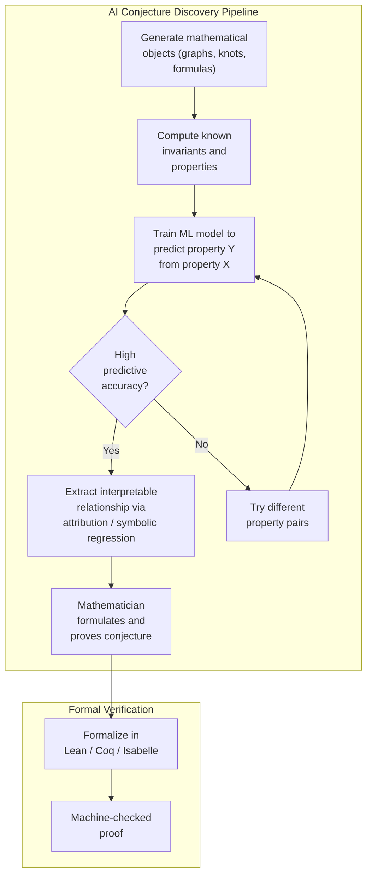

# Frontiers and Future Directions in AI for Mathematics

## Overview

The intersection of AI and mathematics is evolving at a remarkable pace. We have seen AI prove theorems, discover new patterns, and solve olympiad-level problems. But these successes only hint at what lies ahead. This lesson surveys the frontier: open competitions pushing the boundaries of AI mathematical reasoning, autonomous systems that generate and test conjectures, multi-modal reasoning over diagrams and formulas, and the philosophical questions raised when machines participate in mathematical discovery.

---

## The AI Mathematical Olympiad (AIMO)

The AI Mathematical Olympiad Prize, launched in 2023 with a grand prize of \$5 million, challenges teams to build AI systems that can solve problems at the level of the International Mathematical Olympiad (IMO). The competition uses carefully curated problems that require multi-step reasoning, creative insight, and rigorous proof construction.

Consider a typical competition-level problem: prove that for all positive integers $n$,

$$\sum_{k=1}^{n} \frac{1}{k^2} < 2 - \frac{1}{n}$$

Solving this requires recognizing a telescoping argument. An AI system must not merely compute -- it must **reason**: choose a proof strategy, manipulate inequalities symbolically, and verify each step logically. Early AIMO results showed that LLM-based systems could solve a significant fraction of preliminary-round problems, with AlphaProof and AlphaGeometry (DeepMind, 2024) achieving silver-medal performance at the IMO by combining neural guidance with formal verification.

The significance extends beyond competitions. Success at olympiad-level mathematics requires the kind of flexible, creative reasoning that would transfer to research-level mathematics and scientific problem solving more broadly.

---

## Autonomous Conjecture Generation

Most AI theorem-proving work focuses on proving **known** results. A more ambitious goal is **discovering** new mathematics -- generating conjectures that are novel, non-trivial, and true.

### The Ramanujan Machine

The Ramanujan Machine project (Raayoni et al., 2021) uses algorithms to discover new continued-fraction representations of mathematical constants. For example, it discovered conjectured identities like:

$$\frac{e}{e - 2} = 4 + \cfrac{1}{5 + \cfrac{1}{6 + \cfrac{2}{7 + \cfrac{3}{8 + \cdots}}}}$$

The approach is systematic: enumerate candidate continued-fraction structures, evaluate them numerically to high precision, and check whether the result matches a known constant. When a match is found to hundreds of digits, it is strong evidence (though not proof) of a new identity.

### AI-Driven Conjecture in Graph Theory

DeepMind's collaboration with mathematicians (Davies et al., 2021, published in *Nature*) used ML to discover a new connection between algebraic and geometric invariants of knots, and to find new insights in representation theory. The approach trains a neural network to predict one mathematical quantity from another; when the network succeeds, it suggests a relationship that mathematicians then investigate and prove rigorously.



---

## Multi-Modal Mathematical Reasoning

Real mathematics is not purely textual. Mathematicians reason with **diagrams** (geometric figures, commutative diagrams, function plots), **formulas** (symbolic expressions in $\LaTeX$), and **natural language** (definitions, intuition, proof sketches) simultaneously.

Current AI systems largely process text-only representations. The frontier involves multi-modal systems that can:

- Parse and understand geometric diagrams (AlphaGeometry interprets geometric constructions)
- Read and reason about commutative diagrams in algebra and topology
- Integrate visual intuition with formal reasoning -- for instance, "seeing" that a function is convex from its graph and then proving it algebraically

A multi-modal mathematical agent would take as input a paper containing text, equations, and figures, and produce as output a formalized proof or a verified computation. This requires advances in vision-language models, mathematical OCR, and the grounding of visual concepts in formal logic.

Open problems in this area include:

$$\text{Can AI learn to reason about topological spaces from their visual representations?}$$

$$\text{Can diagram-based proofs (e.g., in category theory) be automatically formalized?}$$

---

## Mathematical Agents

The most ambitious vision is an **autonomous mathematical research agent**: a system that can read papers, identify open problems, formulate conjectures, construct proofs, and write up results -- the full cycle of mathematical research.

Such an agent would combine:

1. **Literature comprehension**: Parsing mathematical papers, extracting definitions, theorems, and proof techniques
2. **Conjecture generation**: Proposing plausible new results based on patterns and analogies
3. **Proof search**: Attempting to prove conjectures using a mix of neural guidance and formal verification
4. **Formalization**: Translating informal reasoning into machine-checkable proof (Lean, Coq, Isabelle)
5. **Communication**: Writing clear, human-readable mathematical exposition

Current systems handle some of these components individually. LeanDojo and ReProver automate parts of formalization. LLMs can read and summarize papers. The integration into a coherent agent remains an open challenge.

---

## Code Example: A Simple Conjecture-Testing Agent

The following code demonstrates a minimal conjecture-testing agent that generates number-theoretic conjectures and tests them empirically.

```python
"""
A simple conjecture-testing agent for number theory.
The agent generates candidate conjectures about integer sequences
and tests them against computed data.
"""
import sympy as sp
from sympy import isprime, factorint, totient, divisor_count
from typing import Callable

def test_conjecture(
    name: str,
    predicate: Callable[[int], bool],
    domain: range,
    verbose: bool = True
) -> dict:
    """Test a conjecture over a range of integers."""
    counterexamples = []
    for n in domain:
        try:
            if not predicate(n):
                counterexamples.append(n)
                if len(counterexamples) >= 5:
                    break
        except (ValueError, ZeroDivisionError):
            continue

    result = {
        "name": name,
        "tested": len(domain),
        "status": "NO COUNTEREXAMPLE FOUND" if not counterexamples
                  else "REFUTED",
        "counterexamples": counterexamples
    }
    if verbose:
        print(f"\n  Conjecture: {name}")
        print(f"  Tested n in [{domain.start}, {domain.stop - 1}]")
        print(f"  Status: {result['status']}")
        if counterexamples:
            print(f"  Counterexamples: {counterexamples}")
    return result

print("=== Number Theory Conjecture-Testing Agent ===\n")

# Conjecture 1 (TRUE): Goldbach-like check for small evens
# Every even integer >= 4 is the sum of two primes
test_conjecture(
    "Every even n >= 4 is the sum of two primes (Goldbach)",
    lambda n: n % 2 == 1 or n < 4 or any(
        isprime(k) and isprime(n - k) for k in range(2, n)
    ),
    range(2, 2000)
)

# Conjecture 2 (TRUE): For prime p, phi(p) = p - 1
test_conjecture(
    "For prime p: euler_totient(p) = p - 1",
    lambda p: not isprime(p) or totient(p) == p - 1,
    range(2, 5000)
)

# Conjecture 3 (FALSE): n^2 + n + 41 is always prime (Euler's)
test_conjecture(
    "n^2 + n + 41 is always prime",
    lambda n: isprime(n**2 + n + 41),
    range(0, 100)
)

# Conjecture 4 (TRUE in tested range): Brocard's problem
# n! + 1 is a perfect square only for n = 4, 5, 7
from sympy import sqrt as sp_sqrt
test_conjecture(
    "n! + 1 is a perfect square only for n in {4, 5, 7} (Brocard)",
    lambda n: (
        sp.factorial(n) + 1 != int(sp.isqrt(sp.factorial(n) + 1))**2
        or n in {4, 5, 7}
    ),
    range(1, 50)
)

# --- Automated conjecture generation ---
print("\n\n=== Automated Conjecture Generator ===\n")

def discover_relationships(n_range: range):
    """Search for simple relationships between number-theoretic functions."""
    functions = {
        "d(n)": divisor_count,        # number of divisors
        "phi(n)": totient,             # Euler's totient
    }

    # Test: is phi(n) * d(n) >= n for all n >= 2?
    conjecture_holds = True
    for n in n_range:
        if totient(n) * divisor_count(n) < n:
            conjecture_holds = False
            print(f"  Counterexample to phi(n)*d(n) >= n: n={n}")
            break

    if conjecture_holds:
        print(f"  Discovered: phi(n) * d(n) >= n holds for "
              f"n in [{n_range.start}, {n_range.stop - 1}]")
        print("  (This is a known inequality in number theory)")

discover_relationships(range(2, 10000))
```

---

## Ethical Considerations

As AI becomes capable of genuine mathematical contribution, several philosophical and ethical questions arise:

- **Attribution**: If an AI discovers a conjecture that a human then proves, who deserves credit? What if the AI also provides the proof?
- **What counts as understanding?** A formal proof verifier confirms correctness but has no "understanding." Does an AI that generates proofs via learned heuristics "understand" the mathematics?
- **Impact on education**: If AI can solve homework problems and competition tasks, how should mathematics education adapt?
- **Access and equity**: Will AI mathematical tools widen or narrow the gap between well-resourced and under-resourced research groups?
- **Creativity and aesthetics**: Mathematicians value elegant proofs. Can AI learn mathematical taste, or does it optimize purely for correctness?

These questions do not have settled answers. The mathematical community is actively debating norms around AI-assisted research, with journals beginning to formulate policies on AI co-authorship and disclosure.

---

## Key Takeaways

- The **AIMO Prize** and similar competitions are driving rapid progress in AI mathematical reasoning, with systems now approaching silver-medal IMO performance.
- **Autonomous conjecture generation** -- exemplified by the Ramanujan Machine and DeepMind's knot-theory work -- represents a shift from AI as proof assistant to AI as research collaborator.
- **Multi-modal reasoning** over diagrams, formulas, and text is a critical open frontier, since real mathematical practice integrates all three modalities.
- The vision of a fully autonomous **mathematical research agent** requires integrating literature comprehension, conjecture generation, proof search, formalization, and exposition into a coherent system.
- Ethical questions around attribution, understanding, and the nature of mathematical creativity will shape how the community adopts these tools.
