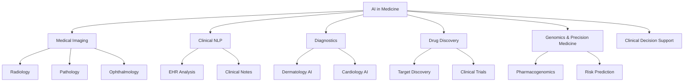

## Introduction to AI in Medicine

## Overview

Medicine is one of the most data-rich and consequential domains in human activity. Every patient encounter generates clinical notes, lab results, imaging studies, and medication records. Yet for most of medical history, physicians have relied on pattern recognition honed through years of training and experience — a fundamentally human process limited by cognitive capacity, fatigue, and the sheer volume of medical knowledge doubling every 73 days.

**Artificial intelligence is transforming medicine** by augmenting clinical reasoning, automating routine analysis, accelerating drug discovery, and enabling personalized treatment at population scale. From detecting diabetic retinopathy in retinal scans to predicting sepsis hours before clinical deterioration, AI systems are entering clinical workflows with measurable impact on patient outcomes.

This lesson introduces the landscape of AI in medicine: its history, why healthcare is both a natural fit and a uniquely challenging domain for machine learning, and the major application areas covered in this track.

---

## Why Medicine Needs AI

Healthcare faces several structural challenges that AI can address:

**Information overload.** A primary care physician would need to read for 29 hours per day to keep up with new medical literature. AI can synthesize evidence, surface relevant studies, and provide decision support at the point of care.

**Diagnostic variability.** Inter-observer agreement among pathologists reading tissue slides can be as low as 50-60% for some cancer grades. AI models trained on thousands of annotated cases can provide consistent, reproducible second opinions.

**Access gaps.** Over half the world's population lacks access to essential health services. AI-powered tools running on smartphones can bring screening (e.g., skin lesion analysis, retinal imaging) to underserved regions without requiring specialist physicians on-site.

**Cost pressure.** Healthcare spending exceeds $4 trillion annually in the US alone. AI can reduce costs through earlier diagnosis (treating disease before it becomes expensive), workflow automation (reducing administrative burden), and optimized resource allocation.

---

## A Brief History

### Rule-Based Expert Systems (1970s–1990s)

The earliest medical AI systems were **expert systems** — rule-based programs encoding clinical knowledge as if-then rules:

- **MYCIN (1976)** diagnosed bacterial infections and recommended antibiotics. It outperformed many physicians but was never deployed clinically due to trust and liability concerns.
- **INTERNIST-1 / QMR** covered internal medicine with thousands of disease-symptom associations.
- **DXplain** generated ranked differential diagnoses from clinical findings.

These systems were brittle — they couldn't handle uncertainty gracefully, required manual knowledge engineering, and couldn't learn from data.

### Statistical Learning and Evidence-Based Medicine (1990s–2010s)

The evidence-based medicine movement brought statistical rigor. Logistic regression, survival analysis, and Bayesian networks became standard tools:

- **Framingham Risk Score** used logistic regression to predict cardiovascular risk.
- **APACHE scoring** predicted ICU mortality.
- **Bayesian networks** modeled probabilistic relationships between symptoms and diseases.

### Deep Learning Revolution (2012–Present)

The deep learning era began with image classification and rapidly spread to medical applications:

- **2016**: Gulshan et al. demonstrated that a CNN could detect diabetic retinopathy from retinal fundus images at specialist-level accuracy.
- **2017**: Esteva et al. showed a CNN matching dermatologists at classifying skin lesions.
- **2020**: DeepMind's AlphaFold solved protein structure prediction, with profound implications for drug discovery.
- **2023-2025**: Large language models (GPT-4, Med-PaLM 2) demonstrated medical reasoning capabilities, passing USMLE and medical board exams.

---

## Key Application Areas



**AI application areas in medicine**

The major domains where AI is making clinical impact include:

- **Medical Imaging**: Automated analysis of X-rays, CT scans, MRIs, pathology slides, and retinal images (Lessons 2 and 5)
- **Clinical Decision Support**: Systems that assist physicians with diagnosis, treatment planning, and risk stratification (Lesson 3)
- **Clinical NLP**: Extracting structured information from unstructured clinical notes and medical literature (Lesson 4)
- **Diagnostics**: AI-powered screening and diagnosis in dermatology, ophthalmology, and radiology (Lesson 5)
- **Electronic Health Records**: Mining EHR data for predictive analytics and population health (Lesson 6)
- **Drug Discovery**: AI-accelerated target identification, molecule design, and clinical trial optimization (Lesson 7)
- **Precision Medicine**: Genomic analysis, pharmacogenomics, and personalized treatment selection (Lesson 8)
- **Regulation and Ethics**: FDA pathways, bias mitigation, and responsible deployment (Lesson 9)

---

## Technical Foundations

Medical AI draws on several core ML techniques:

### Convolutional Neural Networks (CNNs)

The workhorse of medical imaging AI. Architectures like ResNet, DenseNet, and U-Net are adapted for detecting lesions, segmenting organs, and classifying pathology:

$$\hat{y} = f_\theta(\mathbf{x}) = \text{softmax}(W_L \cdot \sigma(W_{L-1} \cdots \sigma(W_1 * \mathbf{x} + b_1) \cdots + b_{L-1}) + b_L)$$

where $*$ denotes convolution, $\sigma$ is an activation function, and $W_i, b_i$ are learned parameters.

### Natural Language Processing

Transformer-based models (BERT, GPT) are fine-tuned on clinical text for:
- Named entity recognition (medications, diseases, procedures)
- Relation extraction (drug-disease, symptom-diagnosis)
- Clinical text summarization

### Survival Analysis and Time-to-Event Models

Medical outcomes are often time-dependent. The **Cox proportional hazards model** is a classical approach:

$$h(t|\mathbf{x}) = h_0(t) \exp(\beta^T \mathbf{x})$$

Deep learning extensions like **DeepSurv** replace the linear predictor $\beta^T \mathbf{x}$ with a neural network.

---

## Code Example: Loading a Medical Imaging Dataset

```python
import torchvision.transforms as transforms
from torchvision.datasets import ImageFolder
from torch.utils.data import DataLoader

# Standard preprocessing for chest X-ray classification
transform = transforms.Compose([
    transforms.Resize((224, 224)),
    transforms.ToTensor(),
    transforms.Normalize(
        mean=[0.485, 0.456, 0.406],  # ImageNet means
        std=[0.229, 0.224, 0.225]
    ),
])

# Load a chest X-ray dataset (e.g., CheXpert, NIH ChestX-ray14)
dataset = ImageFolder(root="data/chestxray/train", transform=transform)
loader = DataLoader(dataset, batch_size=32, shuffle=True, num_workers=4)

# Inspect a batch
images, labels = next(iter(loader))
print(f"Batch shape: {images.shape}")  # [32, 3, 224, 224]
print(f"Labels: {labels[:5]}")
print(f"Classes: {dataset.classes}")
```

---

## Unique Challenges in Medical AI

Medical AI faces challenges that don't exist — or matter less — in other domains:

**Data privacy and regulation.** Patient data is protected by HIPAA (US), GDPR (EU), and similar regulations worldwide. Acquiring and sharing training data requires institutional review board (IRB) approval, de-identification, and often federated learning approaches.

**Class imbalance.** Rare diseases may have only dozens of cases in a dataset of millions. A model that predicts "healthy" for every input achieves 99.9% accuracy on a disease with 0.1% prevalence — but is clinically useless.

**Distribution shift.** A model trained on data from one hospital may fail at another due to differences in patient demographics, imaging equipment, clinical practices, and disease prevalence. This is the **domain shift** problem.

**Explainability requirements.** Clinicians need to understand *why* a model made a prediction, not just what it predicted. Black-box models face adoption barriers in high-stakes medical decisions.

**Validation standards.** Medical AI must meet clinical validation standards — randomized controlled trials, prospective studies, FDA clearance — far more rigorous than typical ML benchmarking.

---

## Real-World Applications

- **IDx-DR**: First FDA-authorized autonomous AI diagnostic system (2018) for detecting diabetic retinopathy without physician oversight.
- **Viz.ai**: AI-powered stroke detection that alerts neurovascular specialists within minutes of CT scan acquisition, reducing time-to-treatment.
- **PathAI**: Deep learning for pathology that assists pathologists in cancer grading and biomarker quantification.
- **Google Health**: Demonstrated AI matching or exceeding radiologists in breast cancer screening across US and UK datasets.

---

## Exercises

1. **Explore a public medical dataset**: Download the NIH ChestX-ray14 dataset or MIMIC-CXR. Write code to load images, inspect label distributions, and visualize class imbalance.
2. **Literature review**: Read Topol (2019) "High-performance medicine: the convergence of human and artificial intelligence" and summarize the three most impactful AI applications discussed.
3. **Ethical analysis**: For a medical AI system of your choice, list three potential failure modes and their clinical consequences.

---

## Further Reading

- Topol, E.J. (2019). "High-performance medicine: the convergence of human and artificial intelligence." *Nature Medicine* — comprehensive review of medical AI
- Rajpurkar, P. et al. (2022). "AI in health and medicine." *Nature Medicine* — state-of-the-art survey
- FDA AI/ML-based SaMD resource page — regulatory framework for AI-based medical devices
