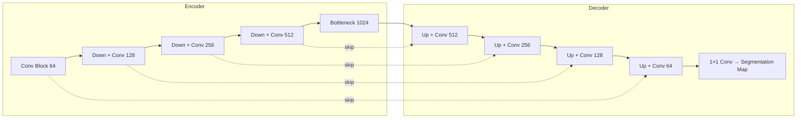

# Medical Imaging AI

## Overview

Medical imaging is the highest-impact application area for AI in healthcare. Radiology, pathology, dermatology, and ophthalmology all rely on visual pattern recognition — a task where deep learning has achieved human-expert-level performance in controlled settings. Every year, over 3.6 billion medical imaging procedures are performed worldwide, generating petabytes of data that no team of radiologists could fully analyze.

AI for medical imaging encompasses **detection** (finding abnormalities), **segmentation** (delineating organ or lesion boundaries), **classification** (assigning diagnostic labels), and **quantification** (measuring size, volume, or density changes over time). This lesson covers the architectures, training strategies, and deployment considerations for building medical imaging AI systems.

---

## Imaging Modalities

Different imaging modalities produce fundamentally different data types:

| Modality | Data Type | Resolution | Common AI Tasks |
|----------|-----------|------------|-----------------|
| X-ray | 2D grayscale | ~3000×3000 px | Lung nodule detection, fracture detection |
| CT | 3D volume | 512×512×N slices | Organ segmentation, tumor detection |
| MRI | 3D multi-sequence | 256×256×N | Brain tumor segmentation, cardiac analysis |
| Ultrasound | 2D/3D real-time | ~640×480 | Fetal measurement, echocardiography |
| Pathology | 2D gigapixel | ~100,000×100,000 px | Cancer grading, mitosis detection |
| Fundus photos | 2D color | ~2000×2000 px | Diabetic retinopathy, glaucoma screening |

---

## Key Architectures

### Classification: Transfer Learning with CNNs

The standard approach for medical image classification is **transfer learning** — starting from a CNN pretrained on ImageNet and fine-tuning on medical data:

```python
import torch
import torch.nn as nn
from torchvision import models

# Load pretrained ResNet-50
model = models.resnet50(pretrained=True)

# Replace final classification layer for binary disease detection
num_classes = 2  # normal vs. abnormal
model.fc = nn.Linear(model.fc.in_features, num_classes)

# Freeze early layers, fine-tune later layers
for param in list(model.parameters())[:-20]:
    param.requires_grad = False

# Loss function for imbalanced data
pos_weight = torch.tensor([10.0])  # upweight positive (disease) class
criterion = nn.BCEWithLogitsLoss(pos_weight=pos_weight)
```

Transfer learning is effective because low-level features (edges, textures) learned from natural images transfer well to medical images, while higher layers adapt to domain-specific patterns.

### Segmentation: U-Net and Variants

**U-Net** (Ronneberger et al., 2015) is the foundational architecture for medical image segmentation. Its encoder-decoder structure with skip connections preserves spatial detail:



**U-Net architecture with skip connections**

Key variants include:

- **V-Net**: 3D U-Net for volumetric (CT/MRI) segmentation with residual connections
- **Attention U-Net**: Adds attention gates that learn to focus on relevant regions
- **nnU-Net**: Self-configuring framework that automatically adapts U-Net hyperparameters to any medical segmentation task — often the strongest baseline

### Segmentation Loss Functions

Medical segmentation often uses the **Dice loss**, which directly optimizes the overlap between predicted and ground-truth masks:

$$\mathcal{L}_{\text{Dice}} = 1 - \frac{2 \sum_i p_i g_i + \epsilon}{\sum_i p_i + \sum_i g_i + \epsilon}$$

where $p_i$ is the predicted probability at pixel $i$, $g_i$ is the ground truth label, and $\epsilon$ is a smoothing term. Combined loss is common:

$$\mathcal{L} = \lambda_1 \mathcal{L}_{\text{BCE}} + \lambda_2 \mathcal{L}_{\text{Dice}}$$

### Detection: Object Detection for Lesions

For detecting discrete lesions (lung nodules, liver lesions, fractures), object detection architectures are adapted:

- **RetinaNet** with focal loss for handling extreme class imbalance
- **YOLO variants** for real-time detection in ultrasound
- **3D detection networks** for volumetric CT/MRI analysis

The **focal loss** addresses class imbalance by down-weighting easy (background) examples:

$$\mathcal{L}_{\text{focal}} = -\alpha_t (1 - p_t)^\gamma \log(p_t)$$

where $\gamma$ (typically 2) reduces the contribution of well-classified examples.

---

## Training Strategies for Medical Imaging

### Data Augmentation

Medical datasets are small compared to natural image benchmarks. Aggressive augmentation is critical:

```python
import albumentations as A

train_transform = A.Compose([
    A.RandomResizedCrop(224, 224, scale=(0.8, 1.0)),
    A.HorizontalFlip(p=0.5),
    A.RandomBrightnessContrast(brightness_limit=0.2, contrast_limit=0.2),
    A.ShiftScaleRotate(shift_limit=0.1, scale_limit=0.1, rotate_limit=15),
    A.GaussNoise(var_limit=(10, 50)),
    A.ElasticTransform(alpha=120, sigma=6, p=0.3),
    A.Normalize(mean=[0.485, 0.456, 0.406], std=[0.229, 0.224, 0.225]),
])
```

### Handling Class Imbalance

Disease prevalence is often very low. Strategies include:
- **Oversampling** minority class during training
- **Weighted loss functions** (as shown above with `pos_weight`)
- **Focal loss** for detection tasks
- **Hard example mining** — focusing training on difficult cases

### Self-Supervised Pretraining

With limited labeled medical data, self-supervised learning (SSL) has emerged as a powerful strategy:

- **Contrastive learning** (SimCLR, MoCo) on unlabeled medical images
- **Masked image modeling** (MAE) adapted for medical images
- **Domain-specific foundation models** like BiomedCLIP pretrained on medical image-text pairs

---

## Evaluation Metrics

Medical imaging uses task-specific metrics:

- **AUROC** (Area Under ROC Curve): Overall discriminative ability
- **Sensitivity/Recall**: Proportion of true positives detected — critical for screening where missing disease is costly
- **Specificity**: Proportion of true negatives correctly identified — important to avoid unnecessary follow-up
- **Free-Response ROC (FROC)**: For lesion detection, plots sensitivity vs. false positives per image
- **Dice Score**: For segmentation, measures overlap between predicted and ground-truth masks

A model with 95% AUROC may still be clinically unacceptable if sensitivity at the operating point is too low.

---

## Real-World Applications

- **CheXpert / CheXNet**: Stanford's models for multi-label chest X-ray classification, detecting 14 pathologies including pneumonia, cardiomegaly, and pleural effusion
- **nnU-Net**: Self-configuring segmentation framework that has won numerous medical segmentation challenges
- **LUNIT INSIGHT**: FDA-cleared AI for detecting suspicious areas in chest X-rays and mammograms
- **Paige AI**: FDA-authorized AI for prostate cancer detection in pathology slides
- **Caption Health**: AI-guided ultrasound that enables non-expert users to acquire diagnostic-quality cardiac images

---

## Challenges and Limitations

**Annotation cost.** Expert annotations (e.g., pixel-level segmentation by a radiologist) are extremely expensive — $50-200 per image for detailed annotation. Weak supervision and semi-supervised learning are active research areas.

**Gigapixel pathology.** A single whole-slide pathology image can exceed 100,000 × 100,000 pixels. Multiple-instance learning (MIL) processes these by breaking slides into patches and aggregating predictions.

**3D volumetric data.** CT and MRI volumes require 3D convolutions or slice-by-slice processing with cross-slice attention, dramatically increasing memory and compute requirements.

**Regulatory burden.** Each imaging AI product requires FDA 510(k) or De Novo clearance, with clinical validation studies costing millions of dollars and years of effort.

---

## Exercises

1. **Build a chest X-ray classifier**: Using the NIH ChestX-ray14 or CheXpert dataset, fine-tune a ResNet-50 to detect pneumonia. Report AUROC and sensitivity at 95% specificity.
2. **Implement U-Net segmentation**: Segment lung fields from chest X-rays using the Montgomery County dataset. Compute Dice score.
3. **Data augmentation ablation**: Train the same model with and without augmentation. Measure the impact on test performance.

---

## Further Reading

- Ronneberger et al. (2015). "U-Net: Convolutional Networks for Biomedical Image Segmentation" — foundational segmentation architecture
- Irvin et al. (2019). "CheXpert: A Large Chest Radiograph Dataset with Uncertainty Labels" — benchmark dataset and labeling methodology
- Isensee et al. (2021). "nnU-Net: a self-configuring method for deep learning-based biomedical image segmentation" — state-of-the-art segmentation framework
