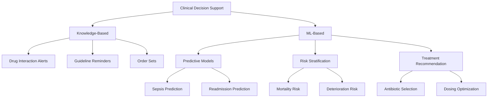
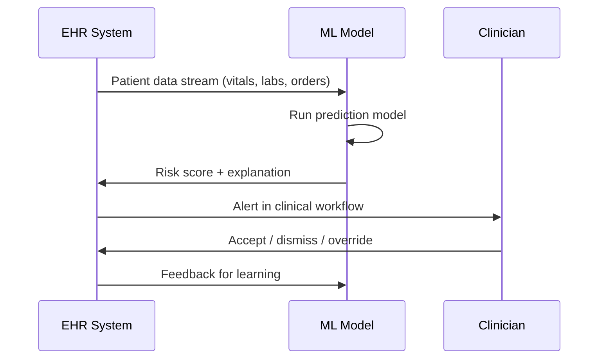

# Clinical Decision Support Systems

## Overview

A **Clinical Decision Support System (CDSS)** is any software that assists clinicians in making diagnostic, therapeutic, or preventive decisions by providing patient-specific assessments or recommendations. Modern CDSS powered by machine learning go far beyond the rule-based alert systems of the 1990s — they can predict sepsis hours before clinical deterioration, recommend optimal antibiotic regimens, and stratify surgical risk using hundreds of variables simultaneously.

CDSS sits at the intersection of clinical medicine and machine learning, translating raw patient data into actionable insights at the point of care. This lesson covers the types of CDSS, the ML architectures behind them, how they integrate into clinical workflows, and the evidence for their effectiveness.

---

## Types of Clinical Decision Support



**Taxonomy of clinical decision support systems**

### Knowledge-Based CDSS

Traditional systems built on curated medical rules:
- **Drug-drug interaction alerts**: Flag potentially dangerous medication combinations
- **Guideline compliance reminders**: Prompt physicians to order recommended screening tests
- **Order sets**: Pre-built bundles of orders (labs, medications, consults) for common conditions

These systems are reliable for well-defined rules but cannot adapt to novel patterns or complex, multi-variable predictions.

### ML-Based CDSS

Modern systems trained on clinical data:
- **Predictive models**: Forecast clinical events (sepsis, cardiac arrest, readmission) before they occur
- **Risk stratification**: Classify patients into risk categories to prioritize care
- **Treatment recommendation engines**: Suggest optimal therapies based on patient-specific features

---

## Predictive Models in Clinical Care

### Early Warning Scores

The most impactful CDSS applications predict clinical deterioration:

**Traditional scores** use hand-crafted features:
- **NEWS (National Early Warning Score)**: heart rate, respiratory rate, SpO2, temperature, blood pressure, consciousness
- **qSOFA (quick Sequential Organ Failure Assessment)**: respiratory rate ≥ 22, altered mentation, systolic BP ≤ 100

**ML-based scores** learn from data and capture complex interactions:

The general formulation for a clinical prediction model:

$$P(Y = 1 | \mathbf{x}_t) = \sigma\left(f_\theta(\mathbf{x}_1, \mathbf{x}_2, \ldots, \mathbf{x}_t)\right)$$

where $\mathbf{x}_t$ is the feature vector at time $t$ (vital signs, labs, medications), $f_\theta$ is a learned function (e.g., LSTM, Transformer), and $\sigma$ is the sigmoid function.

### Sepsis Prediction: A Case Study

Sepsis kills 270,000 Americans annually. Early detection (3-6 hours before onset) dramatically improves survival. Key systems:

- **InSight (Dascena)**: Gradient-boosted trees using 6 vital signs. AUROC 0.88-0.92 for predicting sepsis 4 hours ahead.
- **TREWS (Johns Hopkins)**: Targeted real-time early warning system. Reduced median time to first antibiotic by 1.85 hours in a prospective study.
- **Epic Sepsis Model**: Widely deployed EHR-integrated model — but criticized for low positive predictive value (PPV ~12%) in external validation.

```python
import numpy as np
from sklearn.ensemble import GradientBoostingClassifier
from sklearn.metrics import roc_auc_score

# Simplified sepsis prediction from vital signs
# Features: HR, RR, SBP, DBP, SpO2, Temp, WBC, Lactate
X_train = np.random.randn(10000, 8)  # placeholder for real EHR data
y_train = np.random.binomial(1, 0.05, 10000)  # ~5% sepsis prevalence

model = GradientBoostingClassifier(
    n_estimators=200,
    max_depth=5,
    learning_rate=0.1,
    subsample=0.8,
    min_samples_leaf=50,  # regularization for small datasets
)
model.fit(X_train, y_train)

# Feature importance reveals which vitals matter most
for name, imp in zip(
    ["HR", "RR", "SBP", "DBP", "SpO2", "Temp", "WBC", "Lactate"],
    model.feature_importances_
):
    print(f"{name}: {imp:.3f}")
```

### Temporal Models for Clinical Data

Clinical data is inherently sequential — vitals, labs, and medications arrive over time. Temporal models capture this:

**LSTM / GRU networks** process time-series EHR data:

$$h_t = \text{GRU}(\mathbf{x}_t, h_{t-1})$$
$$\hat{y}_t = \sigma(W_o h_t + b_o)$$

**Transformer-based models** (BERT for EHR) treat clinical events as tokens in a sequence, enabling attention over long clinical histories.

---

## Risk Stratification

Risk stratification assigns patients to categories (low, medium, high risk) to guide resource allocation:

- **Surgical risk**: ACS-NSQIP calculator uses 20+ variables to predict postoperative morbidity and mortality
- **Cardiovascular risk**: ASCVD risk calculator estimates 10-year heart attack/stroke risk
- **Hospital readmission**: LACE index and ML models predict 30-day readmission to trigger discharge planning interventions

### Calibration Matters

In clinical settings, **calibration** is as important as discrimination. A model predicting "30% risk" should be correct about 30% of the time:

$$\text{Calibration error} = \mathbb{E}\left[|P(Y=1 | \hat{p} = p) - p|\right]$$

Plotting **reliability diagrams** (predicted probability vs. observed frequency) reveals whether a model is overconfident or underconfident. **Platt scaling** or **isotonic regression** can recalibrate poorly calibrated models post-hoc.

---

## Integration into Clinical Workflows

The most technically brilliant model fails if it doesn't fit into how clinicians actually work.

### Alert Fatigue

The #1 problem with CDSS deployment is **alert fatigue**. When systems generate too many alerts, clinicians start ignoring all of them — including the critical ones. Studies show override rates of 50-90% for medication alerts.

Mitigation strategies:
- **High-specificity thresholds**: Only alert when confidence is very high
- **Tiered alerting**: Soft alerts (informational) vs. hard alerts (must acknowledge)
- **Contextual suppression**: Don't re-alert for known, accepted conditions
- **Interruptive vs. non-interruptive**: Reserve modal pop-ups for critical alerts

### Integration Points



**CDSS integration flow in an EHR system**

Models must integrate at the right point in the workflow:
- **Passive dashboards**: Show risk scores; clinician checks when convenient
- **Interruptive alerts**: Pop up when thresholds are crossed
- **Order suggestions**: Recommend tests or treatments at the point of ordering
- **Ambient monitoring**: Background surveillance with escalation protocols

---

## Evaluation Framework

### Clinical Validation Hierarchy

1. **Retrospective validation**: Test on historical data. Necessary but insufficient.
2. **Silent prospective validation**: Run model in real-time alongside clinical care without showing results to clinicians. Measures real-world calibration.
3. **Randomized controlled trial (RCT)**: Gold standard. Compare outcomes between CDSS-assisted and standard care.
4. **Post-deployment monitoring**: Track for performance degradation, distributional shift, and unintended consequences.

### Key Metrics

- **AUROC**: Overall discrimination — but misleading at very low prevalence
- **Positive Predictive Value (PPV)**: Of patients flagged, how many truly have the condition?
- **Number Needed to Alert (NNA)**: How many alerts per true positive? Lower is better.
- **Time-to-detection**: How far in advance does the system predict the event?

---

## Challenges and Limitations

**Generalizability.** Models trained at one hospital may not perform well at another due to differences in patient populations, documentation practices, and EHR systems. Multi-site validation is essential.

**Label quality.** Clinical labels are often noisy — ICD codes are assigned for billing purposes and may not reflect true diagnoses. Gold-standard labels require chart review, which is expensive.

**Temporal data leakage.** Features that are consequences of the event (e.g., antibiotics ordered *because* sepsis was suspected) can leak into the training data, inflating model performance. Careful temporal feature engineering is critical.

**Equity and bias.** CDSS can perpetuate or amplify existing health disparities if trained on biased data. The Optum algorithm that used healthcare costs as a proxy for health needs systematically under-referred Black patients.

---

## Exercises

1. **Build a readmission predictor**: Using MIMIC-III data, train a model to predict 30-day hospital readmission. Compare logistic regression, random forest, and gradient boosting.
2. **Alert fatigue simulation**: Given a model with known sensitivity/specificity and a disease prevalence, calculate the PPV and number needed to alert. How does PPV change as prevalence decreases from 10% to 0.1%?
3. **Calibration analysis**: Train any clinical prediction model and create a reliability diagram. Apply Platt scaling and compare.

---

## Further Reading

- Rajkomar, A. et al. (2018). "Scalable and accurate deep learning with electronic health records." *Nature Medicine* — Google's foundational EHR prediction paper
- Wong, A. et al. (2021). "External Validation of a Widely Implemented Proprietary Sepsis Prediction Model." *JAMA Internal Medicine* — critique of Epic's sepsis model
- Sendak, M. et al. (2020). "A Path for Translation of Machine Learning Products into Healthcare Delivery." — practical deployment framework
