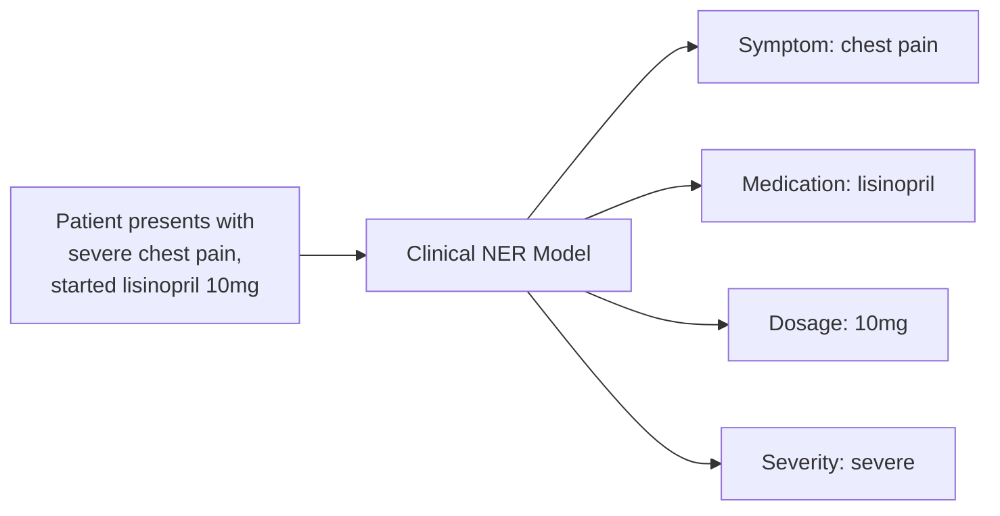

# Natural Language Processing for Clinical Notes

## Overview

Approximately 80% of clinical data is unstructured — physician notes, radiology reports, pathology reports, discharge summaries, and nursing assessments stored as free text. This treasure trove of information is largely invisible to traditional analytics, which rely on structured fields like ICD codes and lab values. **Clinical NLP** unlocks this data by extracting structured medical concepts, relationships, and temporal information from free text.

Clinical NLP is especially challenging because medical language is dense, ambiguous, and domain-specific. Abbreviations like "SOB" mean "shortness of breath" (not what you might think), negation is pervasive ("no evidence of malignancy"), and context matters enormously ("history of cancer" vs. "family history of cancer" vs. "cancer screening").

---

## The Clinical Text Landscape

### Types of Clinical Documents

- **Progress notes**: Daily physician documentation of patient status, assessment, and plan
- **Radiology reports**: Structured narrative describing imaging findings and impressions
- **Pathology reports**: Descriptions of tissue specimens, diagnoses, and staging
- **Discharge summaries**: Comprehensive summaries of hospital stays
- **Operative notes**: Descriptions of surgical procedures
- **Nursing notes**: Observations, vital signs, and care activities

### Characteristics of Clinical Text

Clinical text differs from general English in important ways:

| Feature | General Text | Clinical Text |
|---------|-------------|---------------|
| Abbreviations | Occasional | Pervasive (q4h, prn, SOB, CP) |
| Negation | Uncommon | Very common ("denies chest pain") |
| Sentence structure | Complete | Often fragmented |
| Vocabulary | General | Highly specialized |
| Templates | Rare | Common (copy-paste, macros) |
| Temporal references | Simple | Complex ("3 days ago", "since last visit") |

---

## Core NLP Tasks in Medicine

### Named Entity Recognition (NER)

Identifying and classifying medical concepts in text:



**Clinical named entity recognition extracts structured concepts from free text**

Key entity types include:
- **Problems/Diagnoses**: diseases, symptoms, signs
- **Medications**: drug names, doses, routes, frequencies
- **Procedures**: surgeries, tests, therapies
- **Anatomy**: body parts, organ systems
- **Lab values**: test names and results

### Negation Detection

Negation is critical in clinical text. "No chest pain" means the opposite of "chest pain." The **NegEx** algorithm (Chapman et al., 2001) remains a surprisingly effective baseline:

1. Identify a medical concept (e.g., "chest pain")
2. Look for negation triggers within a window: "no", "denies", "without", "negative for"
3. Check for pseudo-negation: "no change in chest pain" (still present)

Modern transformer-based models learn negation implicitly but still benefit from explicit negation features.

### Relation Extraction

Identifying relationships between entities:
- Drug–disease: "started metformin for diabetes"
- Drug–dosage: "lisinopril 10mg"
- Symptom–anatomy: "pain in left shoulder"
- Temporal: "diagnosed with hypertension in 2019"

### Clinical Text De-identification

Before sharing clinical data for research, protected health information (PHI) must be removed. De-identification systems detect and mask:
- Patient names, dates of birth
- Medical record numbers
- Geographic information
- Phone numbers, email addresses

State-of-the-art de-identification systems achieve F1 scores > 0.98 using fine-tuned BERT models.

---

## Clinical NLP Models

### Traditional Pipeline: cTAKES and MetaMap

**cTAKES** (clinical Text Analysis and Knowledge Extraction System) is an Apache open-source NLP pipeline:

1. **Tokenization** → **Sentence detection** → **POS tagging**
2. **Dictionary lookup** against UMLS (Unified Medical Language System) — a metathesaurus with 4.4M concepts
3. **Negation detection** (NegEx)
4. **Assertion classification** (present, absent, hypothetical, conditional)

**MetaMap** maps free text to UMLS concepts using lexical and linguistic analysis.

### Transformer-Based Models

Modern clinical NLP is dominated by transformer models fine-tuned on clinical text:

| Model | Pretraining Data | Key Strength |
|-------|-----------------|--------------|
| **ClinicalBERT** | MIMIC-III clinical notes | Hospital note understanding |
| **BioBERT** | PubMed abstracts + PMC articles | Biomedical literature |
| **PubMedBERT** | PubMed only (domain-specific vocab) | Biomedical NER, RE |
| **GatorTron** | 90B words of clinical text | Largest clinical LM |
| **Med-PaLM 2** | Medical QA, clinical data | Medical question answering |

### Fine-Tuning ClinicalBERT for NER

```python
from transformers import AutoTokenizer, AutoModelForTokenClassification
from transformers import TrainingArguments, Trainer
import torch

# Load ClinicalBERT
model_name = "emilyalsentzer/Bio_ClinicalBERT"
tokenizer = AutoTokenizer.from_pretrained(model_name)

# NER label scheme (BIO format)
label_list = [
    "O",              # Outside any entity
    "B-Problem",      # Beginning of a problem/diagnosis
    "I-Problem",      # Inside a problem/diagnosis
    "B-Treatment",    # Beginning of a treatment
    "I-Treatment",
    "B-Test",         # Beginning of a test
    "I-Test",
]

model = AutoModelForTokenClassification.from_pretrained(
    model_name,
    num_labels=len(label_list),
)

# Example: tokenize and predict
text = "Patient denies chest pain but reports shortness of breath"
inputs = tokenizer(text, return_tensors="pt", padding=True, truncation=True)

with torch.no_grad():
    outputs = model(**inputs)
    predictions = torch.argmax(outputs.logits, dim=-1)
    
# Map predictions back to tokens
tokens = tokenizer.convert_ids_to_tokens(inputs["input_ids"][0])
for token, pred in zip(tokens, predictions[0]):
    if token not in ["[CLS]", "[SEP]", "[PAD]"]:
        print(f"{token:15s} → {label_list[pred]}")
```

---

## Technical Deep Dive: Section Detection

Clinical notes follow semi-structured formats. Section detection identifies note sections (Chief Complaint, History of Present Illness, Assessment/Plan, etc.) to enable section-aware analysis:

$$P(\text{section} = s | \mathbf{h}_i) = \text{softmax}(W_s \mathbf{h}_i + b_s)$$

where $\mathbf{h}_i$ is the hidden state for line $i$ from a transformer encoder. Section-aware models improve NER by 5-10% F1 because the same word means different things in different sections ("cancer" in family history vs. assessment).

---

## LLMs for Clinical NLP

Large language models are increasingly applied to clinical text tasks:

### Medical Question Answering

**Med-PaLM 2** (Google, 2023) achieved 86.5% on USMLE-style questions, exceeding the expert physician benchmark. Key techniques:
- **Ensemble refinement**: Multiple answer candidates are generated and a separate model selects the best
- **Chain-of-thought prompting**: Step-by-step reasoning improves accuracy on multi-step clinical problems

### Clinical Text Summarization

LLMs can summarize discharge summaries, generate after-visit summaries for patients, and condense lengthy clinical histories:

```python
from anthropic import Anthropic

client = Anthropic()

clinical_note = """
HPI: 67M with PMH of HTN, DM2, CKD3 presenting with 2 days of
progressive dyspnea and bilateral lower extremity edema. Patient
reports orthopnea (3 pillows) and PND. Denies chest pain, fever.
BNP elevated at 1200. CXR shows bilateral pleural effusions and
pulmonary congestion. Echo shows EF 30%, moderate MR.
"""

message = client.messages.create(
    model="claude-sonnet-4-20250514",
    max_tokens=256,
    messages=[{
        "role": "user",
        "content": f"Summarize this clinical note for a handoff:\n\n{clinical_note}"
    }]
)
print(message.content[0].text)
```

---

## Evaluation Metrics for Clinical NLP

| Task | Primary Metric | Notes |
|------|---------------|-------|
| NER | F1 score (strict + relaxed) | Strict requires exact span match; relaxed allows partial overlap |
| Negation | F1 for negated vs. affirmed | Test on hard cases (double negation, hedging) |
| Relation Extraction | Micro/Macro F1 | Per-relation type performance matters |
| De-identification | Recall (sensitivity) | Missing a single PHI element is a privacy violation |
| Summarization | ROUGE + physician rating | Automated metrics correlate poorly with clinical quality |

---

## Real-World Applications

- **Nuance DAX**: Ambient clinical documentation — listens to patient-physician conversations and generates structured notes
- **3M M*Modal**: NLP for computer-assisted coding (CAC) — automatically suggests ICD and CPT codes from clinical documentation
- **Amazon Comprehend Medical**: Cloud-based NLP API for extracting medical entities from text
- **UpToDate / DynaMed**: AI-augmented clinical reference tools that surface relevant evidence from medical literature

---

## Challenges and Limitations

**Data access.** Clinical notes are highly sensitive and difficult to share across institutions. Federated learning and synthetic data generation are partial solutions.

**Copy-paste pollution.** Clinicians frequently copy and paste prior notes, creating redundant and potentially outdated information. NLP systems must handle "note bloat."

**Multilingual medicine.** Clinical notes are written in many languages. Most clinical NLP research focuses on English, leaving other languages underserved.

**Contextual ambiguity.** "Patient's mother had breast cancer" is family history, not the patient's diagnosis. Resolving these distinctions requires deep contextual understanding.

---

## Exercises

1. **Build a medication extractor**: Using the i2b2 2009 medication extraction dataset, fine-tune ClinicalBERT for NER to extract medication names, dosages, routes, and frequencies.
2. **Negation detection**: Implement NegEx in Python and test it on 50 clinical sentences. Compare with a fine-tuned BERT classifier.
3. **Clinical text de-identification**: Using the i2b2 2014 de-identification dataset, evaluate a BERT-based model's ability to detect PHI. What entity types are hardest to detect?

---

## Further Reading

- Alsentzer, E. et al. (2019). "Publicly Available Clinical BERT Embeddings" — ClinicalBERT paper
- Savova, G. et al. (2010). "Mayo clinical Text Analysis and Knowledge Extraction System (cTAKES)" — foundational clinical NLP pipeline
- Singhal, K. et al. (2023). "Large Language Models Encode Clinical Knowledge" — Med-PaLM paper
