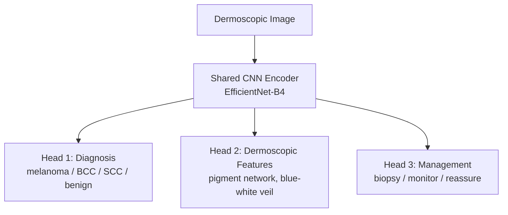
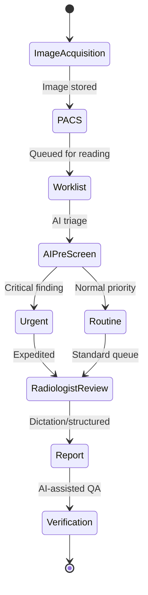

# AI for Diagnostics: Dermatology, Ophthalmology, and Radiology

## Overview

Diagnostic AI represents the most clinically mature application of machine learning in medicine. In dermatology, ophthalmology, and radiology, AI systems have demonstrated performance comparable to — and sometimes exceeding — human specialists in controlled studies. **IDx-DR** became the first FDA-authorized autonomous AI diagnostic in 2018, diagnosing diabetic retinopathy without requiring physician interpretation.

This lesson examines AI diagnostic systems across three specialties where visual pattern recognition is central, exploring the architectures, clinical validation studies, and deployment realities that determine whether a technically excellent model actually improves patient care.

---

## AI in Dermatology

### The Problem

Skin cancer is the most common cancer globally, with over 5 million cases diagnosed annually in the US. Early detection of melanoma — the deadliest skin cancer — is critical: 5-year survival is 99% for localized disease but drops to 32% for distant metastases. Yet dermatologist access is limited, with average wait times of 30+ days in many regions.

### Landmark Study: Esteva et al. (2017)

The landmark study trained a CNN (Inception v3) on 129,450 clinical images spanning 2,032 diseases:

- Performance matched 21 board-certified dermatologists on biopsy-proven cases
- Binary classification (benign vs. malignant) achieved sensitivity 91% and specificity 82.5%

### Architecture: Multi-Task Learning for Skin Lesion Classification

Modern dermatology AI uses multi-task learning to simultaneously predict:



**Multi-task dermatology AI architecture**

The multi-task approach improves performance because dermoscopic features are correlated with diagnosis, providing additional supervision signal.

### The ISIC Challenge and HAM10000

The **International Skin Imaging Collaboration (ISIC)** organizes annual challenges using datasets like **HAM10000** (10,015 dermoscopic images, 7 diagnostic categories):

```python
import torch
import torch.nn as nn
from torchvision import models, transforms
from torch.utils.data import DataLoader

# Multi-class skin lesion classifier
class SkinLesionClassifier(nn.Module):
    def __init__(self, num_classes=7):
        super().__init__()
        self.backbone = models.efficientnet_b4(pretrained=True)
        in_features = self.backbone.classifier[1].in_features
        self.backbone.classifier = nn.Sequential(
            nn.Dropout(p=0.4),
            nn.Linear(in_features, num_classes),
        )

    def forward(self, x):
        return self.backbone(x)

# Class-weighted loss to handle severe imbalance
# HAM10000 distribution: nv(67%), mel(11%), bkl(11%), bcc(5%), ...
class_weights = torch.tensor([1.0, 6.0, 6.0, 13.0, 20.0, 57.0, 80.0])
criterion = nn.CrossEntropyLoss(weight=class_weights)
```

### Challenges Specific to Dermatology AI

**Skin tone bias.** Most training datasets are heavily skewed toward lighter skin tones (Fitzpatrick I-III). Models perform significantly worse on darker skin, potentially exacerbating existing disparities in dermatologic care. The **Diverse Dermatology Images (DDI)** dataset aims to address this.

**Clinical vs. dermoscopic images.** Consumer smartphone photos differ dramatically from standardized dermoscopic images. Models trained on dermoscopy may fail on clinical photos, and vice versa.

---

## AI in Ophthalmology

### Diabetic Retinopathy Screening

Diabetic retinopathy (DR) affects 1 in 3 diabetics and is the leading cause of blindness in working-age adults. The International Clinical Diabetic Retinopathy (ICDR) scale defines 5 severity levels:

| Grade | Severity | Findings |
|-------|----------|----------|
| 0 | No DR | No abnormalities |
| 1 | Mild NPDR | Microaneurysms only |
| 2 | Moderate NPDR | More than just microaneurysms |
| 3 | Severe NPDR | Extensive hemorrhages, venous beading |
| 4 | Proliferative DR | Neovascularization, vitreous hemorrhage |

### IDx-DR: First Autonomous AI Diagnostic

**IDx-DR** (now Digital Diagnostics) was FDA-authorized in 2018 as the first autonomous AI — it makes a diagnostic decision without physician interpretation:

- **Input**: Retinal fundus photographs from a Topcon camera
- **Output**: Binary referral decision (more than mild DR: refer; otherwise: rescreen in 12 months)
- **Performance**: Sensitivity 87.2%, specificity 90.7% in the pivotal trial
- **Deployment**: Primary care clinics — the camera operator needs no specialized training

### Glaucoma and Age-Related Macular Degeneration

Beyond DR, ophthalmology AI covers:

- **Glaucoma**: CNN-based analysis of optic disc photographs and OCT (Optical Coherence Tomography) to detect glaucomatous optic neuropathy
- **AMD**: Automated detection and staging of age-related macular degeneration from fundus and OCT images
- **ROP**: Retinopathy of prematurity screening in neonates — i-ROP DL system demonstrated 91% sensitivity

### OCT Analysis with 3D CNNs

OCT produces volumetric retinal scans. DeepMind's collaboration with Moorfields Eye Hospital processed OCT volumes in two stages:

$$\text{Raw OCT} \xrightarrow{\text{Segmentation Model}} \text{Tissue Map} \xrightarrow{\text{Classification Model}} \text{Diagnosis + Referral}$$

The segmentation-first approach provides interpretability (clinicians can inspect the tissue map) and robustness (the classification model is insulated from device-specific artifacts).

---

## AI in Radiology

### Chest X-ray Analysis

Chest X-rays are the most common imaging study, with billions performed annually. AI can detect:

- Pneumonia, tuberculosis, COVID-19
- Lung nodules and masses
- Cardiomegaly, pleural effusions
- Rib fractures, pneumothorax

### Mammography: Breast Cancer Screening

Google Health's 2020 study demonstrated AI matching or exceeding radiologists in breast cancer screening:

- **Dataset**: 28,953 mammograms from UK and US
- **Results**: AI reduced false positives by 5.7% (US) and 1.2% (UK); reduced false negatives by 9.4% (US) and 2.7% (UK)
- **Human-AI collaboration**: AI as a "second reader" showed the most promising results

### The Radiologist's Workflow

Understanding how radiologists work is essential for effective AI integration:



**AI integration points in the radiology workflow**

AI can add value at multiple points:
1. **Triage**: Prioritize urgent cases (e.g., Viz.ai for stroke, Aidoc for critical findings)
2. **Detection assist**: Highlight suspicious regions for radiologist attention
3. **Measurement**: Automated measurement of tumor size, organ volumes
4. **Quality assurance**: Flag potential misses before report finalization

---

## Technical Deep Dive: Operating Point Selection

A diagnostic AI model produces a continuous risk score. The **operating point** (threshold) determines the tradeoff between sensitivity and specificity:

$$\text{Sensitivity} = \frac{TP}{TP + FN} \qquad \text{Specificity} = \frac{TN}{TN + FP}$$

For a screening test (e.g., mammography), **high sensitivity** is prioritized — missing a cancer is worse than a false alarm. For confirmatory tests, **high specificity** matters more.

The **Youden index** finds the optimal threshold:

$$J = \text{Sensitivity} + \text{Specificity} - 1$$

But clinical operating points are rarely set at the Youden index. They are chosen based on:
- Disease prevalence and pre-test probability
- Cost of false positives (unnecessary biopsies) vs. false negatives (missed disease)
- Regulatory requirements and clinical guidelines

---

## Evaluation: Reader Studies

The gold standard for evaluating diagnostic AI is the **multi-reader multi-case (MRMC) study**:

1. Collect a set of cases with ground-truth diagnoses (biopsy-confirmed)
2. Multiple readers (e.g., 10 radiologists) interpret cases **without** AI
3. Same readers interpret the same cases **with** AI assistance
4. Compare AUROC, sensitivity, specificity, and reading time

This paired design controls for reader variability and case difficulty. FDA often requires MRMC studies for regulatory clearance.

---

## Real-World Applications

- **IDx-DR / Digital Diagnostics**: Autonomous DR screening in primary care
- **Viz.ai**: AI-powered stroke detection — CTA analysis alerts neurovascular team in minutes
- **Paige Prostate**: FDA-authorized AI for prostate cancer detection in pathology
- **Lunit INSIGHT CXR**: Chest X-ray analysis for 10 abnormalities, deployed across Asia
- **iCAD ProFound AI**: AI for digital breast tomosynthesis (3D mammography)
- **SkinVision**: Consumer app for skin lesion risk assessment (CE-marked)

---

## Challenges and Limitations

**Shortcut learning.** Models may learn spurious correlations — detecting the hospital label on an X-ray rather than the pathology, or using image metadata (e.g., portable vs. standard X-ray) as a proxy for disease severity.

**Spectrum bias.** Validation datasets often over-represent clear-cut cases and under-represent the ambiguous cases where AI assistance would be most valuable.

**Liability and trust.** Who is responsible when an AI misses a diagnosis? Current regulatory frameworks are still evolving on liability for AI-assisted vs. AI-autonomous decisions.

**Workflow disruption.** Adding AI to a radiology workflow adds complexity. If the AI takes 30 seconds to process an image but the radiologist reads it in 15 seconds, the AI is a hindrance, not a help.

---

## Exercises

1. **Skin lesion classifier**: Fine-tune an EfficientNet on HAM10000. Evaluate per-class performance and analyze which lesion types are hardest to classify.
2. **Operating point analysis**: For a diabetic retinopathy model, plot the ROC curve and calculate sensitivity at 90%, 95%, and 98% specificity. Which operating point would you choose for a screening program and why?
3. **Bias audit**: Analyze a skin lesion model's performance stratified by skin tone (Fitzpatrick scale). Report performance gaps.

---

## Further Reading

- Esteva, A. et al. (2017). "Dermatologist-level classification of skin cancer with deep neural networks." *Nature* — landmark skin cancer AI study
- Gulshan, V. et al. (2016). "Development and Validation of a Deep Learning Algorithm for Detection of Diabetic Retinopathy." *JAMA* — foundational DR detection paper
- McKinney, S.M. et al. (2020). "International evaluation of an AI system for breast cancer screening." *Nature* — Google Health mammography study
