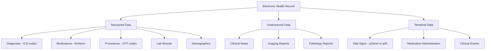

# Electronic Health Records and Clinical Data

## Overview

Electronic Health Records (EHRs) are the backbone of modern healthcare data infrastructure. An EHR contains a patient's complete medical history — diagnoses, medications, lab results, vital signs, clinical notes, imaging orders, procedures, and billing codes — often spanning decades of care. In the US, over 96% of hospitals use certified EHR systems, generating a continuous stream of data that represents the largest observational medical dataset ever created.

**AI applied to EHR data** can predict clinical deterioration, identify patients at risk for disease, optimize resource allocation, and enable population health management. But EHR data is messy, heterogeneous, and full of biases that make naive ML approaches dangerous. This lesson covers EHR data structure, preprocessing, modeling approaches, and the unique challenges of learning from clinical data.

---

## EHR Data Structure

### Data Types in an EHR



**EHR data hierarchy and types**

### Medical Coding Systems

EHR data uses standardized medical coding systems:

| System | Purpose | Example |
|--------|---------|---------|
| **ICD-10** | Diagnoses | E11.9 (Type 2 diabetes, unspecified) |
| **CPT** | Procedures | 99213 (Office visit, established patient) |
| **RxNorm** | Medications | 197361 (Lisinopril 10mg tablet) |
| **LOINC** | Lab tests | 2345-7 (Glucose, serum/plasma) |
| **SNOMED CT** | Clinical concepts | 73211009 (Diabetes mellitus) |

### The OMOP Common Data Model

The **Observational Medical Outcomes Partnership (OMOP)** Common Data Model standardizes EHR data across institutions:

```python
# Example OMOP-structured query for diabetic patients
# with HbA1c > 9% in the last year
query = """
SELECT p.person_id, m.measurement_date, m.value_as_number
FROM person p
JOIN condition_occurrence co
    ON p.person_id = co.person_id
JOIN measurement m
    ON p.person_id = m.person_id
WHERE co.condition_concept_id = 201826  -- Type 2 DM (SNOMED)
  AND m.measurement_concept_id = 3004410  -- HbA1c (LOINC)
  AND m.value_as_number > 9.0
  AND m.measurement_date >= DATE_SUB(CURRENT_DATE, INTERVAL 1 YEAR)
"""
```

---

## EHR Data Preprocessing

### Handling Missing Data

Clinical data is **missing not at random (MNAR)**. A lab test being absent is informative — it means the physician didn't order it, which itself reflects a clinical judgment. Common approaches:

- **Carry-forward imputation**: Use the last known value (appropriate for slowly changing variables like weight)
- **Mean/median imputation**: Simple but destroys variance structure
- **Missingness indicators**: Add binary features indicating whether each value is missing
- **Multiple imputation (MICE)**: Statistically principled but computationally expensive

$$\mathbf{x}_{\text{augmented}} = [\mathbf{x}, \mathbf{m}]$$

where $\mathbf{m}_i = \mathbb{1}[\mathbf{x}_i \text{ is missing}]$ is the missingness mask.

### Irregular Time Series

Unlike sensor data with fixed sampling rates, clinical time series are **irregularly sampled**. Vital signs may be recorded every 15 minutes in ICU but every 4 hours on a general ward:

```python
import numpy as np
import pandas as pd

# Clinical time series with irregular sampling
vitals = pd.DataFrame({
    'time_hours': [0, 0.25, 0.5, 1.0, 2.0, 4.0, 8.0, 12.0],
    'heart_rate': [88, 92, 95, 102, 98, 85, 78, 76],
    'sbp':        [130, 128, 125, 118, 122, 128, 132, 130],
    'spo2':       [96, 95, 94, 92, 93, 95, 97, 98],
})

# Time since last measurement as a feature
vitals['time_delta'] = vitals['time_hours'].diff().fillna(0)

# Resampling to fixed intervals (e.g., hourly) with forward-fill
hourly = vitals.set_index('time_hours').resample('1h').ffill()
```

### Feature Engineering from Codes

Medical codes are high-dimensional and sparse. Effective feature engineering includes:
- **Embedding layers**: Learn dense representations of ICD, CPT, and medication codes
- **Code grouping**: Roll up ICD-10 codes to higher-level categories (e.g., CCS groups)
- **Temporal aggregation**: Count of diagnoses in last 30/90/365 days
- **Comorbidity indices**: Charlson or Elixhauser comorbidity scores

---

## Modeling Approaches

### Tabular Models for EHR Data

For structured EHR prediction tasks, **gradient-boosted trees** remain highly competitive:

```python
import xgboost as xgb
from sklearn.model_selection import StratifiedKFold
from sklearn.metrics import roc_auc_score

# Features: demographics + recent vitals + lab trends + comorbidity count
X = patient_features  # shape: (n_patients, n_features)
y = mortality_label    # 30-day in-hospital mortality

# XGBoost with careful regularization
model = xgb.XGBClassifier(
    n_estimators=300,
    max_depth=6,
    learning_rate=0.05,
    subsample=0.8,
    colsample_bytree=0.8,
    scale_pos_weight=20,  # handle class imbalance
    eval_metric='aucpr',  # AUPRC better than AUROC at low prevalence
)

# 5-fold cross-validation
cv = StratifiedKFold(n_splits=5, shuffle=True, random_state=42)
scores = []
for train_idx, val_idx in cv.split(X, y):
    model.fit(X[train_idx], y[train_idx])
    y_pred = model.predict_proba(X[val_idx])[:, 1]
    scores.append(roc_auc_score(y[val_idx], y_pred))

print(f"Mean AUROC: {np.mean(scores):.3f} ± {np.std(scores):.3f}")
```

### Deep Learning for EHR Sequences

For temporal modeling, deep learning captures sequential patterns:

**Google's EHR model** (Rajkomar et al., 2018) represents the entire patient timeline as a sequence of events and uses an LSTM to predict:
- In-hospital mortality
- 30-day unplanned readmission
- Length of stay
- Discharge diagnosis

The **BEHRT** model applies BERT-style pretraining to EHR event sequences:

$$\text{Input} = [\text{CLS}] \; d_1 \; d_2 \; \ldots \; d_T \; [\text{SEP}]$$

where each $d_t$ is a clinical event (diagnosis code, medication, procedure) with positional encodings that capture both sequential order and absolute time.

### Medical Concept Embeddings

Learning vector representations of medical concepts reveals clinical relationships:

$$\text{Med2Vec}: \quad \mathbf{c}_i = \text{Embedding}(\text{code}_i) \in \mathbb{R}^d$$

Trained on co-occurrence patterns, these embeddings capture that "hypertension" is close to "lisinopril" and "amlodipine" in embedding space — reflecting the treatment relationship without explicit labeling.

---

## Population Health and Cohort Studies

### Phenotyping

**Computational phenotyping** identifies patient cohorts with specific conditions from EHR data. This is harder than it sounds — an ICD code for diabetes in the EHR doesn't necessarily mean the patient has diabetes (it might be a ruled-out diagnosis, a billing artifact, or a coding error).

Rule-based phenotyping algorithms combine:
- Diagnosis codes (ICD) — at least 2 codes on separate dates
- Medication data — disease-specific medications (e.g., insulin for diabetes)
- Lab data — abnormal values (e.g., HbA1c ≥ 6.5%)
- NLP from clinical notes — mentions in problem lists or assessments

### Observational Causal Inference

EHR data enables large-scale observational studies, but causal claims require careful methodology:

$$\text{ATE} = \mathbb{E}[Y(1) - Y(0)]$$

where $Y(1)$ and $Y(0)$ are potential outcomes under treatment and control. Techniques include:
- **Propensity score matching**: Match treated and untreated patients on confounders
- **Inverse probability weighting**: Weight observations by inverse propensity scores
- **Instrumental variables**: Exploit natural randomization (e.g., physician preference as an instrument)

---

## The MIMIC Dataset

**MIMIC** (Medical Information Mart for Intensive Care) is the most widely used public EHR dataset:

- **MIMIC-III**: 53,423 ICU stays at Beth Israel Deaconess Medical Center (2001-2012)
- **MIMIC-IV**: Extended to 2019, includes ED data
- **MIMIC-CXR**: 377,110 chest X-rays linked to MIMIC patients
- **Access**: Requires CITI training certification and data use agreement

---

## Real-World Applications

- **Epic Deterioration Index**: Predicts in-hospital deterioration, deployed across 200+ health systems
- **Google's EHR predictions**: Demonstrated deep learning on 216,221 adult patients predicting mortality, readmission, and length of stay
- **Optum / UnitedHealth**: Large-scale claims data analytics for population health management
- **Truveta**: Consortium of health systems sharing de-identified EHR data for research

---

## Challenges and Limitations

**Data quality.** EHR data is generated for clinical care and billing, not research. Documentation practices vary by physician, specialty, and institution. "Garbage in, garbage out" is the central risk.

**Label leakage.** Outcomes may be influenced by information available only in the EHR (e.g., a patient is labeled "high risk" because the model uses features that were recorded *because* the patient was already identified as high risk).

**Health equity.** EHR data reflects existing healthcare access patterns. Patients who visit the hospital frequently have richer data, but this doesn't mean they're sicker — it means they have better access.

**Interoperability.** Despite standards like HL7 FHIR, EHR systems still vary dramatically in data formats, coding practices, and documentation templates, making multi-site models difficult.

---

## Exercises

1. **MIMIC exploration**: Complete PhysioNet's MIMIC-III tutorial. Write SQL queries to extract a cohort of sepsis patients and their vital signs in the 24 hours before sepsis onset.
2. **Missing data analysis**: For a MIMIC cohort, calculate the missingness rate for 10 common lab tests. Create missingness indicators and compare model performance with and without them.
3. **Medical concept embeddings**: Train a Word2Vec model on sequences of ICD codes from MIMIC. Visualize the embeddings with t-SNE and identify clinically meaningful clusters.

---

## Further Reading

- Johnson, A. et al. (2023). "MIMIC-IV: A Freely Accessible Electronic Health Record Dataset" — the most important public EHR dataset
- Rajkomar, A. et al. (2018). "Scalable and accurate deep learning with electronic health records." *Nature Medicine* — Google's landmark EHR deep learning paper
- Hripcsak, G. & Albers, D. (2013). "Next-generation phenotyping of electronic health records." *JAMIA* — computational phenotyping primer
