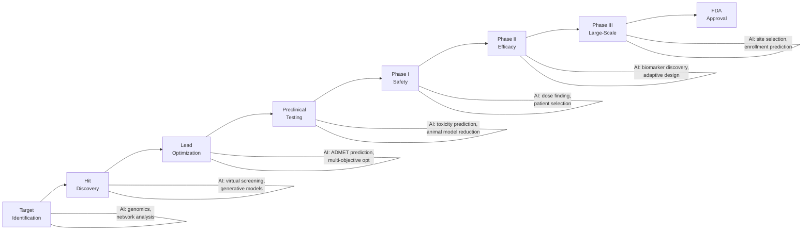

# Drug Discovery and Clinical Trial AI

## Overview

Developing a new drug takes an average of 10-15 years and costs $2.6 billion, with a failure rate exceeding 90%. The pharmaceutical pipeline — from target identification to FDA approval — is one of the most expensive, risky, and time-consuming processes in any industry. **AI is compressing this timeline** by accelerating target discovery, generating novel molecules, predicting drug properties, optimizing clinical trials, and identifying existing drugs that can be repurposed.

This lesson covers AI applications across the full drug development pipeline: target identification, hit discovery, lead optimization, ADMET prediction, clinical trial design, and drug repurposing.

---

## The Drug Discovery Pipeline



**Drug discovery pipeline with AI intervention points**

### Timeline and Costs

| Phase | Duration | Cost | Success Rate |
|-------|----------|------|-------------|
| Target ID | 1-2 years | $50M | — |
| Hit-to-Lead | 1-2 years | $100M | — |
| Lead Optimization | 1-2 years | $150M | — |
| Preclinical | 1-2 years | $200M | ~50% |
| Phase I | 1-2 years | $25M | ~65% |
| Phase II | 2-3 years | $60M | ~30% |
| Phase III | 3-4 years | $250M | ~58% |

---

## AI for Target Identification

A drug target is a biological molecule (usually a protein) whose modulation can treat a disease. AI identifies targets by:

### Network-Based Approaches

**Protein-protein interaction (PPI) networks** model relationships between proteins. Graph neural networks can identify key nodes:

$$\mathbf{h}_v^{(l+1)} = \sigma\left(\mathbf{W}^{(l)} \sum_{u \in \mathcal{N}(v)} \frac{\mathbf{h}_u^{(l)}}{|\mathcal{N}(v)|} + \mathbf{b}^{(l)}\right)$$

Nodes with high "disease centrality" — connected to many disease-associated genes — are candidate targets.

### Multi-Omics Integration

Modern target identification integrates multiple data types:
- **Genomics**: GWAS hits, rare variant associations
- **Transcriptomics**: Differentially expressed genes in disease vs. healthy tissue
- **Proteomics**: Protein abundance and post-translational modifications
- **Metabolomics**: Metabolic pathway perturbations

Transformer-based models that process multi-omics data simultaneously have shown improved target prediction over single-omics approaches.

---

## AI for Hit Discovery and Virtual Screening

### Virtual Screening

Virtual screening evaluates millions of candidate molecules computationally instead of experimentally:

```python
from rdkit import Chem
from rdkit.Chem import AllChem, DataStructs
import numpy as np

# Compute Morgan fingerprints for similarity screening
def compute_fingerprint(smiles, radius=2, n_bits=2048):
    mol = Chem.MolFromSmiles(smiles)
    if mol is None:
        return None
    return AllChem.GetMorganFingerprintAsBitVect(mol, radius, nBits=n_bits)

# Tanimoto similarity between two molecules
def tanimoto_similarity(fp1, fp2):
    return DataStructs.TanimotoSimilarity(fp1, fp2)

# Screen a library against a known active compound
active_smiles = "CC(=O)Oc1ccccc1C(=O)O"  # Aspirin
active_fp = compute_fingerprint(active_smiles)

library = ["c1ccccc1", "CC(=O)O", "CC(C)CC1=CC=C(C=C1)C(C)C(=O)O"]
for smi in library:
    fp = compute_fingerprint(smi)
    if fp:
        sim = tanimoto_similarity(active_fp, fp)
        print(f"{smi}: Tanimoto = {sim:.3f}")
```

### Structure-Based Methods: Molecular Docking with ML

Traditional docking (AutoDock, Glide) scores protein-ligand binding poses using physics-based energy functions. ML-enhanced docking uses:

- **DiffDock** (Corso et al., 2023): Diffusion model that generates ligand binding poses, outperforming traditional docking on PDBBind
- **Equibind**: SE(3)-equivariant model for fast, keypoint-based docking
- **GNINA**: CNN-based scoring function for molecular docking

The binding affinity between a protein and ligand is approximated as:

$$\Delta G_{\text{bind}} \approx f_\theta(\mathbf{x}_{\text{protein}}, \mathbf{x}_{\text{ligand}})$$

where $f_\theta$ is a neural network (often a GNN operating on the protein-ligand complex graph).

### Generative Models for De Novo Drug Design

Instead of screening existing libraries, generative models create novel molecules:

- **VAE-based**: JUNCTION TREE VAE (JT-VAE) generates molecular graphs in a chemically valid manner
- **Autoregressive**: REINVENT generates SMILES strings with RL-guided property optimization
- **Diffusion-based**: 3D molecular generation models produce atom coordinates directly
- **Flow-based**: MoFlow and GraphNVP enable exact likelihood computation

---

## ADMET Prediction

A promising drug candidate must have favorable **ADMET** properties:

| Property | What It Measures | Why It Matters |
|----------|-----------------|----------------|
| **A**bsorption | Oral bioavailability, intestinal permeability | Drug must reach the bloodstream |
| **D**istribution | Volume of distribution, plasma protein binding | Drug must reach the target tissue |
| **M**etabolism | CYP450 interactions, metabolic stability | Determines half-life, drug-drug interactions |
| **E**xcretion | Clearance rate, renal elimination | Determines dosing frequency |
| **T**oxicity | hERG inhibition, hepatotoxicity, mutagenicity | Safety is non-negotiable |

### Multi-Task ADMET Models

Modern ADMET prediction uses multi-task learning across related endpoints:

```python
import torch
import torch.nn as nn

class ADMETPredictor(nn.Module):
    """Multi-task ADMET prediction from molecular fingerprints."""

    def __init__(self, input_dim=2048, hidden_dim=512):
        super().__init__()
        self.shared = nn.Sequential(
            nn.Linear(input_dim, hidden_dim),
            nn.ReLU(),
            nn.Dropout(0.3),
            nn.Linear(hidden_dim, 256),
            nn.ReLU(),
            nn.Dropout(0.2),
        )
        # Task-specific heads
        self.solubility_head = nn.Linear(256, 1)       # regression
        self.permeability_head = nn.Linear(256, 1)     # regression
        self.cyp_inhibition_head = nn.Linear(256, 5)   # multi-label (5 CYP isoforms)
        self.toxicity_head = nn.Linear(256, 1)         # binary classification

    def forward(self, x):
        shared = self.shared(x)
        return {
            'solubility': self.solubility_head(shared),
            'permeability': self.permeability_head(shared),
            'cyp_inhibition': torch.sigmoid(self.cyp_inhibition_head(shared)),
            'toxicity': torch.sigmoid(self.toxicity_head(shared)),
        }
```

Lipinski's Rule of Five provides a quick heuristic for oral drug-likeness:
- Molecular weight ≤ 500 Da
- LogP ≤ 5
- H-bond donors ≤ 5
- H-bond acceptors ≤ 10

$$\text{Drug-likeness score} = \sum_{i} \mathbb{1}[\text{property}_i \text{ satisfies Lipinski rule}_i]$$

---

## AI for Clinical Trials

### Patient Recruitment and Eligibility

Clinical trial recruitment is the #1 bottleneck — 80% of trials fail to meet enrollment timelines. AI can:
- **Match patients to trials**: NLP-based matching of EHR data to trial eligibility criteria
- **Predict enrollment rates**: ML models forecast site-level enrollment to optimize site selection
- **Broaden eligibility**: Analyze which exclusion criteria are unnecessarily restrictive

### Adaptive Trial Design

**Bayesian adaptive designs** use accumulating data to modify the trial in real-time:
- **Response-adaptive randomization**: Assign more patients to the arm showing better results
- **Dose-finding**: Bayesian models optimize dose escalation in Phase I
- **Platform trials**: Test multiple treatments simultaneously with shared control arms

### Digital Biomarkers

AI enables continuous patient monitoring through digital biomarkers from wearable devices:
- **Accelerometry**: Gait analysis for neurological disease progression
- **Heart rate variability**: Cardiac function monitoring
- **Speech analysis**: Early detection of cognitive decline
- **Smartphone typing patterns**: Motor function in Parkinson's disease

---

## Drug Repurposing

**Drug repurposing** (repositioning) finds new therapeutic uses for existing approved drugs, dramatically reducing development time and cost:

- **Knowledge graph approaches**: GNNs on biomedical knowledge graphs (drugs, diseases, genes, pathways) predict new drug-disease links
- **Signature matching**: Compare disease gene expression signatures with drug-induced expression changes (Connectivity Map)
- **Clinical evidence mining**: NLP extraction of off-label drug use from EHRs and literature

Notable AI-assisted repurposing successes:
- **Baricitinib** for COVID-19 (BenevolentAI, 2020): Identified via knowledge graph analysis
- **Halicin** antibiotic discovery (MIT, 2020): Neural network screened Drug Repurposing Hub

---

## Real-World Applications

- **Insilico Medicine**: AI-discovered drug ISM001-055 for idiopathic pulmonary fibrosis entered Phase II trials — the first fully AI-discovered drug to reach this stage
- **Recursion Pharmaceuticals**: Uses computer vision on cell microscopy to identify drug candidates
- **Atomwise**: Structure-based virtual screening using CNNs
- **BenevolentAI**: Knowledge graph platform for target identification and drug repurposing
- **Unlearn.ai**: Digital twins for clinical trials, enabling smaller control arms

---

## Challenges and Limitations

**Activity cliff problem.** Small chemical modifications can dramatically change a molecule's activity. Models struggle with these discontinuities in structure-activity relationships.

**Lack of negative data.** In drug screening, only active compounds are typically reported. The absence of a result doesn't mean a compound was tested and found inactive — it may never have been tested.

**Translational gap.** In silico predictions must be validated experimentally. Many AI-predicted "hits" fail in wet-lab assays due to model limitations (e.g., ignoring solvent effects, protein flexibility).

**Data access.** Pharmaceutical companies guard their data closely. Public datasets like ChEMBL and PDBBind are valuable but limited compared to proprietary databases.

---

## Exercises

1. **Virtual screening pipeline**: Using RDKit and a public dataset (e.g., ChEMBL), implement a fingerprint-based similarity search to find analogs of a known drug.
2. **ADMET prediction**: Train a GNN on the TDC (Therapeutics Data Commons) ADMET benchmark. Compare GNN performance with Morgan fingerprint + random forest.
3. **Drug repurposing with knowledge graphs**: Build a simple biomedical knowledge graph from DrugBank and DisGeNET. Implement a link prediction model to suggest new drug-disease associations.

---

## Further Reading

- Corso, G. et al. (2023). "DiffDock: Diffusion Steps, Twists, and Turns for Molecular Docking" — state-of-the-art ML docking
- Stokes, J.M. et al. (2020). "A Deep Learning Approach to Antibiotic Discovery." *Cell* — halicin discovery
- Vamathevan, J. et al. (2019). "Applications of machine learning in drug discovery and development." *Nature Reviews Drug Discovery* — comprehensive review
