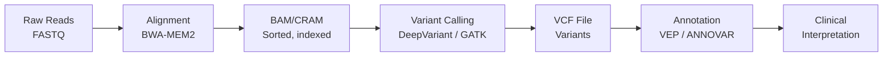
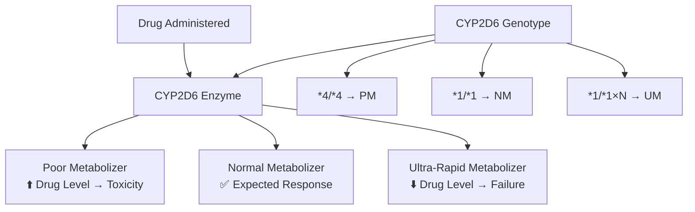

# Precision Medicine and Genomic AI

## Overview

**Precision medicine** replaces the one-size-fits-all approach with treatments tailored to individual patients based on their genetic makeup, environment, and lifestyle. The Human Genome Project (completed 2003) sequenced the first human genome for $2.7 billion; today, whole-genome sequencing costs under $200 and takes hours. This flood of genomic data has created an enormous opportunity — and challenge — for AI.

AI transforms genomic data into clinical actionability: predicting disease risk from polygenic scores, matching cancer patients to targeted therapies, identifying pharmacogenomic variants that affect drug metabolism, and discovering novel disease-gene associations. This lesson covers the AI techniques powering the precision medicine revolution.

---

## Genomic Data Types

### DNA Sequence Analysis

The human genome contains approximately 3.2 billion base pairs encoding ~20,000 protein-coding genes. Key variant types:

- **SNPs** (Single Nucleotide Polymorphisms): Single base changes, ~4-5 million per genome
- **Indels**: Small insertions/deletions (1-50 bp)
- **Structural variants**: Large deletions, duplications, inversions (>50 bp)
- **Copy number variants (CNVs)**: Segments present in varying copy numbers

### Variant Calling Pipeline



**Genomic variant calling pipeline**

### DeepVariant: CNN-Based Variant Calling

**DeepVariant** (Google, 2018) frames variant calling as an image classification problem:

1. Stack aligned reads around a candidate site into a "pileup image"
2. Encode base identity, quality, strand, and mapping quality as RGB-like channels
3. Pass through an Inception CNN to classify: homozygous reference, heterozygous variant, or homozygous variant

DeepVariant achieved the highest accuracy in the PrecisionFDA Truth Challenge, outperforming traditional statistical methods like GATK HaplotypeCaller.

---

## Polygenic Risk Scores

Most common diseases (diabetes, heart disease, schizophrenia) are influenced by thousands of genetic variants, each with a tiny effect. A **Polygenic Risk Score (PRS)** aggregates these effects:

$$\text{PRS}_i = \sum_{j=1}^{M} \beta_j \cdot x_{ij}$$

where $\beta_j$ is the effect size of variant $j$ (from GWAS) and $x_{ij}$ is the allele count (0, 1, or 2) for individual $i$ at variant $j$.

### PRS Limitations and Improvements

Standard PRS has major limitations:

**Population bias.** ~80% of GWAS participants are of European ancestry. PRS derived from European GWAS performs significantly worse in African, Asian, and Hispanic populations:

```python
import numpy as np

# Simplified PRS calculation
def compute_prs(genotypes, weights):
    """
    genotypes: (n_individuals, n_variants) array of allele counts (0, 1, 2)
    weights: (n_variants,) array of GWAS effect sizes (beta)
    """
    return genotypes @ weights

# Example: PRS for 1000 individuals across 100K variants
n_individuals = 1000
n_variants = 100_000
genotypes = np.random.choice([0, 1, 2], size=(n_individuals, n_variants), p=[0.7, 0.25, 0.05])
weights = np.random.normal(0, 0.01, size=n_variants)

prs = compute_prs(genotypes, weights)
print(f"PRS distribution: mean={prs.mean():.2f}, std={prs.std():.2f}")
```

**Deep learning PRS** models capture nonlinear interactions between variants:
- **PRS-Net**: Neural network that learns variant interactions
- **VIME**: Self-supervised pretraining on genomic data
- **Graph-based PRS**: Models variant-variant interactions using biological pathway graphs

---

## Cancer Genomics and Treatment Selection

### Tumor Mutational Profiling

Cancer is fundamentally a genomic disease. Each tumor has a unique mutational profile that determines which therapies will be effective:

| Mutation | Cancer Type | Targeted Therapy |
|----------|------------|-----------------|
| EGFR L858R | Lung adenocarcinoma | Osimertinib |
| BRAF V600E | Melanoma | Vemurafenib + Cobimetinib |
| HER2 amplification | Breast cancer | Trastuzumab |
| BCR-ABL fusion | CML | Imatinib |
| BRCA1/2 mutations | Breast/Ovarian | PARP inhibitors |

### AI for Variant Interpretation

Classifying variants as pathogenic or benign is a major challenge. The **ACMG/AMP guidelines** provide a framework, but manual interpretation is slow. AI systems automate this:

$$P(\text{pathogenic} | \text{variant features}) = \sigma(f_\theta(\mathbf{x}))$$

where features $\mathbf{x}$ include:
- **Conservation**: PhyloP, GERP scores across species
- **Protein impact**: SIFT, PolyPhen-2 predictions
- **Population frequency**: gnomAD allele frequency
- **Functional annotations**: Protein domain, regulatory element overlap
- **Structural context**: Distance to active site, protein stability change

**AlphaMissense** (DeepMind, 2023) classified 89% of all possible human missense variants as likely pathogenic or likely benign, leveraging AlphaFold's protein structure predictions.

### Tumor Mutational Burden and Immunotherapy

**Tumor Mutational Burden (TMB)** — the number of somatic mutations per megabase — predicts response to immune checkpoint inhibitors:

$$\text{TMB} = \frac{\text{Number of somatic mutations}}{\text{Megabases sequenced}}$$

High TMB (>10 mut/Mb) tumors generate more neoantigens, making them more visible to the immune system. ML models predict immunotherapy response by combining TMB with gene expression signatures, immune cell infiltration estimates, and HLA typing.

---

## Pharmacogenomics

**Pharmacogenomics (PGx)** studies how genetic variation affects drug response. Key examples:

### CYP450 Metabolism

The cytochrome P450 enzyme family metabolizes ~75% of all drugs. Genetic variants create:
- **Poor metabolizers**: Drug accumulates → toxicity
- **Ultra-rapid metabolizers**: Drug cleared too fast → therapeutic failure



**Pharmacogenomic variation in drug metabolism**

### Clinical PGx Implementation

The **Clinical Pharmacogenetics Implementation Consortium (CPIC)** provides evidence-based guidelines:
- **Clopidogrel + CYP2C19**: Poor metabolizers get reduced antiplatelet effect → switch to prasugrel
- **Codeine + CYP2D6**: Ultra-rapid metabolizers convert too much to morphine → avoid codeine
- **Warfarin + CYP2C9/VKORC1**: Genetic variants require dose adjustment from 0.5-7mg/day

AI improves PGx by integrating genetic data with clinical variables for personalized dosing:

$$\text{Dose}_{\text{optimal}} = f_\theta(\text{genotype}, \text{age}, \text{weight}, \text{comorbidities}, \text{co-medications})$$

---

## Single-Cell Genomics

**Single-cell RNA sequencing (scRNA-seq)** measures gene expression in individual cells, revealing cellular heterogeneity invisible to bulk sequencing.

### Dimensionality Reduction

A typical scRNA-seq experiment measures ~20,000 genes across 10,000-1,000,000 cells. Visualization requires dimensionality reduction:

- **PCA**: Linear reduction, captures major axes of variation
- **t-SNE**: Non-linear, preserves local structure
- **UMAP**: Non-linear, preserves global and local structure
- **scVI**: Variational autoencoder specifically designed for scRNA-seq

$$\text{scVI}: \quad z_i \sim q_\phi(z | x_i) \quad \Rightarrow \quad \hat{x}_i \sim p_\theta(x | z_i)$$

where $z_i$ is the latent representation of cell $i$, $q_\phi$ is the encoder, and $p_\theta$ is the decoder that accounts for technical noise (library size, batch effects).

### Cell Type Annotation

AI automates cell type identification from single-cell data:
- **scBERT**: BERT-style model pretrained on large scRNA-seq atlases
- **CellTypist**: Logistic regression-based classifier trained on the Human Cell Atlas
- **Foundation models**: scGPT and Geneformer pretrained on millions of single-cell profiles

---

## Real-World Applications

- **Foundation Medicine (Roche)**: Comprehensive genomic profiling (FoundationOne CDx) for cancer treatment selection, FDA-approved companion diagnostic
- **23andMe**: Consumer PRS reports for health risks (with FDA authorization for certain conditions)
- **Tempus**: AI platform integrating clinical and molecular data for oncology treatment decisions
- **Color Health**: Population-scale genetic testing with AI-driven variant interpretation
- **UK Biobank**: 500,000 participants with whole-genome sequencing, linked to health records — the world's largest biobank

---

## Challenges and Limitations

**Ancestry bias.** Genomic databases are overwhelmingly European-descent. PRS performance drops substantially for underrepresented populations, risking exacerbation of health disparities.

**Variant of uncertain significance (VUS).** Many detected variants cannot be classified as pathogenic or benign with current evidence. AI can reduce VUS rates but cannot eliminate uncertainty.

**Incidental findings.** Genomic sequencing may reveal predispositions (e.g., BRCA1 mutation) unrelated to the original clinical question, raising ethical questions about disclosure.

**Polygenic complexity.** For common diseases, thousands of variants contribute tiny effects. Gene-environment interactions add another layer of complexity that current models struggle to capture.

---

## Exercises

1. **PRS calculation**: Using publicly available GWAS summary statistics and 1000 Genomes data, compute PRS for a set of individuals. Evaluate the association between PRS and a phenotype.
2. **Variant classification**: Build a classifier for ClinVar variants using features from conservation scores, allele frequency, and protein impact predictions. Compare with AlphaMissense predictions.
3. **Single-cell analysis**: Use scanpy to analyze a public scRNA-seq dataset. Perform clustering, identify marker genes, and annotate cell types.

---

## Further Reading

- Popejoy, A.B. & Fullerton, S.M. (2016). "Genomics is failing on diversity." *Nature* — equity in genomic research
- Cheng, J. et al. (2023). "Accurate proteome-wide missense variant effect prediction with AlphaMissense." *Science* — DeepMind's variant classifier
- Hie, B. et al. (2020). "Computational methods for single-cell RNA sequencing." *Annual Review of Biomedical Data Science* — scRNA-seq methods review
