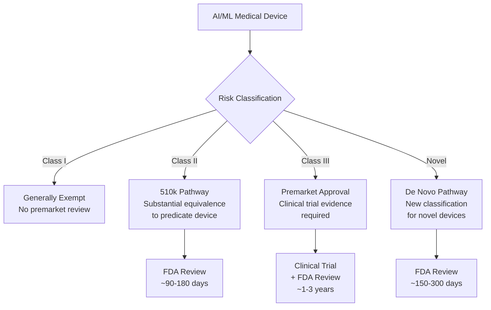
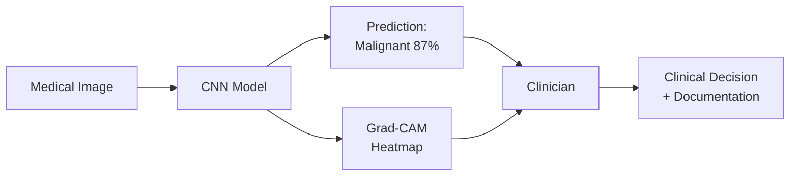

# Medical AI Regulations and Ethics

## Overview

Medical AI exists in a uniquely regulated space. Unlike consumer AI products, a diagnostic algorithm that misclassifies a malignant tumor as benign can directly cause patient harm or death. **Regulatory frameworks, ethical principles, and deployment safeguards** are not optional add-ons — they are fundamental requirements that shape how medical AI is developed, validated, and deployed.

This lesson covers the FDA regulatory pathway for AI-based medical devices, the EU AI Act's implications for health AI, algorithmic fairness in medicine, informed consent, liability frameworks, and the ethical principles guiding responsible medical AI development.

---

## FDA Regulation of AI/ML Medical Devices

### Software as a Medical Device (SaMD)

The FDA classifies AI-based clinical tools as **Software as a Medical Device (SaMD)** — software intended for medical purposes that is not part of a hardware device. The International Medical Device Regulators Forum (IMDRF) defines risk categories:

| Category | Risk | Example |
|----------|------|---------|
| I | Low | Wellness apps, symptom checkers |
| II | Moderate | Clinical decision support with physician oversight |
| III | High | Autonomous diagnostic AI (e.g., IDx-DR) |
| IV | Very High | AI controlling therapy (e.g., closed-loop insulin) |

### Regulatory Pathways



**FDA regulatory pathways for AI medical devices**

### Key Regulatory Milestones

- **2018**: IDx-DR — first De Novo authorization for autonomous AI diagnostic (diabetic retinopathy)
- **2020**: Caption Health — AI-guided ultrasound for non-expert users
- **2021**: Paige Prostate — AI for prostate cancer detection in pathology
- **2023**: FDA has authorized 690+ AI/ML-enabled medical devices (cumulative)
- **2024**: Majority of AI devices are in radiology (75%), followed by cardiology (11%)

### The Predetermined Change Control Plan (PCCP)

Traditional regulation assumes a device is "locked" — the version submitted is the version deployed. AI/ML models that update continuously don't fit this paradigm. The FDA's **PCCP framework** allows:

1. Define the **SaMD Pre-Specifications (SPS)**: What aspects of the algorithm might change
2. Define the **Algorithm Change Protocol (ACP)**: How changes will be validated
3. Submit both with the initial authorization
4. Make changes within the pre-specified boundaries without new submissions

This is still evolving — as of 2025, few PCCPs have been approved, and the practical scope of permitted changes remains narrow.

---

## EU AI Act and Global Regulation

### EU AI Act (2024)

The EU AI Act establishes a risk-based framework for all AI systems, with medical AI falling predominantly under **high-risk**:

- **Mandatory requirements**: Risk management, data governance, transparency, human oversight, robustness
- **Conformity assessment**: Must demonstrate compliance before market placement
- **Post-market surveillance**: Continuous monitoring of real-world performance
- **Penalties**: Up to 7% of global revenue for violations

### Comparison: FDA vs. EU vs. China

| Aspect | FDA (US) | EU AI Act + MDR | NMPA (China) |
|--------|----------|----------------|--------------|
| Framework | Device-specific | Horizontal AI law + device regulation | Device-specific |
| Risk classification | Class I-III | Unacceptable/High/Limited/Minimal | Class I-III |
| Clinical evidence | Substantial equivalence or trial | Clinical evaluation | Clinical trial |
| Continuous learning | PCCP (evolving) | Required monitoring | Case-by-case |
| Timeline | 3-12 months (510k) | ~12 months (conformity) | 6-18 months |

---

## Algorithmic Fairness in Medicine

### The Problem

Medical AI can perpetuate and amplify existing health disparities. Three landmark cases illustrate the risk:

**1. Optum Algorithm (2019):** An algorithm used by health systems to identify patients needing extra care used healthcare costs as a proxy for health needs. Because Black patients historically had less access to healthcare (and thus lower costs), the algorithm systematically under-referred Black patients. At a given risk score, Black patients were significantly sicker than white patients.

**2. Dermatology AI:** Skin lesion classifiers trained predominantly on lighter skin tones show degraded performance on darker skin — exactly the populations with less access to dermatologists.

**3. Pulse Oximetry:** Not an AI issue per se, but illustrative: pulse oximeters systematically overestimate oxygen levels in dark-skinned patients, leading to delayed treatment. Any AI using SpO2 as a feature inherits this bias.

### Fairness Metrics

Multiple mathematical definitions of fairness exist, and they are mutually exclusive:

**Demographic parity**: Equal positive prediction rates across groups:

$$P(\hat{Y} = 1 | A = 0) = P(\hat{Y} = 1 | A = 1)$$

**Equalized odds**: Equal true positive and false positive rates across groups:

$$P(\hat{Y} = 1 | Y = y, A = 0) = P(\hat{Y} = 1 | Y = y, A = 1) \quad \forall y$$

**Calibration**: Among patients given risk score $s$, the true event rate is $s$ regardless of group:

$$P(Y = 1 | \hat{p} = s, A = a) = s \quad \forall a$$

The **impossibility theorem** (Chouldechova, 2017) proves that when base rates differ between groups, you cannot simultaneously achieve calibration, equal false positive rates, and equal false negative rates.

### Bias Mitigation Strategies

```python
# Example: Reweighting to achieve demographic parity
import numpy as np

def compute_sample_weights(y, sensitive_attr):
    """Compute sample weights to balance outcomes across groups."""
    weights = np.ones(len(y))
    for group in np.unique(sensitive_attr):
        group_mask = sensitive_attr == group
        group_size = group_mask.sum()
        for label in [0, 1]:
            label_mask = y == label
            combined = group_mask & label_mask
            expected_prop = label_mask.sum() / len(y) * group_size / len(y)
            actual_prop = combined.sum() / len(y)
            if actual_prop > 0:
                weights[combined] = expected_prop / actual_prop
    return weights
```

Approaches include:
- **Pre-processing**: Reweight or resample training data
- **In-processing**: Add fairness constraints to the loss function
- **Post-processing**: Adjust thresholds per group to equalize metrics
- **Data collection**: Actively collect data from underrepresented populations

---

## Informed Consent and Transparency

### Patient Communication

When AI is involved in diagnosis or treatment decisions, patients have a right to know:
- **That AI was used** in their care
- **What role it played** (screening, decision support, autonomous diagnosis)
- **Its known limitations** (performance on their demographic group)
- **Their right to human review** of AI-generated decisions

### Model Transparency and Explainability

Regulatory bodies increasingly require explanations for AI decisions:

- **FDA**: Requires labeling that describes "how the device works" for clinicians
- **EU AI Act**: Mandates transparency for high-risk AI including "interpretability appropriate to the context"
- **Clinical practice**: Grad-CAM, SHAP, and attention maps provide visual explanations



**Explainable AI workflow in clinical practice**

---

## Liability and Malpractice

### Who Is Liable When AI Is Wrong?

The liability landscape for medical AI remains unsettled:

| Scenario | Traditional Liability | With AI |
|----------|---------------------|---------|
| Physician misreads X-ray | Physician malpractice | Physician (if AI available but not used?) |
| AI misses tumor | — | Manufacturer? Physician who relied on AI? Hospital? |
| AI recommends treatment, patient harmed | — | Shared liability? "Learned intermediary" doctrine? |

Key legal questions:
- **Duty to use**: If AI is available and proven, is it malpractice NOT to use it?
- **Duty to override**: If a physician disagrees with AI, whose judgment prevails?
- **Product liability**: Is an AI misdiagnosis a product defect or a clinical judgment?
- **Automation bias**: When physicians defer to AI even when they shouldn't

---

## Ethical Principles for Medical AI

### The Belmont Principles Applied to AI

The foundational ethical principles for human subjects research apply to medical AI:

**Respect for persons**: Patients should understand and consent to AI involvement in their care. Autonomy means the right to opt out.

**Beneficence**: AI must demonstrably improve outcomes. "Do no harm" means rigorous validation, not deployment based on benchmark performance alone.

**Justice**: Benefits and burdens of AI should be distributed fairly across populations. An AI that works well for wealthy, urban, white patients but poorly for rural, minority populations violates this principle.

### Additional AI-Specific Principles

- **Transparency**: Stakeholders should understand how AI systems work and their limitations
- **Accountability**: Clear responsibility chains for AI-influenced decisions
- **Privacy**: Minimize data collection; protect against re-identification
- **Robustness**: Systems should fail safely and gracefully
- **Inclusivity**: Development teams and training data should reflect the diversity of patients served

---

## Real-World Applications

- **AMA AI Policy**: American Medical Association's framework for augmented intelligence in medicine
- **WHO AI Ethics Guidance (2021)**: Six principles for AI in health — protect autonomy, promote well-being, ensure transparency, foster responsibility, ensure inclusiveness, promote responsive and sustainable AI
- **FDA Digital Health Center of Excellence**: Centralized regulatory expertise for digital health and AI
- **Model Facts Label**: Proposed standardized documentation (inspired by nutrition labels) for clinical AI models

---

## Challenges and Limitations

**Regulatory pace vs. technology pace.** AI evolves faster than regulation. The FDA's PCCP framework is a step forward, but practical implementation remains complex.

**International fragmentation.** Different countries have different standards, making global deployment of medical AI products costly and complex.

**Post-market surveillance.** Once deployed, model performance can degrade due to data drift, population changes, or clinical practice evolution. Continuous monitoring is required but rarely implemented well.

**Commercial pressure vs. safety.** Startup culture values speed to market. Rigorous clinical validation is slow and expensive. The tension between commercial viability and patient safety requires strong regulatory guardrails.

---

## Exercises

1. **Regulatory analysis**: Choose an FDA-authorized AI medical device from the FDA's AI/ML-based SaMD list. Identify its regulatory pathway, clinical evidence, and labeled indications. What were the limitations noted in the authorization?
2. **Fairness audit**: Using a public clinical dataset (e.g., MIMIC), train a mortality prediction model and evaluate performance stratified by race and sex. Calculate disparities in AUROC, sensitivity, and calibration.
3. **Ethical case study**: A hospital wants to deploy a skin lesion AI trained primarily on lighter skin tones. Draft a stakeholder analysis: who benefits, who bears risk, and what safeguards would you recommend before deployment?

---

## Further Reading

- Obermeyer, Z. et al. (2019). "Dissecting racial bias in an algorithm used to manage the health of populations." *Science* — the Optum algorithm case study
- FDA (2021). "Artificial Intelligence/Machine Learning (AI/ML)-Based Software as a Medical Device (SaMD) Action Plan" — FDA's evolving regulatory approach
- WHO (2021). "Ethics and governance of artificial intelligence for health" — global ethical framework
