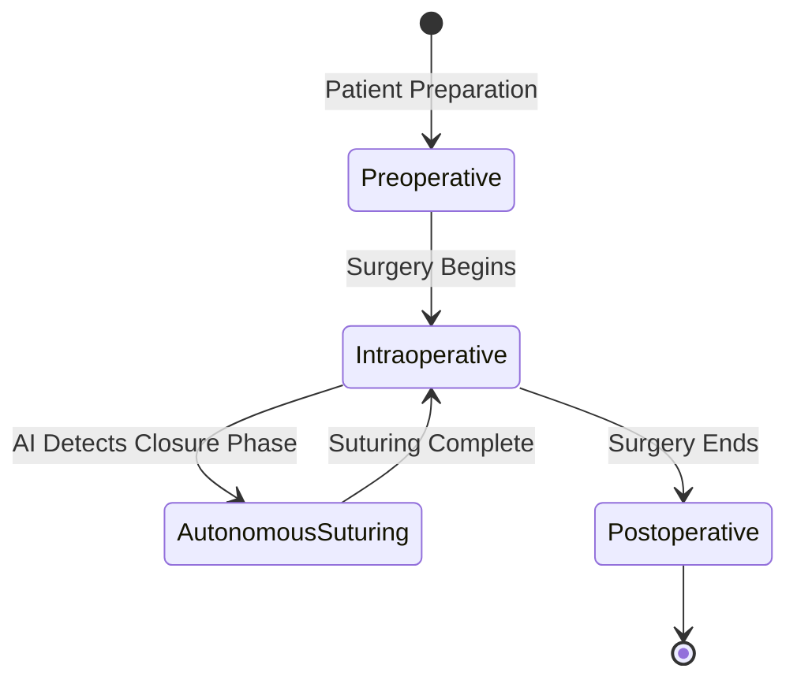
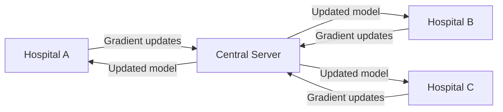

# Frontiers in Medical AI

## Overview

Medical AI is advancing at an extraordinary pace, with breakthrough applications emerging across nearly every clinical specialty. This lesson explores the most promising frontiers shaping the future of healthcare AI — from foundation models for medicine to autonomous surgical robots, from AI-powered scientific discovery to the convergence of wearable sensors and real-time health monitoring.

These frontiers represent not just incremental improvements but fundamental shifts in what AI systems can do in medicine. Understanding them is essential for anyone working at the intersection of AI and healthcare.

---

## Foundation Models for Medicine

The success of large language models (LLMs) in general domains has inspired a new generation of **medical foundation models** — large neural networks pre-trained on massive amounts of biomedical data, then fine-tuned for specific clinical tasks.

### GPT-4V and Medical VLMs

Vision-language models like GPT-4V have demonstrated remarkable zero-shot capability on medical imaging tasks. When prompted with a chest X-ray, GPT-4V can describe findings consistent with pneumothorax, pleural effusion, or lung nodules — sometimes matching the accuracy of board-certified radiologists on routine cases.

More specialized models like **Med-PaLM M** (MedCLIP-based) and **RadFM** (Radiology Foundation Model) are trained specifically on medical image-text pairs, enabling richer reasoning about complex cases.

### BioLM and Biomedical NLP

Models like **BioGPT**, **PubMedBERT**, and **Galactica** are pre-trained on biomedical corpora — PubMed abstracts, clinical notes, protein sequences. They achieve state-of-the-art results on tasks ranging from medical question answering (MedQA, USMLE-style questions) to adverse drug event detection.

Key benchmark: **MedQA** (USMLE Step 1-3 style questions). Human expert performance is ~60%; GPT-4 achieves ~67% — the first model to surpass the pass threshold.

```python
# Example: Using a biomedical LLM for clinical reasoning
from transformers import AutoModelForCausalLM, AutoTokenizer

model_name = "microsoft/BiomedGPT-LM-7B"
tokenizer = AutoTokenizer.from_pretrained(model_name)
model = AutoModelForCausalLM.from_pretrained(model_name)

prompt = """
Patient: 58-year-old male with chest pain, hypertension, and Type 2 diabetes.
Lab: Troponin I elevated at 2.4 ng/mL (normal < 0.04), BNP 850 pg/mL (normal < 100).
ECG: ST-segment depression in leads V1-V4.
Diagnosis reasoning:
"""

inputs = tokenizer(prompt, return_tensors="pt")
outputs = model.generate(**inputs, max_new_tokens=200)
print(tokenizer.decode(outputs[0], skip_special_tokens=True))
```

### Impact of Medical Foundation Models

Foundation models represent a paradigm shift because they can be adapted to new tasks with minimal labeled data — a critical advantage in medicine where annotated datasets are small and expensive.

---

## Autonomous Systems in Medicine

AI is moving beyond advisory roles into **autonomous action** in controlled medical environments.

### Surgical Robotics

Systems like the **Da Vinci Surgical System** have been used for over 7 million procedures. More recently, AI-assisted surgical robotics have demonstrated:

- **Autonomous suturing**: Models trained on kinematic data from expert surgeons can replicate suturing patterns autonomously
- **Real-time tissue tracking**: Computer vision models track moving tissue during procedures, enabling adaptive robot control
- **Natural orifice surgery**: AI-guided robots performing procedures through natural body openings (no external incisions)



**Phases of AI-assisted surgical workflow**

### Autonomous Screening

In diagnostic screening contexts, AI systems operate with increasing autonomy:

- **Diabetic retinopathy screening**: FDA-cleared systems (e.g., IDx-DR) make autonomous screening decisions without physician oversight in primary care settings
- **Skin cancer screening**: Systems achieving dermatologist-level accuracy in detecting melanoma from dermoscopic images
- **Cervical cancer screening**: AI analyzing wet mount microscopy for trichomoniasis and bacterial vaginosis

---

## Wearables and Continuous Monitoring

The proliferation of **smartwatches and wearable sensors** has created a new frontier: continuous, passive health monitoring that extends beyond the clinical setting.

### ECG and Arrhythmia Detection

Apple Watch Series 4+ contains an FDA-cleared ECG app capable of detecting **atrial fibrillation**. The Apple Heart Study demonstrated that the Apple Watch detected AF with 84% sensitivity and 99% specificity compared to patch monitors.

More advanced systems now detect:
- **QT prolongation** (drug-induced cardiac risk)
- **Hypertrophic cardiomyopathy** from pulse wave analysis
- **Heart failure** progression from impedance cardiography

### Continuous Glucose Monitoring (CGM)

CGM devices from Dexcom and Abbott generate 288 glucose readings per day. AI systems analyze these patterns to:

- Predict hypoglycemic events 30-60 minutes in advance
- Optimize insulin dosing in real-time (automated insulin delivery systems)
- Identify dietary and lifestyle patterns affecting glycemic control

$$HbA1c_{predicted} = \frac{2.59 + 0.31 \times mean_{CGM} - 0.001 \times glycemic_variability}{1.0}$$

### Sleep and Respiratory Monitoring

Wearable devices now track:
- **Sleep stages** (light, deep, REM) via movement and heart rate variability
- **Respiratory rate** from accelerometry
- **Blood oxygen saturation** (SpO2) via photoplethysmography
- **Sleep apnea** detection from oxygen desaturation patterns

---

## AI for Scientific Discovery in Medicine

Beyond clinical applications, AI is accelerating the pace of **biomedical scientific discovery** itself.

### AlphaFold and Structural Biology

AlphaFold2 (2021) solved the protein folding problem — predicting 3D protein structure from amino acid sequence with atomic accuracy. This was recognized as the scientific breakthrough of the decade.

Extensions like **AlphaFold Server** provide free access to structure predictions for researchers worldwide. Over 1 million structures have been accessed since launch.

### Foundation Models for Drug Discovery

Modern drug discovery uses AI foundation models across the entire pipeline:

| Stage | AI Application | Example |
|-------|---------------|---------|
| Target identification | Protein-protein interaction prediction | AlphaFold-Multimer |
| Hit discovery | Virtual screening of billions of compounds | MolBERT, Uni-Mol |
| Lead optimization | Generative design of novel molecules | REINVENT, GraphAF |
| Clinical trial design | Patient stratification from EHR | TrialLens |
| Pharmacovigilance | Adverse event detection from social media | VASQUEZ |

### Robot Scientists

Autonomous laboratory systems — sometimes called "robot scientists" — can:

- Formulate hypotheses from literature
- Design experiments to test hypotheses
- Execute experiments using robotic liquid handlers
- Analyze results and iterate

The **Aaron** platform at Merck has automated thousands of reactions, reducing the time for hit-to-lead optimization from months to weeks.

---

## Federated Learning and Privacy-Preserving AI

Healthcare data is extremely sensitive and heavily regulated. **Federated learning** enables AI model training across institutions without sharing patient data.

### How Federated Learning Works



**Federated learning architecture across hospitals**

Instead of sharing patient data, each hospital trains a local model and shares only the **gradient updates** (or model weights). The central server aggregates these updates to improve the global model.

### Differential Privacy

Differential privacy adds mathematical guarantees that individual patient records cannot be re-identified from model outputs:

$$\Pr[\mathcal{M}(D) \in S] \leq e^\epsilon \Pr[\mathcal{M}(D') \in S] + \delta$$

Where $D$ and $D'$ differ by one record, $\epsilon$ is the privacy budget, and $\delta$ is the probability of privacy violation.

Systems like **Google's DP-SGD** (Differentially Private Stochastic Gradient Descent) are used to train models on sensitive EHR data.

---

## Multimodal Medical AI

The future belongs to **multimodal AI systems** that integrate data from all sources:

- **Imaging + genomics + clinical notes + vital signs** → unified patient representation
- **Foundation models** like GPT-4V, Gemini, and LLaVA that process text, images, and potentially audio/video
- **Medical multimodal benchmarks** like MultiMedBench covering 12 task types

Real-world deployment: An AI system in a hospital could simultaneously analyze a patient's chest X-ray (imaging), their lab trend over time (structured data), and the physician's note describing symptoms (text) — producing a unified clinical assessment.

---

## Exercises

1. **Medical VLM Evaluation**: Use a vision-language model (e.g., via API) to analyze a medical image (chest X-ray or skin lesion). Compare its interpretation to published clinical guidelines. Document edge cases where the model struggles.

2. **Federated Learning Simulation**: Simulate federated learning across 3 "hospitals" (data partitions) using a public medical dataset (e.g., UCI Heart Disease). Train local models, aggregate weights, and compare performance to centrally-trained model.

3. **Wearable Data Analysis**: If you have access to personal health device data (or a public dataset like MIMIC), build a simple anomaly detection model for heart rate or glucose values.

4. **Literature Review**: Identify 3 recent papers (2024-2026) on medical AI frontiers not covered in this lesson. Write a 500-word synthesis of their contributions and implications.

---

## Further Reading

- Singhal, K. et al. (2023). "Towards Expert-Level Medical Question Answering with Large Language Models." — Med-PaLM 2 performance on medical benchmarks
- Jumper, J. et al. (2021). "Highly accurate protein structure prediction with AlphaFold." *Nature* — protein folding breakthrough
- Rieke, N. et al. (2020). "The future of digital health with federated learning." *npj Digital Medicine* — review of FL applications in medicine
- FDA (2021). "Artificial Intelligence/Machine Learning (AI/ML)-Based Software as a Medical Device (SaMD) Action Plan" — regulatory framework for medical AI
