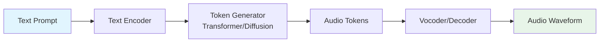

# Introduction to AI for Music and Creative Arts

## Overview

The relationship between computation and music stretches back further than most people realize. In 1957, Lejaren Hiller and Leonard Isaacson used the ILLIAC I computer at the University of Illinois to compose the *Illiac Suite for String Quartet* — widely regarded as the first computer-generated musical composition. They used Markov chains and rule-based systems to generate melodies that adhered to principles of classical counterpoint. The result was imperfect, but it posed a question that remains central today: can machines create art?

For decades, algorithmic composition remained an academic curiosity. Systems like David Cope's EMI (Experiments in Musical Intelligence) in the 1980s could analyze a composer's style and produce new works that sometimes fooled expert listeners. But these systems were brittle — they relied on hand-crafted rules and could not generalize beyond narrow stylistic boundaries.

The deep learning revolution changed everything. Starting around 2016, neural networks began producing music that was not merely rule-following but genuinely creative-sounding. Google's Magenta project explored recurrent neural networks (RNNs) for melody generation. OpenAI's MuseNet (2019) used transformer architectures to generate multi-instrument compositions in various styles. Then came the diffusion model era.

By 2024-2026, the landscape has transformed dramatically. Suno has grown to over 2 million paying subscribers with $300 million in annual revenue, allowing anyone to generate full songs from text prompts. Udio raised a $40 million Series A to compete in the same space. Stability AI demonstrated 6-minute coherent song generation. Google DeepMind's Lyria 3 introduced photo-to-music generation — upload an image and receive a soundtrack that matches the visual mood. The creative music AI industry has become a multi-billion-dollar ecosystem.

---

## The Current Landscape

### Major Players and Products

The generative music space has consolidated around several key platforms and research labs:

- **Suno** — The market leader in consumer text-to-music generation. Users type a prompt like "upbeat jazz fusion with synth bass" and receive a complete song with vocals, instruments, and production within seconds. Suno uses a proprietary architecture combining transformers and diffusion models.

- **Udio** — A strong competitor focused on audio quality and musical coherence. Udio emphasizes longer-form generation and more precise stylistic control.

- **Stability AI (Stable Audio)** — Built on latent diffusion models (the same family as Stable Diffusion for images), Stable Audio generates music by denoising in a learned audio latent space.

- **Google DeepMind (Lyria / MusicLM)** — Research-driven systems that pioneered text-to-music generation. MusicLM introduced hierarchical token-based generation. Lyria 3 extended this to cross-modal inputs.

- **Meta (MusicGen)** — An open-source transformer-based model for music generation. MusicGen operates over discrete audio tokens and provides fine-grained control over generation.

### Types of Generative Models

Three model families dominate AI music generation:

1. **Transformer Models** — Treat music as a sequence of discrete tokens (similar to text in LLMs). Models like MusicGen and MusicLM predict the next audio token given previous tokens and conditioning signals (text, melody). They excel at capturing long-range musical structure.

2. **Diffusion Models** — Start from random noise and iteratively denoise to produce audio. Stable Audio and parts of Suno's pipeline use diffusion. They produce high-fidelity audio and allow fine-grained control through classifier-free guidance.

3. **Generative Adversarial Networks (GANs)** — A generator network creates audio while a discriminator tries to distinguish real from generated audio. GANs like WaveGAN were early pioneers but have been largely overtaken by transformers and diffusion models for music.

4. **Variational Autoencoders (VAEs)** — Encode audio into a compressed latent space, then decode back. VAEs (like Encodec) often serve as the audio tokenizer for transformer-based systems rather than being the primary generator.

---

## Key Concepts

- **Algorithmic Composition**: Rule-based systems that generate music using mathematical procedures, Markov chains, or formal grammars. The precursor to neural music generation.

- **Neural Audio Synthesis**: Using deep neural networks to generate raw audio waveforms or spectrograms, producing sounds that can be indistinguishable from human-produced audio.

- **Audio Tokenization**: Converting continuous audio signals into discrete tokens that can be processed by language-model-style architectures. Key tokenizers include Encodec (Meta) and SoundStream (Google).

- **Conditioning**: Providing additional information to guide generation — text prompts, melody contours, genre labels, mood descriptors, tempo, or even images.

- **Latent Space**: A compressed, learned representation of audio where mathematical operations (interpolation, arithmetic) produce musically meaningful transformations.

- **Vocoder**: A model that converts intermediate representations (mel spectrograms, latent codes) into audible waveforms. HiFi-GAN and Encodec's decoder are common vocoders.

---

## Applications and Industry Impact

AI music generation is not a single application but an ecosystem:

| Application | Description | Example Tools |
|---|---|---|
| Text-to-music | Generate complete songs from text prompts | Suno, Udio, MusicLM |
| Stem separation | Isolate vocals, drums, bass, etc. from mixed audio | Demucs, Spleeter |
| Music inpainting | Fill gaps or extend existing audio | Stable Audio |
| Voice synthesis | Clone or synthesize singing voices | DiffSV, So-VITS-SVC |
| Adaptive soundtracks | Real-time music that reacts to gameplay or context | AI-driven game engines |
| Production assistance | AI-powered mixing, mastering, and EQ | LANDR, iZotope |

---

## Code Examples

Here is a simple example using Meta's MusicGen to generate a short clip from a text prompt:

```python
from audiocraft.models import MusicGen
from audiocraft.data.audio import audio_write

# Load a pre-trained MusicGen model
model = MusicGen.get_pretrained("facebook/musicgen-small")
model.set_generation_params(duration=8)  # 8 seconds

# Generate music from a text description
descriptions = ["happy acoustic guitar melody with light percussion"]
wav = model.generate(descriptions)

# Save the output
audio_write("output", wav[0].cpu(), model.sample_rate, strategy="loudness")
print("Generated audio saved to output.wav")
```

This code loads a pre-trained MusicGen model, generates 8 seconds of audio from a text description, and saves it as a WAV file. The model handles the entire pipeline — from text encoding to audio token generation to waveform synthesis.

---

## Diagrams



**Figure 1**: High-level pipeline of a text-to-music generation system. A text prompt is encoded, tokens are generated by a transformer or diffusion model, and a vocoder converts tokens to audible audio.

---

## Further Reading

- Copet et al., "Simple and Controllable Music Generation" (MusicGen paper, 2023)
- Agostinelli et al., "MusicLM: Generating Music From Text" (Google, 2023)
- Evans et al., "Stable Audio: Fast Timing-Conditioned Latent Audio Diffusion" (Stability AI, 2024)
- Défossez et al., "High Fidelity Neural Audio Compression" (Encodec paper, 2022)
- Google Magenta Project: https://magenta.tensorflow.org/
