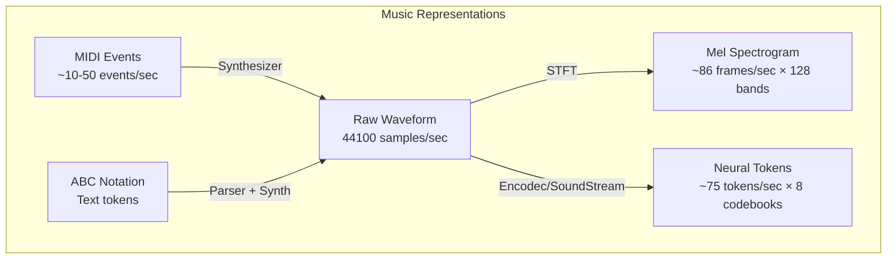

# How Computers Represent Music

## Overview

Before an AI system can generate, analyze, or transform music, the music must be represented in a form that computers can process. This seemingly simple requirement — turning sound into numbers — is one of the most consequential design decisions in AI music systems. The choice of representation determines what the model can learn, what it can generate, and the quality of the output.

Music exists in multiple forms: a pianist's fingers striking keys produce vibrations in air (audio waveforms), a composer writes dots on staves (notation), a MIDI file stores key presses with velocities and timings (symbolic events), and a spectrogram visualizes frequency content over time (spectral representation). Each representation captures different aspects of music and loses others. A waveform preserves every nuance of timbre and dynamics but is extremely high-dimensional. A MIDI file captures pitch and rhythm precisely but discards timbre entirely. Understanding these trade-offs is essential for working with AI music systems.

Modern AI music systems have converged on a critical innovation: **neural audio tokenization**. Instead of working directly with raw waveforms (which have 44,100 samples per second for CD-quality audio) or simplified symbolic representations (which lose timbral information), systems like Meta's Encodec and Google's SoundStream learn to compress audio into a small number of discrete tokens per second — typically 50-75 tokens per second instead of 44,100 samples. This compression makes it feasible to apply transformer-style language models to audio generation.

---

## Music Representations

### Raw Audio Waveforms

The most fundamental representation is the raw audio waveform — a one-dimensional signal representing air pressure over time:

```text
Amplitude
    ^
    |   /\      /\      /\
    |  /  \    /  \    /  \
    | /    \  /    \  /    \
----+-------\/------\/------\---> Time
    |
    v
```

CD-quality audio is sampled at 44,100 Hz with 16-bit depth, producing 44,100 floating-point values per second per channel. A 3-minute stereo song requires ~31.7 million samples. This is far too many values for most AI models to process directly, which is why compression and alternative representations are essential.

### MIDI (Musical Instrument Digital Interface)

MIDI, developed in 1983, represents music as a sequence of events rather than sound:

```python
# A simple MIDI-like representation
events = [
    {"type": "note_on",  "pitch": 60, "velocity": 80, "time": 0.0},    # C4
    {"type": "note_on",  "pitch": 64, "velocity": 75, "time": 0.0},    # E4
    {"type": "note_on",  "pitch": 67, "velocity": 70, "time": 0.0},    # G4
    {"type": "note_off", "pitch": 60, "velocity": 0,  "time": 0.5},
    {"type": "note_off", "pitch": 64, "velocity": 0,  "time": 0.5},
    {"type": "note_off", "pitch": 67, "velocity": 0,  "time": 0.5},
]
# This encodes a C major chord held for half a second
```

MIDI is compact and musically interpretable, but it contains no timbre information — the same MIDI file can sound like a piano, guitar, or synthesizer depending on the playback engine.

### Spectrograms and Mel Spectrograms

A spectrogram converts a waveform into a 2D image showing frequency content over time using the Short-Time Fourier Transform (STFT):

```python
import librosa
import librosa.display
import numpy as np

# Load an audio file
y, sr = librosa.load("song.wav", sr=22050)

# Compute mel spectrogram
mel_spec = librosa.feature.melspectrogram(y=y, sr=sr, n_mels=128)
mel_spec_db = librosa.power_to_db(mel_spec, ref=np.max)

# Shape: (128 mel bands, T time frames)
print(f"Spectrogram shape: {mel_spec_db.shape}")
```

Mel spectrograms use a perceptually-motivated frequency scale that approximates how humans perceive pitch. Low frequencies are given more resolution than high frequencies, matching the human auditory system.

### Symbolic Representations: ABC Notation and MusicXML

Text-based music notations can be processed by language models directly:

```text
X:1
T:Simple Melody
M:4/4
K:C
|: C D E F | G2 G2 | A B c d | e4 :|
```

ABC notation is compact and tokenizable, making it suitable for transformer-based generation of sheet music. MusicXML is a more verbose XML format used for interchange between notation software.

---

## Key Concepts

- **Sampling Rate**: The number of audio samples per second. CD quality = 44,100 Hz. Higher rates capture more high-frequency detail but increase data size.

- **Neural Audio Codec**: A learned encoder-decoder that compresses audio waveforms into discrete token sequences. Encodec compresses 24kHz mono audio to ~1.5 kbps using residual vector quantization.

- **Residual Vector Quantization (RVQ)**: A multi-layer quantization scheme where each layer encodes the residual error from the previous layer. This produces multiple "codebooks" of tokens at different fidelity levels.

- **Symbolic vs. Audio Generation**: Symbolic generation produces MIDI or notation (structure without timbre). Audio generation produces waveforms directly (full fidelity but harder to control).

---

## Neural Audio Tokenization: Encodec and SoundStream

The breakthrough enabling transformer-based music generation was neural audio compression:

```python
# Conceptual illustration of Encodec tokenization
# (simplified — actual API may differ)

from encodec import EncodecModel
import torch

# Load the 24kHz Encodec model
model = EncodecModel.encodec_model_24khz()
model.set_target_bandwidth(6.0)  # kbps

# Encode audio to discrete tokens
audio = torch.randn(1, 1, 24000 * 5)  # 5 seconds of audio
encoded_frames = model.encode(audio)

# Each frame contains multiple codebook indices
# Codebook 1: coarse structure (melody, rhythm)
# Codebook 2-8: fine details (timbre, texture)
codes = encoded_frames[0][0]  # shape: (batch, n_codebooks, n_frames)
print(f"Token shape: {codes.shape}")
# e.g., (1, 8, 375) = 8 codebooks, 375 frames for 5 seconds = 75 tokens/sec

# Decode back to audio
decoded_audio = model.decode(encoded_frames)
```

---

## Diagrams



**Figure 1**: Different music representations and their conversion paths. Neural tokens (Encodec/SoundStream) provide the best balance of compression and fidelity for AI generation.

---

## Further Reading

- Défossez et al., "High Fidelity Neural Audio Compression" (Encodec, 2022)
- Zeghidour et al., "SoundStream: An End-to-End Neural Audio Codec" (Google, 2021)
- Librosa documentation: https://librosa.org/
- MIDI specification: https://midi.org/specifications
- Müller, "Fundamentals of Music Processing" (Springer, 2015)
