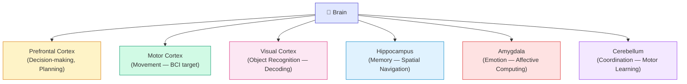
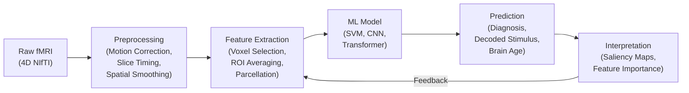

# Introduction to AI for Neuroscience

## Overview

Neuroscience is the study of the nervous system — from individual neurons to entire brain circuits. For decades, neuroscientists collected data faster than they could analyze it. The brain produces terabytes of imaging signals, electrical recordings, and behavioral measurements. AI bridges this gap, enabling discoveries that would be impossible through manual analysis alone.

The intersection of AI and neuroscience began long before the deep learning era. In the 1990s, researchers used early neural networks to classify neurons from electrophysiology recordings. By the 2000s, support vector machines became standard for fMRI analysis. The 2010s brought convolutional neural networks (CNNs) that could read patterns in brain scans with superhuman accuracy. Today, foundation models trained on massive neuroimaging datasets are reshaping what we can discover about cognition, disease, and cognition itself.

The scope of AI for neuroscience is vast. It includes using machine learning to decode what a person is seeing or remembering from their brain activity, predicting Alzheimer's disease a decade before symptoms appear, finding the wiring diagram of a fly brain from electron microscopy images, and modeling how billions of neurons interact to produce thought and behavior.

What makes neuroscience uniquely challenging for AI is the diversity and complexity of data types. A single neuroscience study might involve functional MRI (fMRI) time series, single-neuron electrical recordings from hundreds of cells, calcium imaging videos showing neural activity at millisecond resolution, and behavioral data from complex tasks. Each data type requires different preprocessing, feature extraction, and modeling approaches. Yet neuroscience is also exceptionally rich ground for AI because the data is structured by underlying biology and physics — providing strong constraints that AI can exploit.

This course will guide you from the fundamentals of brain imaging through advanced topics in neural decoding, computational modeling, and brain-computer interfaces. By the end, you'll understand how AI is transforming every aspect of neuroscience research.

## Key Concepts

- **Neuroimaging**: Techniques that produce images of brain structure or function, including MRI (structural), fMRI (blood flow-based activity), PET (molecular metabolism), and EEG (electrical fields on the scalp). Each modality offers a different trade-off between spatial resolution, temporal resolution, and invasiveness.
- **Neural decoding**: Using ML models to predict what a person is experiencing or intending from their brain activity patterns. For example, a linear classifier trained on fMRI voxel patterns can distinguish whether a participant is viewing a face or a house with over 90% accuracy.
- **Brain-computer interface (BCI)**: Systems that directly translate neural signals into device commands — e.g., controlling a prosthetic arm from motor cortex activity. Modern BCIs use deep learning to decode intention from high-density electrode arrays implanted in cortex.
- **Connectomics**: The complete map of neural connections in a nervous system — analogous to genomics but for wiring. The first full connectome of *C. elegans* (302 neurons) was mapped in 1986; AI now enables mapping of the *Drosophila* brain (≈140,000 neurons) from electron microscopy.
- **Computational neuroscience**: Using mathematical models to understand how neurons and circuits process information. Models range from biophysical simulations of single ion channels to abstract neural network models of cognition.
- **Brain age**: A biomarker that estimates the biological age of a brain from imaging data; a higher brain age than chronological age correlates with neurodegenerative disease. Brain age gap (predicted age minus chronological age) is computed using regression models trained on structural MRI from thousands of healthy adults.
- **Neural manifold**: The low-dimensional geometric structure in which neural activity patterns live, reflecting the underlying variables the brain encodes (e.g., movement direction, object identity). Dimensionality reduction techniques like PCA and UMAP reveal these manifolds from high-dimensional neural recordings.

## Diagrams

**Major Brain Regions and AI-Relevant Functions**



**Typical fMRI Analysis Pipeline**



## Code Examples

```python
"""
A first look at neuroimaging data with nilearn
nilearn is the premier Python library for neuroimaging ML.
"""
from nilearn import datasets, image, plotting

# Fetch a sample fMRI dataset (from OpenNeuro or similar)
# This downloads resting-state fMRI data from 40 subjects
# (This may take a moment on first run)
dataset = datasets.fetch_adhd(n=1)
func_file = dataset.func[0]

# Load the 4D fMRI image
fmri_img = image.load_img(func_file)
print(f"Shape: {fmri_img.shape}")
print(f"TR (repetition time): {image.get_img_shape(fmri_img, t_r_only=True)}")

# Display a statistical map overlay on the brain
# (This requires matplotlib)
plotting.plot_stat_map(
    image.index_img(fmri_img, 50),
    cut_coords=(-34, -26, -26),
    title="Brain activity at volume #50 (resting state)"
)
plotting.show()
```

**Line-by-line walkthrough:**

- **Line 6 (`from nilearn import ...`)**: Nilearn provides high-level functions for downloading neuroimaging datasets, manipulating brain images, and creating publication-quality visualizations.
- **Line 10 (`datasets.fetch_adhd(n=1)`)**: Downloads one subject's resting-state fMRI data from the ADHD-200 dataset. The data arrives as a NIfTI file (`.nii.gz`), the standard format for neuroimaging.
- **Line 14 (`image.load_img(func_file)`)**: Loads the 4D NIfTI file into memory. The resulting object has shape `(x, y, z, t)` — three spatial dimensions (voxels) and one time dimension (volumes/TRs).
- **Line 15–16 (`print(...)`)**: Inspecting the shape tells you the spatial resolution (how many voxels) and the number of time points collected during the scan.
- **Line 19 (`image.index_img(fmri_img, 50)`)**: Extracts a single 3D volume (the 50th time point) from the 4D series, creating a snapshot of brain activity at that moment.
- **Line 20 (`cut_coords=(-34, -26, -26)`)**: Specifies MNI coordinates (a standard brain coordinate system) for the cross-sectional slices to display.

The 4D image has three spatial dimensions plus time (volumes). Each volume is a 3D scan of blood-oxygen-level-dependent (BOLD) signal, an indirect proxy for neural activity. When neurons fire, local blood flow increases — fMRI detects this hemodynamic response with a delay of ~4–6 seconds.

## Exercises

1. **Explore Brain Atlases**: Using nilearn's `datasets.fetch_atlas_destrieux_2009()`, load a brain atlas and visualize it with `plotting.plot_roi()`. How many distinct regions does this atlas define? Pick three regions and look up their functions.
2. **Voxel Time Series**: Extract the BOLD time series from a single voxel (e.g., coordinates `(30, 30, 30)`) using `nilearn.masking.apply_mask` or direct array indexing. Plot it with matplotlib. What patterns do you observe? What might cause the fluctuations?
3. **Comparing Modalities**: Create a comparison table of four neuroimaging modalities (fMRI, EEG, MEG, PET) listing their spatial resolution, temporal resolution, invasiveness, cost, and one example AI application for each.
4. **Brain Age Concept**: Read about the brain age paradigm. If a 60-year-old patient has a predicted brain age of 68, what might this suggest clinically? What confounds could lead to an inaccurate prediction?
5. **Neural Decoding Thought Experiment**: Design (on paper) a simple neural decoding experiment. What stimulus would you present? What brain region would you record from? What ML model would you use, and why?

## Further Reading

- [Nilearn documentation](https://nilearn.github.io/) — Python library for neuroimaging machine learning
- [Human Connectome Project](https://www.humanconnectome.org/) — Large-scale dataset of brain connectivity
- [Allen Brain Atlas](https://portal.brain-map.org/) — Comprehensive gene expression and connectivity atlas
- Varoquaux, G. & Thirion, B., "How machine learning is shaping cognitive neuroimaging" (GigaScience, 2014)
- Naselaris, T. et al., "Encoding and decoding in fMRI" (NeuroImage, 2011) — foundational review of neural decoding
- Wen, H. et al., "Neural encoding and decoding with deep learning for dynamic natural vision" (Cerebral Cortex, 2018)