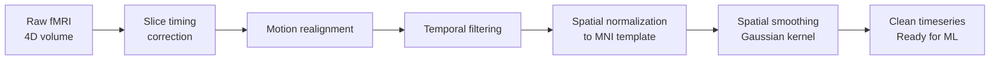

# Brain Imaging Modalities and AI

## Overview

Every AI model for neuroscience begins with understanding what kind of data it operates on. Brain imaging modalities differ enormously in their physical basis, spatial resolution, temporal resolution, and what they reveal about brain function. Matching the right AI approach to the right modality is fundamental.

**Magnetic Resonance Imaging (MRI)** uses strong magnetic fields and radio waves to align hydrogen nuclei in water molecules, then measures the relaxation signals as they return to equilibrium. Structural MRI produces high-resolution images of brain anatomy — gray matter, white matter tracts, CSF spaces. AI applied to structural MRI includes tissue segmentation (gray/white/CSF classification), detection of lesions (white matter hyperintensities, tumors), and measurement of cortical thickness.

**Functional MRI (fMRI)** measures the Blood Oxygen Level Dependent (BOLD) signal — changes in MRI signal caused by blood oxygenation changes that follow neural activity with a delay of 1-5 seconds. Because fMRI is non-invasive and can image the entire brain, it is the dominant modality for cognitive neuroscience. However, the BOLD signal is an indirect proxy for neural activity, and each voxel (3D pixel, typically 3mm³ at standard resolution) contains hundreds of thousands of neurons. AI for fMRI must contend with low signal-to-noise ratio (SNR) and complex noise artifacts (head motion, respiration, cardiac pulse).

**Electroencephalography (EEG)** records electrical potentials from electrodes placed on the scalp. EEG has excellent temporal resolution (milliseconds) but poor spatial resolution — electrical signals from deep brain structures are smeared by the skull and scalp. AI for EEG focuses on decoding event-related potentials (ERPs), classifying mental states, and brain-computer interface control signals. The key challenge is separating neural signals from muscle artifacts and environmental noise.

**Magnetoencephalography (MEG)** measures the magnetic fields produced by neural currents. MEG has better spatial resolution than EEG and good temporal resolution, but requires expensive shielded rooms and is sensitive to deep sources.

**Positron Emission Tomography (PET)** uses radioactive tracers that bind to specific molecular targets — for example, amyloid-beta plaques in Alzheimer's disease (with $^11$C-PiB tracer) or dopamine receptors (with $^18$F-DOPA). PET provides molecular-level information that no other imaging modality can, but involves radiation exposure and has poor spatial resolution.

Deep learning has transformed every imaging modality. CNNs segment MRI scans with human-level or better accuracy. Recurrent models denoise fMRI timeseries. Transformers extract features from EEG across time and frequency dimensions simultaneously. Self-supervised models pretrained on large neuroimaging datasets (e.g., brainlm, neural encoding models) are now standard for transfer learning.

## Key Concepts

- **BOLD signal**: Blood Oxygen Level Dependent signal — the MRI contrast mechanism used in fMRI, reflecting hemodynamic response to neural activity
- **Voxel**: A 3D pixel in a volumetric brain image; standard fMRI voxels are 3×3×3 mm³ or larger
- **Spatial resolution**: Level of anatomical detail — structural MRI can resolve ~1mm features; fMRI is typically 2-3mm
- **Temporal resolution**: How frequently measurements are made — EEG records at 1000+ Hz; fMRI at ~0.5-2 Hz (TR of 0.5-2s)
- **TR (repetition time)**: Time between successive fMRI volume acquisitions, determines temporal resolution
- **Artifact**: Non-neural signal in imaging data — head motion, breathing, cardiac pulse, scanner drift
- **Preprocessing pipeline**: Steps to clean raw imaging data: motion correction, spatial normalization, spatial smoothing, temporal filtering

## Code Examples

```python
"""
Comparing imaging modalities: spatial vs temporal resolution
"""
import numpy as np

# Approximate resolution characteristics of each modality
modalities = {
    "Structural MRI":  {"spatial_mm": 1.0, "temporal_s": None},
    "fMRI":            {"spatial_mm": 3.0, "temporal_s": 2.0},
    "EEG":             {"spatial_mm": 10.0, "temporal_s": 0.001},
    "MEG":             {"spatial_mm": 5.0, "temporal_s": 0.001},
    "PET":             {"spatial_mm": 5.0, "temporal_s": 60.0},  # dynamic PET
}

print(f"{'Modality':<20} {'Spatial Res (mm)':<20} {'Temporal Res':<20}")
print("-" * 60)
for name, props in modalities.items():
    spatial = f"{props['spatial_mm']} mm"
    temporal = f"{props['temporal_s']} s" if props['temporal_s'] else "N/A"
    print(f"{name:<20} {spatial:<20} {temporal:<20}")

# The fundamental tradeoff: spatial vs temporal resolution
# EEG/MEG: excellent temporal, poor spatial
# fMRI: moderate spatial, poor temporal
# PET: moderate spatial, very poor temporal, but excellent molecular specificity
```

## Diagrams

**Preprocessing Pipeline for fMRI**



Each preprocessing step introduces tradeoffs. Motion realignment models and removes head motion effects. Temporal filtering (high-pass at ~0.01 Hz) removes slow scanner drifts while preserving neural signals. Spatial normalization enables group-level analysis across subjects by aligning each brain to a standard template (MNI152).

## Further Reading

- [nilearn preprocessing tutorial](https://nilearn.github.io/stable/connectivity.html)
- [FSL fMRI preprocessing](https://fsl.fmrib.ox.ac.uk/fsl/fslwiki/)
- [MNE-Python for EEG/MEG](https://mne.tools/)