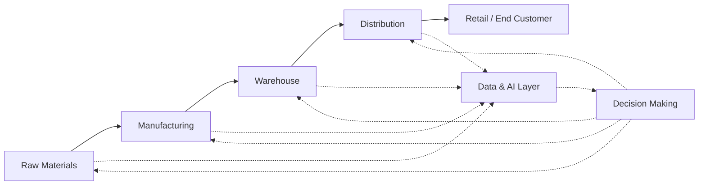

# Introduction to AI for Operations Research and Supply Chain

## Overview

Operations Research (OR) is the discipline of applying analytical methods — mathematics, probability, statistics, optimization — to make better decisions. Supply Chain Management (SCM) is the domain concerned with the flow of goods, information, and finances from raw materials to end customers. These two fields have been intertwined for decades, but the rise of machine learning and deep learning is transforming what is possible, enabling systems to handle uncertainty, scale, and complexity that classical OR methods struggle with.

Historically, OR relied on carefully hand-crafted models: linear programs for production planning, queuing theory for service operations, and dynamic programming for inventory control. These models make strong assumptions — linearity, stationarity, known distributions — that rarely hold in real supply chains. Real-world supply chains are dynamic, stochastic, high-dimensional, and influenced by human behavior, weather, geopolitics, and demand shocks.

AI is expanding the toolkit available to OR practitioners in three key ways:

1. **Learning from data** — Rather than specifying a model entirely by hand, ML can learn demand distributions, lead-time distributions, or cost functions from historical data.
2. **Scalable optimization** — Neural networks can approximate NP-hard problems (e.g., vehicle routing, facility location) fast enough for real-time use, where exact solvers time out.
3. **Closed-loop optimization** — Reinforcement learning (RL) enables systems to learn optimal policies through experience, adapting to changing conditions without manual re-tuning.

This track covers the full spectrum: from classical optimization foundations and inventory management, through production scheduling and queueing networks, to warehouse robotics, last-mile logistics, and the frontier of autonomous supply chains.



## Key Concepts

- **Operations Research (OR)**: The discipline of mathematical decision-making under uncertainty. Core tools include linear programming, integer programming, dynamic programming, and queuing theory.
- **Supply Chain Management (SCM)**: The end-to-end process of planning, sourcing, producing, storing, and delivering goods. Key decisions: where to locate facilities, how much inventory to hold, how to route vehicles.
- **Deterministic vs. Stochastic**: Classical OR often assumes known parameters. Stochastic OR and ML embrace uncertainty, learning distributions from data.
- **Exact vs. Heuristic/Neural Solvers**: Exact solvers (e.g., Gurobi, CPLEX) guarantee optimal solutions but don't scale to NP-hard problems. Neural solvers and heuristics trade optimality for speed and scalability.
- **Offline optimization vs. Online learning**: Static optimization runs once; online learning continuously adapts as new data arrives.

## Code Examples

```python
# Simple simulation of a basic newsvendor problem (stochastic inventory)
import numpy as np

def newsvendor_solution(price: float, cost: float, demand_samples: np.ndarray) -> float:
    """
    Classic single-period newsvendor. Find order quantity that maximizes expected profit.
    Critical fractile: order quantity = quantile of demand at (price - cost) / price.
    """
    critical_ratio = (price - cost) / price
    print(f"Critical ratio: {critical_ratio:.3f}")

    optimal_q = np.quantile(demand_samples, critical_ratio)
    return optimal_q

# Simulate demand (normally distributed)
np.random.seed(42)
demand = np.random.normal(loc=100, scale=20, size=10000)

optimal_order = newsvendor_solution(price=10.0, cost=3.0, demand_samples=demand)
print(f"Optimal order quantity: {optimal_order:.1f} units")

# Evaluate expected profit
revenues = optimal_order * price  # if demand >= optimal_order
lost_sales = (optimal_order - demand[demand < optimal_order]) * cost  # overstock cost
expected_profit = np.mean(revenues - lost_sales)
print(f"Expected profit at optimal order: ${expected_profit:.2f}")
```

## Exercises/Projects

- **Exercise 1**: Modify the newsvendor code above to use a log-normal demand distribution instead of normal. How does the optimal order quantity change?
- **Exercise 2**: Research and compare three real-world supply chain disruptions (e.g., COVID-19, Suez Canal blockage, 2011 Thailand floods). For each, identify what AI/ML tools could have helped mitigate the impact.
- **Project**: Build a simple supply chain graph in Python (using NetworkX) representing a 3-tier supply chain (supplier → manufacturer → distributor → retailer). Add random lead-time variability and simulate the bullwhip effect.

## Further Reading

- [Supply Chain Management: Strategy, Planning, and Operation](https://www.pearson.com/en-us/subject-catalog/p/sunil-chopra/upply-chain-management-strategy-planning-and-operation-myself/9780134740866) — Chopra & Meindl (comprehensive SCM textbook)
- [Reinforcement Learning: An Introduction](https://www.informit.com/title/9780262039246) — Sutton & Barto (foundational RL text, applicable to supply chain)