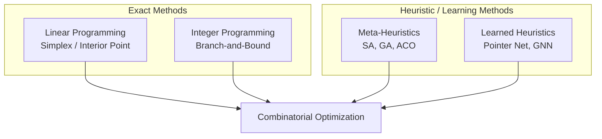

# Optimization Fundamentals: From Linear Programming to Combinatorial Optimization

## Overview

Optimization is the mathematical core of operations research. Every supply chain decision — what to produce, how much to inventory, which suppliers to use, where to locate warehouses — can be framed as an optimization problem: maximize or minimize an objective subject to constraints.

The simplest and most foundational case is **Linear Programming (LP)**, where both the objective function and constraints are linear. The canonical form:

$$\min_{x} \quad c^\top x \quad \text{s.t.} \quad Ax \leq b, \quad x \geq 0$$

Solved efficiently by the **simplex algorithm** (Dantzig, 1947) or interior-point methods. LPs appear everywhere in supply chains: production planning, workforce scheduling, transportation, portfolio optimization.

Many interesting supply chain problems are not linear. **Integer Programming (IP)** and **Mixed Integer Programming (MIP)** require some decision variables to be integers (e.g., "open facility yes/no", "assign worker to shift"). The addition of integrality makes the problem NP-hard — no polynomial-time algorithm is known — yet modern solvers (Gurobi, CPLEX) can solve practical instances with tens of thousands of variables thanks to branch-and-bound, cutting planes, and dramatic hardware improvements.

**Combinatorial optimization** covers problems like the Traveling Salesman Problem (TSP), Vehicle Routing Problem (VRP), and Facility Location Problem (FLP). These are the backbone of logistics and supply chain network design. Classical approaches include:

- **Branch-and-bound / Branch-and-cut**: Systematically exploring the solution tree.
- **Dynamic programming**: Breaking problems into overlapping subproblems (e.g., Held-Karp for TSP).
- **Constraint Programming (CP)**: Declaratively specifying constraints and letting a solver search.
- **Heuristics and meta-heuristics**: Greedy, local search, simulated annealing, genetic algorithms, ant colony optimization.

Modern AI-augmented approaches use **graph neural networks** and **attention mechanisms** to learn good heuristics from data (e.g., Pointer Networks for TSP, Graphormer for routing), enabling fast "anytime" solutions via learned policies.



## Key Concepts

- **Linear Programming (LP)**: Continuous objective and constraints. solvable in polynomial time. Used for production blending, transportation, portfolio.
- **Integer Programming (IP/MIP)**: Integrality constraints. NP-hard but solvable for moderate sizes with modern solvers.
- **Branch-and-Bound**: Systematic enumeration of the integer solution space, pruning branches that cannot improve the best known solution.
- **Cutting Planes**: Additional valid inequalities added to tighten the LP relaxation, accelerating branch-and-bound.
- **Constraint Programming (CP)**: Very expressive for scheduling and combinatorial problems with complex logical constraints.
- **Learned Heuristics**: Using neural networks to predict good solutions or guide search. Pointer Networks (Vinyals et al., 2015) showed seq2seq models could learn TSP approximation; Graphormer (2021) applies Transformers to combinatorial optimization on graphs.
- **Optimality Gap**: The difference between the best known solution and the best bound. Modern MIP solvers can provide bounds with any desired gap tolerance.

## Code Examples

```python
# Linear Programming with scipy — production planning example
from scipy.optimize import linprog
import numpy as np

# Maximize profit: 2x + 3y (equivalent to minimize -2x - 3y)
# s.t.  x +  y <= 100   (machine hours)
#        2x +  y <= 150  (labor hours)
#        x >= 0, y >= 0

c = [-2, -3]               # minimize -profit
A = [[1, 1], [2, 1]]       # inequality constraints
b = [100, 150]             # RHS
bounds = [(0, None), (0, None)]

result = linprog(c, A_ub=A, b_ub=b, bounds=bounds, method='highs')
print(f"Optimal x={result.x[0]:.2f}, y={result.x[1]:.2f}")
print(f"Max profit: ${-result.fun:.2f}")

# Mixed Integer Program: Facility Location (simplified)
# Using scipy doesn't support MIP directly — show pseudocode for PuLP/Gurobi
"""
from pulp import *

model = LpProblem("Facility_Location", LpMinimize)
x = LpVariable("x_0", cat='Binary')   # open facility 0?
y = LpVariable("y_00", lowBound=0)    # flow from facility 0 to customer 0

model += 1000 * x_0 + 5 * y_00         # minimize fixed cost + shipping cost
model += y_00 <= 100 * x_0             # can only ship if facility open
model += sum(y_0j for j in customers) >= demand_j  # meet all customer demands
"""
```

```python
# Graph Neural Network for Routing (conceptual using PyTorch Geometric)
# This shows the architecture concept; training on actual data is complex
import torch
import torch.nn as nn

class GraphRouter(nn.Module):
    """Simplified attention-based router inspired by Transformer for VRP."""
    def __init__(self, n_features: int, hidden_dim: int = 128):
        super().__init__()
        self.encoder = nn.Sequential(
            nn.Linear(n_features, hidden_dim),
            nn.ReLU(),
            nn.Linear(hidden_dim, hidden_dim),
        )
        self.decoder = nn.MultiheadAttention(hidden_dim, num_heads=8)
        self.readout = nn.Linear(hidden_dim, 1)

    def forward(self, node_features, edge_index):
        # Encode nodes
        h = self.encoder(node_features)
        # Message passing via edges
        h_prime = torch.zeros_like(h)
        h_prime[edge_index[0]] += self.encoder(node_features[edge_index[1]])
        # Readout: tour construction would use attention + greedy decoding
        logits = self.readout(h_prime)
        return logits
```

## Exercises/Projects

- **Exercise 1**: Formulate a workforce scheduling problem as an IP: 5 workers, 7 days, each worker works at most 5 days, at least 3 workers per day, each worker needs 2 consecutive days off.
- **Exercise 2**: Implement a greedy nearest-neighbor heuristic for the 50-city TSP and evaluate it against the optimal solution for small instances (n ≤ 10) computed by brute force.
- **Project**: Compare a MIP solver (PuLP + CBC) against a neural heuristic (trained Pointer Network) on 100 random VRP instances. Measure solution quality and solve time.

## Further Reading

- [Introduction to Operations Research](https://www.mheducation.com/title/ introduction-operations-research-hillier-product-9780073520578.html) — Hillier & Lieberman (classic OR textbook)
- [Pointer Networks](https://arxiv.org/abs/1506.03134) — Vinyals et al., 2015 (learned sequencing)