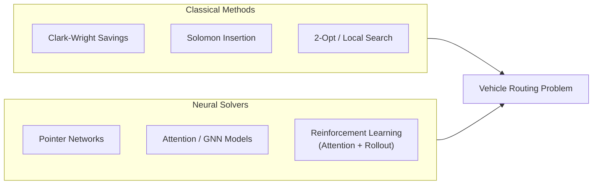

# Vehicle Routing Problems and Neural Solvers

## Overview

The Vehicle Routing Problem (VRP) is one of the most important combinatorial optimization problems in logistics. Given a fleet of vehicles based at a depot and a set of customers with demand, find the shortest (or cheapest) set of routes that serve all customers. The basic Capacitated VRP (CVRP) adds a capacity constraint: each vehicle can carry at most $Q$ units of demand.

VRP is a direct generalization of the Traveling Salesman Problem (TSP) — TSP is CVRP with a single vehicle and unlimited capacity. CVRP is NP-hard, meaning exact solvers scale poorly as the number of customers grows. For real-world logistics companies routing hundreds or thousands of customers daily, heuristic methods are essential.

Classical VRP heuristics include:

- **Clark & Wright savings algorithm**: A constructive heuristic that merges routes to minimize total distance.
- ** Solomon's I1 heuristic**: A greedy insertion heuristic for VRP with time windows.
- **Local search**: 2-opt, Or-opt, lambda-interchange moves to improve existing routes.
- **Meta-heuristics**: Tabu search, simulated annealing, genetic algorithms for VRP.

More recently, **Neural Solvers** — approaches that use machine learning to guide or replace classical heuristics — have shown strong results, particularly on problems where the same type of VRP is solved repeatedly with different data (which is exactly the logistics use case).

The two dominant neural approaches are:

1. **Pointer Networks (Ptr-Nets)**: Sequence-to-sequence models that output a permutation of input nodes, trained by imitation learning against an optimal solver. They learn a policy $\pi_\theta(a|s)$ mapping problem instances to route sequences.

2. **Attention-based Models (e.g., AMRL, PDPT-Net)**: Graph attention networks that encode customer locations and dynamics, then decode tours. Can handle richer problem variants: multiple depots, time windows, pickups and deliveries.

3. **Graph Neural Networks + Optimization**: Treating VRP as a graph optimization problem and using message-passing networks to learn vertex embeddings that guide construction heuristics.

$$O^* = \min_{\text{routes}} \sum_{r \in \text{routes}} \sum_{(i,j) \in r} d_{ij} \quad \text{s.t.} \quad \sum_{i \in r} \text{dem}_i \leq Q \;\; \bigcup_r \text{customers}(r) = C$$



## Key Concepts

- **CVRP (Capacitated VRP)**: Each vehicle has a capacity $Q$. Every customer $i$ has demand $d_i$. Routes must respect capacity and cover all customers.
- **VRPTW (VRP with Time Windows)**: Each customer $i$ must be served within a time window $[e_i, l_i]$. Adds temporal feasibility constraints.
- **PDP (Pickup and Delivery Problem)**: Goods must be collected from pickup points and delivered to corresponding delivery points.
- **Savings Algorithm**: Starts with each customer on its own route; iteratively merges the two routes with highest "savings" (distance saved by joining their endpoints).
- **Neural heuristics**: Learned policies that construct or improve tours. Training via supervised learning on optimal solutions, or RL on tour length rewards.
- **Imitation learning**: Training a neural network to mimic an expert solver (e.g., OR-Tools, Google VRP solver) by generating state-action pairs.

## Code Examples

```python
# Simple savings algorithm for CVRP
def clark_wright_savings(customers: list, depot: tuple, vehicle_capacity: float) -> list:
    """
    customers: list of (id, x, y, demand)
    depot: (x, y)
    Returns list of routes (list of customer ids)
    """
    import math
    # Step 1: Compute savings for every pair (i, j)
    savings = []
    for i, ci in enumerate(customers):
        for j, cj in enumerate(customers):
            if i >= j:
                continue
            di_dj = math.sqrt((depot[0]-cj[1])**2 + (depot[1]-cj[2])**2)
            dj_di = math.sqrt((depot[0]-ci[1])**2 + (depot[1]-ci[2])**2)
            didj = math.sqrt((ci[1]-cj[1])**2 + (ci[2]-cj[2])**2)
            saving = di_dj + dj_di - didj
            savings.append((saving, i, j))

    # Step 2: Sort savings descending
    savings.sort(key=lambda s: s[0], reverse=True)

    # Step 3: Merge routes
    routes = {i: [i] for i in range(len(customers))}

    for _, i, j in savings:
        ri, rj = routes.get(i, [i]), routes.get(j, [j])
        if ri is rj:
            continue
        # Check capacity
        combined_demand = sum(customers[k][3] for k in set(ri + rj))
        if combined_demand > vehicle_capacity:
            continue
        # Merge j into i's route
        new_route = ri + rj
        for k in rj:
            routes[k] = new_route

    # Collect unique routes
    seen = set()
    result = []
    for k in routes:
        route = routes[k]
        route_id = tuple(sorted(route))
        if route_id not in seen:
            seen.add(route_id)
            result.append(route)
    return result

# Example usage
customers = [(0, 2, 3, 10), (1, 5, 8, 15), (2, 1, 7, 20), (3, 6, 2, 12)]
depot = (0, 0)
routes = clark_wright_savings(customers, depot, vehicle_capacity=30)
print(f"Routes: {routes}")
```

```python
# Reinforcement Learning for VRP (pseudocode)
"""
Environment: VRPEnvironment — resets with new customer locations, step() executes a tour action
Agent: AttentionModel (graph encoder + attention decoder)
Training: REINFORCE policy gradient

for epoch in range(num_epochs):
    for instance in batch_of_vrp_instances:
        tour, log_probs, lengths = agent.forward(instance)   # construct tour
        reward = total_tour_length(tour, instance)          # negative length = reward
        loss = -reward * sum(log_probs)                     # policy gradient loss
        optimizer.zero_grad(); loss.backward(); optimizer.step()
"""
```

## Exercises/Projects

- **Exercise 1**: Implement 2-opt improvement for an existing CVRP solution. Test on random instances with 20 customers.
- **Exercise 2**: Extend the savings algorithm to handle VRPTW (add time window feasibility check during merging).
- **Project**: Train a Pointer Network on TSPLIB CVRP instances (n=20,50,100). Evaluate average optimality gap vs. a classical solver (e.g., Google OR-Tools). Report solve time comparison.

## Further Reading

- [OR-Tools VRP documentation](https://developers.google.com/optimization/routing/vrph) — Google's open-source VRP solver
- [Attention, Learn to Solve Routing Problems](https://arxiv.org/abs/1803.08475) — Kool et al., 2019 (AMRL — strong attention-based RL approach for VRP/TSP)