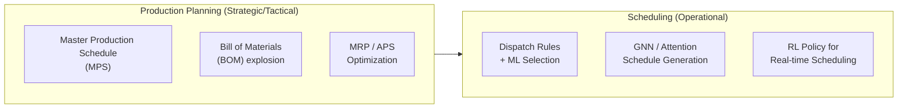

# Production Planning, Scheduling, and Process Optimization

## Overview

Manufacturing is where supply chains create value. Production planning decides what quantities of which products to make over what time horizon, subject to constraints on capacity, materials, and workforce. Scheduling takes the output of planning and assigns operations to specific resources (machines, workers, lines) at specific times. Together, these decisions determine a plant's efficiency, responsiveness, and cost structure.

**Material Requirements Planning (MRP)** — developed in the 1960s — systematized production planning by exploding the bill of materials (BOM) for each product, computing net requirements at each stage based on master production schedules. MRP is deterministic and push-based; it assumes known demand, deterministic lead times, and infinite capacity. Modern advanced planning systems (APS) extend MRP with finite capacity planning, optimization-based allocation, and what-if scenario analysis.

**Production scheduling** assigns jobs to machines over time. Key problem variants:

- **Job Shop Scheduling (JSP)**: $n$ jobs, each consisting of a sequence of $m$ operations on specific machines. Minimizing makespan (completion time of last job). Strongly NP-hard.
- **Flow Shop**: All jobs follow the same machine sequence. Still NP-hard for minimizing makespan.
- **Open Shop**: No precedence constraints between operations.
- **Assembly Line Balancing**: Assign tasks to stations along an assembly line to minimize balance delay.

Classical approaches include **dispatch rules** (shortest processing time first, earliest due date first), **priority rules**, **branch-and-bound**, and **constraint programming**. Machine learning is entering in three ways:

1. **Learning dispatch rules**: Train RL agents or supervised models to select dispatch rules adaptively based on queue state.
2. **Predicting job completion times**: GNNs or LSTMs predicting remaining processing time (RPT) from job features.
3. **Scheduling as sequence generation**: Treating the schedule as a sequence problem (Pointer Networks, attention models) trained via imitation or reinforcement learning.

The objective in scheduling is typically:

$$\min \ C_{\max} = \min \max_j C_j$$

where $C_j$ is the completion time of job $j$. Other objectives include minimizing total weighted tardiness, maximizing throughput, and minimizing total idle time.



## Key Concepts

- **MRP (Material Requirements Planning)**: Explodes the product BOM to compute time-phased component requirements from the MPS. Deterministic, periodic.
- **MPS (Master Production Schedule)**: High-level production plan specifying what to make, when, and in what quantities.
- **APS (Advanced Planning and Scheduling)**: Extends MRP with constraint-based optimization and ATP (available-to-promise) analysis.
- **Job Shop Scheduling**: Each job has a specific routing through machines. Minimizing makespan $C_{\max}$ or tardiness.
- **Dispatch Rules**: Priority-based heuristics (SPT, EDD, CR) that select the next job to process. Simple, fast, widely used in practice. ML can learn to switch between rules.
- **Remaining Processing Time (RPT)**: How much time a job has left. GNN-based RPT predictors can improve scheduling decisions.
- **Pointer Networks for Scheduling**: Encode job-shop state as a graph; decode operations in sequence to construct a schedule. Trained with REINFORCE or behavior cloning.

## Code Examples

```python
# Dispatch rule simulation: compare SPT vs EDD
import numpy as np

def simulate_dispatch(jobs, dispatch_rule):
    """Simulate a single-machine dispatch with given priority rule."""
    import heapq
    time = 0
    completed = []

    if dispatch_rule == "SPT":
        # Sort by processing time
        queue = sorted(enumerate(jobs), key=lambda x: x[1]['proc_time'])
    elif dispatch_rule == "EDD":
        # Sort by earliest due date
        queue = sorted(enumerate(jobs), key=lambda x: x[1]['due_date'])
    else:
        queue = list(enumerate(jobs))

    for idx, job in queue:
        time += job['proc_time']
        completion_time = time
        tardiness = max(0, completion_time - job['due_date'])
        completed.append({'job': idx, 'completion': completion_time, 'tardiness': tardiness})

    return completed

jobs = [
    {'proc_time': 5, 'due_date': 10},
    {'proc_time': 3, 'due_date': 8},
    {'proc_time': 8, 'due_date': 15},
    {'proc_time': 2, 'due_date': 6},
]

results_spt = simulate_dispatch(jobs, "SPT")
results_edd = simulate_dispatch(jobs, "EDD")

print("SPT rule:")
for r in results_spt:
    print(f"  Job {r['job']}: completed at {r['completion']}, tardiness={r['tardiness']}")

print("EDD rule:")
for r in results_edd:
    print(f"  Job {r['job']}: completed at {r['completion']}, tardiness={r['tardiness']}")

total_tardiness_spt = sum(r['tardiness'] for r in results_spt)
total_tardiness_edd = sum(r['tardiness'] for r in results_edd)
print(f"Total tardiness SPT: {total_tardiness_spt}, EDD: {total_tardiness_edd}")
```

```python
# Constraint Programming for simple job shop (pseudocode using OR-Tools)
"""
from ortools.sat.python import cp_model

model = cp_model.CpModel()
# Variables: start_time[j][m], processing_time[j][m]
# Constraints:
#   - No overlap: start[j][m] + proc[m][j] <= start[j'][m] or ...
#   - Precedence: start[j][m2] >= start[j][m1] + proc[m1][j]
#   - Makespan minimization

model.Minimize(makespan)
solver = cp_model.CpSolver()
status = solver.Solve(model)
"""
```

## Exercises/Projects

- **Exercise 1**: Implement three dispatch rules (SPT, EDD, CR) on a 10-job single machine problem. Compare average tardiness and maximum tardiness.
- **Exercise 2**: Formulate a 3-machine flow shop (Johnson's rule might apply for 2 machines) as an integer program and solve with PuLP.
- **Project**: Train a Pointer Network on job shop instances (15 jobs × 10 machines, 2000 instances) using OR-Tools as the expert. Evaluate the neural scheduler's makespan vs. dispatch rules and CP solver on held-out test instances.

## Further Reading

- [Operations Scheduling](https://www.mheducation.com/title/operations-management-scheduling-manufacturing-services-supply-chains-krajewski/9780135175077.html) — Krajewski et al. (manufacturing scheduling reference)
- [SchedulingNet](https://arxiv.org/abs/2006.12370) — Shoshiali et al., 2020 (GNN for job shop scheduling)