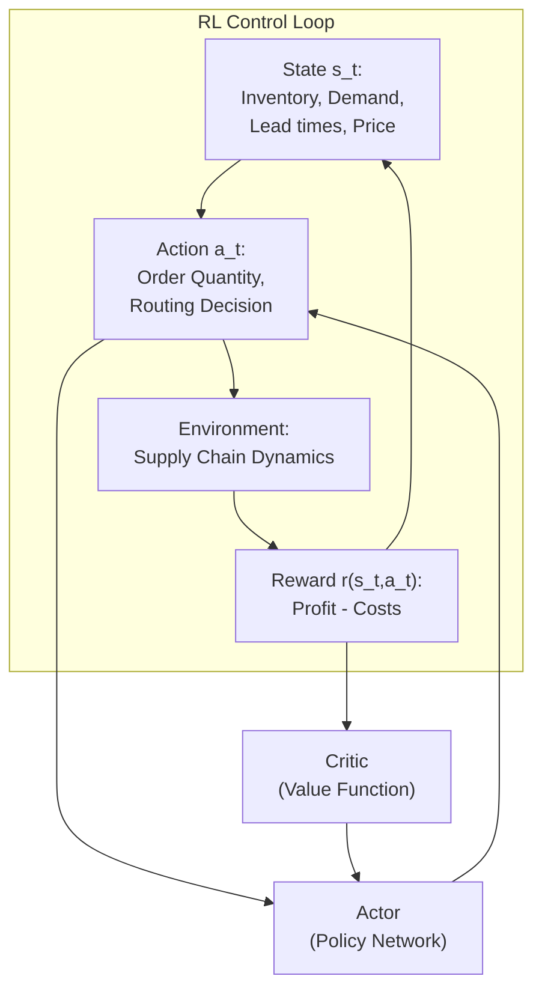

## Reinforcement Learning for Dynamic Supply Chain Decisions

## Overview

Classical OR models for inventory, routing, and production planning typically assume a known model of the environment: known demand distribution, known lead times, known costs. Real supply chains don't come with accurate probability distributions — they have complex, non-stationary dynamics driven by promotions, competitor behavior, weather, macroeconomic shifts, and supply disruptions. Reinforcement Learning (RL) is a natural framework for learning optimal policies directly from interaction data, without requiring an explicit model.

RL formulations are natural for supply chain problems. The standard framing:

- **State $s_t$**: Current inventory at each location, outstanding orders, current time/week, demand lag features, price levels, seasonal indicators.
- **Action $a_t$**: Order quantity at each SKU/location, routing decisions, production schedule adjustments.
- **Reward $r_t$**: Profit (revenue minus cost) minus holding costs, stockout costs, and ordering costs. Often shaped to provide frequent feedback.
- **Transition $s_{t+1} = f(s_t, a_t, w_t)$**: Demand shock $w_t$ drives inventory change. Unknown in advance.

Key RL algorithms applied to supply chain include:

- **Q-learning / DQN**: For discrete action spaces (order 0, 10, 20, ... units). Simple but struggles with continuous or high-dimensional actions.
- **Policy Gradient (REINFORCE)**: Directly optimizes the expected cumulative reward. Can handle continuous action spaces.
- **Actor-Critic (A2C/A3C, PPO)**: Combines value function estimation (critic) with policy optimization (actor). The dominant approach for complex supply chain problems.
- **Deep RL for Inventory (DRLVN)**: Specialized approaches that model the inventory replenishment problem as an RL task with safety constraints.

The long-horizon nature of supply chain decisions — orders placed weeks in advance, multi-echelon inventories — makes RL challenging: the reward signal is delayed, and the effective horizon can be very long. Hierarchical RL and temporal abstraction (options, sub-goals) help address this.

$$J(\theta) = \mathbb{E}_\pi \left[ \sum_{t=0}^{T} \gamma^t r(s_t, a_t) \right]$$



## Key Concepts

- **Markov Decision Process (MDP)**: The formal framework. State, action, transition, reward, discount factor $\gamma$. Supply chain problems are inherently stochastic MDPs.
- **Value Function $V^\pi(s)$**: Expected discounted return from state $s$ following policy $\pi$. Tells us "how good" is a state.
- **Q-Function $Q^\pi(s,a)$**: Expected return from state $s$ taking action $a$ then following $\pi$. Used for Q-learning.
- **Policy Gradient**: Directly differentiate the objective $J(\theta)$ with respect to policy parameters $\theta$. Works with function approximation (neural networks).
- **Actor-Critic**: Critic estimates $V(s)$; actor updates policy $\pi(a|s)$ in direction suggested by the advantage $A(s,a) = Q(s,a) - V(s)$.
- **PPO (Proximal Policy Optimization)**: Current state-of-the-art on-policy RL algorithm. Clips policy updates to prevent destructively large steps. Stable and effective for continuous control.
- **Curse of Dimensionality**: In multi-echelon, multi-SKU settings, state space grows exponentially. Abstraction, aggregation, and function approximation are essential.
- **Sim-to-real transfer**: Train RL policies in supply chain simulators, deploy to real environments. Key challenge: model mismatch between simulation and reality.

## Code Examples

```python
# Simple Q-learning for a 2-echelon inventory problem
import numpy as np

class SimpleSupplyChainEnv:
    """Minimal 2-echelon supply chain: retailer + warehouse."""
    def __init__(self, demand_mean=10, lead_time=2):
        self.retailer_stock = 20
        self.warehouse_stock = 50
        self.demand_mean = demand_mean
        self.lead_time = lead_time
        self.pending_orders = [0] * lead_time
        self.day = 0
        self.max_days = 100

    def reset(self):
        self.retailer_stock = 20
        self.warehouse_stock = 50
        self.pending_orders = [0] * self.lead_time
        self.day = 0
        return self._state()

    def _state(self):
        return np.array([self.retailer_stock, self.warehouse_stock] + self.pending_orders)

    def step(self, order):
        # Order flows from warehouse to retailer after lead time
        self.day += 1
        demand = np.random.poisson(self.demand_mean)
        incoming = self.pending_orders.pop(0)
        self.retailer_stock += incoming
        self.pending_orders.append(order)

        # Demand served if possible
        sales = min(self.retailer_stock, demand)
        stockout_penalty = 2 * (demand - sales)
        self.retailer_stock -= sales
        holding_cost = 0.5 * self.retailer_stock + 0.3 * self.warehouse_stock
        ordering_cost = 1.0 * order
        reward = 3 * sales - holding_cost - ordering_cost - stockout_penalty
        done = self.day >= self.max_days
        return self._state(), reward, done

# Q-Learning agent
env = SimpleSupplyChainEnv()
q_table = np.zeros((11, 11, 11, 5))  # discretized states × actions

for episode in range(500):
    state = env.reset()
    done = False
    while not done:
        # Discretize state for tabular Q-learning
        s_idx = tuple(min(int(s/5), 10) for s in state)
        # Epsilon-greedy
        if np.random.random() < 0.1:
            action = np.random.randint(0, 5)
        else:
            action = np.argmax(q_table[s_idx])

        next_state, reward, done = env.step(action * 4)  # order = action * 4
        ns_idx = tuple(min(int(ns/5), 10) for ns in next_state))
        q_table[s_idx + (action,)] += 0.1 * (reward + 0.9 * np.max(q_table[ns_idx]) - q_table[s_idx + (action,)])

print("Training complete. Sample Q-values:", q_table[2, 2, 0, 0])
```

## Exercises/Projects

- **Exercise 1**: Extend the Q-learning example to a 3-echelon supply chain (factory → warehouse → retailer). Observe how optimal policy changes with echelon depth.
- **Exercise 2**: Implement a REINFORCE agent for the same environment. Compare convergence speed and final performance vs. Q-learning.
- **Project**: Build a supply chain gym environment with: (a) 5 retailers with correlated demand, (b) 1 central warehouse, (c) stochastic lead times, (d) ordering costs + holding costs + stockout costs. Train a PPO agent to minimize total cost. Compare against a base-stock policy.

## Further Reading

- [DeepRail](https://arxiv.org/abs/1708.09744) — Oroojlooy et al., 2017 (DQN for supply chain)
- [PPO paper](https://arxiv.org/abs/1707.06347) — Schulman et al., 2017