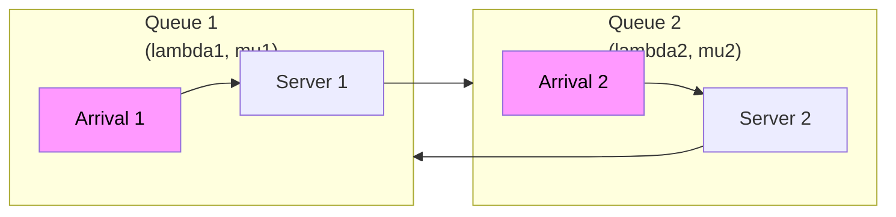

# Queueing Networks and Stochastic Optimization with Deep Learning

## Overview

Queueing theory is the mathematical foundation for analyzing congestion, wait times, and capacity in supply chains and service operations. Every warehouse, distribution center, port, and manufacturing line is a queueing system — materials or customers arrive, wait for service, move to the next stage. Understanding and optimizing these queues is essential for service level management, capacity planning, and process improvement.

The foundational queueing model is the **M/M/1 queue**: Poisson arrivals (Markov), exponential service times, single server. Key metrics:

$$\mathbb{E}[W] = \frac{\lambda}{\mu(\mu - \lambda)}, \quad \rho = \frac{\lambda}{\mu}$$

where $\lambda$ is the arrival rate, $\mu$ is the service rate, and $\rho$ is utilization. $\mathbb{E}[W]$ is mean waiting time in queue.

Real supply chain queueing networks are far more complex:

- **Networks of queues**: Jobs flow through multiple stations, each with its own service time distribution. The Jackson network is the classic tractable model — assumes open network, exponential service, product-form equilibrium.
- **Non-Markovian arrivals**: Real demand arrivals often aren't Poisson — they have burstiness, correlations, and heavy tails.
- **Finite buffers and blocking**: Production lines have limited buffer capacity. When a buffer fills, upstream stations must stop (blocking).
- **Dynamic routing**: Jobs may be routed based on queue lengths, priority, or downstream availability.

Deep learning enters in two key ways:

1. **Deep queueing networks**: Graph neural networks that learn the behavior of complex queueing networks from simulation data, enabling fast approximation where analytical solutions don't exist.
2. **Stochastic optimization with learned distributions**: Using normalizing flows or variational autoencoders to learn complex arrival/service distributions, then solving stochastic programs over the learned distribution.

$$P(Q > 0) = \rho, \quad \mathbb{E}[Q] = \frac{\rho}{1-\rho} \quad \text{(M/M/1 at steady state)}$$



## Key Concepts

- **M/M/1 queue**: Basic continuous-time Markov chain model. Simple but foundational. Equilibrium exists iff $\lambda < \mu$ (stable system).
- **Jackson Network**: Open queueing network with product-form equilibrium. Each station's utilization and waiting time can be computed independently. Tractable even for large networks.
- **Kendall notation**: $A/S/c/K$ — Arrival process / Service distribution / Servers / Buffer size. E.g., M/M/1/∞, G/G/c/N.
- **Utilization $\rho$**: Fraction of time server is busy. $\rho \to 1$ leads to very high wait times (the "square root law" applies in many settings).
- **Lead time variability**: In supply chains, the effective "service time" is lead time. Variability in lead times — from supplier delays, transit variability — is a major driver of inventory requirements.
- **Normalizing flows for distributions**: Deep generative models that learn complex probability distributions from data. Can replace parametric assumptions (e.g., normal demand) with data-driven distributions in stochastic optimization.
- **GNN for queueing**: Encoder-decoder model that takes a queueing network topology and traffic parameters as input, outputs performance metrics (mean waiting time, throughput). Trained on simulation data.

## Code Examples

```python
# M/M/1 queue simulation
import numpy as np

def simulate_mm1(lambda_rate: float, mu_rate: float, num_arrivals: int, seed: int = 42):
    """Simulate M/M/1 queue and compute waiting times."""
    np.random.seed(seed)
    arrival_times = np.cumsum(np.random.exponential(1/lambda_rate, num_arrivals))
    service_times = np.random.exponential(1/mu_rate, num_arrivals)

    departure_times = np.zeros(num_arrivals)
    departure_times[0] = arrival_times[0] + service_times[0]
    wait_times = np.zeros(num_arrivals)

    for i in range(1, num_arrivals):
        departure_times[i] = max(arrival_times[i], departure_times[i-1]) + service_times[i]
        wait_times[i] = max(0, departure_times[i-1] - arrival_times[i])

    return arrival_times, departure_times, wait_times

# M/M/1 theory
def mm1_theory(lambda_rate, mu_rate):
    rho = lambda_rate / mu_rate
    if rho >= 1:
        return None, None, None  # unstable
    E_W = rho / (mu_rate - lambda_rate)  # mean waiting time in queue
    E_T = 1 / (mu_rate - lambda_rate)    # mean time in system
    E_Q = rho / (1 - rho)                 # mean number in queue
    return E_W, E_T, E_Q

lambda_r, mu_r = 0.7, 1.0
E_W, E_T, E_Q = mm1_theory(lambda_r, mu_r)
print(f"Theory: E[W]={E_W:.3f}, E[T]={E_T:.3f}, E[Q]={E_Q:.3f}, rho={lambda_r/mu_r:.2f}")

arrivals, departures, waits = simulate_mm1(lambda_r, mu_r, 10000)
print(f"Simulation: E[W]={waits.mean():.3f}, E[Q]={waits[waits>0].mean():.3f}")
```

```python
# Deep distribution learning for stochastic optimization (pseudocode)
"""
from torch import nn
from normalizing_flows import MAF  # Masked Autoregressive Flow

# Learn complex demand distribution from historical data
demand_data = load_historical_demand()  # shape: (n_days, n_SKUs)

flow = MAF(n_features=n_SKUs, hidden_layers=5, hidden_dim=128)
optimizer = torch.optim.Adam(flow.parameters(), lr=1e-3)

for epoch in range(200):
    loss = -flow.log_prob(demand_data).mean()
    optimizer.zero_grad(); loss.backward(); optimizer.step()

# Use learned distribution for stochastic optimization:
# Instead of assuming Normal(d, sigma), sample from learned flow
samples = flow.sample(1000)  # 1000 demand scenarios
expected_cost = (1/1000) * sum(compute_inventory_cost(order_qty, scenario) for scenario in samples)
"""
```

## Exercises/Projects

- **Exercise 1**: Compare M/M/1, M/D/1, and G/G/1 queues with the same $\lambda$ and $\mu$. How do waiting times differ? Use simulation.
- **Exercise 2**: Build a simulation of a 3-station Jackson network. Verify that the simulated mean queue lengths match the product-form theory.
- **Project**: Use a graph neural network to learn the mapping from queueing network topology (nodes=stations, edges=routing probabilities) + traffic parameters to mean throughput. Train on 10,000 simulated networks. Evaluate generalization to larger networks.

## Further Reading

- [Networks of Queues](https://www.wiley.com/en-us/Introduction+to+Queueing+Networks+with+Java:+Theory+and+Mission-Critical+Applications+-p-9780470041409) — Bose (comprehensive queueing networks text)
- [Normalizing Flows for Inventory Optimization](https://arxiv.org/abs/2104.01439) — Grover et al. (learned distributions for supply chain)