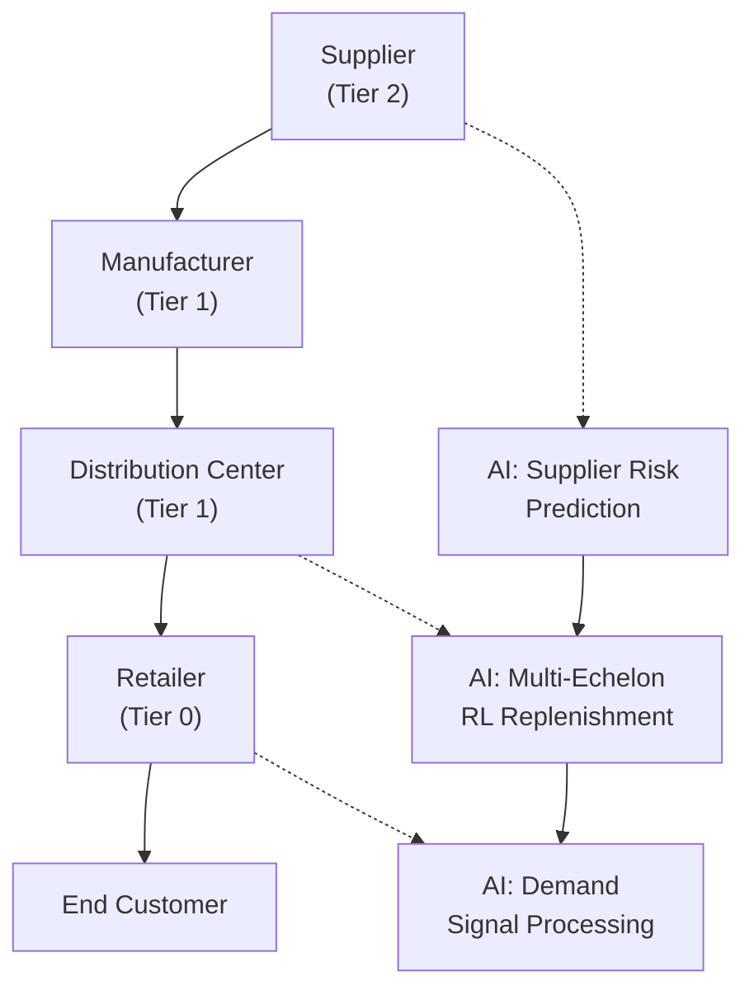

# Multi-Echelon Inventory Models and AI

## Overview

Real supply chains are not a single warehouse and a single retailer — they span multiple tiers: supplier → manufacturer → distribution center → retailer → customer. Each tier holds inventory, each tier faces demand uncertainty, and each tier's ordering decisions propagate upstream through the supply chain. Managing inventory across multiple echelons is one of the hardest and highest-value problems in supply chain management.

The challenge is the **bullwhip effect**: small fluctuations in consumer demand at the retail end cause increasingly large oscillations in orders as you move up the supply chain. This effect — first documented by the beer game at MIT in the 1950s — causes massive inefficiencies: excess inventory at upstream stages, stockouts at downstream stages, and enormous cost.

Classical approaches to multi-echelon inventory optimization include:

- **Base-stock (s,S) policies**: Each echelon orders up to a base-stock level $S$ whenever inventory drops. Simple but not always optimal.
- **Forced ordering rules**: Order-up-to policy: $O_t = \max(0, D_{t-1} + L_t - I_t)$ where $D$ is demand, $L$ is lead time, $I$ is current inventory.
- **Optimal policy characterization**: Under certain conditions (i.i.d. demand, fixed lead times), a base-stock policy is optimal. In more complex settings, state-dependent policies can outperform.
- **Approximate models**: Mean-value analysis for queueing networks, analysis of the fill rate vs. inventory trade-off in multi-echelon systems.

AI and ML are transforming multi-echelon inventory management through:

1. **Demand forecasting at each echelon**: Using hierarchical forecasting to propagate demand signals across the network.
2. **Learning optimal reorder policies**: Deep RL agents that learn inventory replenishment policies that outperform hand-crafted rules, especially with non-stationary demand.
3. **Supplier risk modeling**: Using ML to predict supplier lead time variability and incorporate risk into multi-echelon decisions.

**Base-stock level at echelon $i$**: $S_i = \hat{d}_{L_i} + z \cdot \sigma_{L_i}$ where $\hat{d}_{L_i}$ is lead-time demand forecast and $\sigma_{L_i}$ is its standard deviation.

$$I_i = \max(0, S_i - D_{\text{in-transit}}) \quad \text{(inventory position at echelon } i)$$



## Key Concepts

- **Bullwhip Effect**: Amplification of demand variability as orders move up the supply chain. Caused by demand signal processing, rationing, gaming on lead times, and price fluctuations.
- **Base-stock / Order-up-to policy**: Reorder $Q = S - I_{position}$ to maintain inventory position at $S$. Optimal under i.i.d. demand with zero lead time variance.
- **Echelon inventory**: The total inventory in a given tier plus all downstream demand. Useful for coordinating replenishment across tiers.
- **Multi-echelon inventory optimization (MEIO)**: Jointly optimizing inventory levels across all echelons to minimize total cost (holding + stockout) subject to service level constraints. Typically requires simulation or approximate dynamic programming.
- **Deep RL for MEIO**: State = inventory levels at all echelons + in-transit quantities + demand history. Action = order quantities at each echelon. Reward = profit minus costs. Actor-critic methods scale better than Q-learning for continuous action spaces.
- **Hierarchical forecasting**: Forecast demand at the retail level, then aggregate/disaggregate to propagate signals through the supply chain. Ensures consistency between SKU-level and category-level forecasts.

## Code Examples

```python
# Multi-echelon base-stock simulation
import numpy as np

def simulate_multiechelon(T: int, base_stocks: list, lead_times: list) -> dict:
    """
    Simulate a 3-echelon supply chain (supplier -> manufacturer -> retailer).
    base_stocks: [S_retailer, S_mfg, S_supplier]
    lead_times: [lt_retailer, lt_mfg, lt_supplier]
    """
    # Demand at retailer
    demand = np.random.normal(100, 20, T)

    # Inventory at each echelon
    retailer_stock = np.zeros(T)
    mfg_stock = np.zeros(T)
    supplier_stock = np.zeros(T)

    # Orders (pipeline inventory)
    orders_retailer = np.zeros(T)   # orders to manufacturer
    orders_mfg = np.zeros(T)        # orders to supplier

    for t in range(T):
        # Retailer: demand arrives, reorder to base stock
        if t >= lead_times[0]:
            incoming_mfg = orders_retailer[t - lead_times[0]]
            retailer_stock[t] = max(0, retailer_stock[t-1] - demand[t] + incoming_mfg) if t > 0 else max(0, 200 - demand[t] + incoming_mfg)
        else:
            retailer_stock[t] = max(0, 200 - demand[t]) if t > 0 else max(0, 200 - demand[t])

        target_order_r = max(0, base_stocks[0] - retailer_stock[t])
        orders_retailer[t] = target_order_r

        # Manufacturer: receives from supplier, sends to retailer
        if t >= lead_times[1]:
            incoming_supplier = orders_mfg[t - lead_times[1]]
            mfg_stock[t] = max(0, mfg_stock[t-1] - target_order_r + incoming_supplier) if t > 0 else max(0, 300 - target_order_r + incoming_supplier)
        else:
            mfg_stock[t] = max(0, 300 - target_order_r) if t > 0 else max(0, 300 - target_order_r)

        target_order_m = max(0, base_stocks[1] - mfg_stock[t])
        orders_mfg[t] = target_order_m

    return {
        'retailer_stock': retailer_stock,
        'mfg_stock': mfg_stock,
        'demand': demand,
    }

result = simulate_multiechelon(100, base_stocks=[200, 300, 400], lead_times=[2, 3, 4])
print(f"Avg retailer stock: {result['retailer_stock'].mean():.1f}")
print(f"Avg mfg stock: {result['mfg_stock'].mean():.1f}")
```

## Exercises/Projects

- **Exercise 1**: Implement the beer game simulation (4-echelon, each with a fixed base-stock rule). Observe the bullwhip effect: plot order variance at each echelon.
- **Exercise 2**: Compare base-stock policy vs. a $(R, Q)$ periodic review policy in a 3-echelon setting using simulation. Measure total holding + stockout cost.
- **Project**: Train a PPO agent for a 4-echelon supply chain with stochastic lead times and correlated demand across SKUs. Compare against a base-stock policy and a rule-based reorder policy. Use a simulation environment with at least 50 time steps per episode.

## Further Reading

- [Multi-Echelon Inventory Management](https://www.sciencedirect.com/book/9780444636452/multi-echelon-inventory-management) — tick et al. (handbook chapter, advanced treatment)
- [Bullwhip Effect Review](https://www.sciencedirect.com/science/article/abs/pii/S0925527314001578) — Gardone & Noso (comprehensive review of causes and mitigations)