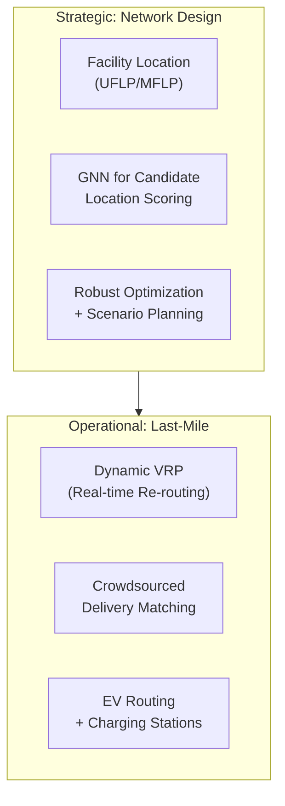

# AI for Logistics Network Design and Last-Mile Delivery

## Overview

Logistics network design is a strategic supply chain problem: where should a company locate its warehouses, cross-docks, and fulfillment centers? How should capacity be allocated across the network? What should be the service area of each facility? These decisions are made infrequently (every 1-5 years) but have enormous impact on cost, speed, and resilience.

The classic **Facility Location Problem (FLP)** is a core OR problem. The uncapacitated facility location (UFLP):

$$\min \sum_{i \in F} f_i y_i + \sum_{i \in F} \sum_{j \in C} c_{ij} x_{ij}$$

$$\text{s.t.} \quad \sum_{i \in F} x_{ij} = 1 \;\; \forall j \in C, \quad x_{ij} \leq y_i \;\; \forall i,j$$

where $y_i \in \{0,1\}$ indicates whether facility $i$ is open, $x_{ij}$ indicates whether customer $j$ is served by facility $i$, $f_i$ is the fixed opening cost, and $c_{ij}$ is the service cost. This is NP-hard (metric UFLP has a 1.488-approximation algorithm).

For last-mile delivery — the final step of getting packages from a distribution center to the end customer — the challenge is different: routing thousands of packages across a dense urban road network with time windows, vehicle capacities, and driver constraints. This is the VRP family, which we covered in Lesson 3, but here we focus on the urban specificities:

- **Dynamic traffic**: Real-time traffic conditions affect route durations, requiring online re-optimization.
- **Crowdsourced delivery**: Platforms like Uber, DoorDash, and Instacart use crowdsourced drivers. Matching packages to drivers involves ML-based delivery time prediction and incentive design.
- **Electric vehicles**: EV routing adds battery constraints and charging station decisions to VRP (the E-VRP variant).

AI for network design includes:

- **Neural neighborhood search**: Learning good perturbation operators for local search on large FLP instances.
- **Graph embedding for facility siting**: Using node embeddings (DeepWalk, Node2Vec) to identify candidate locations with high demand density and low opening costs.
- **End-to-end RL for network optimization**: Learning a policy that decides where to open facilities given demand forecasts and cost parameters.

$$T_{ij} = t_{ij} \cdot (1 + \alpha \cdot \text{congestion}_{ij}(t))$$



## Key Concepts

- **Facility Location Problem (FLP)**: Strategic decision of where to open facilities. $y_i$ = open facility $i$? $x_{ij}$ = assign customer $j$ to facility $i$? Fixed costs $f_i$, assignment costs $c_{ij}$.
- **Approximation algorithms**: For metric UFLP, the classic 1.488-approximation uses primal-dual (Goemans-Williamson). Near-optimal solutions can be found for practical instances.
- **Last-Mile Delivery**: The most expensive segment of the supply chain, representing 30-50% of total cost. Urban density makes this especially challenging.
- **Dynamic/Online VRP**: The version of VRP where orders arrive over time and must be inserted into existing routes. Requires fast re-optimization algorithms.
- **Crowdsourced logistics**: Using non-professional drivers for delivery. Matching algorithms must balance speed, cost, and reliability.
- **Electric Vehicle Routing (E-VRP)**: VRP with EV constraints — limited range, charging station locations, charging times. Multi-objective optimization (minimize total time, minimize charging stops).
- **GNN for logistics**: Graph neural networks that encode the road network and customer locations, used for both facility location (scoring candidate sites) and routing (learning routing policies).

## Code Examples

```python
# Facility location problem (UFLP) with greedy approximation
import numpy as np

def greedy_facility_location(customers: list, facilities: list, opening_cost: list, assignment_cost: list):
    """
    Greedy primal-dual approximation for metric UFLP.
    facilities: list of (x, y) coordinates
    customers: list of (x, y) coordinates with demand weight
    Returns: set of open facilities, assignment dict
    """
    n_facilities = len(facilities)
    n_customers = len(customers)

    # Compute assignment cost matrix
    dist = np.zeros((n_customers, n_facilities))
    for j, cust in enumerate(customers):
        for i, fac in enumerate(facilities):
            dist[j, i] = np.sqrt((cust[0]-fac[0])**2 + (cust[1]-fac[1])**2)

    open_facilities = set()
    assigned = [False] * n_customers

    while sum(assigned) < n_customers:
        # Find cheapest facility to open next that reduces total cost
        best_delta = float('inf')
        best_facility = None
        for i in range(n_facilities):
            if i in open_facilities:
                continue
            delta = opening_cost[i]
            for j in range(n_customers):
                if not assigned[j]:
                    delta += dist[j, i] * customers[j][2]  # weight
            if delta < best_delta:
                best_delta = delta
                best_facility = i

        open_facilities.add(best_facility)

        # Assign customers to nearest open facility
        for j in range(n_customers):
            if not assigned[j]:
                min_dist = min(dist[j, i] for i in open_facilities)
                if dist[j, best_facility] == min_dist:
                    assigned[j] = True

    return open_facilities

# Example
facilities = [(0,0), (50,0), (0,50), (50,50)]
customers = [(10,10,1.0), (40,40,1.5), (45,5,0.8), (5,45,0.9)]
opening_costs = [100, 150, 120, 130]
open = greedy_facility_location(customers, facilities, opening_costs, None)
print(f"Open facilities: {open}")
```

```python
# Dynamic VRP with real-time insertions (pseudocode)
"""
class DynamicVRP:
    def insert_order(self, order, current_route, current_time):
        '''Insert new delivery order into existing route.'''
        best_insert = None
        best_cost = float('inf')

        for pos in range(len(current_route) + 1):
            for vehicle in self.vehicles:
                trial_route = current_route[:pos] + [order] + current_route[pos:]
                cost = self.evaluate_route(trial_route, vehicle)
                if cost < best_cost:
                    best_cost = cost
                    best_insert = (pos, vehicle)

        if best_insert:
            self.commit_insertion(best_insert)
        return best_cost

    def evaluate_route(self, route, vehicle):
        # Compute total time including time windows
        # Penalize lateness heavily
        return total_distance + 10 * max(0, arrival_time - time_window_end)
"""
```

## Exercises/Projects

- **Exercise 1**: Formulate and solve a 10-customer, 5-facility UFLP using PuLP. Compare the greedy solution cost to the optimal solution (found by solver).
- **Exercise 2**: Implement a dynamic VRP simulation where new orders arrive according to a Poisson process. Compare a re-optimize-from-scratch strategy vs. an insertion heuristic for order processing rate.
- **Project**: Design a regional logistics network for a given city: determine optimal number and location of micro-fulfillment centers given demand density data. Use a combination of facility location optimization and VRP for delivery performance evaluation.

## Further Reading

- [Facility Location: Applications and Theory](https://www.springer.com/book/9783642172661) — Drezner & Hamacher (comprehensive FLP reference)
- [Last-Mile Delivery research](https://journals.sagepub.com/doi/10.1177/07256184211056174) — Recent review of urban logistics and AI