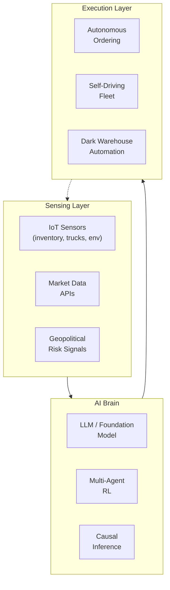

# Frontiers: Autonomous Supply Chain and AI-Native Operations

## Overview

The long-term trajectory of AI in supply chain is toward full autonomy: self-managing, self-healing supply chains that detect disruptions, adapt plans, and execute decisions without human intervention. This is the vision of the "autonomous supply chain" — sometimes called Supply Chain 4.0 or the self-driving supply chain.

Several converging trends are making this vision increasingly practical:

1. **Foundation models for supply chain**: Large language models (LLMs) fine-tuned on supply chain data (SAP, Oracle, demand signals, contracts) can reason about disruptions and suggest actions in natural language. This is a qualitatively new capability — LLMs can synthesize information from multiple sources (weather, geopolitics, supplier financials) to generate coherent risk assessments and response plans.

2. **Digital twins at scale**: End-to-end supply chain simulation environments that mirror the real system in real time, enabling what-if analysis, policy testing, and RL training in simulation before real deployment.

3. **Fully automated warehouses**: Dark warehouses (lights-out operations), robotic picking and packing, autonomous yard trucks, and automated quality inspection. The frontier is integrating these into a cohesive, self-coordinating system.

4. **Autonomous procurement**: Agentic AI systems that monitor supplier risk, negotiate with vendors, place orders, and manage contracts — all without human involvement for routine decisions.

5. **Generative supply chain**: Using generative AI to design new supply chain networks, simulate disruption scenarios, and generate contingency plans.

The key technical frontiers:

- **Temporal reasoning with LLMs**: Supply chains are fundamentally temporal systems — what happens now depends on what happened before and will affect what happens next. LLMs must be augmented with temporal knowledge graphs and planning capabilities.
- **Causal reasoning for interventions**: "What if we double our safety stock?" requires causal models, not just correlations. Causal ML for supply chain is an emerging area.
- **Robust multi-agent coordination**: Supply chains are naturally distributed systems; coordinating decisions across autonomous agents (suppliers, logistics providers, manufacturers) requires robust multi-agent RL.
- **Sustainability and carbon-aware operations**: Multi-objective optimization that balances cost, speed, and carbon footprint. AI for carbon-aware routing and procurement.

$$J_{\text{total}} = \alpha \cdot \text{Cost} + \beta \cdot \text{Speed} + \gamma \cdot \text{Carbon} + \delta \cdot \text{Risk}$$



## Key Concepts

- **Autonomous supply chain**: A supply chain that uses AI to continuously sense its environment, plan responses, and execute decisions with minimal human intervention. The highest maturity level of supply chain automation.
- **Digital twin**: A high-fidelity simulation model of the supply chain that mirrors reality in real time. Used for scenario planning, policy optimization, and training AI controllers before real deployment.
- **Agentic AI for procurement**: AI agents that can plan (break down "source component X" into sub-tasks), use tools (query supplier APIs, access ERP), and execute (place PO, track delivery) with human oversight.
- **Dark warehouse**: A fully automated fulfillment center with no human workers inside the operational area. All tasks performed by robots, automated cranes, and conveyors. Extreme end of the automation spectrum.
- **Carbon-aware logistics**: Optimization that accounts for CO₂ emissions as a primary objective or constraint. Requires emissions factors per route/vehicle/time, integrated into routing and network design models.
- **Foundation model for supply chain**: A large pretrained model (like GPT-4) fine-tuned on supply chain data — 10-K filings, procurement contracts, ERP logs, shipment records — enabling general-purpose reasoning about supply chain questions.

## Code Examples

```python
# Autonomous ordering agent (simplified conceptual demo)
"""
class SupplyChainAgent:
    def __init__(self, llm, tools):
        self.llm = llm  # LLM for reasoning
        self.tools = tools  # ERP, weather API, supplier API

    def run_cycle(self):
        # Sense: collect signals
        demand_signal = self.tools.get_recent_demand()
        supplier_signal = self.tools.get_supplier_status()
        risk_signal = self.tools.get_geopolitical_risk()

        # Think: analyze and plan
        context = f"Demand: {demand_signal}, Supplier: {supplier_signal}, Risk: {risk_signal}"
        plan = self.llm.think(context, task="replenishment_decision")

        # Act: execute plan
        if plan['action'] == 'order':
            self.tools.place_order(plan['sku'], plan['qty'])
        elif plan['action'] == 'wait':
            pass  # Monitor
        elif plan['action'] == 'escalate':
            self.tools.notify_human(plan['reason'])

        return plan

# Example invocation
agent = SupplyChainAgent(llm=gpt4, tools=erp_tools)
decision = agent.run_cycle()
print(f"Agent decision: {decision}")
"""
```

```python
# Carbon-aware routing (simplified multi-objective)
import numpy as np

def carbon_aware_route(orders, vehicles, road_network, carbon_factors):
    """
    Multi-objective: minimize cost AND carbon simultaneously.
    carbon_factors[vehicle_type][road_type] = gCO2/km
    Returns Pareto front of routes.
    """
    pareto_routes = []

    for order in orders:
        # Compute cost-optimal and carbon-optimal routes separately
        route_cost = compute_route(orders, vehicles, road_network,
                                   objective=lambda r: r['distance'] * vehicles[0]['cost_per_km'])
        route_carbon = compute_route(orders, vehicles, road_network,
                                     objective=lambda r: r['distance'] * carbon_factors[r['vehicle_type']])
        pareto_routes.append({
            'order': order,
            'cost_optimal': route_cost,
            'carbon_optimal': route_carbon,
        })

    return pareto_routes

# Example: truck vs. electric van
carbon_factors = {
    'truck': 0.8,    # kg CO2 per km
    'ev_van': 0.15,  # kg CO2 per km
}

# Trade-off: EV is slower (limited range) but 5x cleaner
# Optimization: minimize weighted sum or find Pareto front
print("Carbon-aware routing enables trade-offs between cost and sustainability.")
```

## Exercises/Projects

- **Exercise 1**: Research three real-world examples of supply chain disruptions where autonomous AI response would have significantly reduced impact. For each, sketch how an autonomous supply chain system could have responded.
- **Exercise 2**: Build a simple multi-objective optimization (cost vs. carbon) for a 10-customer routing problem using weighted sum and Pareto front approaches. Visualize the trade-off.
- **Project**: Design a conceptual autonomous supply chain system architecture: identify key components (sensing, reasoning, execution), data flows, and AI models required. Implement a simplified version where an LLM agent makes replenishment decisions for a 3-SKU, 2-echelon supply chain given noisy demand signals and supplier lead time variability.

## Further Reading

- [McKinsey: Autonomous Supply Chain](https://www.mckinsey.com/business-functions/operations/our-insights/supply-chains-prepare-for-ai-autonomy) — Vision for autonomous supply chains
- [The Self-Driving Supply Chain](https://www.gartner.com/en/supply-chain/research/the-self-driving-supply-chain) — Gartner's analysis of maturity levels
- [Foundation Models for Supply Chain](https://arxiv.org/abs/2305.12578) — Recent paper on applying LLMs to supply chain reasoning