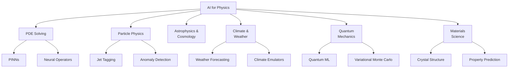

# Introduction to AI for Physics

## Overview

Physics has always been about discovering the fundamental laws that govern the universe — from Newton's laws of motion to Maxwell's equations of electromagnetism to the Standard Model of particle physics. For centuries, physicists relied on pen-and-paper theory and carefully controlled experiments. But modern physics faces a scaling crisis: the equations we write down are often too complex to solve analytically, and the experiments we run generate data at rates no human can process.

**AI is rapidly becoming the third pillar of physics**, alongside theory and experiment. Machine learning models can approximate solutions to intractable partial differential equations (PDEs), discover hidden patterns in petabytes of collider data, and even propose new physical laws from raw observations. This lesson introduces why physics needs AI, traces the key historical developments, and surveys the landscape of AI-for-physics applications.

---

## Why Physics Needs AI

### The PDE Problem

Most physical systems are governed by partial differential equations — the Navier-Stokes equations for fluid flow, the Schrödinger equation for quantum mechanics, Einstein's field equations for general relativity. Exact analytical solutions exist only for highly idealized cases (spherical cows, infinite plates, vacuum). Real-world systems require **numerical simulation**, which scales poorly:

- A 3D fluid simulation on a $1024^3$ grid has over a billion degrees of freedom
- Climate models couple atmosphere, ocean, ice, and land on grids spanning the globe
- Quantum many-body systems suffer exponential scaling: $N$ particles require $O(2^N)$ amplitudes

Traditional solvers (finite element, finite difference, spectral methods) are powerful but computationally expensive. A single high-fidelity turbulence simulation can consume millions of CPU-hours. **AI offers surrogate models** that learn the input-output mapping of a simulator at a fraction of the cost.

### The Data Flood

Modern physics experiments generate staggering volumes of data:

- The Large Hadron Collider (LHC) at CERN produces ~1 petabyte per second of raw collision data, filtered down to ~1 GB/s for storage
- The Vera C. Rubin Observatory will photograph the entire southern sky every three nights, generating 20 TB per night
- Gravitational wave detectors (LIGO/Virgo) continuously stream time-series data from laser interferometers

No human can inspect this data manually. ML classifiers, anomaly detectors, and generative models are essential for extracting physics from the noise.

---

## A Brief History

- **1940s–1950s**: Monte Carlo methods (Ulam, Metropolis) at Los Alamos — the birth of computational physics
- **1960s**: Molecular dynamics simulations (Alder, Rahman) for statistical mechanics
- **1990s**: Neural networks first applied to particle physics classification at CERN
- **2017**: Physics-Informed Neural Networks (PINNs) introduced by Raissi et al. — embedding PDEs directly into neural network loss functions
- **2019**: Neural ODEs (Chen et al.) — continuous-depth models that parameterize derivatives with neural networks
- **2020**: Fourier Neural Operator (Li et al.) — learning mappings between function spaces, solving PDEs 1000x faster than traditional solvers
- **2022**: GraphCast (DeepMind) — graph neural network for global weather forecasting, outperforming numerical weather prediction models
- **2023**: GNoME (DeepMind) — graph networks discover 2.2 million new stable crystal structures
- **2024**: Foundation models for scientific simulation emerge, combining multiple physics domains

---

## The AI-for-Physics Landscape

**AI-for-Physics Domains**



---

## Key Concepts

- **Surrogate Models**: Neural networks trained to approximate expensive simulations. Once trained, inference is orders of magnitude faster than running the full simulation.
- **Physics-Informed Learning**: Embedding known physical laws (conservation laws, symmetries, boundary conditions) directly into the model's loss function or architecture.
- **Operator Learning**: Learning mappings between infinite-dimensional function spaces (e.g., mapping initial conditions to solutions), rather than point-to-point predictions.
- **Symmetry and Equivariance**: Physics obeys symmetries (rotational, translational, gauge). Models that respect these symmetries generalize better and require less data.
- **Hybrid Physics-ML**: Combining traditional numerical solvers with ML components — using ML to correct or accelerate parts of a simulation pipeline.

---

## Code Example

A minimal example showing how physics knowledge can guide ML — fitting a simple harmonic oscillator trajectory:

```python
import torch
import torch.nn as nn

# Generate data from a simple harmonic oscillator: x(t) = A*cos(ωt)
A, omega = 1.0, 2 * torch.pi  # amplitude and angular frequency
t = torch.linspace(0, 2, 200).unsqueeze(1)
x_true = A * torch.cos(omega * t)

# Simple MLP to learn x(t)
model = nn.Sequential(
    nn.Linear(1, 64), nn.Tanh(),
    nn.Linear(64, 64), nn.Tanh(),
    nn.Linear(64, 1)
)

optimizer = torch.optim.Adam(model.parameters(), lr=1e-3)

for epoch in range(2000):
    x_pred = model(t)
    # Data loss
    loss_data = ((x_pred - x_true) ** 2).mean()
    # Physics loss: d²x/dt² + ω²x = 0
    x_t = torch.autograd.grad(x_pred.sum(), t, create_graph=True)[0]
    x_tt = torch.autograd.grad(x_t.sum(), t, create_graph=True)[0]
    loss_physics = ((x_tt + omega**2 * x_pred) ** 2).mean()
    loss = loss_data + loss_physics
    optimizer.zero_grad()
    loss.backward()
    optimizer.step()

# Note: t must have requires_grad=True for autograd
t.requires_grad_(True)
```

This illustrates the core PINN idea: the loss function penalizes both data mismatch **and** violation of the governing equation $\frac{d^2x}{dt^2} + \omega^2 x = 0$.

---

## Exercises

1. **Concept Check**: Name three reasons why traditional PDE solvers struggle with real-world physics problems. How does AI address each?
2. **Explore**: Pick one physics domain (climate, particle physics, quantum mechanics). Find one recent paper (2022+) where ML achieved results comparable to or better than traditional methods. Summarize the key insight in 2–3 sentences.
3. **Code**: Modify the code example above to model a damped harmonic oscillator: $\frac{d^2x}{dt^2} + 2\gamma\frac{dx}{dt} + \omega^2 x = 0$. Add the damping term to the physics loss.

---

## Further Reading

- Karniadakis et al., "Physics-informed machine learning" (Nature Reviews Physics, 2021)
- Thuerey et al., "Physics-based Deep Learning" — free online textbook: https://physicsbaseddeeplearning.org
- Carleo et al., "Machine learning and the physical sciences" (Reviews of Modern Physics, 2019)
