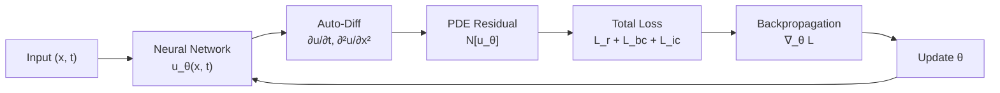

# Physics-Informed Neural Networks

## Overview

Physics-Informed Neural Networks (PINNs) are one of the most influential ideas at the intersection of AI and physics. Introduced by Raissi, Perdikaris, and Karniadakis in 2019, PINNs embed the governing partial differential equations (PDEs) of a physical system directly into the loss function of a neural network. Instead of relying solely on data, PINNs enforce that the network's predictions satisfy known physical laws — conservation of energy, momentum, mass, or any PDE you can write down.

The key insight is simple but powerful: **automatic differentiation**, the same tool used to compute gradients during backpropagation, can also compute the spatial and temporal derivatives of a neural network's output with respect to its inputs. This means you can evaluate PDE residuals exactly, without finite differences or mesh generation.

---

## The PINN Framework

### Problem Setup

Consider a general PDE:

$$\mathcal{N}[u(x, t)] = 0, \quad x \in \Omega, \; t \in [0, T]$$

with boundary conditions $\mathcal{B}[u] = 0$ on $\partial\Omega$ and initial condition $u(x, 0) = u_0(x)$.

A PINN approximates the solution $u(x, t)$ with a neural network $u_\theta(x, t)$ parameterized by weights $\theta$.

### Loss Function

The total loss has three components:

$$\mathcal{L} = \lambda_r \mathcal{L}_r + \lambda_{bc} \mathcal{L}_{bc} + \lambda_{ic} \mathcal{L}_{ic}$$

where:

- **PDE residual loss**: $\mathcal{L}_r = \frac{1}{N_r} \sum_{i=1}^{N_r} |\mathcal{N}[u_\theta(x_i, t_i)]|^2$ — evaluated at collocation points sampled inside the domain
- **Boundary loss**: $\mathcal{L}_{bc} = \frac{1}{N_{bc}} \sum_{i=1}^{N_{bc}} |\mathcal{B}[u_\theta] - g_i|^2$
- **Initial condition loss**: $\mathcal{L}_{ic} = \frac{1}{N_{ic}} \sum_{i=1}^{N_{ic}} |u_\theta(x_i, 0) - u_0(x_i)|^2$

The $\lambda$ weights balance the different loss terms.

---

## How Auto-Differentiation Enables PINNs

**PINN Training Loop**



The critical enabler is that frameworks like PyTorch and JAX can differentiate the network output $u_\theta$ with respect to its **inputs** $(x, t)$ — not just its parameters. This means:

```python
# Computing ∂u/∂t and ∂²u/∂x² using autograd
u = model(x, t)
u_t = torch.autograd.grad(u, t, grad_outputs=torch.ones_like(u), create_graph=True)[0]
u_x = torch.autograd.grad(u, x, grad_outputs=torch.ones_like(u), create_graph=True)[0]
u_xx = torch.autograd.grad(u_x, x, grad_outputs=torch.ones_like(u_x), create_graph=True)[0]
```

No finite difference stencils, no mesh needed. The derivatives are computed exactly (up to floating-point precision) through the computation graph.

---

## Key Concepts

- **Collocation Points**: Random or quasi-random points sampled inside the domain where the PDE residual is evaluated. Unlike finite elements, PINNs are **meshless** — no structured grid is required.
- **Soft vs Hard Constraints**: The standard PINN applies boundary/initial conditions as soft penalties in the loss. Hard constraints bake them into the architecture (e.g., multiplying by a distance function that is zero on the boundary).
- **Loss Balancing**: The $\lambda$ weights are crucial. Poor balancing leads to the network satisfying one constraint while ignoring others. Techniques include gradient-based weighting (learning rate annealing) and the Neural Tangent Kernel approach.
- **Inverse Problems**: PINNs naturally handle inverse problems — if some PDE parameters are unknown, make them trainable. The network simultaneously fits the data and infers the parameters.

---

## Code Example: Solving the 1D Heat Equation

The 1D heat equation: $\frac{\partial u}{\partial t} = \alpha \frac{\partial^2 u}{\partial x^2}$

```python
import torch
import torch.nn as nn

class PINN(nn.Module):
    def __init__(self):
        super().__init__()
        self.net = nn.Sequential(
            nn.Linear(2, 64), nn.Tanh(),
            nn.Linear(64, 64), nn.Tanh(),
            nn.Linear(64, 64), nn.Tanh(),
            nn.Linear(64, 1)
        )

    def forward(self, x, t):
        inputs = torch.cat([x, t], dim=1)
        return self.net(inputs)

alpha = 0.01  # thermal diffusivity
model = PINN()
optimizer = torch.optim.Adam(model.parameters(), lr=1e-3)

for epoch in range(5000):
    # Collocation points inside domain [0,1] x [0,1]
    x_r = torch.rand(1000, 1, requires_grad=True)
    t_r = torch.rand(1000, 1, requires_grad=True)
    u = model(x_r, t_r)

    # Compute derivatives via autograd
    u_t = torch.autograd.grad(u, t_r, torch.ones_like(u), create_graph=True)[0]
    u_x = torch.autograd.grad(u, x_r, torch.ones_like(u), create_graph=True)[0]
    u_xx = torch.autograd.grad(u_x, x_r, torch.ones_like(u_x), create_graph=True)[0]

    # PDE residual: u_t - α * u_xx = 0
    residual = u_t - alpha * u_xx
    loss_pde = (residual ** 2).mean()

    # Initial condition: u(x, 0) = sin(πx)
    x_ic = torch.rand(200, 1, requires_grad=True)
    t_ic = torch.zeros(200, 1, requires_grad=True)
    u_ic = model(x_ic, t_ic)
    loss_ic = ((u_ic - torch.sin(torch.pi * x_ic)) ** 2).mean()

    # Boundary conditions: u(0,t) = u(1,t) = 0
    t_bc = torch.rand(200, 1, requires_grad=True)
    u_left = model(torch.zeros(200, 1), t_bc)
    u_right = model(torch.ones(200, 1), t_bc)
    loss_bc = (u_left ** 2).mean() + (u_right ** 2).mean()

    loss = loss_pde + 10 * loss_ic + 10 * loss_bc
    optimizer.zero_grad()
    loss.backward()
    optimizer.step()

    if epoch % 1000 == 0:
        print(f"Epoch {epoch}: PDE={loss_pde:.4e}, IC={loss_ic:.4e}, BC={loss_bc:.4e}")
```

The analytical solution is $u(x,t) = e^{-\alpha \pi^2 t} \sin(\pi x)$, so you can verify the PINN's accuracy.

---

## Strengths and Limitations

| Strengths | Limitations |
|---|---|
| Meshless — no grid generation | Training can be slow to converge |
| Handles irregular geometries | Struggles with sharp gradients / shocks |
| Natural for inverse problems | Loss balancing is non-trivial |
| Works with sparse / noisy data | Scaling to high dimensions is hard |

---

## Exercises

1. **Implement**: Run the heat equation PINN above. Plot $u(x, t)$ as a heatmap and compare to the analytical solution. What is the maximum error?
2. **Inverse Problem**: Modify the code to treat $\alpha$ as a trainable parameter. Generate synthetic data from $\alpha = 0.01$ and see if the PINN recovers it.
3. **Explore**: What happens if you remove the physics loss entirely and only train on data? How many data points do you need to match the PINN's accuracy?

---

## Further Reading

- Raissi, Perdikaris, Karniadakis, "Physics-informed neural networks" (Journal of Computational Physics, 2019)
- Lu et al., "DeepXDE: A deep learning library for solving differential equations" (SIAM Review, 2021)
- Karniadakis et al., "Physics-informed machine learning" (Nature Reviews Physics, 2021)
