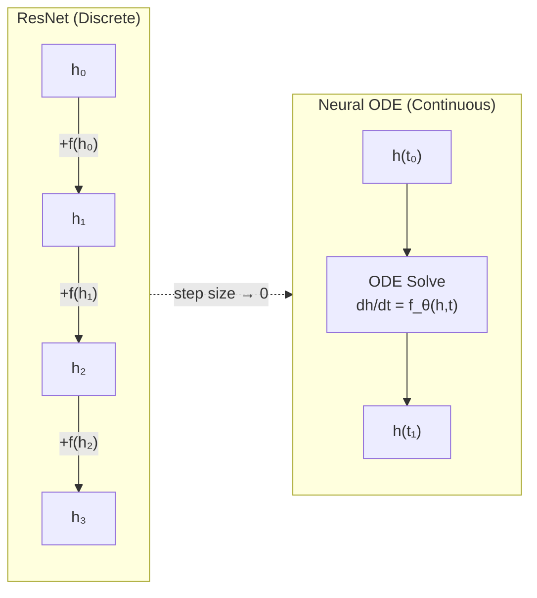

# Neural Differential Equations

## Overview

Neural Ordinary Differential Equations (Neural ODEs), introduced by Chen et al. in 2018, represent one of the most elegant fusions of deep learning and mathematical physics. The core idea is deceptively simple: instead of stacking discrete layers in a neural network, parameterize the **continuous dynamics** of a hidden state with a neural network and solve the resulting ODE with a numerical integrator.

This insight bridges two worlds — the discrete world of neural network layers and the continuous world of differential equations that physics is built on. Neural ODEs offer memory-efficient training via the adjoint method, naturally handle irregularly-sampled time series, and provide a principled framework for learning dynamical systems from data.

---

## From Residual Networks to Neural ODEs

### The Residual Network Connection

A residual network (ResNet) computes:

$$h_{t+1} = h_t + f_\theta(h_t, t)$$

This looks like an Euler step for an ODE! If we take the step size to zero, we get a continuous dynamical system:

$$\frac{dh}{dt} = f_\theta(h(t), t)$$

where $f_\theta$ is a neural network. The "depth" of the network becomes continuous — instead of a fixed number of layers, we integrate from time $t_0$ to $t_1$.

**From ResNet to Neural ODE**



---

## The Adjoint Method

### The Memory Problem

Backpropagation through an ODE solver requires storing all intermediate states — potentially thousands of solver steps. This is prohibitively expensive.

### The Solution: Adjoint Sensitivity

The adjoint method computes gradients by solving a **second ODE backwards in time**. Define the adjoint state:

$$a(t) = \frac{\partial \mathcal{L}}{\partial h(t)}$$

The adjoint satisfies:

$$\frac{da}{dt} = -a(t)^T \frac{\partial f_\theta}{\partial h}$$

and the parameter gradients are:

$$\frac{d\mathcal{L}}{d\theta} = -\int_{t_1}^{t_0} a(t)^T \frac{\partial f_\theta}{\partial \theta} \, dt$$

This means memory cost is **constant** (O(1)) regardless of the number of solver steps — you only store the final state and integrate backwards.

---

## Key Concepts

- **Continuous-Depth Models**: Neural ODEs have no fixed number of layers. The ODE solver adaptively chooses the number of function evaluations based on the required accuracy, spending more computation where the dynamics are complex.
- **Adaptive Computation**: Unlike fixed-depth networks, the solver uses more steps in regions with rapid changes and fewer steps in smooth regions. This is analogous to adaptive mesh refinement in numerical methods.
- **Normalizing Flows**: Neural ODEs enable continuous normalizing flows (CNFs) — a way to model complex probability distributions by continuously transforming a simple base distribution through an ODE.
- **Augmented Neural ODEs**: The original Neural ODE has limited expressiveness because ODE trajectories cannot cross. Augmenting the state space with extra dimensions solves this.

---

## Neural ODEs for Physics

### Learning Dynamical Systems

The most natural application: given trajectory data from a physical system, learn the dynamics directly:

$$\frac{dx}{dt} = f_\theta(x)$$

The network $f_\theta$ learns the vector field governing the system. Once trained, you can:
- Predict future states (forecasting)
- Interpolate between observed time points
- Extrapolate beyond the training window (with care)

### Hamiltonian Neural Networks

For conservative systems, we know the dynamics preserve energy. Hamiltonian Neural Networks (HNNs) learn a scalar Hamiltonian $\mathcal{H}_\theta(q, p)$ and derive dynamics via Hamilton's equations:

$$\frac{dq}{dt} = \frac{\partial \mathcal{H}_\theta}{\partial p}, \quad \frac{dp}{dt} = -\frac{\partial \mathcal{H}_\theta}{\partial q}$$

This guarantees energy conservation by construction.

---

## Code Example: Learning a Pendulum's Dynamics

```python
import torch
import torch.nn as nn
from torchdiffeq import odeint  # pip install torchdiffeq

# True pendulum dynamics: dθ/dt = ω, dω/dt = -sin(θ)
def true_dynamics(t, state):
    theta, omega = state[..., 0:1], state[..., 1:2]
    return torch.cat([omega, -torch.sin(theta)], dim=-1)

# Generate training data
t_span = torch.linspace(0, 5, 100)
y0 = torch.tensor([[1.0, 0.0]])  # initial angle=1 rad, angular velocity=0
with torch.no_grad():
    true_traj = odeint(true_dynamics, y0, t_span)  # shape: [100, 1, 2]

# Neural ODE: learn f_θ such that dy/dt = f_θ(y)
class ODEFunc(nn.Module):
    def __init__(self):
        super().__init__()
        self.net = nn.Sequential(
            nn.Linear(2, 64), nn.Tanh(),
            nn.Linear(64, 64), nn.Tanh(),
            nn.Linear(64, 2)
        )

    def forward(self, t, y):
        return self.net(y)

func = ODEFunc()
optimizer = torch.optim.Adam(func.parameters(), lr=1e-3)

for epoch in range(300):
    pred_traj = odeint(func, y0, t_span)
    loss = ((pred_traj - true_traj) ** 2).mean()
    optimizer.zero_grad()
    loss.backward()
    optimizer.step()
    if epoch % 50 == 0:
        print(f"Epoch {epoch}: loss={loss.item():.6f}")

# After training, func has learned the pendulum dynamics
# You can now predict trajectories from new initial conditions
```

---

## Neural ODEs vs PINNs

| | Neural ODE | PINN |
|---|---|---|
| **Learns** | Dynamics (vector field) | Solution field |
| **Input** | Trajectory data | PDE + boundary conditions |
| **Requires** | Observed trajectories | Known governing equations |
| **Output** | ODE right-hand side $f_\theta$ | Solution $u_\theta(x,t)$ |
| **Best for** | Unknown dynamics from data | Known physics, complex geometry |

They are complementary: use PINNs when you know the equations, Neural ODEs when you don't.

---

## Extensions

- **Neural SDEs**: Replace the ODE with a stochastic differential equation to model noisy dynamics
- **Latent ODEs**: Encode irregular time series into a latent state, evolve with a Neural ODE, decode — powerful for clinical time series
- **Neural PDEs**: Extend the framework from ODEs to PDEs using spatial discretization combined with neural dynamics

---

## Exercises

1. **Run the Code**: Train the pendulum Neural ODE above. Plot the learned trajectory vs the true trajectory. Then predict from a new initial condition $(\theta_0 = 0.5, \omega_0 = 1.0)$ — does the model generalize?
2. **Hamiltonian**: Modify the code to learn a Hamiltonian $\mathcal{H}_\theta(\theta, \omega)$ instead of the dynamics directly. Does this version conserve energy better during long rollouts?
3. **Think**: Why can't standard Neural ODE trajectories cross in state space? Hint: think about uniqueness theorems for ODEs.

---

## Further Reading

- Chen et al., "Neural Ordinary Differential Equations" (NeurIPS 2018 — Best Paper)
- Greydanus et al., "Hamiltonian Neural Networks" (NeurIPS 2019)
- Kidger, "On Neural Differential Equations" (PhD thesis, 2022) — comprehensive reference
