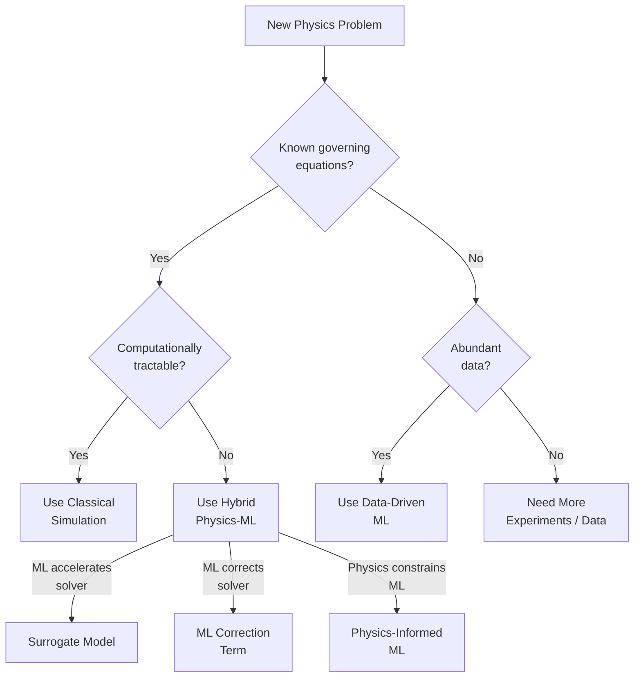

# Classical vs Data-Driven Physics

## Overview

Physics has two powerful but fundamentally different approaches to understanding nature. **Classical (first-principles) methods** start from known laws — Newton's equations, thermodynamic principles, quantum mechanics — and derive predictions through mathematical analysis and numerical simulation. **Data-driven methods** start from observations and let machine learning discover patterns, correlations, and even governing equations directly from data.

Neither approach alone is sufficient. Classical methods struggle when equations are intractable or unknown. Data-driven methods struggle when data is scarce or the model must extrapolate far beyond training conditions. The most promising direction is **hybrid physics-ML**, which combines the strengths of both. This lesson maps out when to use each approach, how to combine them, and how to quantify the uncertainty in your predictions.

---

## Classical (First-Principles) Methods

### Strengths

Classical methods are the gold standard of physics for good reason:

- **Interpretability**: Every prediction can be traced back to fundamental laws. You know *why* the model predicts what it does.
- **Extrapolation**: Physical laws generalize. Newton's law of gravity works from apples to galaxies. A well-validated simulation can predict regimes never observed.
- **Conservation Guarantees**: Properly formulated numerical schemes conserve energy, momentum, and mass by construction.
- **No Data Required**: You can simulate systems that have never been measured.

### Limitations

- **Computational Cost**: High-fidelity simulations of turbulence, climate, or quantum systems can take weeks on supercomputers.
- **Unknown Physics**: Many real systems involve unknown constitutive laws, unmeasured parameters, or multi-scale interactions that resist first-principles modeling.
- **Idealized Assumptions**: Analytical solutions often require simplifying assumptions (linearity, symmetry, homogeneity) that don't hold in practice.

---

## Data-Driven Methods

### Strengths

- **Speed**: Once trained, neural network surrogates can produce predictions in milliseconds vs hours for a simulation.
- **Pattern Discovery**: ML can find patterns in high-dimensional data that humans miss — discovering new materials, classifying particle collisions, identifying anomalies.
- **Flexibility**: No need to know the governing equations. Given enough data, ML can approximate any continuous function.

### Limitations

- **Data Hungry**: Deep learning models typically need large, high-quality datasets.
- **Poor Extrapolation**: Neural networks are notoriously unreliable outside their training distribution. A model trained on low-Reynolds-number flows won't work for turbulence.
- **Black Box**: Standard neural networks provide no physical insight into *why* they make a prediction.
- **No Conservation Guarantees**: Without special architecture design, ML models can violate energy conservation, produce negative densities, or break symmetries.

---

## Decision Framework

**When to Use Which Approach**



### Rules of Thumb

| Scenario | Recommended Approach |
|---|---|
| Well-understood PDE, small domain | Classical solver |
| Well-understood PDE, huge parameter space | ML surrogate trained on simulation data |
| Partially known physics + experimental data | Hybrid: physics backbone + ML correction |
| Unknown dynamics, abundant trajectory data | Neural ODE / pure data-driven |
| Safety-critical (nuclear, aerospace) | Classical with ML-assisted speedup; ML alone insufficient for certification |

---

## Hybrid Physics-ML Approaches

### 1. ML-Corrected Simulations

Run a coarse (fast but inaccurate) simulation and train an ML model to predict the correction:

$$u_{\text{accurate}} \approx u_{\text{coarse}} + \delta u_{\text{ML}}$$

The ML model only needs to learn the **residual** — a much simpler function than the full solution. This is widely used in climate modeling and turbulence.

### 2. Physics-Constrained Architectures

Design the neural network architecture to satisfy physical constraints by construction:

- **Hamiltonian/Lagrangian NNs**: Energy conservation built in
- **Equivariant networks**: Rotational/translational symmetry built in (SE(3)-equivariant)
- **Divergence-free networks**: Mass conservation for incompressible flows
- **Symplectic integrators**: Phase space structure preserved

### 3. Multi-Fidelity Learning

Combine a few expensive high-fidelity simulations with many cheap low-fidelity runs:

```python
# Pseudocode for multi-fidelity learning
# Low-fidelity: fast but approximate (e.g., coarse grid)
# High-fidelity: accurate but expensive (e.g., DNS)

# Train a low-fidelity model on abundant cheap data
model_lo = train(data_low_fidelity)  # 10,000 samples

# Train a correction model on sparse high-fidelity data
model_correction = train(
    inputs=data_high_fidelity,
    targets=y_hifi - model_lo(x_hifi)  # learn the residual
)  # 100 samples

# Final prediction
y_pred = model_lo(x_new) + model_correction(x_new)
```

---

## Uncertainty Quantification

A critical concern in both approaches: **how confident are we in the prediction?**

### For Classical Methods
- Sensitivity analysis: vary input parameters, measure output variation
- Grid convergence studies: refine the mesh and check if the answer changes

### For ML Methods
- **Ensemble methods**: Train multiple models, measure disagreement
- **Monte Carlo Dropout**: Use dropout at inference time to approximate Bayesian uncertainty
- **Bayesian Neural Networks**: Place distributions over weights, sample predictions

$$\text{Predictive uncertainty} = \underbrace{\text{Epistemic}}_{\text{model uncertainty}} + \underbrace{\text{Aleatoric}}_{\text{data noise}}$$

Epistemic uncertainty decreases with more data; aleatoric uncertainty is irreducible.

---

## Key Concepts

- **Surrogate Model**: A fast approximation of an expensive simulation, typically a neural network trained on simulation output data.
- **Transfer Learning for Physics**: Pre-train on simulation data from one regime, fine-tune on scarce data from another regime (e.g., pre-train on simulation, fine-tune on experiment).
- **Sim-to-Real Gap**: The difference between simulation and reality. Hybrid methods help bridge this gap.
- **Certification**: For safety-critical applications, pure ML predictions may not be certifiable. Hybrid approaches with provable error bounds are an active research area.

---

## Exercises

1. **Decision Making**: For each scenario below, recommend an approach (classical, data-driven, or hybrid) and justify:
   - Predicting airflow around a new aircraft wing design
   - Classifying galaxy types from telescope images
   - Accelerating weather forecasting from 6 hours to 6 seconds
2. **Code**: Implement a simple multi-fidelity model. Generate "low-fidelity" data from $y = \sin(x)$ and "high-fidelity" data from $y = \sin(x) + 0.1\cos(5x)$. Train a correction network on sparse high-fidelity samples.
3. **Think**: Why is extrapolation harder for neural networks than for physics-based models? Give a concrete example.

---

## Further Reading

- Willard et al., "Integrating Scientific Knowledge with Machine Learning for Engineering and Environmental Systems" (ACM Computing Surveys, 2022)
- Brunton & Kutz, "Data-Driven Science and Engineering" (Cambridge University Press, 2022)
- Baker et al., "Workshop Report on Basic Research Needs for Scientific Machine Learning" (DOE, 2019)
