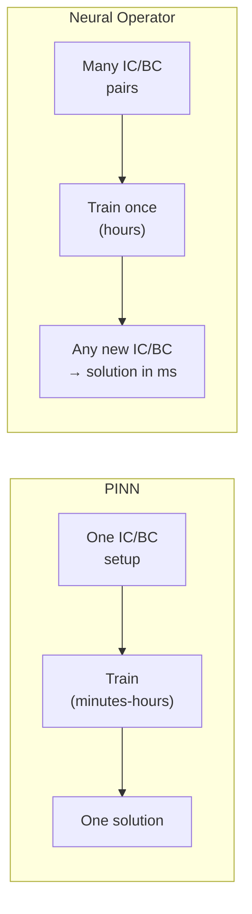
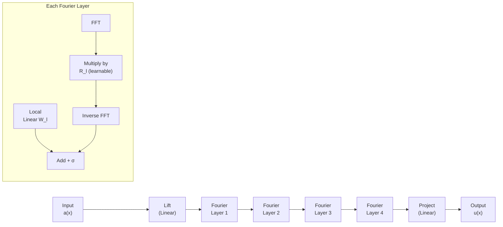

# Solving PDEs with Deep Learning

## Overview

While PINNs embed PDEs into loss functions, a more recent and powerful paradigm learns to solve entire **families** of PDEs at once. Neural operators learn mappings between infinite-dimensional function spaces — for example, mapping an initial condition to the full solution field, or mapping a variable coefficient to the corresponding PDE solution. Once trained, a neural operator can solve a new instance of the PDE in a single forward pass, achieving speedups of 1000x or more over traditional solvers.

This lesson covers the key neural operator architectures — Fourier Neural Operators (FNO), DeepONet, and their variants — and compares them to PINNs and classical methods.

---

## From Point Predictions to Operator Learning

### The Limitation of PINNs

A PINN learns the solution $u(x,t)$ for **one specific** set of initial/boundary conditions. Change the conditions, and you must retrain. This is impractical for applications that require solving the same PDE thousands of times with different inputs (design optimization, uncertainty quantification, real-time control).

### Operator Learning

An operator $\mathcal{G}$ maps one function to another:

$$\mathcal{G}: a(x) \mapsto u(x)$$

For example, mapping the initial temperature distribution $a(x) = u(x, 0)$ to the solution at time $T$: $u(x, T)$. Neural operators learn $\mathcal{G}_\theta \approx \mathcal{G}$ from data pairs $\{(a_i, u_i)\}$.

**PINNs vs Neural Operators**



---

## Fourier Neural Operator (FNO)

### Key Insight

Physical systems often have structure in the frequency domain. The FNO performs learning in Fourier space, where global interactions become local (multiplication instead of convolution).

### Architecture

Each Fourier layer applies:

$$v_{l+1}(x) = \sigma\left(W_l v_l(x) + \mathcal{F}^{-1}\left(R_l \cdot \mathcal{F}(v_l)\right)(x)\right)$$

where:
- $\mathcal{F}$ is the Fast Fourier Transform
- $R_l$ is a learnable weight matrix in Fourier space (applied to the low-frequency modes)
- $W_l$ is a local linear transform
- $\sigma$ is a nonlinear activation

**FNO Architecture**



### Why FNO Works

- **Resolution invariance**: Trained at one resolution, tested at another. The Fourier representation is inherently grid-independent.
- **Global receptive field**: Each Fourier layer captures interactions across the entire domain — no need for deep stacks of local convolutions.
- **Speed**: FFT is $O(N \log N)$, and inference is a single forward pass.

---

## DeepONet

DeepONet (Lu et al., 2021) takes a different approach based on the universal approximation theorem for operators.

### Architecture

DeepONet has two sub-networks:

$$\mathcal{G}_\theta(a)(y) = \sum_{k=1}^{p} \underbrace{b_k(a(x_1), \ldots, a(x_m))}_{\text{Branch net}} \cdot \underbrace{t_k(y)}_{\text{Trunk net}}$$

- **Branch network**: Encodes the input function $a$ evaluated at fixed sensor points
- **Trunk network**: Encodes the output query location $y$
- The dot product combines them

This is flexible: the branch can be any architecture (MLP, CNN, transformer), and the trunk can evaluate at arbitrary output points.

---

## Code Example: FNO for Burgers' Equation

```python
import torch
import torch.nn as nn
import torch.fft

class SpectralConv1d(nn.Module):
    """1D Fourier layer: multiply low-frequency modes by learnable weights."""
    def __init__(self, in_channels, out_channels, modes):
        super().__init__()
        self.modes = modes
        scale = 1 / (in_channels * out_channels)
        self.weights = nn.Parameter(
            scale * torch.randn(in_channels, out_channels, modes, dtype=torch.cfloat)
        )

    def forward(self, x):
        # x shape: [batch, channels, spatial]
        x_ft = torch.fft.rfft(x)
        # Multiply low-frequency modes
        out_ft = torch.zeros_like(x_ft)
        out_ft[:, :, :self.modes] = torch.einsum(
            "bix,iox->box", x_ft[:, :, :self.modes], self.weights
        )
        return torch.fft.irfft(out_ft, n=x.size(-1))

class FNO1d(nn.Module):
    def __init__(self, modes=16, width=64):
        super().__init__()
        self.lift = nn.Linear(1, width)
        self.spectral_convs = nn.ModuleList([
            SpectralConv1d(width, width, modes) for _ in range(4)
        ])
        self.local_convs = nn.ModuleList([
            nn.Conv1d(width, width, 1) for _ in range(4)
        ])
        self.project = nn.Sequential(
            nn.Linear(width, 128), nn.GELU(), nn.Linear(128, 1)
        )

    def forward(self, x):
        # x: [batch, spatial, 1] -> input function values
        x = self.lift(x)           # [batch, spatial, width]
        x = x.permute(0, 2, 1)    # [batch, width, spatial]
        for spec, local in zip(self.spectral_convs, self.local_convs):
            x = torch.nn.functional.gelu(spec(x) + local(x))
        x = x.permute(0, 2, 1)    # [batch, spatial, width]
        return self.project(x)    # [batch, spatial, 1]

# Usage:
# Train on pairs (initial_condition, solution_at_T)
# model = FNO1d()
# pred = model(initial_condition)  # single forward pass!
```

---

## Comparison of Approaches

| Method | Training Data | Inference Speed | Resolution Invariant | Best For |
|---|---|---|---|---|
| **Classical FEM/FDM** | None needed | Slow (minutes-hours) | N/A | Gold-standard accuracy |
| **PINN** | Optional sparse data | Slow (requires optimization) | No | Single-instance, inverse problems |
| **FNO** | Many input-output pairs | Very fast (ms) | Yes | Parametric studies, real-time |
| **DeepONet** | Many input-output pairs | Very fast (ms) | Partially | Flexible geometry, multi-physics |

---

## Recent Advances

- **U-NO (U-shaped Neural Operator)**: Adds skip connections for multi-scale features
- **GNOT (General Neural Operator Transformer)**: Transformer-based operator learning
- **Geometry-Aware FNO (Geo-FNO)**: Handles irregular domains by learning a mapping to a regular domain
- **DPOT (Data-driven Physics-informed Operator Transformer)**: Combines physics constraints with operator learning

---

## Exercises

1. **Implement**: Build the FNO1d model above. Generate training data by solving Burgers' equation $u_t + u u_x = \nu u_{xx}$ with a classical solver for 1000 random initial conditions. Train the FNO and compare inference time to the classical solver.
2. **Resolution Test**: Train the FNO on a 64-point grid. Test on a 256-point grid. Does it generalize?
3. **Compare**: For the same PDE, train both a PINN and an FNO. Which is faster to train? Which gives better accuracy for a single instance? Which is more useful if you need to solve 10,000 instances?

---

## Further Reading

- Li et al., "Fourier Neural Operator for Parametric PDEs" (ICLR 2021)
- Lu et al., "Learning nonlinear operators via DeepONet" (Nature Machine Intelligence, 2021)
- Kovachki et al., "Neural Operator: Learning Maps Between Function Spaces" (JMLR, 2023)
