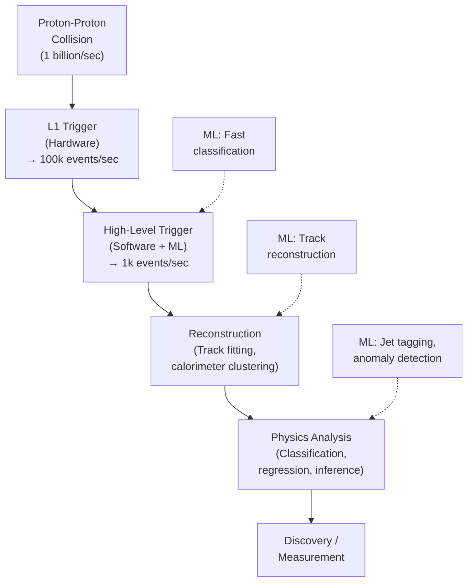
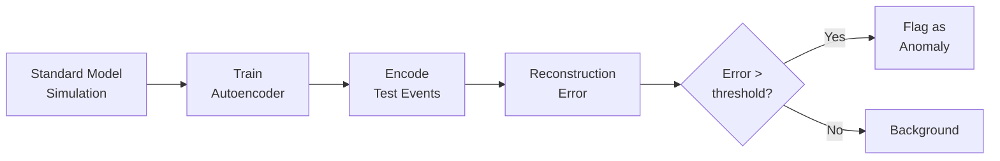

# AI for Particle Physics

## Overview

Particle physics is arguably where AI first proved its value in the physical sciences. The Large Hadron Collider (LHC) at CERN produces approximately 1 billion proton-proton collisions per second, each generating hundreds of particles that spray through massive detectors. Extracting physics from this firehose of data — identifying rare processes, classifying particle jets, searching for new physics beyond the Standard Model — is fundamentally a machine learning problem.

This lesson covers how AI is used across the particle physics pipeline: from real-time event triggering to jet classification, anomaly detection for new physics, and the emerging use of graph neural networks that respect the natural structure of collision events.

---

## The LHC Data Pipeline

**From Collision to Discovery**



At every stage, ML plays a critical role. Without it, the LHC simply could not operate — the data rate is too high for any manual or rule-based approach.

---

## Jet Tagging

### What is a Jet?

When quarks or gluons are produced in a collision, they cannot exist in isolation (confinement). Instead, they produce a spray of hadrons called a **jet**. Different parent particles produce jets with different internal structure:

- A **top quark** jet has a three-pronged substructure ($t \to Wb \to q\bar{q}b$)
- A **W/Z boson** jet has a two-pronged substructure
- A **QCD jet** (from a gluon or light quark) has no distinctive substructure

Jet tagging is the task of classifying which particle produced a given jet. This is critical for searches like $H \to b\bar{b}$ (Higgs decaying to bottom quarks).

### ML Approaches

**Evolution of jet tagging:**

1. **Expert features** (2010s): Hand-crafted variables like jet mass, $N$-subjettiness ($\tau_N$), energy correlation functions. Fed into BDTs (boosted decision trees).
2. **Jet images** (2015): Represent the jet as a 2D image in $(\eta, \phi)$ space and apply CNNs. Simple but loses information about individual particles.
3. **Particle clouds** (2019): Treat the jet as a set of particles and use Deep Sets or Particle Net (point-cloud networks). Permutation invariant.
4. **Graph networks** (2020+): Model particles as nodes, with edges connecting nearby particles. ParticleNet, LorentzNet, and other GNNs achieve state-of-the-art performance.

---

## Graph Neural Networks for Particle Physics

### Why Graphs?

Collision events have a natural graph structure: particles are nodes, and relationships (spatial proximity, shared vertex) are edges. Unlike images or sequences, graphs respect the irregular, variable-size nature of particle physics data.

### ParticleNet

ParticleNet applies Dynamic Graph CNN (DGCNN) to jet classification:

```python
import torch
import torch.nn as nn

class EdgeConv(nn.Module):
    """Edge convolution: aggregate features from k-nearest neighbors."""
    def __init__(self, in_feat, out_feat, k=16):
        super().__init__()
        self.k = k
        self.mlp = nn.Sequential(
            nn.Linear(2 * in_feat, out_feat),
            nn.BatchNorm1d(out_feat),
            nn.ReLU(),
            nn.Linear(out_feat, out_feat),
            nn.BatchNorm1d(out_feat),
            nn.ReLU()
        )

    def forward(self, x, coords):
        # x: [batch*N, features], coords: [batch*N, spatial_dims]
        # Find k-nearest neighbors in coordinate space
        # Apply MLP to (x_i, x_j - x_i) for each neighbor j of i
        # Aggregate by max-pooling over neighbors
        # (Simplified — full implementation uses kNN + gather)
        return self.mlp(x)  # placeholder

class ParticleNet(nn.Module):
    def __init__(self, input_dim=4, num_classes=5):
        super().__init__()
        self.edge_convs = nn.ModuleList([
            EdgeConv(input_dim, 64),
            EdgeConv(64, 128),
            EdgeConv(128, 256)
        ])
        self.classifier = nn.Sequential(
            nn.Linear(256, 128), nn.ReLU(), nn.Dropout(0.3),
            nn.Linear(128, num_classes)
        )

    def forward(self, particles, coords):
        x = particles
        for conv in self.edge_convs:
            x = conv(x, coords)
        x = x.mean(dim=0)  # global average pooling
        return self.classifier(x)
```

Each particle is represented by its 4-momentum $(p_T, \eta, \phi, E)$ and optional additional features (charge, particle ID).

---

## Anomaly Detection for New Physics

### The Problem

Most LHC searches are **model-dependent**: you hypothesize a new particle (e.g., a $Z'$ boson at 3 TeV), simulate what it would look like, and search for that specific signature. But what if new physics looks nothing like what we predicted?

### Model-Independent Searches

Anomaly detection methods search for **any** deviation from the Standard Model prediction without specifying what the new physics looks like:

- **Autoencoders**: Train on Standard Model (background) events. New physics events reconstruct poorly → high reconstruction error flags anomalies.
- **CURTAINS / CATHODE**: Use conditional density estimation to learn the background in a signal-free control region, then compare to the signal region.
- **CWoLa (Classification Without Labels)**: Train a classifier to distinguish events in a signal region from a sideband. If new physics is present, the classifier learns to identify it without ever being told what it looks like.

**Anomaly Detection Pipeline**



---

## Key Concepts

- **Trigger System**: Hardware and software pipeline that decides in real-time which collisions to record. ML models must run in microseconds on FPGAs.
- **Jet Substructure**: The internal energy and angular pattern within a jet, revealing the identity of the parent particle.
- **Lorentz Equivariance**: The physics doesn't change under Lorentz boosts and rotations. Networks like LorentzNet build this symmetry into the architecture.
- **Systematic Uncertainties**: In particle physics, ML models must be robust to detector effects, pile-up (multiple simultaneous collisions), and theoretical uncertainties in the simulation.
- **Simulation-Based Inference**: Using ML to perform likelihood-free inference — extracting fundamental parameters (masses, couplings) directly from simulated and observed data.

---

## Exercises

1. **Concept**: Why is it important that jet taggers be permutation-invariant with respect to the constituent particles? What would go wrong if they weren't?
2. **Explore**: The CMS and ATLAS experiments at CERN publish open data. Download a jet dataset from the [CERN Open Data Portal](https://opendata.cern.ch/) or use the Top Quark Tagging Reference Dataset. Train a simple MLP classifier on jet-level features.
3. **Think**: Anomaly detection in particle physics has a unique challenge: the "anomaly" might be one event in a million. How does this extreme class imbalance affect the choice of ML method?

---

## Further Reading

- Guest, Cranmer, Whiteson, "Deep Learning and its Application to LHC Physics" (Annual Review of Nuclear and Particle Science, 2018)
- Qu & Gouskos, "Jet Tagging via Particle Clouds" (Physical Review D, 2020)
- Kasieczka et al., "The LHC Olympics 2020: A Community Challenge for Anomaly Detection" (Reports on Progress in Physics, 2021)
