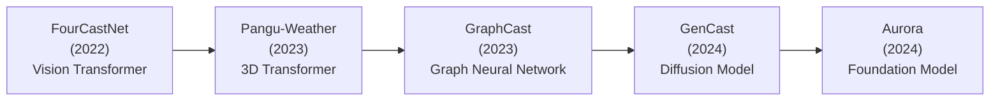

# AI for Climate Modeling

## Overview

Weather prediction and climate modeling are among the most computationally demanding problems in all of science. Traditional Numerical Weather Prediction (NWP) models solve the primitive equations of atmospheric dynamics on massive grids, requiring supercomputers and hours of wall-clock time to produce a single 10-day forecast. In 2022–2023, a wave of AI weather models — GraphCast, Pangu-Weather, FourCastNet, GenCast — shattered this paradigm, matching or exceeding the accuracy of the best physics-based models while running **in seconds on a single GPU**.

This lesson covers the physics of weather and climate modeling, how AI models learn atmospheric dynamics from reanalysis data, and the open challenges in making AI trustworthy for operational forecasting and long-term climate projection.

---

## Traditional Numerical Weather Prediction

### The Primitive Equations

Weather is governed by the Navier-Stokes equations on a rotating sphere, coupled with thermodynamics and moisture physics. The key equations:

- **Momentum**: $\frac{D\mathbf{v}}{Dt} = -\frac{1}{\rho}\nabla p - 2\boldsymbol{\Omega} \times \mathbf{v} + \mathbf{g} + \mathbf{F}$
- **Continuity**: $\frac{\partial \rho}{\partial t} + \nabla \cdot (\rho \mathbf{v}) = 0$
- **Thermodynamic energy**: $\frac{DT}{Dt} = \frac{Q}{c_p} + \frac{RT}{c_p p}\frac{Dp}{Dt}$
- **Moisture**: $\frac{Dq}{Dt} = E - C$ (evaporation minus condensation)

NWP models discretize these on grids with ~10–25 km horizontal resolution and 50–137 vertical levels. The European Centre for Medium-Range Weather Forecasts (ECMWF) IFS model is the gold standard.

### The Cost

- ECMWF runs on a ~9 km grid with 137 vertical levels: ~1 billion grid points
- A 10-day forecast takes ~1 hour on thousands of CPU cores
- Ensemble forecasting (50+ runs with perturbed initial conditions) multiplies this cost

---

## AI Weather Models

### The Training Data

All major AI weather models train on **ERA5** — ECMWF's global atmospheric reanalysis dataset spanning 1940–present at 0.25° resolution (~30 km), with 37 pressure levels and hourly temporal resolution. ERA5 combines observations with a physics-based model to produce a self-consistent 4D picture of the atmosphere.

Training data: ~40 years of 6-hourly atmospheric states → the model learns to predict the next state from the current one.

### Key Models

**Timeline of AI Weather Breakthroughs**



### GraphCast (DeepMind, 2023)

GraphCast represents the atmosphere as a graph:

- **Grid nodes**: ~1 million points on an icosahedral mesh covering the globe
- **Mesh edges**: Connect nearby grid points at multiple resolutions
- **Message passing**: Information propagates through the graph in each layer

Architecture: Encoder (grid → mesh) → 16 message-passing layers → Decoder (mesh → grid)

$$\text{state}_{t+6h} = \text{GraphCast}(\text{state}_t, \text{state}_{t-6h})$$

Key result: GraphCast outperformed ECMWF's HRES model on 90% of 1,380 verification targets for 10-day forecasts, while running in **under 60 seconds on a single TPU**.

### GenCast (DeepMind, 2024)

GenCast uses a **diffusion model** to generate probabilistic forecasts — an ensemble of possible future weather states. This is crucial because weather is chaotic: small perturbations grow exponentially, so a single deterministic forecast is inherently limited.

---

## Code Example: Simplified Weather Prediction

```python
import torch
import torch.nn as nn

class SimpleWeatherModel(nn.Module):
    """
    Simplified autoregressive weather model.
    Input: atmospheric state at time t (temperature, wind, humidity on a grid)
    Output: atmospheric state at time t + Δt
    """
    def __init__(self, n_vars=5, n_levels=13, grid_h=64, grid_w=128):
        super().__init__()
        in_channels = n_vars * n_levels  # flatten variables × levels
        self.encoder = nn.Sequential(
            nn.Conv2d(in_channels, 256, 3, padding=1), nn.GELU(),
            nn.Conv2d(256, 256, 3, padding=1), nn.GELU(),
        )
        self.processor = nn.Sequential(
            *[nn.Sequential(
                nn.Conv2d(256, 256, 3, padding=1), nn.GELU(),
                nn.Conv2d(256, 256, 3, padding=1), nn.GELU(),
            ) for _ in range(4)]
        )
        self.decoder = nn.Conv2d(256, in_channels, 1)

    def forward(self, x):
        # x: [batch, n_vars*n_levels, H, W]
        h = self.encoder(x)
        h = self.processor(h) + h  # residual
        delta = self.decoder(h)
        return x + delta  # predict the change, add to current state

# Autoregressive rollout
def rollout(model, initial_state, n_steps):
    states = [initial_state]
    state = initial_state
    for _ in range(n_steps):
        state = model(state)
        states.append(state)
    return torch.stack(states)
```

Real models use spherical harmonics or icosahedral meshes instead of rectangular grids to handle the sphere correctly.

---

## Weather vs Climate

| | Weather Prediction | Climate Projection |
|---|---|---|
| **Timescale** | Days to 2 weeks | Decades to centuries |
| **Question** | "Will it rain in Paris on Tuesday?" | "How much warmer will Paris be in 2080?" |
| **AI status** | AI matches/beats NWP | Active research, early results |
| **Challenge** | Chaos limits predictability | Must capture slow processes (ocean, ice) |

### AI for Climate

AI climate applications are earlier-stage but rapidly growing:

- **Emulators**: Train on output of expensive Earth System Models to explore parameter spaces quickly
- **Downscaling**: Super-resolution models that add fine spatial detail to coarse climate projections
- **Parameterization**: Replace expensive sub-grid physics (clouds, turbulence) with learned neural network parameterizations
- **Extreme event attribution**: ML models help determine whether a specific extreme weather event was made more likely by climate change

---

## Key Concepts

- **Autoregressive Rollout**: AI weather models predict one time step ahead, then feed the prediction back as input. Error accumulates over time — a key challenge.
- **Spectral Bias**: Neural networks tend to learn low-frequency patterns first and struggle with fine-scale features. This can cause AI weather models to produce overly smooth forecasts.
- **Reanalysis Data**: A blend of observations and model output that provides a physically consistent, gap-free record of the atmosphere. ERA5 is the most widely used.
- **Ensemble Forecasting**: Running multiple forecasts with slightly different initial conditions to estimate forecast uncertainty. GenCast does this natively via its diffusion model.

---

## Exercises

1. **Concept**: Why does autoregressive error accumulation limit AI weather models? How does ensemble forecasting (GenCast) help address this?
2. **Explore**: Compare the skill of GraphCast vs ECMWF HRES for 500 hPa geopotential height at day 1, 3, 5, and 10. The GraphCast paper has these curves — what happens after day 10?
3. **Think**: AI weather models are trained on ERA5 reanalysis (1940–present). Climate change means future weather statistics will differ from the training period. How might this affect AI weather model performance in 2050? What strategies could help?

---

## Further Reading

- Lam et al., "Learning skillful medium-range global weather forecasting" (Science, 2023) — GraphCast
- Bi et al., "Accurate medium-range global weather forecasting with 3D neural networks" (Nature, 2023) — Pangu-Weather
- Price et al., "GenCast: Diffusion-based ensemble forecasting for medium-range weather" (Nature, 2024)
- Schneider et al., "Harnessing AI and computing to advance climate modelling and prediction" (Nature Climate Change, 2023)
