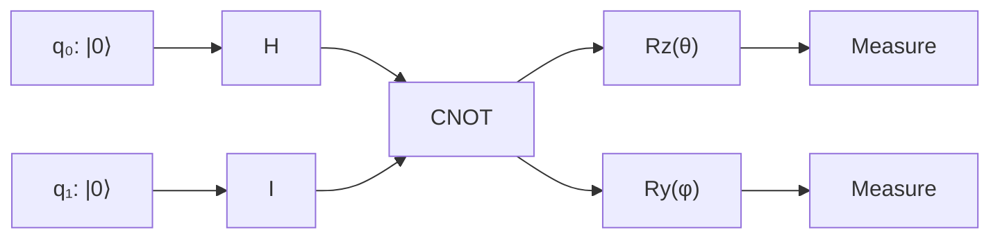
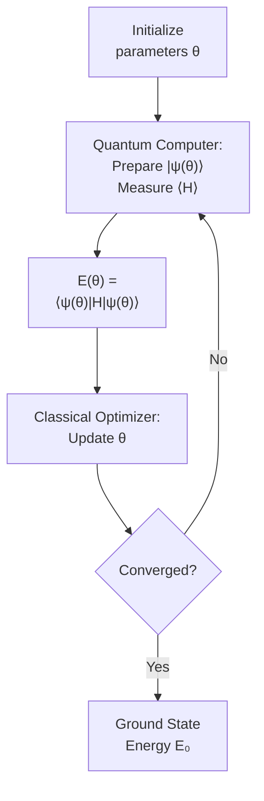

# Quantum Machine Learning

## Overview

Quantum computing and machine learning are two of the most transformative technologies of the 21st century. Quantum Machine Learning (QML) sits at their intersection, asking two complementary questions: Can quantum computers make machine learning better? And can machine learning help solve quantum physics problems?

Quantum computers exploit superposition, entanglement, and interference to process information in ways that classical computers cannot efficiently replicate. For certain physics problems — simulating quantum systems, sampling from complex distributions, optimizing over exponentially large spaces — quantum computers may offer an inherent advantage. This lesson introduces quantum computing fundamentals, variational quantum algorithms, quantum neural networks, and the current reality of quantum advantage.

---

## Quantum Computing Fundamentals

### Qubits and Superposition

A classical bit is 0 or 1. A **qubit** can be in a superposition:

$$|\psi\rangle = \alpha|0\rangle + \beta|1\rangle, \quad |\alpha|^2 + |\beta|^2 = 1$$

where $\alpha, \beta \in \mathbb{C}$. With $n$ qubits, you can represent $2^n$ amplitudes simultaneously.

### Key Quantum Operations

- **Quantum gates**: Unitary operations that transform qubit states. Analogous to logic gates but reversible.
  - Hadamard ($H$): Creates superposition, $H|0\rangle = \frac{|0\rangle + |1\rangle}{\sqrt{2}}$
  - CNOT: Entangles two qubits
  - Rotation gates ($R_x, R_y, R_z$): Parameterized rotations — the building blocks of variational circuits
- **Measurement**: Collapses the superposition. You get outcome $|0\rangle$ with probability $|\alpha|^2$ and $|1\rangle$ with probability $|\beta|^2$.
- **Entanglement**: Correlated quantum states that cannot be described independently. Einstein's "spooky action at a distance."

**Quantum Circuit Schematic**



---

## Variational Quantum Eigensolver (VQE)

### The Problem

Finding the ground state energy of a quantum system is exponentially hard on a classical computer for large systems. The Hamiltonian $\hat{H}$ may act on a Hilbert space of dimension $2^n$.

### The VQE Approach

VQE is a **hybrid quantum-classical** algorithm:

1. Prepare a parameterized quantum state $|\psi(\theta)\rangle$ on the quantum computer (an "ansatz")
2. Measure the expectation value $\langle\psi(\theta)|\hat{H}|\psi(\theta)\rangle$ on the quantum computer
3. Use a classical optimizer to update $\theta$ to minimize the energy
4. Repeat until convergence

By the variational principle: $E(\theta) = \langle\psi(\theta)|\hat{H}|\psi(\theta)\rangle \geq E_0$ (the true ground state energy).

**VQE Hybrid Loop**



---

## Quantum Neural Networks (QNNs)

### Parameterized Quantum Circuits

A QNN is essentially a parameterized quantum circuit used as a trainable model:

$$f(\mathbf{x}; \theta) = \langle 0|U^\dagger(\mathbf{x}, \theta) \hat{O} \, U(\mathbf{x}, \theta)|0\rangle$$

where:
- $U(\mathbf{x}, \theta)$ is a unitary built from parameterized gates
- $\mathbf{x}$ is the input data (encoded into rotation angles)
- $\hat{O}$ is a measurement observable
- $\theta$ are the trainable parameters

### Data Encoding

Classical data must be encoded into quantum states. Common methods:

- **Angle encoding**: Map features to rotation angles: $R_y(x_i)|0\rangle$
- **Amplitude encoding**: Encode data into the amplitudes of a quantum state (exponentially compact but hard to prepare)
- **IQP encoding**: Interleaved layers of data-dependent and entangling gates

---

## Code Example: VQE with Pennylane

```python
import pennylane as qml
from pennylane import numpy as np

# Define a 2-qubit device
dev = qml.device("default.qubit", wires=2)

# Define the H₂ Hamiltonian (simplified)
coeffs = [0.2252, 0.3435, -0.4347, 0.5716, 0.0910]
obs = [
    qml.Identity(0),
    qml.PauliZ(0),
    qml.PauliZ(1),
    qml.PauliZ(0) @ qml.PauliZ(1),
    qml.PauliX(0) @ qml.PauliX(1),
]
H = qml.Hamiltonian(coeffs, obs)

# Variational ansatz
@qml.qnode(dev)
def circuit(params):
    qml.RY(params[0], wires=0)
    qml.RY(params[1], wires=1)
    qml.CNOT(wires=[0, 1])
    qml.RY(params[2], wires=0)
    qml.RY(params[3], wires=1)
    return qml.expval(H)

# Classical optimization loop
params = np.random.uniform(0, 2 * np.pi, 4, requires_grad=True)
opt = qml.GradientDescentOptimizer(stepsize=0.4)

for step in range(100):
    params = opt.step(circuit, params)
    if step % 20 == 0:
        energy = circuit(params)
        print(f"Step {step}: Energy = {energy:.6f} Ha")

print(f"VQE ground state energy: {circuit(params):.6f} Ha")
# Exact ground state energy of H₂ ≈ -1.137 Ha
```

---

## Quantum Advantage: Hype vs Reality

### Where Quantum Might Help

- **Quantum simulation**: Simulating quantum systems (molecules, materials) is naturally suited to quantum computers. A 50-qubit molecule is intractable classically.
- **Combinatorial optimization**: QAOA (Quantum Approximate Optimization Algorithm) for NP-hard problems.
- **Sampling**: Quantum computers can efficiently sample from distributions that are classically hard (quantum supremacy demonstrations).

### Current Limitations

- **Noise**: Today's quantum computers are NISQ (Noisy Intermediate-Scale Quantum) — 50–1000 noisy qubits. Error rates of ~0.1–1% per gate.
- **Qubit count**: Useful quantum advantage for chemistry likely requires thousands of error-corrected logical qubits (millions of physical qubits).
- **Barren plateaus**: As the number of qubits grows, the gradient landscape of random parameterized circuits becomes exponentially flat — training becomes impossible.
- **Classical competition**: Classical methods keep improving. Tensor network methods, for instance, can simulate many quantum circuits efficiently.

---

## Key Concepts

- **NISQ**: Noisy Intermediate-Scale Quantum — the current era of quantum computing with limited, noisy qubits.
- **Variational Principle**: For any trial wavefunction, the expectation value of the Hamiltonian is an upper bound on the true ground state energy.
- **Barren Plateau**: A phenomenon where gradients vanish exponentially with system size in random quantum circuits, making optimization intractable.
- **Quantum Error Correction**: Encoding logical qubits into many physical qubits to protect against noise. Required for fault-tolerant quantum computing.

---

## Exercises

1. **Run**: Install PennyLane (`pip install pennylane`) and run the VQE example above. How close does it get to the exact H₂ ground state energy of -1.137 Ha?
2. **Explore**: Modify the ansatz to use more layers (deeper circuit). Does this improve accuracy? At what depth do you observe diminishing returns?
3. **Think**: Why is simulating quantum systems on a classical computer fundamentally hard? What makes quantum computers potentially better at this task?

---

## Further Reading

- Cerezo et al., "Variational quantum algorithms" (Nature Reviews Physics, 2021)
- Bharti et al., "Noisy intermediate-scale quantum algorithms" (Reviews of Modern Physics, 2022)
- Peruzzo et al., "A variational eigenvalue solver on a photonic quantum processor" (Nature Communications, 2014) — original VQE paper
