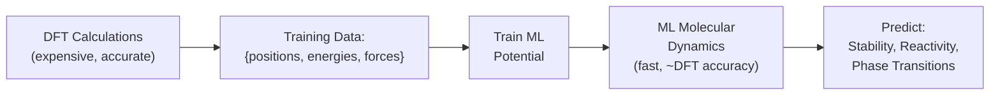

# AI for Computational Chemistry

## Overview

Computational chemistry sits at the intersection of physics, chemistry, and computer science. Its central challenge: predicting how atoms arrange themselves and interact — from the electronic structure of a single molecule to the binding of a drug to a protein. The underlying physics is quantum mechanics (the Schrödinger equation), but solving it exactly is exponentially hard. Classical approximations like Density Functional Theory (DFT) are powerful but computationally expensive — a single DFT calculation on a moderately sized molecule can take hours.

AI is transforming this field by learning to predict molecular properties, energies, and forces at a fraction of the computational cost, while maintaining near-DFT accuracy. This lesson covers the physics background, key ML architectures (GemNet, equivariant transformers, SchNet), and applications from molecular property prediction to drug discovery.

---

## The Physics: From Schrödinger to DFT

### The Many-Body Problem

The time-independent Schrödinger equation:

$$\hat{H}\Psi = E\Psi$$

For a molecule with $N$ electrons, $\Psi$ is a function of $3N$ spatial coordinates (plus spin). The cost of solving this scales as $O(e^N)$ for exact methods.

### Density Functional Theory (DFT)

DFT reformulates the problem in terms of the electron density $\rho(\mathbf{r})$ — a function of only 3 coordinates, regardless of the number of electrons. The Hohenberg-Kohn theorem guarantees that the ground state energy is a unique functional of $\rho$:

$$E[\rho] = T_s[\rho] + V_{ext}[\rho] + E_H[\rho] + E_{xc}[\rho]$$

The catch: the exchange-correlation functional $E_{xc}[\rho]$ is unknown and must be approximated. Different approximations (LDA, GGA, hybrid functionals like B3LYP) trade accuracy for cost.

**DFT scales as $O(N^3)$** — manageable for molecules up to ~1000 atoms, but still expensive for large-scale screening or molecular dynamics.

---

## ML Interatomic Potentials

### The Idea

Instead of running DFT for every configuration, **train a neural network to predict energies and forces** from atomic positions:

$$E = \text{NN}(\{Z_i, \mathbf{r}_i\}), \quad \mathbf{F}_i = -\frac{\partial E}{\partial \mathbf{r}_i}$$

where $Z_i$ is the atomic number and $\mathbf{r}_i$ is the position of atom $i$. Forces are obtained by differentiating the predicted energy — same autodiff trick as PINNs.

**ML Potential Pipeline**



Once trained, the ML potential runs molecular dynamics simulations **1000–10,000x faster** than DFT while retaining near-DFT accuracy.

---

## Key Architectures

### SchNet (2017)

SchNet introduced continuous-filter convolutional layers that operate on interatomic distances:

- Atoms are embedded based on atomic number
- Message passing uses radial basis functions of distances $d_{ij}$
- Naturally handles variable-size molecules

### DimeNet and GemNet (2020–2022)

These incorporate **angular information** — not just distances between atoms, but angles between bonds:

- DimeNet: Uses pairwise distances and triplet angles
- GemNet: Adds dihedral (four-body) angles for even higher accuracy
- State-of-the-art on OC20 (Open Catalyst) and other molecular benchmarks

### Equivariant Transformers

The latest generation of models use SE(3)-equivariant architectures that transform correctly under rotations and translations:

- **Equiformer**: Transformer with equivariant attention using spherical harmonics
- **MACE**: Message-passing with multi-body interactions and equivariant features
- **eSCN**: Equivariant Spherical Channel Network

$$\text{Equivariance}: \quad T_g[f(\mathbf{r})] = f(g \cdot \mathbf{r})$$

A rotation of the input produces a corresponding rotation of the output — the model doesn't need to learn rotational symmetry from data.

---

## Code Example: Simple Molecular Energy Prediction

```python
import torch
import torch.nn as nn

class SimpleSchNet(nn.Module):
    """Simplified SchNet-style model for molecular energy prediction."""
    def __init__(self, n_atoms_max=50, embed_dim=64, n_rbf=20, cutoff=5.0):
        super().__init__()
        self.cutoff = cutoff
        self.atom_embed = nn.Embedding(100, embed_dim)  # up to 100 elements

        # Radial basis functions for distance encoding
        self.rbf_centers = nn.Parameter(
            torch.linspace(0.1, cutoff, n_rbf), requires_grad=False
        )
        self.rbf_width = (cutoff - 0.1) / n_rbf

        # Interaction layers
        self.filter_net = nn.Sequential(
            nn.Linear(n_rbf, embed_dim), nn.SiLU(),
            nn.Linear(embed_dim, embed_dim)
        )
        self.interaction = nn.Sequential(
            nn.Linear(embed_dim, embed_dim), nn.SiLU(),
            nn.Linear(embed_dim, embed_dim)
        )
        self.output = nn.Sequential(
            nn.Linear(embed_dim, 64), nn.SiLU(),
            nn.Linear(64, 1)
        )

    def rbf(self, distances):
        """Expand distances in radial basis functions."""
        return torch.exp(
            -((distances.unsqueeze(-1) - self.rbf_centers) ** 2)
            / (2 * self.rbf_width ** 2)
        )

    def forward(self, atomic_numbers, positions):
        # atomic_numbers: [batch, n_atoms]
        # positions: [batch, n_atoms, 3]
        h = self.atom_embed(atomic_numbers)  # [batch, n_atoms, embed_dim]

        # Compute pairwise distances
        diff = positions.unsqueeze(2) - positions.unsqueeze(1)
        dist = torch.norm(diff, dim=-1)  # [batch, n_atoms, n_atoms]

        # RBF expansion and filter
        rbf_feat = self.rbf(dist)  # [batch, n_atoms, n_atoms, n_rbf]
        filters = self.filter_net(rbf_feat)  # [batch, n_atoms, n_atoms, embed_dim]

        # Mask beyond cutoff
        mask = (dist < self.cutoff) & (dist > 0.01)
        filters = filters * mask.unsqueeze(-1)

        # Message passing
        messages = (filters * h.unsqueeze(1)).sum(dim=2)
        h = h + self.interaction(messages)

        # Sum over atoms to get molecular energy
        atom_energies = self.output(h).squeeze(-1)  # [batch, n_atoms]
        total_energy = atom_energies.sum(dim=1)      # [batch]
        return total_energy
```

---

## Applications

### Drug Discovery

ML potentials and property predictors accelerate drug discovery:

- **Virtual screening**: Predict binding affinity for millions of drug candidates in hours instead of months
- **ADMET prediction**: Absorption, Distribution, Metabolism, Excretion, Toxicity — critical for drug development
- **Generative models**: Design novel molecules with desired properties using diffusion models or reinforcement learning

### Materials Science

- **Open Catalyst Project (OC20)**: ML models predict catalytic activity for clean energy applications
- **GNoME (DeepMind, 2023)**: Discovered 2.2 million stable crystal structures using graph neural networks — more than all previously known stable crystals combined
- **Battery materials**: Predicting ion conductivity and stability for next-generation batteries

---

## Key Concepts

- **Equivariance**: A function $f$ is equivariant to a group $G$ if $f(g \cdot x) = g \cdot f(x)$. For molecular systems, SE(3)-equivariance (rotations + translations) is essential.
- **Interatomic Potential**: A function mapping atomic positions to energies (and forces by differentiation). ML potentials replace expensive quantum chemistry calculations.
- **Message Passing Neural Network (MPNN)**: Atoms send "messages" to neighbors, update their representations, and repeat. The standard paradigm for molecular GNNs.
- **Many-Body Interactions**: Two-body potentials (pairwise distances) are insufficient for many systems. GemNet and MACE capture three-body and higher-order interactions.

---

## Exercises

1. **Implement**: Run the SimpleSchNet code above on a toy dataset. Generate random "molecules" (atomic numbers and positions) with energies defined by a simple pair potential $E = \sum_{i<j} \frac{1}{r_{ij}^{12}} - \frac{1}{r_{ij}^6}$ (Lennard-Jones). Can the model learn this potential?
2. **Explore**: Look at the Open Catalyst Project leaderboard. Which architectures dominate? What metrics are used?
3. **Think**: Why is equivariance important rather than just data augmentation (training on rotated copies)? How much data would augmentation require to match equivariance?

---

## Further Reading

- Schütt et al., "SchNet: A continuous-filter convolutional neural network for modeling quantum interactions" (NeurIPS 2017)
- Gasteiger et al., "GemNet: Universal Directional Graph Neural Networks for Molecules" (NeurIPS 2021)
- Merchant et al., "Scaling deep learning for materials discovery" (Nature, 2023) — GNoME
- Chanussot et al., "Open Catalyst 2020 (OC20) Dataset and Community Challenges" (ACS Catalysis, 2021)
