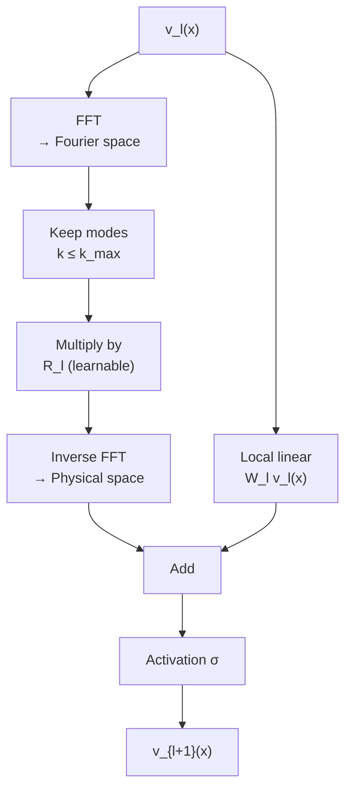
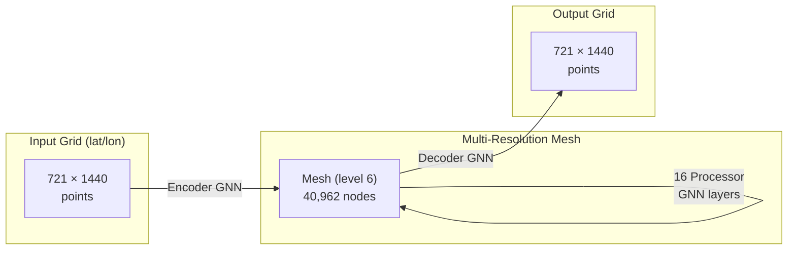

# Neural Operators and Operator Learning

## Overview

Classical neural networks learn mappings between finite-dimensional vectors: $f: \mathbb{R}^n \to \mathbb{R}^m$. But the natural objects in physics are **functions** — temperature fields, velocity profiles, wavefunctions — which live in infinite-dimensional spaces. Neural operators generalize neural networks to learn mappings between function spaces: $\mathcal{G}: \mathcal{A} \to \mathcal{U}$, where $\mathcal{A}$ and $\mathcal{U}$ are spaces of functions.

This lesson provides a rigorous treatment of operator learning theory, covers the major architectures (FNO, DeepONet, and their successors), examines how GraphCast and other physics foundation models build on these ideas, and discusses the theoretical foundations that explain why and when neural operators work.

---

## Mathematical Foundations

### Operators in Physics

An operator maps functions to functions. In PDE solving, the solution operator maps inputs (initial conditions, boundary conditions, forcing terms, coefficients) to the solution:

$$\mathcal{G}: a \in \mathcal{A}(\Omega; \mathbb{R}^{d_a}) \to u \in \mathcal{U}(\Omega; \mathbb{R}^{d_u})$$

For example, for Darcy flow: $-\nabla \cdot (a(x) \nabla u(x)) = f(x)$, the operator maps the permeability field $a(x)$ to the pressure field $u(x)$.

### Universal Approximation for Operators

The theoretical foundation comes from two key results:

1. **Chen & Chen (1995)**: A neural network with a branch net and a trunk net can approximate any nonlinear continuous operator to arbitrary accuracy. This is the basis for DeepONet.
2. **Kovachki et al. (2023)**: Neural operators with appropriate architecture are universal approximators in operator norms, not just pointwise.

The key difference from standard universal approximation: we need approximation in **operator norm**, meaning the error must be small uniformly over all input functions, not just at specific points.

---

## FNO: Deep Dive

### Fourier Layers in Detail

Recall the Fourier Neural Operator layer:

$$v_{l+1}(x) = \sigma\left(W_l v_l(x) + \mathcal{K}_l(v_l)(x)\right)$$

The kernel integral operator $\mathcal{K}_l$ is parameterized in Fourier space:

$$(\mathcal{K}_l v_l)(x) = \mathcal{F}^{-1}\left(R_l \cdot \mathcal{F}(v_l)\right)(x)$$

where $R_l \in \mathbb{C}^{d_{v} \times d_{v} \times k_{\max}}$ is a learnable tensor applied to the first $k_{\max}$ Fourier modes. High-frequency modes are truncated.

**FNO Fourier Layer Detail**



### Resolution Invariance

Because the Fourier representation is continuous, an FNO trained at resolution $N$ can be evaluated at resolution $M \neq N$:
- The Fourier coefficients are the same
- Only the FFT/IFFT is recomputed on the new grid
- This is a major advantage over convolutional approaches

### Variants

| Variant | Key Innovation | Use Case |
|---|---|---|
| **FNO-2D/3D** | 2D/3D Fourier transforms | 2D/3D spatial domains |
| **U-FNO** | U-Net skip connections | Multi-scale problems |
| **Geo-FNO** | Learnable deformation to regular domain | Irregular geometries |
| **F-FNO** | Factorized Fourier layers for efficiency | High-dimensional problems |
| **SFNO** | Spherical Fourier transforms | Global weather/climate |

---

## DeepONet: Deep Dive

### Architecture Theory

DeepONet implements the Chen & Chen universal approximation theorem:

$$\mathcal{G}_\theta(a)(y) = \sum_{k=1}^{p} b_k\bigl(a(x_1), \ldots, a(x_m)\bigr) \cdot t_k(y) + b_0$$

- **Branch network** $b_k$: Takes the input function sampled at $m$ sensor locations. Can be MLP, CNN, or Transformer.
- **Trunk network** $t_k$: Takes the output query coordinate $y$. Provides a basis for the output space.
- **Dot product**: Combines the encoding of "which input function" with "where to evaluate."

### POD-DeepONet

An improved variant uses Proper Orthogonal Decomposition (POD) as the trunk basis:

1. Compute POD modes from training data: $u(x) \approx \sum_{k=1}^{p} c_k \phi_k(x)$
2. Use POD modes $\phi_k(x)$ as a fixed trunk network
3. Branch network predicts the coefficients $c_k$ from the input function

This converges faster because the basis is adapted to the problem.

---

## GraphCast as Operator Learning

GraphCast (DeepMind, 2023) can be viewed as a neural operator on the sphere:

### Graph Construction

The atmosphere is discretized on an icosahedral mesh:



### Why It's an Operator

GraphCast learns $\mathcal{G}: (\text{state}_t, \text{state}_{t-6h}) \mapsto \text{state}_{t+6h}$. This is an operator mapping atmospheric fields (functions on the sphere) to atmospheric fields. The graph structure provides:

- Multi-resolution representation (different edge lengths)
- Locality (nearby points interact more strongly)
- Spherical geometry (no pole singularities from lat/lon grids)

---

## Code Example: DeepONet

```python
import torch
import torch.nn as nn

class DeepONet(nn.Module):
    def __init__(self, branch_input_dim, trunk_input_dim, hidden_dim=128, basis_dim=64):
        super().__init__()
        # Branch: encodes the input function
        self.branch = nn.Sequential(
            nn.Linear(branch_input_dim, hidden_dim), nn.ReLU(),
            nn.Linear(hidden_dim, hidden_dim), nn.ReLU(),
            nn.Linear(hidden_dim, basis_dim)
        )
        # Trunk: encodes the output query location
        self.trunk = nn.Sequential(
            nn.Linear(trunk_input_dim, hidden_dim), nn.ReLU(),
            nn.Linear(hidden_dim, hidden_dim), nn.ReLU(),
            nn.Linear(hidden_dim, basis_dim)
        )
        self.bias = nn.Parameter(torch.zeros(1))

    def forward(self, branch_input, trunk_input):
        """
        branch_input: [batch, m] — input function at m sensor locations
        trunk_input: [batch, n_query, d] — query coordinates
        returns: [batch, n_query] — predicted output function values
        """
        b = self.branch(branch_input)         # [batch, basis_dim]
        t = self.trunk(trunk_input)            # [batch, n_query, basis_dim]
        # Dot product + bias
        out = torch.einsum("bp,bqp->bq", b, t) + self.bias
        return out

# Example: learn the antiderivative operator
# Input: f(x) sampled at m points
# Output: F(y) = ∫₀ʸ f(x)dx evaluated at query points y
m_sensors = 100
model = DeepONet(branch_input_dim=m_sensors, trunk_input_dim=1)

# Training loop (pseudocode)
# for f_samples, y_query, F_true in dataloader:
#     F_pred = model(f_samples, y_query)
#     loss = mse(F_pred, F_true)
#     loss.backward(); optimizer.step()
```

---

## Theoretical Considerations

### Approximation Error Bounds

For Lipschitz continuous operators, the FNO approximation error satisfies:

$$\|\mathcal{G} - \mathcal{G}_\theta\|_{L^2} \leq C \left(\frac{1}{k_{\max}^s} + \frac{1}{\sqrt{N}}\right)$$

where $k_{\max}$ is the number of Fourier modes, $N$ is the number of training samples, and $s$ depends on the regularity of the operator.

### When Neural Operators Fail

- **Discontinuities**: FNOs struggle with shocks and discontinuities (Gibbs phenomenon in Fourier space)
- **Long-range temporal dependencies**: Autoregressive rollout accumulates errors
- **Out-of-distribution inputs**: Neural operators, like all ML models, don't extrapolate well to input functions very different from training data
- **High-frequency content**: Truncating Fourier modes limits the resolvable detail

---

## Key Concepts

- **Operator Norm**: $\|\mathcal{G}\| = \sup_{a \neq 0} \frac{\|\mathcal{G}(a)\|}{\|a\|}$ — measures the "size" of an operator. Universal approximation in operator norm is much stronger than pointwise approximation.
- **Discretization Invariance**: A truly mesh-independent model works at any resolution. FNO achieves this through Fourier parameterization; DeepONet through continuous trunk evaluation.
- **Transfer Learning**: Pre-train a neural operator on one family of PDEs, fine-tune on a related but different family. Foundation models for PDEs are an active research direction.
- **Infinite-Dimensional Learning Theory**: Generalization bounds for operators require new theory beyond classical VC dimension / Rademacher complexity, accounting for the function-space structure of inputs and outputs.

---

## Exercises

1. **Implement**: Build the DeepONet above and train it to learn the antiderivative operator: given $f(x)$ sampled at 100 points on $[0, 1]$, predict $F(y) = \int_0^y f(x) dx$. Generate training data using random Fourier series for $f$.
2. **Compare**: For a 1D Poisson equation $-u'' = f$, train both an FNO and a DeepONet. Compare accuracy, training time, and ability to generalize to unseen forcing functions.
3. **Theory**: Why does truncating high Fourier modes in FNO act as implicit regularization? How is this similar to spectral methods in numerical analysis?

---

## Further Reading

- Kovachki et al., "Neural Operator: Learning Maps Between Function Spaces With Applications to PDEs" (JMLR, 2023)
- Li et al., "Fourier Neural Operator for Parametric Partial Differential Equations" (ICLR 2021)
- Lu et al., "A comprehensive and fair comparison of two neural operators" (Nature Machine Intelligence, 2022)
- Lam et al., "Learning skillful medium-range global weather forecasting" (Science, 2023) — GraphCast
