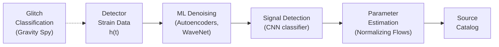
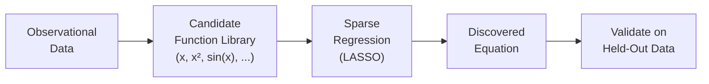
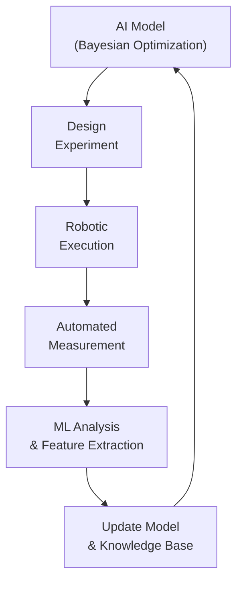

# Frontiers in AI for Fundamental Physics

## Overview

AI is not just accelerating known physics — it is beginning to help physicists discover new physics. From detecting gravitational waves buried in detector noise to searching for dark matter signatures, from discovering conservation laws in data to building autonomous laboratories that design and run their own experiments, AI is pushing the boundaries of what we can learn about the universe.

This final lesson surveys the most exciting frontiers where AI meets fundamental physics: gravitational wave astronomy, dark matter detection, causal discovery, symbolic regression for physics laws, and the emerging paradigm of self-driving laboratories.

---

## Gravitational Wave Detection

### The Signal in the Noise

Gravitational waves — ripples in spacetime predicted by Einstein in 1915 and first detected by LIGO in 2015 — are extraordinarily faint. A merging black hole binary billions of light-years away produces a strain (fractional length change) of order $h \sim 10^{-21}$. The detector must measure displacements smaller than $10^{-18}$ meters — a thousandth the diameter of a proton.

The raw detector data is dominated by noise: seismic vibrations, thermal fluctuations, laser shot noise, and transient "glitches." Extracting signals requires matched filtering against templates — but generating templates for all possible source parameters is expensive, and some signals (supernova collapses, cosmic string cusps) have no reliable templates.

### AI for Gravitational Waves

**Gravitational Wave Detection Pipeline**



Key applications:

- **Real-time detection**: CNNs that detect merger signals in milliseconds (vs minutes for matched filtering), enabling rapid electromagnetic follow-up
- **Glitch classification**: Gravity Spy uses citizen science + ML to classify detector artifacts into categories (scratchy, blip, koi fish, etc.)
- **Parameter estimation**: Normalizing flows (DINGO) produce posterior distributions over source parameters (masses, spins, distance) 1000x faster than traditional Bayesian MCMC
- **Unmodeled searches**: Autoencoders and anomaly detection for signals without templates (burst sources, unknown physics)

---

## Dark Matter Searches

### The Dark Matter Problem

Roughly 85% of the matter in the universe is **dark matter** — it interacts gravitationally but has never been directly detected in a laboratory. The leading candidates include WIMPs (Weakly Interacting Massive Particles), axions, and sterile neutrinos.

### ML Applications

- **Direct detection**: Experiments like XENON, LZ, and PandaX search for rare nuclear recoils. ML discriminates between signal (dark matter scattering) and background (radioactive decays, neutrons) based on scintillation pulse shape, position, and energy.
- **Indirect detection**: Searching for dark matter annihilation products in gamma-ray, neutrino, or cosmic-ray data. ML classifies sources and identifies unexpected excesses.
- **Strong gravitational lensing**: Dark matter substructure distorts lensed galaxy images. Neural networks can infer the dark matter subhalo mass function from lensing observations.

```python
# Simplified dark matter signal classifier
import torch
import torch.nn as nn

class PulseClassifier(nn.Module):
    """Classify scintillation pulses as signal (dark matter) or background."""
    def __init__(self, pulse_length=500):
        super().__init__()
        self.conv = nn.Sequential(
            nn.Conv1d(1, 32, 7, padding=3), nn.ReLU(), nn.MaxPool1d(2),
            nn.Conv1d(32, 64, 5, padding=2), nn.ReLU(), nn.MaxPool1d(2),
            nn.Conv1d(64, 128, 3, padding=1), nn.ReLU(),
            nn.AdaptiveAvgPool1d(1)
        )
        self.classifier = nn.Sequential(
            nn.Linear(128, 64), nn.ReLU(), nn.Dropout(0.3),
            nn.Linear(64, 2)  # signal vs background
        )

    def forward(self, pulse):
        # pulse: [batch, 1, time_steps]
        features = self.conv(pulse).squeeze(-1)
        return self.classifier(features)
```

---

## Symbolic Regression and Law Discovery

### Can AI Discover Physics Laws?

Traditional ML produces black-box predictions. **Symbolic regression** searches for compact mathematical expressions that fit the data — potentially discovering interpretable physical laws.

### AI Feynman (2020)

Udrescu and Tegmark's AI Feynman algorithm discovers physics equations from data by:

1. Checking for known symmetries (translational, rotational)
2. Trying separability: $f(x, y) = g(x) + h(y)$ or $f(x, y) = g(x) \cdot h(y)$
3. Fitting neural networks and inspecting the learned function
4. Brute-force symbolic search in the simplified sub-problems

It rediscovered all 100 equations from the Feynman Lectures, including:

$$F = \frac{Gm_1 m_2}{r^2}, \quad E = mc^2, \quad T = 2\pi\sqrt{\frac{l}{g}}$$

### SINDy (Sparse Identification of Nonlinear Dynamics)

SINDy discovers governing equations from time-series data:

$$\frac{d\mathbf{x}}{dt} = \Theta(\mathbf{x}) \boldsymbol{\xi}$$

where $\Theta(\mathbf{x})$ is a library of candidate terms (polynomials, trig functions, etc.) and $\boldsymbol{\xi}$ is a sparse coefficient vector found via LASSO regression. The sparsity constraint selects only the relevant terms.

**Symbolic Regression Pipeline**



---

## Causal Discovery in Physics

### Beyond Correlation

Standard ML finds correlations. Physics cares about **causation** — does changing variable $X$ actually cause a change in $Y$? Causal discovery algorithms infer causal graphs from observational data.

### Applications

- **Climate science**: Inferring causal relationships between atmospheric variables (does El Niño cause Indian monsoon changes, or vice versa?)
- **Particle physics**: Identifying causal structure in collision events
- **Cosmology**: Determining whether observed correlations in galaxy distributions reflect physical interactions or selection effects

Key methods:
- **Granger causality**: Time-series based — $X$ Granger-causes $Y$ if past values of $X$ help predict $Y$ beyond past values of $Y$ alone
- **PC algorithm**: Constraint-based causal structure learning from conditional independence tests
- **Neural causal discovery**: Use neural networks to parameterize structural equation models and learn the causal graph jointly

---

## Self-Driving Laboratories

### The Concept

A **self-driving laboratory** (SDL) combines AI with robotic experimentation to autonomously:

1. Propose hypotheses or experiments (Bayesian optimization, active learning)
2. Execute experiments (robotic synthesis, automated measurement)
3. Analyze results (ML-based data analysis)
4. Update the model and propose the next experiment
5. Repeat — closing the loop with no human in the loop

**Self-Driving Lab Loop**



### Examples

- **A-Lab (Berkeley, 2023)**: Autonomous materials synthesis lab that designed and synthesized 41 novel inorganic compounds in 17 days
- **Ada (University of Liverpool)**: Mobile robot chemist that autonomously optimized photocatalyst formulations
- **ARES (Helmholtz)**: Self-driving particle accelerator that tunes beam parameters using Bayesian optimization

---

## Foundation Models for Physics

### The Vision

Just as GPT and BERT transformed NLP, the physics community is pursuing **foundation models** trained on diverse physics data that can transfer across domains:

- **Polymathic AI**: A collaboration training foundation models on numerical simulations across astrophysics, fluid dynamics, and beyond
- **Multiple Physics Pretraining (MPP)**: Pre-train on diverse PDE solutions, fine-tune on specific applications
- **Aurora (Microsoft, 2024)**: Foundation model for Earth system forecasting, trained on diverse atmospheric and ocean data

The promise: a single pre-trained model that can be fine-tuned for weather prediction, turbulence modeling, molecular dynamics, or plasma physics with minimal domain-specific data.

---

## Key Concepts

- **Simulation-Based Inference (SBI)**: Using ML to perform Bayesian inference when the likelihood function is intractable but simulations are available. Neural posterior estimation, neural ratio estimation, and neural likelihood estimation.
- **Normalizing Flows**: Invertible neural networks that learn complex probability distributions by transforming a simple base distribution. Used for fast posterior sampling in gravitational wave parameter estimation.
- **Active Learning**: Selecting the most informative experiments/simulations to run next, minimizing the total amount of data needed. Critical for self-driving labs.
- **Equivariant Symbolic Regression**: Combining symmetry constraints with symbolic search to discover equations that respect known physics symmetries.

---

## Exercises

1. **Symbolic Regression**: Use the PySR library (`pip install pysr`) to rediscover a physics law. Generate data from $F = G\frac{m_1 m_2}{r^2}$ with noise. Can PySR recover the equation?
2. **Explore**: Read about one self-driving laboratory (A-Lab, Ada, or ARES). What was the key ML component? What was the bottleneck?
3. **Think**: Foundation models for physics face a unique challenge: physics spans many orders of magnitude in scale (subatomic to cosmological). How should training data be balanced across scales? What inductive biases should the architecture encode?

---

## Further Reading

- Cranmer et al., "Discovering Symbolic Models from Deep Learning with Inductive Biases" (NeurIPS 2020) — symbolic regression with GNNs
- Dax et al., "Real-time gravitational wave science with neural posterior estimation" (Physical Review Letters, 2021) — DINGO
- Udrescu & Tegmark, "AI Feynman: A physics-inspired method for symbolic regression" (Science Advances, 2020)
- Szymanski et al., "An autonomous laboratory for the accelerated synthesis of novel materials" (Nature, 2023) — A-Lab
- McCabe et al., "Multiple Physics Pretraining for Physical Surrogate Models" (NeurIPS 2023)
