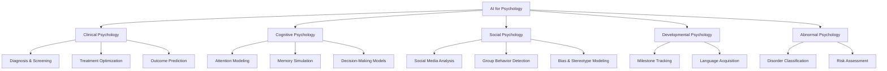
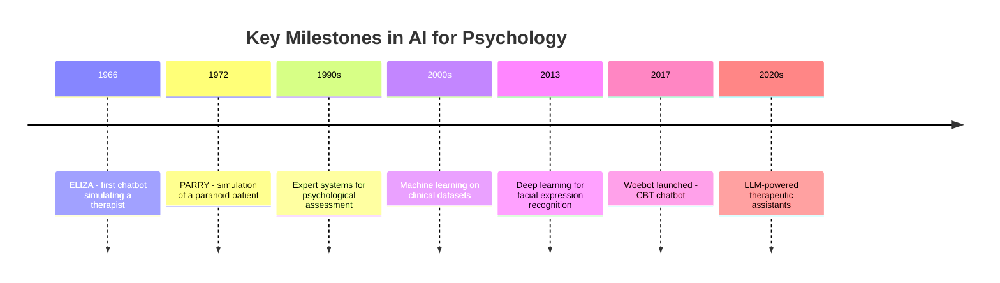

# Introduction to AI for Psychology

## Overview

The relationship between artificial intelligence and psychology is one of the oldest in computing. In 1966, Joseph Weizenbaum at MIT created **ELIZA**, a simple pattern-matching program that simulated a Rogerian psychotherapist. ELIZA had no understanding of language or emotion -- it used regular expressions to reflect users' statements back as questions. Yet many users attributed genuine empathy to it, a phenomenon Weizenbaum himself found disturbing. This early encounter between AI and the therapeutic setting foreshadowed decades of research, controversy, and innovation.

### From Expert Systems to Deep Learning

Through the 1970s and 1980s, expert systems like **MYCIN** (for medical diagnosis) inspired parallel efforts in psychological assessment. Rule-based systems were developed to administer and score standardized psychological tests, replacing pencil-and-paper workflows. The 1990s brought statistical machine learning to psychology: researchers applied logistic regression, decision trees, and early neural networks to predict clinical outcomes from patient records. Natural language processing (NLP) began to appear in the analysis of therapy transcripts and clinical notes.

The 2010s deep learning revolution transformed the field. Convolutional neural networks enabled automatic facial expression recognition from video. Recurrent networks and later transformer architectures allowed researchers to detect depression, anxiety, and suicidal ideation from social media posts and text messages with accuracy rivaling trained clinicians. Wearable sensors opened a new stream of physiological data -- heart rate variability, electrodermal activity, sleep patterns -- that machine learning could fuse with behavioral signals for continuous mental health monitoring.

### The LLM Era and Ethical Complexity

Today, large language models (LLMs) like GPT-4 and Claude power conversational mental health tools such as Woebot and Wysa, serving millions of users who lack access to traditional therapy. Yet the field is fraught with ethical complexity. Psychology deals with vulnerable populations, stigmatized conditions, and deeply personal data. Questions of informed consent, algorithmic bias, therapeutic alliance, and the limits of AI empathy remain at the forefront.

### What This Track Covers

The scope of AI for psychology spans clinical psychology (diagnosis, treatment, outcome prediction), cognitive psychology (modeling attention, memory, decision-making), social psychology (analyzing group dynamics and online behavior), developmental psychology (tracking child development milestones), and abnormal psychology (detecting and classifying disorders). The core AI methods driving this work include NLP for text and speech analysis, computer vision for facial and behavioral coding, reinforcement learning for adaptive interventions, and deep generative models for synthetic data and simulation.

## Key Concepts

**ELIZA effect**

The tendency for humans to attribute understanding and empathy to computer programs that produce human-like responses, even when the program has no actual comprehension. Named after Weizenbaum's 1966 chatbot, this effect has been observed repeatedly — from early rule-based systems to modern LLMs — and carries significant implications for therapeutic contexts where users may form parasocial bonds with AI systems.

**Computational psychiatry**

A subfield that uses mathematical and computational models to understand, predict, and treat psychiatric disorders, bridging neuroscience, psychology, and AI. Computational psychiatry applies reinforcement learning models, Bayesian inference, and neural network simulations to formalize theories of mental illness at multiple levels — from neurotransmitter dynamics to behavioral symptoms.

**Digital phenotyping**

The moment-by-moment quantification of individual-level human behavior using data from smartphones and wearable devices, including GPS, accelerometer, typing patterns, and call/text logs. Unlike traditional clinical assessments conducted in artificial office settings, digital phenotyping captures real-world behavior continuously and passively, potentially revealing early warning signs of relapse or deterioration.

**Ecological momentary assessment (EMA)**

A method of collecting real-time self-report data from participants in their natural environments, often via smartphone prompts. EMA reduces recall bias inherent in retrospective questionnaires — instead of asking "How anxious were you last month?", the system might ping the user at random intervals throughout the day for an immediate rating.

**Therapeutic alliance**

The collaborative relationship between therapist and client, considered one of the strongest predictors of therapy outcome across modalities. When AI systems enter the therapeutic space, the question of whether a machine can form a genuine therapeutic alliance — and whether it even needs to — becomes central to evaluating clinical effectiveness and ethical deployment.

**Reinforcement learning in clinical settings**

A machine learning paradigm where an agent learns to make sequential decisions by maximizing cumulative reward. In psychology, RL is applied to just-in-time adaptive interventions (JITAIs) — systems that learn when and how to deliver therapeutic micro-interventions (mindfulness prompts, behavioral activation suggestions) based on the user's current context, optimizing for long-term clinical improvement.

## Technical Details

### Data Landscape in Psychology

Understanding how AI enters psychology begins with recognizing the discipline's data landscape. Psychological research traditionally relies on self-report questionnaires, clinician ratings, behavioral experiments, and neuroimaging. Each of these generates structured or semi-structured data that machine learning can process.

### Supervised Classification

The simplest entry point is **supervised classification**. Given a dataset of labeled examples (e.g., patients diagnosed with major depressive disorder vs. healthy controls), a classifier learns to distinguish groups from features. In clinical psychology, features might be linguistic markers extracted from interview transcripts, scores on standardized scales, or physiological measurements. A logistic regression model for binary classification computes the probability of a positive class as:

$$P(y=1 \mid \mathbf{x}) = \sigma(\mathbf{w}^\top \mathbf{x} + b) = \frac{1}{1 + e^{-(\mathbf{w}^\top \mathbf{x} + b)}}$$

where $\mathbf{x}$ is the feature vector, $\mathbf{w}$ is the learned weight vector, $b$ is the bias, and $\sigma$ is the sigmoid function.

### Deep Learning and Transformers

More sophisticated approaches use **deep learning**. A transformer-based model like BERT can process raw therapy transcripts and learn contextual representations that capture subtle linguistic cues associated with psychological states — hedging language, cognitive distortions, emotional vocabulary shifts. Fine-tuning a pretrained language model on clinical text requires far less labeled data than training from scratch, which is critical given the scarcity of annotated psychological datasets.

### Reinforcement Learning for Adaptive Interventions

**Reinforcement learning** enters psychology through adaptive interventions. A just-in-time adaptive intervention (JITAI) uses RL to decide when and how to deliver a therapeutic micro-intervention (e.g., a mindfulness prompt, a behavioral activation suggestion) based on the user's current context. The intervention policy is optimized over time to maximize a long-term outcome such as reduced PHQ-9 scores. This sequential decision-making framework naturally maps onto the RL formalism where states are user contexts, actions are intervention choices, and rewards reflect clinical improvement.

### Ethical and Regulatory Considerations

Ethical and regulatory considerations are not ancillary — they are central to the technical design. Any system processing mental health data must comply with **HIPAA** (in the United States) and **GDPR** (in Europe), which impose strict requirements on data storage, access controls, and consent. De-identification of clinical text is a preprocessing step that itself requires NLP (named entity recognition to detect and redact names, dates, and locations). Model fairness must be evaluated across demographic groups, as psychological AI tools trained predominantly on data from one population may perform poorly or harmfully when deployed to another.

## Code Examples

```python
"""
Sentiment analysis on mental health text using a pretrained transformer.
This example uses the Hugging Face transformers library to classify
the emotional tone of short text entries, simulating mood tracking.
"""
from transformers import pipeline

# Load a pretrained sentiment analysis pipeline
classifier = pipeline(
    "sentiment-analysis",
    model="distilbert-base-uncased-finetuned-sst-2-english"
)

# Simulated mood journal entries from a user
journal_entries = [
    "I had a great day at work and felt really productive.",
    "I couldn't get out of bed this morning. Everything feels pointless.",
    "Therapy session went well. I'm learning to challenge negative thoughts.",
    "I snapped at my partner again. I hate how irritable I've become.",
    "Went for a long walk in the park. The fresh air helped clear my mind.",
]

# Classify each entry
print("Mood Journal Sentiment Analysis")
print("=" * 50)
for entry in journal_entries:
    result = classifier(entry)[0]
    label = result["label"]
    score = result["score"]
    print(f"Entry: {entry[:60]}...")
    print(f"  Sentiment: {label} (confidence: {score:.3f})")
    print()

# Aggregate: track proportion of negative entries over time
labels = [classifier(e)[0]["label"] for e in journal_entries]
neg_ratio = labels.count("NEGATIVE") / len(labels)
print(f"Negative entry ratio: {neg_ratio:.0%}")
if neg_ratio > 0.5:
    print("Alert: Majority of recent entries are negative. Consider check-in.")
```

This example demonstrates a basic NLP pipeline for mood tracking. In a real clinical setting, the model would be fine-tuned on mental health corpora rather than movie reviews, and outputs would supplement -- never replace -- clinical judgment.

## Diagrams

**Taxonomy of AI for Psychology**



**Historical Timeline of AI in Psychology**



## Applications & Case Studies

- **Woebot** (Woebot Health): An AI chatbot delivering cognitive-behavioral therapy (CBT) techniques via text-based conversation. A randomized controlled trial published in the *Journal of Medical Internet Research* (Fitzpatrick et al., 2017) showed significant reduction in depression symptoms (PHQ-9) over two weeks compared to a control group receiving an information-only e-book.
- **Wysa** (Touchkin eServices): A conversational AI app combining CBT, dialectical behavior therapy (DBT), and mindfulness techniques. Wysa has been evaluated in multiple peer-reviewed studies and received FDA Breakthrough Device designation in 2023 for its clinical-grade version targeting chronic pain and associated mental health conditions.
- **Crisis Text Line**: Uses NLP models to triage incoming text messages from individuals in crisis, predicting severity and routing high-risk conversations to trained counselors faster. Their system processes over 100 million messages and has been shown to reduce wait times for the most at-risk individuals.
- **LIWC (Linguistic Inquiry and Word Count)**: Developed by James Pennebaker at UT Austin, LIWC is a text analysis tool that counts words in psychologically meaningful categories (affect, cognition, social processes). While not itself an AI system, LIWC features are widely used as inputs to machine learning models for psychological research.

## Exercises

1. **ELIZA investigation**: Find a modern ELIZA implementation online (search for "ELIZA chatbot emulator") and have a conversation with it. Write a brief reflection: did you find yourself attributing understanding to the program? What specific linguistic patterns triggered the ELIZA effect?

2. **Digital phenotyping design**: Imagine you are designing a smartphone app to monitor depression symptoms. List three types of passive sensor data you would collect (e.g., GPS, accelerometer) and explain how each might correlate with depressive symptoms. What privacy concerns would you need to address?

3. **Classifier assessment**: Using the sentiment analysis code example above, modify the dataset to include three more journal entries of your own writing. Run the script and inspect the output. What false positives or negatives do you notice? Why might a model trained on movie reviews produce misleading results for clinical text?

## Further Reading

- Weizenbaum, J. (1966). "ELIZA -- A Computer Program for the Study of Natural Language Communication Between Man and Machine." *Communications of the ACM*, 9(1), 36-45.
- Fitzpatrick, K. K., Darcy, A., & Vierhile, M. (2017). "Delivering Cognitive Behavior Therapy to Young Adults with Symptoms of Depression via a Fully Automated Conversational Agent (Woebot)." *JMIR Mental Health*, 4(2), e19.
- Torous, J., et al. (2021). "Digital Mental Health and COVID-19: Using Technology Today to Accelerate the Curve on Access and Quality Tomorrow." *JMIR Mental Health*, 7(3), e18848.
- Huys, Q. J., Maia, T. V., & Frank, M. J. (2016). "Computational Psychiatry as a Bridge from Neuroscience to Clinical Applications." *Nature Neuroscience*, 19(3), 404-413.
