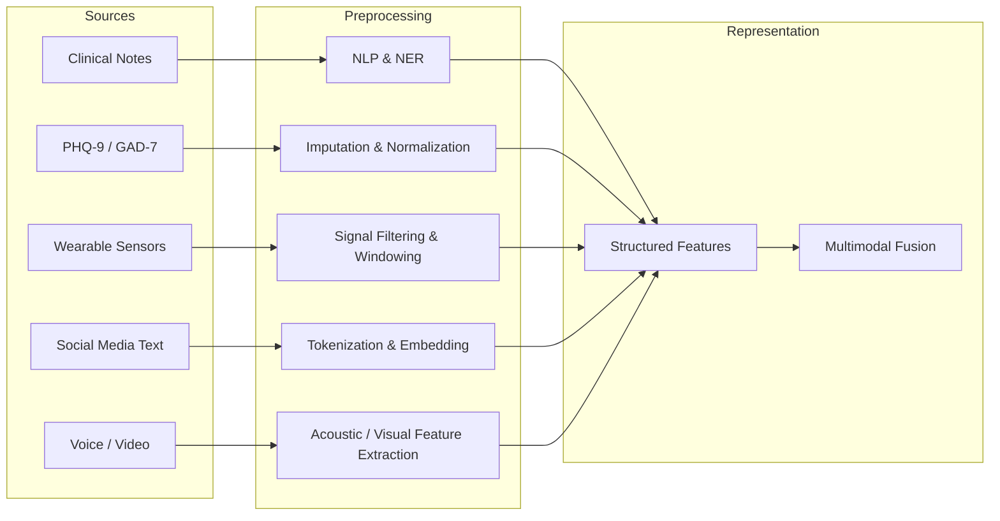
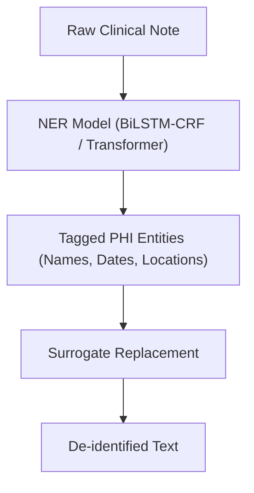

## Mental Health Data and Representations

## Overview

Before any AI model can reason about mental health, it must consume data that reflects psychological states. Unlike radiology, where a tumor is visible in a scan, mental health conditions manifest through subtle, distributed, and often subjective signals. Depression does not show up on a blood test -- it emerges in how a person speaks, sleeps, moves, and describes their inner world. This makes mental health data uniquely diverse, noisy, and sensitive.

The richest source of structured psychological data is **standardized clinical scales**. The Patient Health Questionnaire-9 (PHQ-9) scores depression severity on a 0-27 scale using nine items mapped to DSM-5 criteria. The Generalized Anxiety Disorder 7-item scale (GAD-7) similarly quantifies anxiety from 0 to 21. These instruments produce clean numerical features, but they are snapshots -- a single PHQ-9 score captures how a patient felt over the past two weeks, missing day-to-day fluctuations.

**Clinical notes** are the narrative records clinicians write during or after sessions. They contain rich contextual information -- patient history, observed affect, treatment plans, therapeutic formulations -- but in unstructured free text. Extracting structured information from clinical notes requires NLP techniques such as named entity recognition, negation detection, and relation extraction. A note reading "Patient denies suicidal ideation but reports persistent hopelessness" contains critical clinical distinctions that a naive keyword search would miss.

**Wearable and smartphone data** provide continuous, passive behavioral signals. Accelerometers capture physical activity and sleep-wake patterns. Heart rate variability (HRV), measured by photoplethysmography sensors in smartwatches, correlates with autonomic nervous system regulation and stress. Electrodermal activity (EDA) from wrist-worn sensors reflects sympathetic arousal. GPS traces reveal mobility patterns -- reduced home-leaving and social venue visits are associated with depressive episodes. Typing dynamics on smartphones (keystroke timing, error rates) have been linked to cognitive and emotional states.

**Text and social media data** offer windows into naturalistic language use. Reddit posts in mental health subreddits, Twitter disclosures, and text messages have been used to build predictive models for depression, anxiety, PTSD, and suicidal ideation. These data are abundant but raise serious ethical questions about consent, privacy, and the distinction between research and surveillance.

**Voice and facial expression data** capture paralinguistic and nonverbal cues. Acoustic features such as pitch variability, speech rate, pause duration, and vocal jitter correlate with mood disorders. Facial action coding (using the Facial Action Coding System, or FACS) quantifies muscle movements associated with emotional expressions, which computer vision models can now detect automatically from video.

## Key Concepts

- **PHQ-9 (Patient Health Questionnaire-9)**: A validated 9-item self-report measure of depression severity, with each item scored 0-3 and total scores categorized as minimal (0-4), mild (5-9), moderate (10-14), moderately severe (15-19), and severe (20-27).
- **GAD-7 (Generalized Anxiety Disorder 7-item scale)**: A brief validated measure for screening and assessing generalized anxiety disorder severity.
- **Digital phenotyping**: The use of passive smartphone and wearable sensor data to infer behavioral and psychological states without requiring active user input.
- **De-identification**: The process of removing or masking protected health information (PHI) from clinical text to comply with privacy regulations, typically using NLP-based named entity recognition.
- **HIPAA (Health Insurance Portability and Accountability Act)**: U.S. federal law that sets standards for protecting sensitive patient health information, directly governing how mental health AI systems store, transmit, and process data.
- **GDPR (General Data Protection Regulation)**: European Union regulation on data protection and privacy, requiring explicit consent, data minimization, and the right to erasure -- particularly relevant for mental health data collected from apps and wearables.
- **Multimodal fusion**: Combining features from multiple data sources (text, audio, video, physiological signals) into a unified representation for improved prediction accuracy.

## Technical Details

Building an AI pipeline for mental health data requires careful attention to preprocessing, representation, and privacy at every stage.

**Tabular clinical data** (scale scores, demographics, session counts) is the most straightforward to process. Standard preprocessing involves handling missing values -- common in clinical settings where patients skip questions or drop out -- via imputation methods such as mean imputation, $k$-nearest-neighbor imputation, or multiple imputation by chained equations (MICE). Feature normalization ensures that variables on different scales (e.g., age in years vs. PHQ-9 scores from 0-27) contribute proportionally to model training. For a feature $x$ with mean $\mu$ and standard deviation $\sigma$, z-score normalization computes:

$$z = \frac{x - \mu}{\sigma}$$

**Clinical text preprocessing** involves tokenization, lowercasing, and handling domain-specific vocabulary (drug names, diagnostic codes, abbreviations like "SI" for suicidal ideation). For transformer-based models, subword tokenization (e.g., byte-pair encoding) handles out-of-vocabulary terms naturally. A critical step is **negation detection** -- clinical notes frequently contain negated findings ("no suicidal ideation," "denies hallucinations"), and failing to account for negation can invert the meaning of extracted features. The NegEx algorithm and its successors identify negation cues and their scope in clinical text.

**Wearable sensor preprocessing** involves resampling signals to uniform time intervals, filtering noise (e.g., bandpass filtering for HRV extraction), and segmenting continuous streams into meaningful windows. Heart rate variability is typically computed from inter-beat intervals (IBIs) extracted from the photoplethysmography signal. Common HRV features include:

- **RMSSD** (root mean square of successive differences): $\text{RMSSD} = \sqrt{\frac{1}{N-1}\sum_{i=1}^{N-1}(IBI_{i+1} - IBI_i)^2}$, reflecting parasympathetic activity.
- **SDNN** (standard deviation of normal-to-normal intervals): a measure of overall HRV.

**De-identification** is a mandatory preprocessing step for any system handling protected health information. Modern de-identification systems use sequence labeling models (BiLSTM-CRF or transformer-based NER) trained on annotated clinical corpora like the i2b2/UTHealth de-identification dataset. The model tags tokens as names, dates, locations, phone numbers, or medical record numbers, which are then replaced with surrogate values. Performance is typically evaluated using recall (sensitivity), because missed PHI constitutes a privacy violation, while false positives merely reduce readability.

**Multimodal fusion** combines features from different modalities. Early fusion concatenates all feature vectors before feeding them to a model. Late fusion trains separate models per modality and combines predictions (e.g., via weighted averaging or a meta-classifier). Attention-based fusion uses cross-modal attention mechanisms to let the model learn which modalities are most informative for a given input.

## Code Examples

```python
"""
Preprocessing a mental health dataset: PHQ-9 scores with missing values,
z-score normalization, and severity classification.
"""
import numpy as np
import pandas as pd
from sklearn.impute import KNNImputer
from sklearn.preprocessing import StandardScaler

# Simulated dataset: 20 patients with PHQ-9 items (0-3 each) and age
np.random.seed(42)
n_patients = 20
data = {
    f"phq9_q{i}": np.random.randint(0, 4, n_patients).astype(float)
    for i in range(1, 10)
}
data["age"] = np.random.randint(18, 65, n_patients).astype(float)

# Introduce 10% missing values (common in clinical data)
df = pd.DataFrame(data)
mask = np.random.random(df.shape) < 0.10
df[mask] = np.nan
print("Missing values per column:")
print(df.isnull().sum())
print()

# Step 1: Impute missing values using k-nearest neighbors
imputer = KNNImputer(n_neighbors=5)
df_imputed = pd.DataFrame(imputer.fit_transform(df), columns=df.columns)

# Step 2: Compute total PHQ-9 score
phq9_cols = [f"phq9_q{i}" for i in range(1, 10)]
df_imputed["phq9_total"] = df_imputed[phq9_cols].sum(axis=1).round()

# Step 3: Classify severity
def classify_severity(score):
    if score <= 4:
        return "minimal"
    elif score <= 9:
        return "mild"
    elif score <= 14:
        return "moderate"
    elif score <= 19:
        return "moderately severe"
    else:
        return "severe"

df_imputed["severity"] = df_imputed["phq9_total"].apply(classify_severity)

# Step 4: Z-score normalize numeric features for ML input
scaler = StandardScaler()
feature_cols = phq9_cols + ["age"]
df_imputed[feature_cols] = scaler.fit_transform(df_imputed[feature_cols])

print("Severity distribution:")
print(df_imputed["severity"].value_counts())
print()
print("Normalized feature statistics (should be ~mean=0, std=1):")
print(df_imputed[feature_cols].describe().loc[["mean", "std"]].round(3))
```

This pipeline demonstrates a realistic workflow: handling missing clinical data via KNN imputation, computing a validated scale score, classifying severity per DSM-5 aligned cutoffs, and normalizing features for downstream machine learning.

## Diagrams

**Mental Health Data Pipeline**



**De-identification Process for Clinical Text**



## Applications & Case Studies

- **MITRE de-identification system**: The MITRE team developed a state-of-the-art clinical text de-identification system using a transformer-based NER model trained on the i2b2 2014 de-identification shared task dataset. Their system achieved over 97% recall for PHI detection across multiple entity types and has been adopted by several hospital systems for research data preparation.
- **StudentLife Study** (Dartmouth College): A landmark digital phenotyping study that collected continuous smartphone sensor data (GPS, accelerometer, phone usage, ambient audio) from 48 students over a 10-week term. Machine learning models trained on these passive signals predicted PHQ-9 depression scores, academic performance, and social isolation with significant accuracy, establishing digital phenotyping as a viable approach for mental health monitoring.
- **Kintsugi** (Kintsugi Mindful): A voice biomarker platform that analyzes 20 seconds of free speech to screen for depression and anxiety. The system extracts paralinguistic features (pitch, jitter, shimmer, pause patterns) and uses neural network classifiers. Kintsugi received FDA Breakthrough Device designation and has been integrated into telehealth platforms to augment standard screening workflows.
- **DAIC-WOZ Dataset** (USC Institute for Creative Technologies): The Distress Analysis Interview Corpus -- Wizard of Oz contains clinical interviews conducted by an animated virtual agent (Ellie). It includes synchronized audio, video, and text transcripts with PHQ-8 depression scores, serving as a benchmark dataset for multimodal depression detection research.

## Further Reading

- Kroenke, K., Spitzer, R. L., & Williams, J. B. (2001). "The PHQ-9: Validity of a Brief Depression Severity Measure." *Journal of General Internal Medicine*, 16(9), 606-613.
- Torous, J., Kiang, M. V., Lorme, J., & Onnela, J.-P. (2016). "New Tools for New Research in Psychiatry: A Scalable and Customizable Platform to Empower Data Driven Smartphone Research." *JMIR Mental Health*, 3(2), e16.
- Uzuner, O., Luo, Y., & Szolovits, P. (2007). "Evaluating the State-of-the-Art in Automatic De-identification." *Journal of the American Medical Informatics Association*, 14(5), 550-563.
- Gratch, J., et al. (2014). "The Distress Analysis Interview Corpus of Human and Computer Interviews." *Proceedings of LREC*, 3123-3128.
