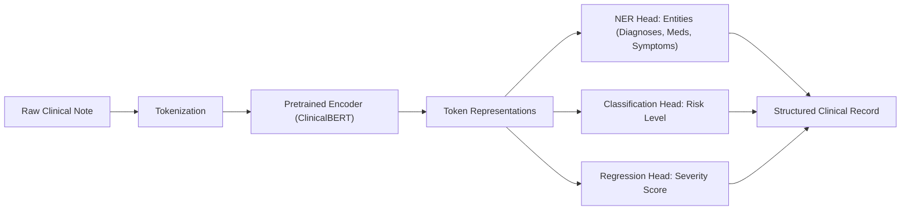
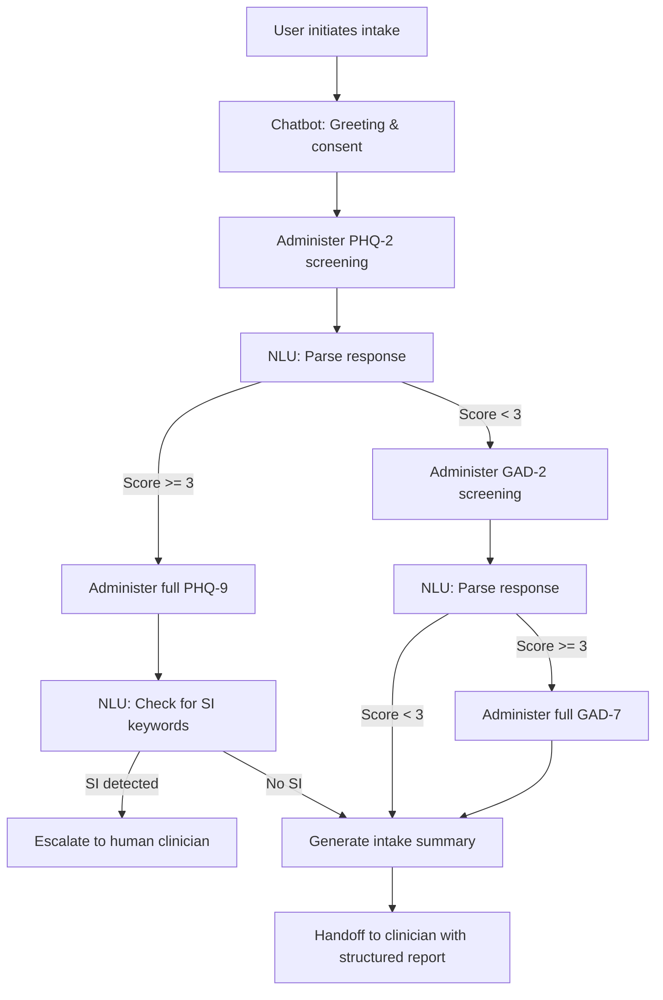

# NLP for Clinical Psychology

## Overview

Natural language processing is arguably the most impactful AI technology for clinical psychology. Language is the primary medium through which psychological distress is expressed, assessed, and treated. Patients describe their symptoms in words. Clinicians document observations in notes. Therapy itself is fundamentally a linguistic interaction. NLP provides the tools to analyze, quantify, and act on this vast stream of clinical language at scales that human review alone cannot achieve.

The earliest computational approaches to clinical text relied on **dictionary-based methods**. The Linguistic Inquiry and Word Count (LIWC) system, developed by James Pennebaker in the 1990s, categorizes words into psychologically meaningful dimensions -- affect (positive and negative emotion words), cognitive processes (cause, insight, certainty), social references (family, friends), and more. A patient whose language shows declining positive affect words and increasing first-person singular pronouns ("I," "me," "my") over successive therapy sessions may be exhibiting markers of worsening depression. LIWC remains widely used because its features are interpretable and grounded in decades of psychological research.

Modern NLP has moved beyond word counting to contextual language understanding. Transformer-based models like **BERT** (Bidirectional Encoder Representations from Transformers) and **GPT** (Generative Pre-trained Transformer) learn dense vector representations that capture meaning, context, and nuance. Fine-tuning BERT on clinical text enables tasks that were previously intractable: extracting medication mentions and their attributes from psychiatric notes, identifying references to self-harm in free text, and classifying therapy session segments by therapeutic technique.

Three major application areas define NLP for clinical psychology today. First, **clinical note processing** uses named entity recognition (NER) and relation extraction to structure unstructured narratives -- identifying diagnoses, medications, symptoms, and their relationships within clinician documentation. Second, **text-based mental health assessment** applies classification and regression models to patient-generated text (journal entries, social media posts, chat messages) to estimate symptom severity or detect risk. Third, **chatbot-based intake and intervention** systems use dialogue management and language generation to conduct structured assessments, deliver psychoeducation, and provide basic therapeutic exercises through conversational interfaces.

## Key Concepts

- **Named Entity Recognition (NER)**: The task of identifying and classifying named entities in text into predefined categories such as medications, diagnoses, symptoms, and procedures in clinical notes.
- **Relation extraction**: Identifying semantic relationships between entities in text, such as linking a medication entity to a diagnosis entity with a "treats" relation or linking a symptom to its negation status.
- **LIWC (Linguistic Inquiry and Word Count)**: A text analysis framework that counts words belonging to validated psychological categories, producing interpretable features like percentage of positive emotion words, cognitive mechanism words, and social reference words.
- **BERT (Bidirectional Encoder Representations from Transformers)**: A pretrained language model that generates contextual word embeddings by attending to both left and right context, widely fine-tuned for clinical NLP tasks.
- **Attention mechanism**: The core component of transformer models, computing relevance scores between all pairs of tokens in a sequence. For query $\mathbf{Q}$, key $\mathbf{K}$, and value $\mathbf{V}$ matrices, scaled dot-product attention is: $\text{Attention}(\mathbf{Q}, \mathbf{K}, \mathbf{V}) = \text{softmax}\left(\frac{\mathbf{Q}\mathbf{K}^\top}{\sqrt{d_k}}\right)\mathbf{V}$
- **Token classification**: A sequence labeling task where each token in the input receives a label (e.g., B-MEDICATION, I-MEDICATION, O), used for NER in clinical text.
- **Perplexity**: A measure of how well a language model predicts a sample of text, defined as $\text{PPL} = \exp\left(-\frac{1}{N}\sum_{i=1}^{N}\log P(w_i \mid w_{<i})\right)$. Lower perplexity indicates better model fit; it has been explored as a marker of linguistic coherence in psychosis research.

## Technical Details

The technical pipeline for clinical NLP in psychology involves several interconnected stages, each with domain-specific considerations that distinguish it from general NLP.

**Clinical Named Entity Recognition** is the foundation. In psychiatric notes, the entities of interest include diagnoses (major depressive disorder, generalized anxiety disorder, PTSD), medications (sertraline, fluoxetine, benzodiazepines), symptoms (anhedonia, insomnia, rumination), and risk factors (suicidal ideation, substance use, history of trauma). The standard approach uses a pretrained transformer encoder followed by a token classification head. Given an input sequence of tokens $\mathbf{x} = (x_1, x_2, \ldots, x_n)$, the model produces contextualized representations $\mathbf{h} = (h_1, h_2, \ldots, h_n)$ and a softmax classifier predicts BIO labels for each token:

$$P(y_i = k \mid \mathbf{h}_i) = \frac{\exp(\mathbf{W}_k \mathbf{h}_i + b_k)}{\sum_{j} \exp(\mathbf{W}_j \mathbf{h}_i + b_j)}$$

Domain-specific pretrained models significantly outperform general-purpose ones. **ClinicalBERT**, pretrained on MIMIC-III clinical notes, and **MentalBERT**, pretrained on Reddit mental health posts, capture vocabulary and distributional patterns specific to their respective domains.

**Sentiment and affect analysis for mood tracking** goes beyond simple positive/negative polarity. Clinical applications require dimensional models of affect, typically mapping text to valence (pleasant-unpleasant) and arousal (activated-deactivated) dimensions. The circumplex model of affect predicts that a text expressing "I feel numb and empty" would score low on both valence and arousal (depression quadrant), while "I can't stop worrying, my heart is racing" would score low on valence but high on arousal (anxiety quadrant). Regression models are trained to predict continuous valence-arousal scores from text features.

**Text-based mental health assessment** models learn to predict standardized scale scores from patient-generated text. A common architecture fine-tunes a BERT-based model to predict PHQ-9 severity categories from user text. The model tokenizes the input, passes it through the transformer encoder, extracts the [CLS] token representation, and feeds it through a classification head. Training uses cross-entropy loss over severity categories, and evaluation focuses on macro-averaged F1 score to ensure performance across all severity levels, not just the majority class.

**Chatbot-based intake systems** combine NLP understanding with dialogue management. A structured intake chatbot follows a clinical decision tree -- asking screening questions, interpreting responses using NLU (natural language understanding), and branching based on detected symptom categories. Modern implementations use LLMs with carefully designed system prompts that enforce clinical protocols, prevent the chatbot from offering diagnoses or treatment recommendations, and escalate to human clinicians when risk indicators are detected. Guardrails are implemented through output classifiers that flag responses violating clinical safety constraints before they reach the user.

## Code Examples

```python
"""
Fine-tuning a transformer model for mental health text classification.
This example uses Hugging Face to classify text into depression severity
categories based on linguistic content.
"""
import torch
from transformers import AutoTokenizer, AutoModelForSequenceClassification
from transformers import Trainer, TrainingArguments
from torch.utils.data import Dataset

# Define severity labels aligned with PHQ-9 categories
LABELS = ["minimal", "mild", "moderate", "severe"]
label2id = {label: i for i, label in enumerate(LABELS)}
id2label = {i: label for label, i in label2id.items()}

# Simulated training data (in practice, use clinician-annotated datasets)
train_texts = [
    "I feel fine today, had a productive day at work.",
    "A little tired lately but generally doing okay.",
    "I've been crying a lot and can't concentrate on anything.",
    "I don't want to be alive anymore. Nothing matters.",
    "Had a good weekend. Saw friends and felt happy.",
    "Sleep has been off but I'm managing day to day.",
    "I can't eat, can't sleep, can't think straight.",
    "I've been planning how to end things. I see no way out.",
]
train_labels = [0, 1, 2, 3, 0, 1, 2, 3]  # minimal, mild, moderate, severe

# Tokenize
model_name = "distilbert-base-uncased"
tokenizer = AutoTokenizer.from_pretrained(model_name)
encodings = tokenizer(train_texts, truncation=True, padding=True, max_length=128)

# Create Dataset
class MentalHealthDataset(Dataset):
    def __init__(self, encodings, labels):
        self.encodings = encodings
        self.labels = labels

    def __len__(self):
        return len(self.labels)

    def __getitem__(self, idx):
        item = {key: torch.tensor(val[idx]) for key, val in self.encodings.items()}
        item["labels"] = torch.tensor(self.labels[idx])
        return item

dataset = MentalHealthDataset(encodings, train_labels)

# Load model with classification head
model = AutoModelForSequenceClassification.from_pretrained(
    model_name,
    num_labels=len(LABELS),
    id2label=id2label,
    label2id=label2id,
)

# Training configuration
training_args = TrainingArguments(
    output_dir="./mental_health_classifier",
    num_train_epochs=5,
    per_device_train_batch_size=4,
    learning_rate=2e-5,
    weight_decay=0.01,
    logging_steps=1,
    save_strategy="no",
)

trainer = Trainer(
    model=model,
    args=training_args,
    train_dataset=dataset,
)

# Train (in practice, include validation set and early stopping)
trainer.train()

# Inference on new text
test_text = "I haven't left my apartment in two weeks. I just stare at the walls."
inputs = tokenizer(test_text, return_tensors="pt", truncation=True, max_length=128)
with torch.no_grad():
    outputs = model(**inputs)
    predicted_class = torch.argmax(outputs.logits, dim=-1).item()
print(f"Text: {test_text}")
print(f"Predicted severity: {id2label[predicted_class]}")
```

This example shows the complete workflow for training a mental health text classifier. In production, the training set would contain thousands of clinician-annotated examples, and evaluation would include cross-validation, fairness audits across demographic subgroups, and calibration analysis to ensure confidence scores are clinically meaningful.

## Diagrams

**Clinical NLP Pipeline for Psychiatric Notes**



**Chatbot-Based Clinical Intake Flow**



## Applications & Case Studies

- **ClinicalBERT** (Huang et al., 2019): A BERT model pretrained on MIMIC-III clinical notes from Beth Israel Deaconess Medical Center. ClinicalBERT outperforms general BERT on clinical NLP tasks including hospital readmission prediction, and its contextual embeddings capture clinical semantics that domain-agnostic models miss -- for example, correctly distinguishing "depression" as a psychiatric diagnosis versus cardiac output depression.
- **MentalBERT** (Ji et al., 2022): A pretrained language model specifically designed for mental health NLP, trained on a large corpus of Reddit posts from mental health subreddits (r/depression, r/anxiety, r/SuicideWatch, etc.). MentalBERT achieves state-of-the-art performance on multiple mental health detection benchmarks, outperforming both general BERT and BioClinicalBERT on tasks like depression detection and suicide risk assessment from social media text.
- **CLPsych Shared Tasks** (Computational Linguistics and Clinical Psychology Workshops, 2013-present): An annual NLP competition co-located with NAACL/ACL that has driven progress in text-based mental health detection. Tasks have included predicting depression and PTSD from Twitter data (2015), identifying self-harm on Reddit (2019), and detecting moments of change in counseling conversations (2022). The shared task format enables standardized evaluation across research groups.
- **Talkspace and NLP-augmented therapy**: The online therapy platform Talkspace has published research using NLP to analyze therapist-client text exchanges, identifying linguistic features associated with therapeutic alliance strength and treatment outcomes. Their models analyze word usage patterns, response latency, and conversational dynamics to provide therapists with insights about session effectiveness.

## Further Reading

- Pennebaker, J. W., Boyd, R. L., Jordan, K., & Blackburn, K. (2015). "The Development and Psychometric Properties of LIWC2015." UT Austin.
- Devlin, J., Chang, M.-W., Lee, K., & Toutanova, K. (2019). "BERT: Pre-training of Deep Bidirectional Transformers for Language Understanding." *Proceedings of NAACL-HLT*, 4171-4186.
- Huang, K., Altosaar, J., & Ranganath, R. (2019). "ClinicalBERT: Modeling Clinical Notes and Predicting Hospital Readmission." *arXiv:1904.05342*.
- Ji, S., et al. (2022). "MentalBERT: Publicly Available Pretrained Language Models for Mental Health." *Proceedings of LREC*, 7184-7190.
- Coppersmith, G., Dredze, M., & Harman, C. (2014). "Quantifying Mental Health Signals in Twitter." *Proceedings of the Workshop on Computational Linguistics and Clinical Psychology*, 51-60.
