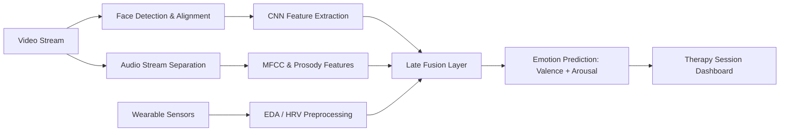
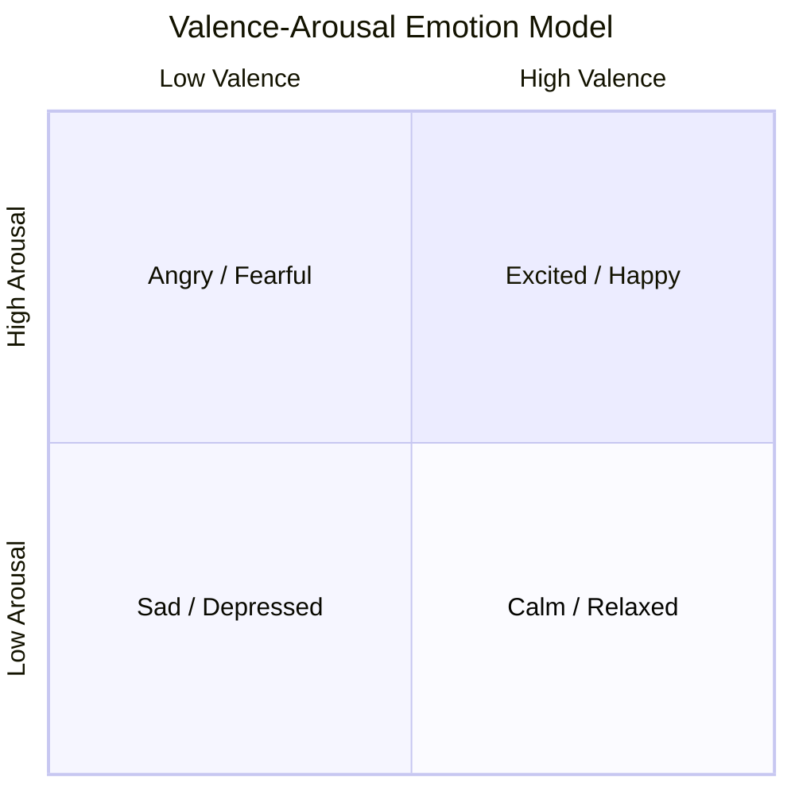
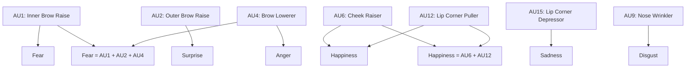

# Emotion Recognition and Affective Computing

## Overview

Affective computing is the branch of AI that deals with recognizing, interpreting, and simulating human emotions. The term was coined by Rosalind Picard at MIT in 1997 and has since grown into a multibillion-dollar industry spanning healthcare, marketing, education, and human-computer interaction. For psychology, affective computing offers something unprecedented: continuous, objective measurement of emotional states that were previously accessible only through self-report or trained clinical observation.

Emotion recognition systems draw on multiple signal channels. **Facial expression analysis** uses computer vision to map muscle movements to affective states. **Voice prosody analysis** extracts pitch, rhythm, and spectral features from speech to infer mood. **Physiological sensing** measures galvanic skin response (GSR), heart rate variability (HRV), and skin temperature as autonomic markers of arousal and valence. When these channels are combined in **multimodal fusion**, the resulting models outperform any single modality, because each channel captures a different facet of the emotional experience.

In therapeutic settings, emotion recognition can provide clinicians with moment-by-moment feedback about a client's affective trajectory during a session. A therapist reviewing a session recording enhanced with affective annotations can identify points of peak distress, emotional breakthroughs, or incongruence between verbal content and expressed affect. This is especially valuable for training novice clinicians and for telehealth contexts where subtle nonverbal cues may be lost to video compression. However, the technology also raises important questions about cultural bias, consent, and the gap between expressed and felt emotion.

## Key Concepts

| Concept | Description |
|---|---|
| Ekman's Basic Emotions | Six universal emotions — happiness, sadness, anger, fear, surprise, disgust — identified through cross-cultural facial expression studies |
| Action Units (AUs) | The Facial Action Coding System (FACS) decomposes expressions into ~46 individual muscle movements (e.g., AU6 = cheek raiser, AU12 = lip corner puller) |
| Valence-Arousal Model | Represents emotion in a 2D continuous space: valence (positive/negative) and arousal (calm/excited) |
| MFCC | Mel-Frequency Cepstral Coefficients — a compact spectral representation of audio widely used as input features for speech emotion recognition |
| Galvanic Skin Response (GSR/EDA) | Electrodermal activity that rises with sympathetic nervous system arousal; a reliable indicator of emotional intensity |
| Heart Rate Variability (HRV) | Variation in time intervals between heartbeats; lower HRV is associated with stress and negative affect |
| Multimodal Fusion | Combining predictions from multiple modalities (face, voice, physiology) using early, late, or hybrid fusion strategies |

## Technical Details

### Facial Expression Recognition

Modern facial emotion recognition pipelines begin with face detection (e.g., MTCNN or RetinaFace), followed by landmark localization to identify key points around the eyes, nose, and mouth. The aligned face is then passed through a convolutional neural network (CNN) for classification. The FER2013 dataset, containing roughly 35,000 grayscale $48 \times 48$ images labeled with seven emotion categories, remains a common benchmark despite known label noise. State-of-the-art models on FER2013 achieve approximately 73-76% accuracy, while human agreement on the same dataset is only around 65%.

The FACS-based approach offers finer granularity. Instead of classifying a discrete emotion, the model predicts which Action Units are active and their intensity on a 1-5 scale. The probability of an emotion $e$ given a set of active Action Units $\{AU_1, AU_2, \ldots, AU_k\}$ can be estimated as:

$$P(e \mid AU_1, \ldots, AU_k) = \frac{P(AU_1, \ldots, AU_k \mid e) \cdot P(e)}{P(AU_1, \ldots, AU_k)}$$

This Bayesian formulation allows mapping AU combinations to emotion labels while accounting for prior probabilities learned from labeled corpora.

### Voice Prosody Analysis

Speech conveys emotion through suprasegmental features: fundamental frequency ($F_0$, perceived as pitch), energy (loudness), speech rate, and spectral tilt. Low-level descriptors are typically extracted over short frames (25 ms with 10 ms hop) and then summarized with statistical functionals (mean, standard deviation, percentiles) over an utterance. The feature vector for a speech segment of $T$ frames can be written as:

$$\mathbf{x} = \left[\mu(F_0), \sigma(F_0), \mu(E), \sigma(E), \text{MFCC}_1, \ldots, \text{MFCC}_{13}, \ldots \right]$$

These features feed into classifiers ranging from SVMs to recurrent neural networks. More recent approaches use pre-trained speech models like wav2vec 2.0 and fine-tune them on emotion corpora such as IEMOCAP (Interactive Emotional Dyadic Motion Capture) or RAVDESS.

### Physiological Signals

Electrodermal activity (EDA) is decomposed into a tonic component (slow baseline shifts) and phasic component (rapid skin conductance responses, or SCRs). Each SCR corresponds to a sympathetic nervous system burst and can be modeled as:

$$\text{SCR}(t) = A \cdot (t - t_0)^2 \cdot e^{-(t - t_0) / \tau}$$

where $A$ is the amplitude, $t_0$ is onset time, and $\tau$ is the recovery time constant. HRV is quantified in both time domain (RMSSD, SDNN) and frequency domain (LF/HF ratio), where a higher LF/HF ratio indicates sympathetic dominance associated with stress.

## Code Examples

```python
"""
Facial emotion recognition using a pre-trained CNN on FER2013-style input.
Demonstrates preprocessing, prediction, and AU-to-emotion mapping.
"""

import numpy as np
from tensorflow.keras.models import Sequential
from tensorflow.keras.layers import Conv2D, MaxPooling2D, Dense, Flatten, Dropout, BatchNormalization

# Define a compact CNN for 48x48 grayscale emotion classification
def build_fer_model(num_classes=7):
    model = Sequential([
        Conv2D(64, (3, 3), activation='relu', padding='same', input_shape=(48, 48, 1)),
        BatchNormalization(),
        Conv2D(64, (3, 3), activation='relu', padding='same'),
        MaxPooling2D(pool_size=(2, 2)),
        Dropout(0.25),

        Conv2D(128, (3, 3), activation='relu', padding='same'),
        BatchNormalization(),
        Conv2D(128, (3, 3), activation='relu', padding='same'),
        MaxPooling2D(pool_size=(2, 2)),
        Dropout(0.25),

        Flatten(),
        Dense(256, activation='relu'),
        Dropout(0.5),
        Dense(num_classes, activation='softmax')
    ])
    model.compile(optimizer='adam', loss='categorical_crossentropy', metrics=['accuracy'])
    return model

EMOTIONS = ['Angry', 'Disgust', 'Fear', 'Happy', 'Sad', 'Surprise', 'Neutral']

# Simulated prediction on a preprocessed face
model = build_fer_model()
sample_face = np.random.rand(1, 48, 48, 1).astype(np.float32)
predictions = model.predict(sample_face, verbose=0)
predicted_emotion = EMOTIONS[np.argmax(predictions)]
print(f"Predicted emotion: {predicted_emotion}")
print(f"Confidence scores: {dict(zip(EMOTIONS, predictions[0].round(3)))}")
```

```python
"""
Extract MFCC features from an audio file for speech emotion recognition.
"""

import numpy as np
import librosa

def extract_prosody_features(audio_path, sr=16000):
    """Extract prosodic and spectral features for emotion classification."""
    y, sr = librosa.load(audio_path, sr=sr)

    # Fundamental frequency via pYIN
    f0, voiced_flag, _ = librosa.pyin(y, fmin=50, fmax=500, sr=sr)
    f0_clean = f0[~np.isnan(f0)]

    # Energy (RMS)
    rms = librosa.feature.rms(y=y)[0]

    # MFCCs (13 coefficients)
    mfccs = librosa.feature.mfcc(y=y, sr=sr, n_mfcc=13)

    features = {
        'f0_mean': np.mean(f0_clean) if len(f0_clean) > 0 else 0.0,
        'f0_std': np.std(f0_clean) if len(f0_clean) > 0 else 0.0,
        'energy_mean': np.mean(rms),
        'energy_std': np.std(rms),
        'speech_rate': np.sum(voiced_flag) / (len(y) / sr),  # voiced frames per second
    }
    # Add MFCC statistics
    for i in range(13):
        features[f'mfcc_{i+1}_mean'] = np.mean(mfccs[i])
        features[f'mfcc_{i+1}_std'] = np.std(mfccs[i])

    return features

# Example usage
# features = extract_prosody_features("session_audio.wav")
# print(features)
```

## Diagrams

**Multimodal Emotion Recognition Pipeline**



**Valence-Arousal Emotion Space**



**FACS Action Unit to Emotion Mapping**



## Applications & Case Studies

**Affectiva (now Smart Eye)**: Originally an MIT Media Lab spin-off, Affectiva built one of the largest facial expression datasets (over 10 million faces from 87 countries). Their Affdex SDK detects seven core emotions plus engagement and attention from webcam video. In clinical research, Affdex has been used to measure affective responses in autism spectrum disorder studies and to track emotional engagement during therapeutic interventions.

**Realeyes**: This platform uses webcam-based facial coding to measure attention and emotional response to video content. While primarily deployed in advertising, Realeyes technology has been adapted for telehealth platforms to provide therapists with aggregated emotional engagement scores across sessions.

**Empatica E4 Wristband**: A research-grade wearable that records EDA, blood volume pulse (BVP), skin temperature, and accelerometry. It has been used in over 3,000 published studies, including clinical trials measuring stress reactivity in PTSD patients, anxiety monitoring in autism, and real-time panic attack detection. The EMBRACE2 variant received FDA clearance for seizure detection, demonstrating the clinical viability of wearable physiological sensing.

**IEMOCAP Corpus**: The Interactive Emotional Dyadic Motion Capture database from USC contains approximately 12 hours of audiovisual data from actors performing scripted and spontaneous dialogues. It remains the most widely used benchmark for multimodal emotion recognition, with annotated emotion labels, Action Unit labels, and motion capture data.

**Therapy Feedback Systems**: Researchers at the University of Southern California's Institute for Creative Technologies developed SimSensei, a virtual interviewer that uses facial expression, gaze, and vocal analysis to detect indicators of depression and PTSD. The system tracks behavioral markers such as reduced smile intensity, averted gaze, and flattened prosody, achieving promising concordance with clinical assessments.

## Further Reading

- Picard, R. W. (1997). *Affective Computing*. MIT Press.
- Ekman, P., & Friesen, W. V. (1978). *Facial Action Coding System: A Technique for the Measurement of Facial Movement*. Consulting Psychologists Press.
- Li, S., & Deng, W. (2022). "Deep Facial Expression Recognition: A Survey." *IEEE Transactions on Affective Computing*, 13(3), 1195-1215.
- Schuller, B. W. (2018). "Speech Emotion Recognition: Two Decades in a Nutshell." *Communications of the ACM*, 61(5), 90-99.
- Sano, A., & Picard, R. W. (2013). "Stress Recognition Using Wearable Sensors and Mobile Phones." *Proceedings of the Humaine Association Conference on Affective Computing and Intelligent Interaction*, 671-676.
- Mollahosseini, A., Hasani, B., & Mahoor, M. H. (2019). "AffectNet: A Database for Facial Expression, Valence, and Arousal Computing in the Wild." *IEEE Transactions on Affective Computing*, 10(1), 18-31.
