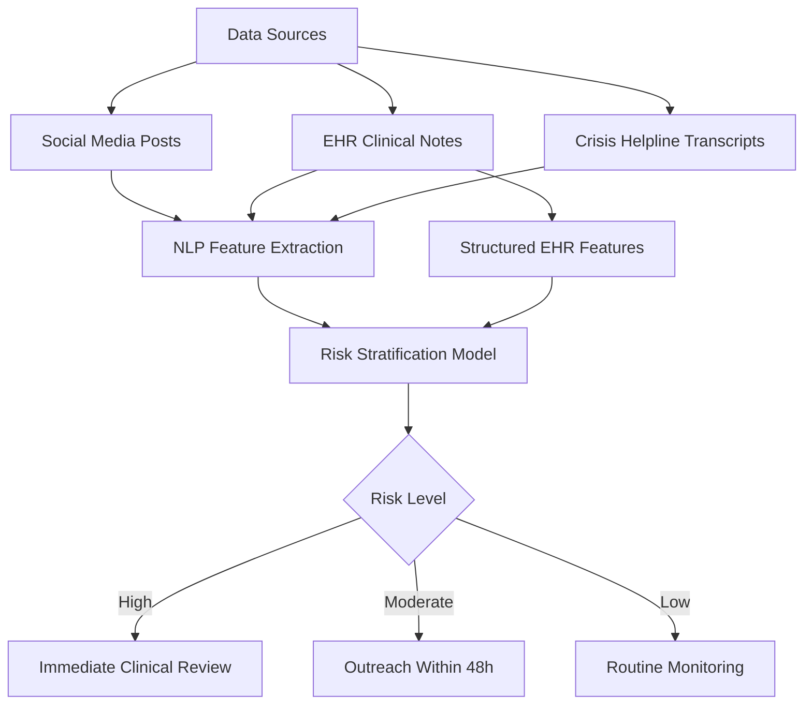
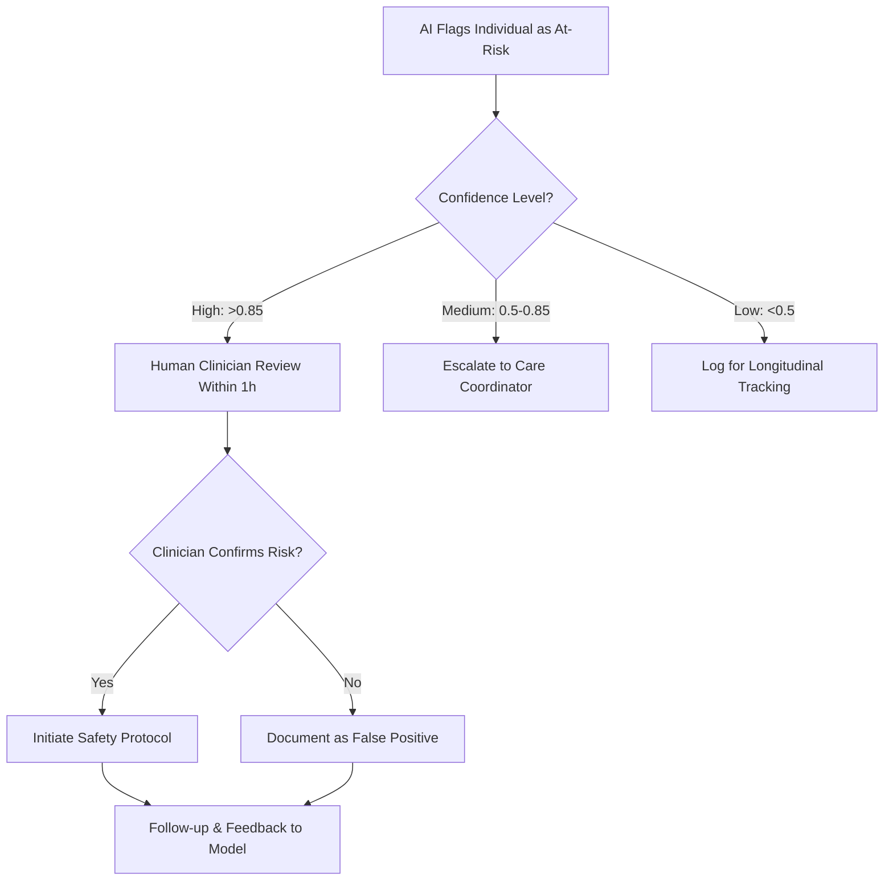

# AI for Suicide Prevention and Crisis Intervention

## Overview

Suicide is a leading cause of death worldwide, claiming over 700,000 lives annually according to the World Health Organization. Despite decades of research, clinicians still struggle to predict which individuals are at imminent risk. Traditional risk assessment relies on clinical interviews, standardized scales such as the Columbia Suicide Severity Rating Scale (C-SSRS), and known demographic and diagnostic risk factors. Yet meta-analyses consistently show that clinical prediction of suicide performs only marginally better than chance over short time horizons.

AI offers a fundamentally different approach: rather than relying on periodic clinical assessments, machine learning models can continuously analyze digital traces — social media posts, electronic health records, crisis helpline transcripts, and even smartphone usage patterns — to identify individuals whose language, behavior, or clinical trajectory suggests escalating risk. Natural language processing (NLP) is the core technology here, because the way people write and speak changes measurably as suicidal ideation intensifies. Shifts toward first-person singular pronouns, absolutist language ("always," "never," "completely"), increased references to death and burden, and decreased future tense usage are all linguistic markers that NLP models can detect.

However, this domain carries uniquely high stakes. A false negative — missing someone who is truly at risk — can have fatal consequences. A false positive can subject someone to involuntary psychiatric holds, breaches of privacy, or unnecessary distress. Balancing sensitivity and specificity is not merely a technical challenge but a deeply ethical one. Every deployment of suicide prediction AI must be evaluated not just on AUC or F1 scores, but on the real-world consequences of its predictions for vulnerable populations.

## Key Concepts

| Concept | Description |
|---|---|
| Columbia Suicide Severity Rating Scale (C-SSRS) | A clinician-administered tool that categorizes suicidal ideation into five levels of increasing severity and tracks suicidal behavior |
| Suicidal Ideation | Thoughts about or preoccupation with ending one's life, ranging from passive ("wish I were dead") to active with plan and intent |
| Risk Stratification | Categorizing individuals into low, moderate, and high risk tiers to allocate clinical resources appropriately |
| Linguistic Markers | Measurable language patterns (pronoun use, absolutist words, temporal orientation) that correlate with psychological states |
| Positive Predictive Value (PPV) | The probability that a positive prediction is a true positive — critically important when base rates are low |
| Zero-Shot Classification | Using pre-trained language models to classify text into categories without task-specific labeled data |

## Technical Details

### NLP for Suicidal Ideation Detection

Text-based detection models operate on a spectrum from feature-engineered approaches to end-to-end deep learning. Classical approaches extract handcrafted features such as LIWC (Linguistic Inquiry and Word Count) categories — particularly the proportion of first-person singular pronouns ($p_{I}$), negative emotion words ($p_{\text{neg}}$), and death-related words ($p_{\text{death}}$). A logistic regression model for binary risk classification might take the form:

$$P(\text{risk} = 1 \mid \mathbf{x}) = \sigma\left(\beta_0 + \beta_1 p_{I} + \beta_2 p_{\text{neg}} + \beta_3 p_{\text{death}} + \beta_4 p_{\text{absol}} + \ldots\right)$$

where $\sigma$ is the sigmoid function and $p_{\text{absol}}$ represents the proportion of absolutist words.

Modern approaches fine-tune transformer models (BERT, RoBERTa, MentalBERT) on labeled suicide-related corpora. The University of Maryland's CLPsych shared tasks have provided benchmark datasets drawn from Reddit posts, with labels assigned by expert annotators. Fine-tuned BERT models on these tasks achieve F1 scores of 0.80-0.90 for detecting posts expressing suicidal ideation, substantially outperforming lexicon-based methods.

### Risk Stratification from Clinical Data

Electronic health record (EHR) based models incorporate structured data — diagnoses (ICD codes for depression, substance use, prior attempts), medications, emergency department visits, and demographic variables — alongside unstructured clinical notes. The Veterans Health Administration developed REACH VET (Recovery Engagement and Coordination for Health - Veterans Enhanced Treatment), which uses a predictive model trained on millions of patient records to flag veterans in the top 0.1% of predicted suicide risk each month. The model combines:

$$\hat{y} = f\left(\mathbf{x}_{\text{dx}}, \mathbf{x}_{\text{rx}}, \mathbf{x}_{\text{util}}, \mathbf{x}_{\text{demo}}, \mathbf{x}_{\text{notes}}\right)$$

where $\mathbf{x}_{\text{dx}}$ represents diagnostic history, $\mathbf{x}_{\text{rx}}$ captures medication patterns, $\mathbf{x}_{\text{util}}$ encodes healthcare utilization, $\mathbf{x}_{\text{demo}}$ covers demographics, and $\mathbf{x}_{\text{notes}}$ contains NLP-derived features from clinical notes.

### The Base Rate Problem

Suicide has a low base rate (approximately 14 per 100,000 in the US). Even a highly accurate classifier faces severe PPV challenges. For a classifier with sensitivity $= 0.90$ and specificity $= 0.99$ applied to a population with base rate $b = 0.00014$:

$$\text{PPV} = \frac{0.90 \times 0.00014}{0.90 \times 0.00014 + 0.01 \times 0.99986} \approx 0.012$$

This means approximately 99% of flagged individuals would be false positives. This mathematical reality demands that AI systems be used as decision-support tools rather than automated gatekeepers, and that interventions triggered by flags must be proportionate and non-coercive.

## Code Examples

```python
"""
Suicidal ideation detection using fine-tuned BERT on social media text.
Demonstrates preprocessing, feature extraction, and risk scoring.
"""

from transformers import AutoTokenizer, AutoModelForSequenceClassification
import torch
import numpy as np

def load_mental_health_model():
    """Load a pre-trained mental health text classifier."""
    model_name = "mental/mental-bert-base-uncased"
    tokenizer = AutoTokenizer.from_pretrained(model_name)
    model = AutoModelForSequenceClassification.from_pretrained(
        model_name, num_labels=4  # no risk, low, moderate, high
    )
    return tokenizer, model

def compute_linguistic_markers(text):
    """Extract interpretable linguistic features associated with suicidal ideation."""
    words = text.lower().split()
    total = len(words) if len(words) > 0 else 1

    first_person_singular = {'i', 'me', 'my', 'mine', 'myself'}
    absolutist_words = {'always', 'never', 'nothing', 'completely', 'every',
                        'entirely', 'absolutely', 'totally', 'forever'}
    death_words = {'die', 'dead', 'death', 'kill', 'suicide', 'end', 'gone', 'final'}

    markers = {
        'first_person_ratio': sum(1 for w in words if w in first_person_singular) / total,
        'absolutist_ratio': sum(1 for w in words if w in absolutist_words) / total,
        'death_ref_ratio': sum(1 for w in words if w in death_words) / total,
        'word_count': len(words),
    }
    return markers

def score_risk(text, tokenizer, model):
    """Produce a risk score and linguistic marker report for a given text."""
    inputs = tokenizer(text, return_tensors="pt", truncation=True, max_length=512)
    with torch.no_grad():
        logits = model(**inputs).logits
    probabilities = torch.softmax(logits, dim=-1).numpy()[0]

    risk_levels = ["No Risk", "Low Risk", "Moderate Risk", "High Risk"]
    markers = compute_linguistic_markers(text)

    return {
        'risk_scores': dict(zip(risk_levels, probabilities.round(4))),
        'predicted_level': risk_levels[np.argmax(probabilities)],
        'linguistic_markers': markers,
    }

# Example usage (model loading would require actual weights)
# tokenizer, model = load_mental_health_model()
# result = score_risk("I feel like there is no point anymore", tokenizer, model)
# print(result)
```

```python
"""
Risk stratification using structured EHR features with gradient boosting.
"""

import numpy as np
from sklearn.ensemble import GradientBoostingClassifier
from sklearn.model_selection import cross_val_score
from sklearn.metrics import precision_score, recall_score, f1_score

# Simulated EHR feature matrix
np.random.seed(42)
n_patients = 10000
base_rate = 0.005  # 0.5% positive rate for demonstration

X = np.random.randn(n_patients, 15)  # 15 clinical features
# Features: prior_attempts, depression_dx, substance_use, ED_visits_6mo,
# antidepressant_rx, age, male, lives_alone, recent_discharge, ...
y = (np.random.rand(n_patients) < base_rate).astype(int)

# Inject signal: prior attempts and depression strongly predict risk
y[X[:, 0] > 2.0] = 1  # prior_attempts feature
y[X[:, 1] > 2.5] = 1  # depression severity

clf = GradientBoostingClassifier(
    n_estimators=200, max_depth=4, learning_rate=0.05, random_state=42
)
scores = cross_val_score(clf, X, y, cv=5, scoring='roc_auc')
print(f"Mean AUC across 5 folds: {np.mean(scores):.3f} (+/- {np.std(scores):.3f})")

clf.fit(X, y)
y_pred = clf.predict(X)
print(f"Precision: {precision_score(y, y_pred):.3f}")
print(f"Recall:    {recall_score(y, y_pred):.3f}")
print(f"F1:        {f1_score(y, y_pred):.3f}")
```

## Diagrams

**Suicide Risk Detection Pipeline**



**Linguistic Markers Over Time in At-Risk Individuals**

```mermaid
flowchart LR
    subgraph Early Posts
        A1[Low first-person pronouns]
        A2[Future tense present]
        A3[Social references]
    end
    subgraph Escalation
        B1[Increasing 'I' usage]
        B2[Absolutist language rises]
        B3[Social withdrawal language]
    end
    subgraph Crisis Period
        C1[High first-person singular]
        C2[Death/burden references]
        C3[Past tense dominance]
    end
    Early Posts --> Escalation --> Crisis Period
```

**Ethical Decision Framework for AI-Flagged Risk**



## Applications & Case Studies

**Crisis Text Line**: This nonprofit operates a text-based crisis service and partnered with researchers to analyze over 100 million messages. Their AI system uses NLP to triage incoming conversations, identifying high-risk texters and routing them to trained counselors more quickly. The system detects escalation patterns and flags conversations where a texter mentions specific plans or access to means, reducing median response time for the highest-acuity conversations.

**Meta (Facebook) Suicide Detection**: In 2017, Facebook deployed a proactive detection system that uses pattern recognition on posts and live videos to identify expressions of suicidal ideation. The system flags content for human reviewers on Facebook's Community Operations team, who can escalate to local emergency services. By 2019, Meta reported that the system had helped first responders conduct over 3,500 wellness checks globally. The system was controversial, as it operates without explicit user consent for mental health screening.

**REACH VET (Veterans Health Administration)**: This clinical decision support system identifies veterans at highest statistical risk for suicide, overdose, hospitalization, and other adverse outcomes. Clinicians receive monthly flags and are required to review each patient's chart and consider enhanced care. A 2020 evaluation found that flagged veterans who received enhanced engagement had a 5% lower mortality rate compared to matched controls.

**Durkheim Project**: Named after the sociologist Emile Durkheim, this DARPA-funded research initiative analyzed social media language of military veterans (with consent) to predict suicide risk. The project applied deep learning to Facebook and Twitter posts and demonstrated that language-based models could identify individuals who later attempted suicide with an AUC of 0.80-0.85, months before the event.

**Reddit and CLPsych Shared Tasks**: The Computational Linguistics and Clinical Psychology (CLPsych) workshops have organized shared tasks using Reddit data from the r/SuicideWatch subreddit. Participating teams develop models to assess suicide risk levels from post histories. These benchmarks have driven methodological advances and established that transformer-based models consistently outperform bag-of-words and lexicon approaches for this task.

## Further Reading

- Franklin, J. C., et al. (2017). "Risk Factors for Suicidal Thoughts and Behaviors: A Meta-Analysis of 50 Years of Research." *Psychological Bulletin*, 143(2), 187-232.
- Coppersmith, G., Leary, R., Crutchley, P., & Fine, A. (2018). "Natural Language Processing of Social Media as Screening for Suicide Risk." *Biomedical Informatics Insights*, 10, 1-11.
- Posner, K., et al. (2011). "The Columbia-Suicide Severity Rating Scale (C-SSRS)." *American Journal of Psychiatry*, 168(12), 1266-1277.
- De Choudhury, M., Kiciman, E., Dredze, M., Coppersmith, G., & Kumar, M. (2016). "Discovering Shifts to Suicidal Ideation from Mental Health Content in Social Media." *Proceedings of the 2016 CHI Conference*, 2098-2110.
- Belsher, B. E., et al. (2019). "Prediction Models for Suicide Attempts and Deaths: A Systematic Review and Simulation." *JAMA Psychiatry*, 76(6), 642-651.
- Torous, J., et al. (2021). "The Growing Field of Digital Psychiatry: Current Evidence and the Future of Apps, Social Media, Chatbots, and Virtual Reality." *World Psychiatry*, 20(3), 318-335.
