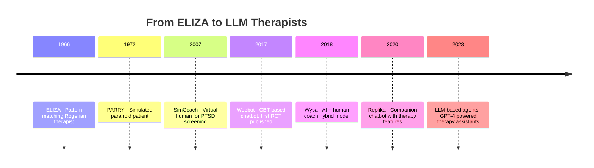
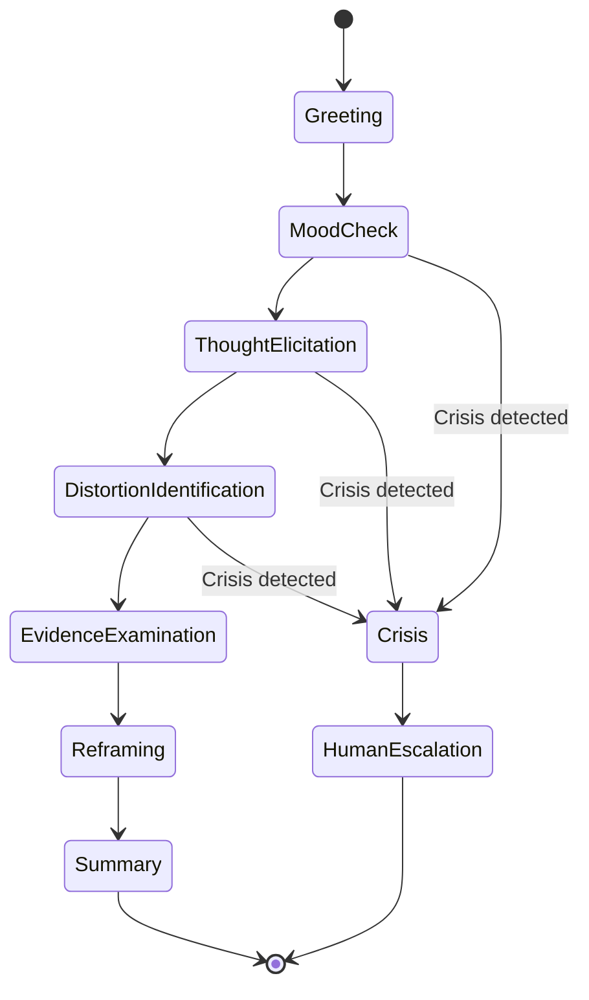
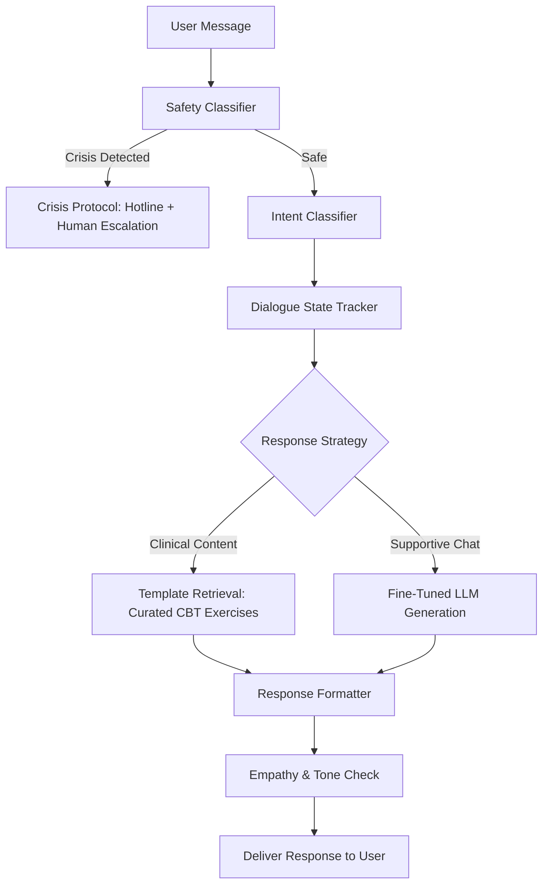

# Chatbots and Virtual Therapists

## Overview

The idea of a computer as therapist is older than most people realize. In 1966, Joseph Weizenbaum at MIT created ELIZA, a simple pattern-matching program that mimicked a Rogerian psychotherapist by reflecting users' statements back to them as questions. Weizenbaum was alarmed when users — including his own secretary — formed emotional attachments to the program and confided in it as if it were human. This phenomenon, now called the ELIZA effect, foreshadowed the central promise and peril of modern therapy chatbots: people are remarkably willing to open up to machines, but that openness carries real clinical responsibility.

Six decades later, therapy chatbots have evolved from crude pattern matching to sophisticated conversational agents built on large language models. Systems like Woebot, Wysa, Replika, and Tess deliver structured cognitive behavioral therapy (CBT) exercises, psychoeducation, mood tracking, and supportive conversations to millions of users worldwide. The appeal is clear: therapy chatbots are available 24/7, cost a fraction of human therapy, carry no social stigma, and can scale to populations that have no access to mental health professionals. The WHO estimates a global shortage of over 1 million mental health workers, and in many low- and middle-income countries the ratio of psychiatrists to population exceeds 1 per 100,000.

Yet significant questions remain about efficacy, safety, and the nature of the therapeutic relationship. Randomized controlled trials (RCTs) show that chatbot interventions can reduce symptoms of depression and anxiety compared to waitlist controls, but effect sizes are typically smaller than those achieved with human therapists. Crisis handling remains a critical gap — most chatbots are not equipped to manage suicidal ideation or acute psychosis, and handoffs to human providers are often clumsy. The rapid deployment of LLM-based chatbots has outpaced regulatory frameworks, raising concerns about liability, data privacy, and the potential for harm when vulnerable users receive inadequate care.

## Key Concepts

| Concept | Description |
|---|---|
| ELIZA Effect | The tendency for humans to attribute understanding and empathy to computer programs based on superficial conversational behavior |
| Cognitive Behavioral Therapy (CBT) | An evidence-based psychotherapy that targets maladaptive thought patterns and behaviors; highly structured and thus amenable to automation |
| Dialogue Management | The component of a chatbot that decides what to say next, either through rule-based state machines, retrieval models, or generative models |
| Therapeutic Alliance | The quality of the relationship between therapist and client, consistently identified as the strongest predictor of therapy outcomes |
| Guided Self-Help | A delivery model where the chatbot provides structured psychoeducation and exercises with minimal or no human clinician involvement |
| Safety Guardrails | Hard-coded rules or classifier layers that detect crisis language and redirect users to human help (e.g., crisis hotlines) |

## Technical Details

### Dialogue Architecture for Therapy Chatbots

Modern therapy chatbots use a hybrid architecture combining rule-based safety layers with flexible conversational AI. The core dialogue flow for a CBT session can be modeled as a finite state machine where each state represents a therapeutic step:

$$S = \{s_{\text{greeting}}, s_{\text{mood\_check}}, s_{\text{thought\_elicit}}, s_{\text{cognitive\_distortion}}, s_{\text{reframe}}, s_{\text{summary}}\}$$

Transitions between states depend on user input and are governed by a policy function $\pi(s_t, u_t) \rightarrow s_{t+1}$, where $u_t$ is the user's message at turn $t$. In early systems like Woebot (version 1), this policy was entirely rule-based: specific keyword patterns triggered specific transitions. Current systems use intent classifiers to map user messages to predefined intents, then apply a policy network to select the next therapeutic action.

The response generation layer combines retrieval and generation. For clinically validated content (psychoeducation, CBT exercises), the system retrieves from a curated template library. For empathetic and contextual responses, a fine-tuned language model generates text. The probability of selecting a response $r$ given dialogue history $\mathbf{h}$ and current state $s$ is:

$$P(r \mid \mathbf{h}, s) = \alpha \cdot P_{\text{retrieval}}(r \mid s) + (1 - \alpha) \cdot P_{\text{generative}}(r \mid \mathbf{h})$$

where $\alpha$ is a mixing parameter that increases for safety-critical states (steering toward curated content) and decreases for open-ended supportive conversation.

### Safety Classification

Every user message passes through a safety classifier before dialogue management. This binary or multi-class model flags messages indicating suicidal ideation, self-harm, abuse, or psychosis. The classifier must operate at very high recall, even at the cost of precision. A typical architecture uses a fine-tuned BERT model with a classification head:

$$\hat{y}_{\text{crisis}} = \sigma(\mathbf{W} \cdot \text{BERT}_{\text{CLS}}(\mathbf{x}) + \mathbf{b})$$

When the crisis probability $\hat{y}_{\text{crisis}}$ exceeds a threshold (typically set low, around 0.3-0.4, to maximize recall), the system exits the normal dialogue flow and provides crisis resources — helpline numbers, grounding exercises, and in some implementations, direct escalation to human counselors.

### Measuring Therapeutic Efficacy

RCTs of therapy chatbots typically measure outcome using the PHQ-9 (depression) or GAD-7 (anxiety) scales. Effect size is reported as Cohen's $d$:

$$d = \frac{\bar{X}_{\text{treatment}} - \bar{X}_{\text{control}}}{S_{\text{pooled}}}$$

A meta-analysis by Gaffney et al. (2023) across 15 RCTs found a pooled effect size of $d = 0.52$ for chatbot CBT interventions on depression symptoms (compared to waitlist), which falls in the medium range. However, when compared to active controls (e.g., psychoeducation alone), effect sizes drop to $d = 0.20$-$0.30$, and comparisons with face-to-face therapy show no equivalence.

## Code Examples

```python
"""
A simplified CBT therapy chatbot with state-based dialogue management
and safety classification.
"""

from dataclasses import dataclass, field
from enum import Enum
from typing import Optional

class TherapyState(Enum):
    GREETING = "greeting"
    MOOD_CHECK = "mood_check"
    THOUGHT_ELICITATION = "thought_elicitation"
    COGNITIVE_DISTORTION = "cognitive_distortion"
    REFRAMING = "reframing"
    SUMMARY = "summary"
    CRISIS = "crisis"

CRISIS_KEYWORDS = {
    'suicide', 'kill myself', 'end it all', 'want to die',
    'self-harm', 'cutting', 'overdose', 'no reason to live'
}

CBT_RESPONSES = {
    TherapyState.GREETING: (
        "Hi there. I'm here to help you work through your thoughts. "
        "How are you feeling right now, on a scale of 1 to 10?"
    ),
    TherapyState.MOOD_CHECK: (
        "Thank you for sharing that. Can you tell me about a specific "
        "situation today that affected your mood?"
    ),
    TherapyState.THOUGHT_ELICITATION: (
        "When that happened, what thoughts went through your mind? "
        "Try to capture the exact words."
    ),
    TherapyState.COGNITIVE_DISTORTION: (
        "I notice that thought might involve some {distortion}. "
        "This is a common thinking pattern. Let's examine the evidence — "
        "what facts support this thought, and what facts go against it?"
    ),
    TherapyState.REFRAMING: (
        "Based on the evidence, could there be a more balanced way to "
        "think about this situation? Try completing: 'A more realistic "
        "thought might be...'"
    ),
    TherapyState.SUMMARY: (
        "Great work today. You identified the thought '{original}', "
        "recognized it as {distortion}, and reframed it as '{reframed}'. "
        "Remember, noticing thinking patterns is a skill that improves with practice."
    ),
    TherapyState.CRISIS: (
        "I'm concerned about what you've shared. Your safety is the top "
        "priority. Please reach out to the 988 Suicide & Crisis Lifeline "
        "by calling or texting 988. You're not alone."
    ),
}

DISTORTION_PATTERNS = {
    'all-or-nothing thinking': ['always', 'never', 'every time', 'nothing'],
    'catastrophizing': ['worst', 'terrible', 'disaster', 'ruined', 'horrible'],
    'mind reading': ['they think', 'everyone knows', 'they must', 'obviously'],
    'should statements': ['should', 'must', 'have to', 'ought to'],
}

@dataclass
class CBTSession:
    state: TherapyState = TherapyState.GREETING
    mood_score: Optional[int] = None
    original_thought: str = ""
    detected_distortion: str = ""
    reframed_thought: str = ""
    turn_count: int = 0
    history: list = field(default_factory=list)

    def check_crisis(self, message: str) -> bool:
        msg_lower = message.lower()
        return any(keyword in msg_lower for keyword in CRISIS_KEYWORDS)

    def detect_distortion(self, thought: str) -> str:
        thought_lower = thought.lower()
        for distortion, markers in DISTORTION_PATTERNS.items():
            if any(m in thought_lower for m in markers):
                return distortion
        return "overgeneralization"  # default

    def process_message(self, user_message: str) -> str:
        self.history.append({"role": "user", "content": user_message})
        self.turn_count += 1

        # Safety check overrides all states
        if self.check_crisis(user_message):
            self.state = TherapyState.CRISIS
            response = CBT_RESPONSES[TherapyState.CRISIS]
            self.history.append({"role": "bot", "content": response})
            return response

        if self.state == TherapyState.GREETING:
            self.state = TherapyState.MOOD_CHECK
            response = CBT_RESPONSES[TherapyState.GREETING]

        elif self.state == TherapyState.MOOD_CHECK:
            try:
                self.mood_score = int(''.join(c for c in user_message if c.isdigit())[:1])
            except (ValueError, IndexError):
                self.mood_score = 5
            self.state = TherapyState.THOUGHT_ELICITATION
            response = CBT_RESPONSES[TherapyState.MOOD_CHECK]

        elif self.state == TherapyState.THOUGHT_ELICITATION:
            self.original_thought = user_message
            self.detected_distortion = self.detect_distortion(user_message)
            self.state = TherapyState.COGNITIVE_DISTORTION
            response = CBT_RESPONSES[TherapyState.COGNITIVE_DISTORTION].format(
                distortion=self.detected_distortion
            )

        elif self.state == TherapyState.COGNITIVE_DISTORTION:
            self.state = TherapyState.REFRAMING
            response = CBT_RESPONSES[TherapyState.REFRAMING]

        elif self.state == TherapyState.REFRAMING:
            self.reframed_thought = user_message
            self.state = TherapyState.SUMMARY
            response = CBT_RESPONSES[TherapyState.SUMMARY].format(
                original=self.original_thought,
                distortion=self.detected_distortion,
                reframed=self.reframed_thought
            )

        else:
            response = "Thank you for this session. Take care of yourself."

        self.history.append({"role": "bot", "content": response})
        return response

# Demo session
session = CBTSession()
print("Bot:", session.process_message(""))  # greeting
print("Bot:", session.process_message("I'd say about a 4"))
print("Bot:", session.process_message("I always mess up at work, my boss never notices my effort"))
print("Bot:", session.process_message("Well, I did get a good review last quarter"))
print("Bot:", session.process_message("I sometimes struggle but I also do good work"))
```

## Diagrams

**Evolution of Therapy Chatbots**



**CBT Chatbot Dialogue Flow**



**Hybrid Architecture: Rule-Based Safety with Generative Dialogue**



## Applications & Case Studies

**Woebot**: Developed by clinical psychologist Alison Darcy at Stanford, Woebot delivers daily CBT-based interactions via text. A landmark 2017 RCT with college students (n=70) found that participants using Woebot for two weeks showed significant reductions in depression symptoms (PHQ-9) compared to an information-only control, with a between-group effect size of $d = 0.44$. Woebot Health has since received FDA Breakthrough Device Designation for its prescription digital therapeutic for substance use disorders, marking a regulatory milestone for therapy chatbots.

**Wysa**: An India-based mental health chatbot that combines AI-driven CBT, DBT (Dialectical Behavior Therapy), and mindfulness exercises with optional access to human coaches. Wysa has been evaluated in multiple RCTs, including a study with chronic pain patients in the UK's National Health Service (NHS) that found significant improvements in depression scores over eight weeks. Wysa serves over 5 million users across 65 countries and has published peer-reviewed evidence across populations including healthcare workers, pregnant women, and college students.

**Replika**: Originally created as a memorial chatbot by Eugenia Kuyda to simulate conversations with a deceased friend, Replika evolved into a companion AI with millions of users. While not a clinical tool, many users report using Replika for emotional support and to practice social interactions. Research has shown both benefits (reduced loneliness) and risks (emotional dependency, distress when features change). In 2023, Italy temporarily banned Replika over concerns about minors and vulnerable users.

**Tess (X2AI)**: A psychological AI chatbot that integrates CBT, DBT, motivational interviewing, and psychoeducation. Tess was evaluated in a clinical trial with university students in the Philippines, showing significant reductions in depression and anxiety symptoms over two to four weeks compared to an information-only control. Tess is notable for its multilingual support and deployment in low-resource settings where mental health professionals are scarce.

**Crisis Text Line with AI Triage**: While not a therapist chatbot itself, Crisis Text Line uses AI to analyze incoming messages and assign a severity score. Messages flagged as high-risk are routed to supervisors and experienced counselors. This AI triage system reduced wait times for the most critical conversations and has processed over 200 million messages since launch.

## Further Reading

- Weizenbaum, J. (1966). "ELIZA — A Computer Program for the Study of Natural Language Communication Between Man and Machine." *Communications of the ACM*, 9(1), 36-45.
- Fitzpatrick, K. K., Darcy, A., & Vierhile, M. (2017). "Delivering Cognitive Behavior Therapy to Young Adults With Symptoms of Depression via a Fully Automated Conversational Agent (Woebot): A Randomized Controlled Trial." *JMIR Mental Health*, 4(2), e19.
- Abd-Alrazaq, A. A., et al. (2020). "Effectiveness and Safety of Using Chatbots to Improve Mental Health: Systematic Review and Meta-Analysis." *Journal of Medical Internet Research*, 22(7), e16021.
- Gaffney, H., Mansell, W., & Tai, S. (2023). "Conversational Agents in the Treatment of Mental Health Problems: A Meta-Analysis of Randomized Controlled Trials." *JMIR Mental Health*, 10, e43862.
- Vaidyam, A. N., Wisniewski, H., Halamka, J. D., Kashavan, M. S., & Torous, J. B. (2019). "Chatbots and Conversational Agents in Mental Health: A Review of the Psychiatric Landscape." *Canadian Journal of Psychiatry*, 64(7), 456-464.
- Miner, A. S., Shah, N., Bullock, K. D., Arnow, B. A., Bailenson, J., & Hancock, J. (2019). "Key Considerations for Incorporating Conversational AI in Psychotherapy." *Frontiers in Psychiatry*, 10, 746.
