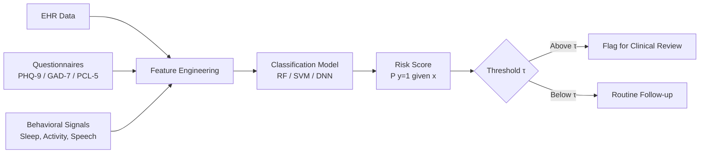
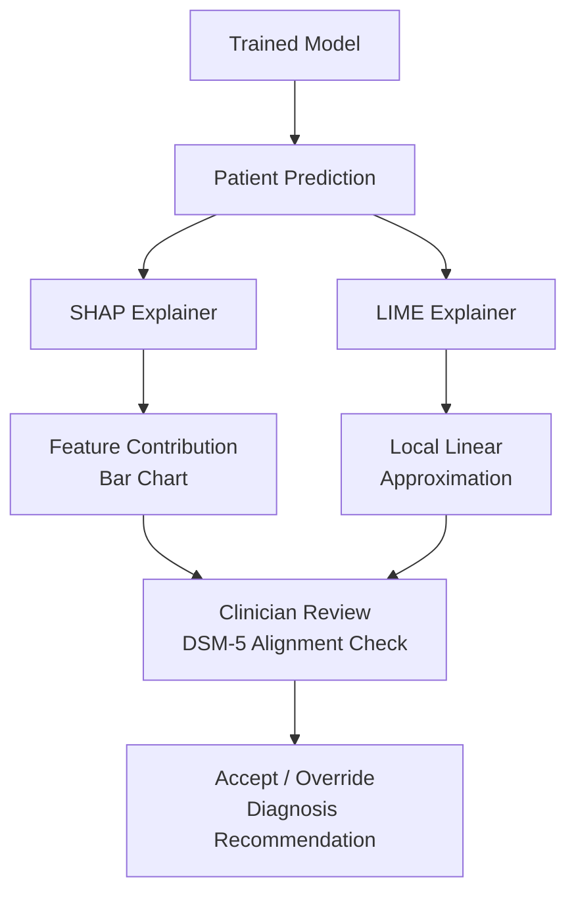

# AI-Assisted Diagnosis of Mental Health Conditions

## Overview

Mental health disorders affect roughly one in eight people worldwide, yet diagnostic processes remain heavily reliant on subjective clinical interviews and self-report questionnaires. The Diagnostic and Statistical Manual of Mental Disorders, Fifth Edition (DSM-5) defines categorical criteria for conditions such as major depressive disorder (MDD), generalized anxiety disorder (GAD), and post-traumatic stress disorder (PTSD), but applying these criteria consistently across clinicians is notoriously difficult. Inter-rater reliability for many psychiatric diagnoses hovers around $\kappa = 0.3$--$0.5$, indicating only fair agreement.

Machine learning offers a path toward more objective, data-driven diagnostic support. By training classifiers on structured clinical data, behavioral signals, and neuroimaging, researchers have built models that can flag individuals at elevated risk for specific conditions. These systems do not replace clinicians; instead, they serve as screening aids and second opinions, particularly in primary care settings where mental health expertise is scarce.

The core challenge lies in balancing predictive accuracy with clinical interpretability. A black-box model that achieves 95% AUC on a research dataset is useless if a psychiatrist cannot understand why a given patient was flagged. Regulatory bodies such as the FDA increasingly require explainability for clinical decision-support tools, making interpretability not just a nice-to-have but a deployment prerequisite.

This lesson covers the ML pipeline for mental health diagnosis: from feature engineering across electronic health records (EHR), standardized questionnaires, and behavioral data, through model selection and evaluation, to the interpretability and validation steps that determine whether a model can responsibly enter clinical use.

## Key Concepts

- **DSM-5 alignment**: Mapping model outputs to recognized diagnostic categories and symptom clusters
- **Feature engineering**: Extracting predictive signals from EHR, PHQ-9/GAD-7 scores, speech, and activity data
- **Diagnostic classification models**: Random forests, SVMs, and deep neural networks for binary and multi-class diagnosis
- **Sensitivity vs. specificity tradeoff**: Choosing operating points appropriate for screening vs. confirmatory diagnosis
- **Model interpretability**: SHAP values, LIME explanations, and attention-based transparency
- **Clinical validation**: Prospective trials, external cohort validation, and regulatory considerations

## Technical Details

### Feature Engineering from Heterogeneous Data Sources

Mental health ML models draw on diverse inputs. Structured EHR data provides diagnosis codes (ICD-10), medication history, visit frequency, and lab results. Standardized questionnaires like the PHQ-9 (depression) and PCL-5 (PTSD) yield ordinal symptom severity scores. Behavioral data — smartphone usage patterns, accelerometer readings, sleep logs — captures ecological momentary signals that questionnaires miss.

A typical feature vector for a depression classifier might include PHQ-9 item scores $\mathbf{q} \in \mathbb{R}^9$, sleep duration variability $\sigma_s$, social interaction frequency $f_{\text{social}}$, and speech features (pitch range, speaking rate). The combined representation is:

$$\mathbf{x} = [\mathbf{q}; \sigma_s; f_{\text{social}}; \mathbf{s}_{\text{speech}}; \mathbf{e}_{\text{EHR}}]$$

where $\mathbf{s}_{\text{speech}} \in \mathbb{R}^d$ is a vector of acoustic features and $\mathbf{e}_{\text{EHR}}$ encodes clinical history.

### Classification Models

For structured tabular data, gradient-boosted trees and random forests remain strong baselines. Support vector machines with RBF kernels work well on smaller datasets. Deep learning enters when raw signals (audio, text, imaging) are involved:

- **Random forests** handle mixed feature types and provide built-in feature importance rankings
- **SVMs** maximize the margin $\frac{2}{\|\mathbf{w}\|}$ between diagnostic classes in high-dimensional space
- **Deep learning** (LSTMs on longitudinal data, CNNs on spectrograms) captures temporal and spatial patterns that handcrafted features miss

The classification decision for a binary screening task assigns a patient to the positive class when $P(y=1 \mid \mathbf{x}) > \tau$, where the threshold $\tau$ is chosen based on the intended use. Screening tools favor high sensitivity (low $\tau$), accepting more false positives to minimize missed cases. Confirmatory tools raise $\tau$ to maximize specificity.

### Interpretability with SHAP and LIME

SHAP (SHapley Additive exPlanations) assigns each feature a contribution to the prediction:

$$f(\mathbf{x}) = \phi_0 + \sum_{i=1}^{M} \phi_i$$

where $\phi_i$ is the Shapley value for feature $i$. LIME fits a local linear model around each prediction, providing per-instance explanations. Both methods are model-agnostic and satisfy clinical demands for transparency.

### Clinical Validation Challenges

A model trained on one hospital's EHR may fail at another due to coding practices, demographics, or comorbidity patterns. Robust validation requires:

1. External cohort testing on data from different institutions
2. Subgroup analysis across age, sex, ethnicity, and comorbidity profiles
3. Prospective trials comparing model-assisted diagnosis to standard care
4. Alignment checks verifying that flagged symptoms map cleanly to DSM-5 criteria

## Code Examples

```python
import numpy as np
import pandas as pd
from sklearn.ensemble import RandomForestClassifier
from sklearn.model_selection import StratifiedKFold
from sklearn.metrics import roc_auc_score, classification_report
import shap

# Simulated patient dataset with PHQ-9 items, sleep, and behavioral features
np.random.seed(42)
n_patients = 500
phq9_items = np.random.randint(0, 4, size=(n_patients, 9))
phq9_total = phq9_items.sum(axis=1)
sleep_variability = np.random.exponential(0.8, n_patients)
social_freq = np.random.poisson(5, n_patients)
# Label: moderate-to-severe depression (PHQ-9 >= 15) with noise
labels = ((phq9_total + np.random.normal(0, 2, n_patients)) >= 14).astype(int)

feature_names = [f"phq9_item_{i+1}" for i in range(9)] + [
    "sleep_variability", "social_interaction_freq"
]
X = np.column_stack([phq9_items, sleep_variability, social_freq])
y = labels

# Stratified cross-validation with Random Forest
skf = StratifiedKFold(n_splits=5, shuffle=True, random_state=42)
auc_scores = []

for train_idx, test_idx in skf.split(X, y):
    clf = RandomForestClassifier(n_estimators=200, max_depth=8, random_state=42)
    clf.fit(X[train_idx], y[train_idx])
    probs = clf.predict_proba(X[test_idx])[:, 1]
    auc_scores.append(roc_auc_score(y[test_idx], probs))

print(f"Mean AUC across 5 folds: {np.mean(auc_scores):.3f} +/- {np.std(auc_scores):.3f}")

# SHAP explanations for interpretability
clf_final = RandomForestClassifier(n_estimators=200, max_depth=8, random_state=42)
clf_final.fit(X, y)
explainer = shap.TreeExplainer(clf_final)
shap_values = explainer.shap_values(X[:50])

# Display top contributing features for the first patient
patient_shap = pd.Series(shap_values[1][0], index=feature_names)
print("\nSHAP values for Patient 0 (class=depressed):")
print(patient_shap.sort_values(ascending=False).head(5))
```

## Diagrams

**ML Pipeline for Mental Health Diagnosis**



**Interpretability Layer in Clinical Decision Support**



## Applications & Case Studies

- **Woebot Health**: An AI chatbot that screens for depression and anxiety using conversational data and CBT principles. FDA Breakthrough Device designation received in 2020. Clinical studies showed significant reduction in PHQ-9 scores after two weeks of use.
- **Mindstrong Health**: Developed digital biomarkers from smartphone keyboard interactions (typing speed, error rate, scrolling patterns) to predict depressive episodes. Longitudinal studies demonstrated correlations between digital phenotyping features and clinician-rated symptom severity.
- **DELPHI (IBM Watson)**: Used NLP on clinical notes combined with structured EHR data to predict onset of PTSD in veterans. Achieved AUC of 0.82 on external validation, with SHAP-based explanations highlighting medication changes and visit frequency as top predictors.
- **CompSych Screening Tool**: A random forest model deployed at the University of Vermont that screens incoming college students for anxiety and depression risk using intake questionnaire data, achieving sensitivity of 0.85 and specificity of 0.72.

## Further Reading

- Chekroud, A. M., et al. "Cross-trial prediction of treatment outcome in depression: a machine learning approach." *The Lancet Psychiatry* 3.3 (2016): 243-250.
- Shatte, A. B., Hutchinson, D. M., & Teague, S. J. "Machine learning in mental health: a scoping review of methods and applications." *Psychological Medicine* 49.9 (2019): 1426-1448.
- Lundberg, S. M., & Lee, S. I. "A unified approach to interpreting model predictions." *NeurIPS* (2017).
- Torous, J., et al. "New tools for new research in psychiatry: a scalable and customizable platform to empower data driven smartphone research." *JMIR Mental Health* 3.2 (2016): e16.
- American Psychiatric Association. *Diagnostic and Statistical Manual of Mental Disorders*, 5th ed. (DSM-5). APA Publishing, 2013.
