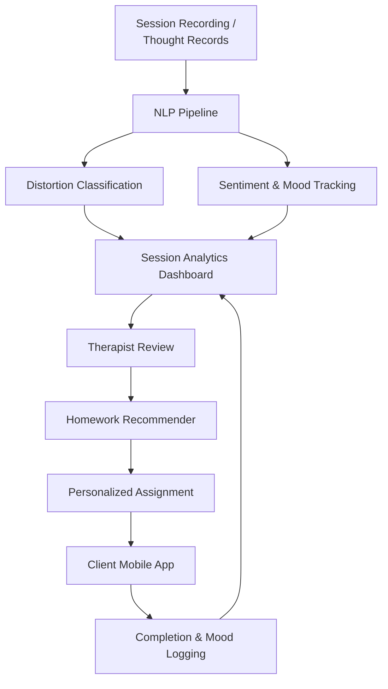
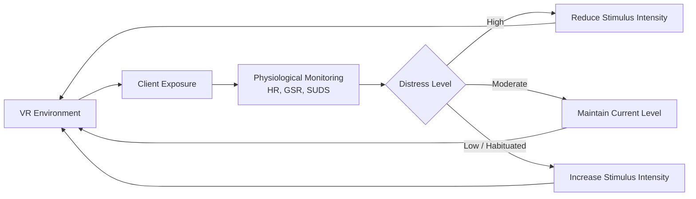

# Cognitive Behavioral Therapy and AI

## Overview

Cognitive Behavioral Therapy (CBT) is one of the most empirically validated psychotherapeutic approaches, effective for depression, anxiety, PTSD, OCD, and numerous other conditions. The cognitive model posits that distressing emotions arise not from events themselves but from the interpretations and automatic thoughts a person attaches to those events. A core therapeutic activity is identifying cognitive distortions — systematic errors in thinking such as catastrophizing, black-and-white thinking, or overgeneralization — and restructuring them into more balanced appraisals.

CBT is highly structured, making it unusually amenable to computational augmentation. Sessions follow predictable phases: mood check, agenda setting, thought record review, skill teaching, and homework assignment. Between sessions, clients complete structured worksheets, behavioral experiments, and exposure exercises. This structure generates data that AI systems can analyze, track, and personalize.

AI enters the CBT workflow at multiple points. Natural language processing models classify automatic thoughts and detect cognitive distortions in session transcripts and thought records. Recommender systems suggest homework assignments tailored to the client's current symptom profile and progress trajectory. Virtual reality platforms deliver graduated exposure therapy for phobias and PTSD. Chatbot-based CBT delivery systems extend therapeutic reach to populations with limited access to trained therapists.

The promise is not to replace the therapeutic relationship — which remains a strong predictor of outcome — but to augment it: giving therapists richer session analytics, ensuring homework adherence, and adapting treatment protocols in real time based on symptom trajectories. This lesson covers the cognitive model, how NLP extracts clinically relevant signals from therapy data, and how AI systems personalize and scale CBT.

## Key Concepts

- **Cognitive model**: The ABC framework — Activating event, Beliefs, Consequences (emotional and behavioral)
- **Automatic thoughts**: Rapid, involuntary cognitions that mediate between events and emotional responses
- **Cognitive distortions**: Systematic thinking errors (e.g., catastrophizing, mind reading, all-or-nothing thinking)
- **Thought records**: Structured worksheets for capturing and reappraising automatic thoughts
- **NLP for CBT**: Text classification of distortions, sentiment tracking, and session summarization
- **Behavioral activation**: Scheduling rewarding activities to counteract avoidance and low mood
- **VR-based exposure therapy**: Graduated virtual exposure for phobias, social anxiety, and PTSD

## Technical Details

### The Cognitive Model and Computational Representation

The ABC model represents a therapeutic episode as a triple $(A, B, C)$ where $A$ is the activating event, $B$ is the set of beliefs or automatic thoughts, and $C$ is the emotional consequence. A thought record captures this structure along with a restructured alternative belief $B'$ and the resulting adjusted emotion $C'$.

Computationally, each thought record entry can be represented as:

$$\mathbf{t} = (\text{enc}(A),\ \text{enc}(B),\ c_{\text{emotion}},\ d_{\text{distortion}},\ \text{enc}(B'),\ c'_{\text{emotion}})$$

where $\text{enc}(\cdot)$ is a text embedding function, $c_{\text{emotion}} \in [0, 10]$ is an emotion intensity rating, and $d_{\text{distortion}} \in \{0, 1\}^K$ is a binary vector over $K$ distortion types.

### NLP for Cognitive Distortion Classification

Given a sentence from a thought record or session transcript, a classifier predicts which cognitive distortions are present. This is a multi-label classification problem. A fine-tuned transformer model takes the text as input and produces a probability over distortion categories:

$$P(d_k = 1 \mid \text{text}) = \sigma(\mathbf{w}_k^\top \mathbf{h}_{\text{[CLS]}} + b_k)$$

where $\mathbf{h}_{\text{[CLS]}}$ is the pooled representation from a BERT-like encoder and $\sigma$ is the sigmoid function. Common distortion labels include catastrophizing, overgeneralization, mental filtering, personalization, and emotional reasoning.

### Homework Recommendation and Progress Tracking

CBT homework adherence is one of the strongest predictors of treatment outcome. An AI system can model a client's progress as a time series of symptom scores $\{s_1, s_2, \ldots, s_T\}$ (e.g., weekly PHQ-9) and homework completion rates $\{h_1, h_2, \ldots, h_T\}$. A recommender selects the next homework assignment $a_{T+1}$ from a library of CBT exercises by maximizing expected symptom improvement:

$$a_{T+1} = \arg\max_{a \in \mathcal{A}} \mathbb{E}[\Delta s_{T+1} \mid \mathbf{s}_{1:T}, \mathbf{h}_{1:T}, a]$$

This can be implemented as a contextual bandit or a simple regression model trained on historical session-outcome pairs.

### VR-Based Exposure Therapy

Exposure therapy requires presenting feared stimuli in a graduated hierarchy. VR environments allow precise control over stimulus intensity. AI adapts the exposure level in real time by monitoring physiological signals (heart rate, galvanic skin response) and self-reported distress (Subjective Units of Distress Scale, SUDS). If SUDS exceeds a threshold, the system reduces stimulus intensity; if habituation plateaus, it increases exposure.

## Code Examples

```python
import numpy as np
from transformers import AutoTokenizer, AutoModelForSequenceClassification
import torch

# Cognitive distortion classifier using a fine-tuned transformer
DISTORTION_LABELS = [
    "catastrophizing", "all_or_nothing", "overgeneralization",
    "mind_reading", "emotional_reasoning", "personalization",
    "mental_filtering", "should_statements"
]

# Load a fine-tuned model (placeholder name for illustration)
tokenizer = AutoTokenizer.from_pretrained("bert-base-uncased")
model = AutoModelForSequenceClassification.from_pretrained(
    "bert-base-uncased", num_labels=len(DISTORTION_LABELS)
)
model.eval()

def classify_distortions(thought_text: str, threshold: float = 0.5):
    """Classify cognitive distortions in a thought record entry."""
    inputs = tokenizer(thought_text, return_tensors="pt", truncation=True, max_length=128)
    with torch.no_grad():
        logits = model(**inputs).logits
    probs = torch.sigmoid(logits).squeeze().numpy()
    detected = {
        DISTORTION_LABELS[i]: float(probs[i])
        for i in range(len(DISTORTION_LABELS))
        if probs[i] > threshold
    }
    return detected

# Example thought record entries
thoughts = [
    "If I fail this exam, my entire career is over and I'll never recover.",
    "She didn't reply to my text, so she must hate me.",
    "I made one mistake in the presentation, the whole thing was a disaster.",
]

for thought in thoughts:
    result = classify_distortions(thought)
    print(f"Thought: {thought}")
    print(f"  Detected distortions: {result}\n")


# Simple homework recommender using contextual features
def recommend_homework(symptom_scores, completion_rates, exercise_library):
    """Recommend next CBT homework based on recent symptom trajectory."""
    recent_trend = np.mean(np.diff(symptom_scores[-4:]))  # slope of last 4 weeks
    avg_completion = np.mean(completion_rates[-4:])

    if recent_trend > 0 and avg_completion < 0.5:
        # Worsening symptoms, low adherence -> simple behavioral activation
        category = "behavioral_activation"
    elif recent_trend > 0 and avg_completion >= 0.5:
        # Worsening despite adherence -> cognitive restructuring
        category = "cognitive_restructuring"
    elif recent_trend <= 0 and avg_completion >= 0.7:
        # Improving, good adherence -> advance to exposure exercises
        category = "exposure"
    else:
        category = "behavioral_activation"

    candidates = [ex for ex in exercise_library if ex["category"] == category]
    return candidates[0] if candidates else exercise_library[0]

exercise_library = [
    {"name": "Pleasant Activity Scheduling", "category": "behavioral_activation"},
    {"name": "Thought Record Worksheet", "category": "cognitive_restructuring"},
    {"name": "Graded Exposure Hierarchy", "category": "exposure"},
]

scores = [18, 16, 17, 15, 13, 11]  # PHQ-9 over 6 weeks
completion = [0.4, 0.6, 0.7, 0.8, 0.9, 0.85]
rec = recommend_homework(scores, completion, exercise_library)
print(f"Recommended homework: {rec['name']}")
```

## Diagrams

**AI-Augmented CBT Session Workflow**



**Adaptive VR Exposure Therapy Control Loop**



## Applications & Case Studies

- **Woebot**: A conversational agent delivering CBT techniques via text chat. Built on a decision-tree dialogue framework augmented with NLP for mood detection and thought reframing. A Stanford RCT showed significant reductions in depression symptoms over two weeks compared to a psychoeducation control group.
- **Wysa**: An AI chatbot that combines CBT, dialectical behavior therapy (DBT), and mindfulness techniques. Deployed across 65 countries, Wysa uses sentiment analysis to route users to appropriate therapeutic modules and escalates to human therapists when risk is detected.
- **Bravemind (USC Institute for Creative Technologies)**: A VR-based exposure therapy platform for combat-related PTSD in veterans. Uses customizable virtual environments (convoy routes, village scenarios) with clinician-controlled stimulus intensity. Clinical trials demonstrated significant PTSD symptom reduction comparable to prolonged exposure therapy.
- **Lumen (Ieso Digital Health)**: NLP-based session analysis platform that processes CBT session transcripts to quantify therapist fidelity to CBT protocols. Identified that specific therapist language patterns (e.g., use of change-talk vs. sustain-talk) predicted patient outcomes, enabling targeted therapist training.

## Further Reading

- Beck, J. S. *Cognitive Behavior Therapy: Basics and Beyond*, 3rd ed. Guilford Press, 2020.
- Fitzpatrick, K. K., Darcy, A., & Vierhile, M. "Delivering cognitive behavior therapy to young adults with symptoms of depression via a fully automated conversational agent (Woebot)." *JMIR Mental Health* 4.2 (2017): e19.
- Rizzo, A., & Shilling, R. "Clinical Virtual Reality tools to advance the prevention, assessment, and treatment of PTSD." *European Journal of Psychotraumatology* 8.sup5 (2017): 1414560.
- Shatte, A. B., Hutchinson, D. M., & Teague, S. J. "Machine learning in mental health: a scoping review." *Psychological Medicine* 49.9 (2019): 1426-1448.
- Ewbank, M. P., et al. "Quantifying the association between psychotherapy content and clinical outcomes using deep learning." *JAMA Psychiatry* 77.1 (2020): 35-43.
