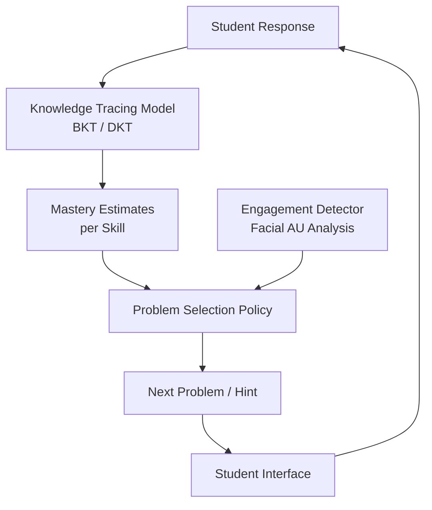
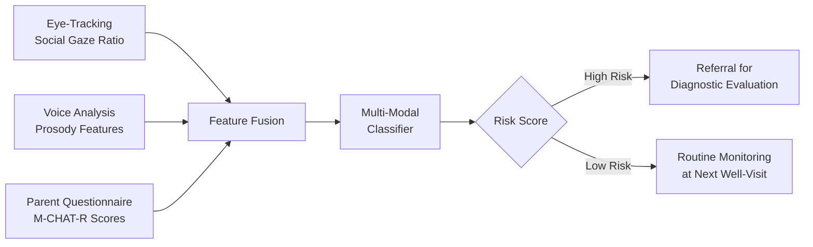

# AI for Developmental and Educational Psychology

## Overview

Developmental psychology studies how cognitive, social, and motor abilities emerge across the lifespan, while educational psychology applies that knowledge to optimize learning. Both fields generate rich behavioral data — from infant eye-tracking recordings to student interaction logs in learning platforms — that machine learning can transform into actionable insights.

Early detection of developmental delays is critical. The Centers for Disease Control and Prevention (CDC) defines milestones for motor, language, cognitive, and social-emotional development at specific ages. When a child misses milestones, early intervention dramatically improves outcomes. Yet pediatric screening relies on brief clinical encounters and parent questionnaires that miss up to 50% of children with developmental delays. AI tools that continuously monitor behavioral signals — through computer vision analysis of motor development, voice analysis for language milestones, and eye-tracking for social attention patterns — promise earlier and more reliable detection.

In education, intelligent tutoring systems (ITS) adapt instruction to individual learner needs in real time. These systems model student knowledge states, predict which concepts a learner has mastered, and select optimal next problems or explanations. Attention and engagement detection through facial expression analysis and interaction patterns enables tutors to adjust pacing and difficulty dynamically.

Autism spectrum disorder (ASD) screening represents a particularly impactful application. ASD affects approximately 1 in 36 children in the United States, yet the median age of diagnosis remains around 4.5 years, well past the window when early intervention is most effective. AI-powered screening tools using eye-tracking, voice prosody analysis, and parent-reported behavioral questionnaires aim to lower the age of reliable screening to 18 months or earlier. This lesson covers the technical foundations of these systems and the evidence supporting their deployment.

## Key Concepts

- **Developmental milestones**: CDC-defined behavioral benchmarks (motor, language, cognitive, social-emotional) at specific ages
- **Intelligent tutoring systems (ITS)**: Adaptive software that models learner knowledge and selects instructional actions
- **Knowledge tracing**: Probabilistic models that estimate which skills a student has mastered over time
- **Autism screening**: AI tools analyzing eye-tracking, voice, and behavioral data to detect ASD risk early
- **Computer vision for motor development**: Pose estimation and movement analysis to track gross and fine motor milestones
- **Engagement detection**: Facial expression and interaction pattern analysis to infer learner attention and affect

## Technical Details

### Knowledge Tracing for Adaptive Tutoring

Bayesian Knowledge Tracing (BKT) is the foundational model for ITS. For each skill $k$, the model maintains a latent mastery state $L_t^k \in \{0, 1\}$ and updates it after each student response. The transition and emission parameters are:

- $P(L_0^k = 1)$: prior probability of initial mastery
- $P(L_{t+1}^k = 1 \mid L_t^k = 0) = p_T$: probability of learning (transition)
- $P(\text{correct} \mid L_t^k = 1) = 1 - p_S$: probability of not slipping
- $P(\text{correct} \mid L_t^k = 0) = p_G$: probability of guessing

After observing response $o_t$, the posterior mastery probability is updated via Bayes' rule:

$$P(L_t = 1 \mid o_t) = \frac{P(o_t \mid L_t = 1) P(L_t = 1)}{P(o_t)}$$

Deep Knowledge Tracing (DKT) replaces this with an LSTM that takes a sequence of (question, correctness) pairs and predicts the probability of answering the next question correctly, capturing richer temporal dependencies.

### Computer Vision for Motor Milestone Tracking

Pose estimation models such as OpenPose or MediaPipe extract skeletal keypoints from video of infants and toddlers. From the keypoint time series $\{\mathbf{p}_t\}_{t=1}^{T}$ where $\mathbf{p}_t \in \mathbb{R}^{J \times 2}$ for $J$ joints, movement features are derived:

- **Range of motion**: $\text{ROM}_j = \max_t \theta_j(t) - \min_t \theta_j(t)$ for joint angle $\theta_j$
- **Movement symmetry**: $\text{sym} = 1 - \frac{|\text{ROM}_{\text{left}} - \text{ROM}_{\text{right}}|}{\text{ROM}_{\text{left}} + \text{ROM}_{\text{right}}}$
- **Movement complexity**: Sample entropy of the acceleration signal

These features feed classifiers that flag delayed motor development compared to age-normed reference distributions.

### AI-Powered Autism Screening

Eye-tracking analysis for ASD screening measures preferential looking patterns. Typically developing infants show a strong preference for faces and eyes; children at risk for ASD often show reduced social attention. The gaze fixation ratio is computed as:

$$r_{\text{social}} = \frac{\sum_{t} \mathbb{1}[\mathbf{g}_t \in \text{AOI}_{\text{social}}]}{\sum_{t} \mathbb{1}[\mathbf{g}_t \in \text{AOI}_{\text{any}}]}$$

where $\mathbf{g}_t$ is the gaze point at time $t$ and $\text{AOI}_{\text{social}}$ is the area of interest covering faces and eyes. Combined with voice prosody features (pitch variability, pause duration) and parent questionnaire scores, multi-modal classifiers achieve AUC values above 0.90 for ASD risk detection in toddlers.

### Attention and Engagement Detection

Learner engagement is modeled from facial action units (AUs) detected via CNNs. Key indicators include AU4 (brow lowerer, indicating concentration), AU12 (lip corner puller, indicating enjoyment), and AU45 (blink rate, indicating fatigue). An engagement score can be formulated as:

$$e_t = \sigma(\mathbf{w}^\top \mathbf{a}_t + b)$$

where $\mathbf{a}_t$ is the action unit activation vector at time $t$. This score modulates the ITS difficulty selection policy.

## Code Examples

```python
import numpy as np

class BayesianKnowledgeTracing:
    """Standard BKT model for a single skill."""

    def __init__(self, p_L0=0.1, p_T=0.2, p_S=0.05, p_G=0.25):
        self.p_L0 = p_L0  # prior mastery
        self.p_T = p_T      # learn rate
        self.p_S = p_S      # slip rate
        self.p_G = p_G      # guess rate
        self.p_L = p_L0     # current mastery estimate

    def update(self, correct: bool) -> float:
        """Update mastery estimate after observing a response."""
        # Likelihood of observed response given mastery state
        if correct:
            p_obs_given_L1 = 1 - self.p_S
            p_obs_given_L0 = self.p_G
        else:
            p_obs_given_L1 = self.p_S
            p_obs_given_L0 = 1 - self.p_G

        # Posterior via Bayes' rule
        numerator = p_obs_given_L1 * self.p_L
        denominator = numerator + p_obs_given_L0 * (1 - self.p_L)
        p_L_posterior = numerator / denominator

        # Incorporate learning transition
        self.p_L = p_L_posterior + (1 - p_L_posterior) * self.p_T
        return self.p_L

    def predict_correct(self) -> float:
        """Predict probability of answering next question correctly."""
        return self.p_L * (1 - self.p_S) + (1 - self.p_L) * self.p_G

# Simulate a student learning a skill over 15 practice problems
bkt = BayesianKnowledgeTracing(p_L0=0.05, p_T=0.15, p_S=0.05, p_G=0.2)

# Simulated response sequence: starts struggling, improves
responses = [False, False, True, False, True, True, False, True, True, True, True, True, True, True, True]

print("Trial | Correct | P(Mastery) | P(Next Correct)")
print("-" * 50)
for i, correct in enumerate(responses):
    p_next = bkt.predict_correct()
    p_mastery = bkt.update(correct)
    print(f"  {i+1:2d}  |  {'Y' if correct else 'N':^7s} |   {p_mastery:.3f}    |     {p_next:.3f}")

# Eye-tracking autism screening feature extraction
def compute_social_gaze_ratio(gaze_points, social_aoi, screen_bounds):
    """
    Compute ratio of gaze time on social areas of interest.

    Args:
        gaze_points: array of shape (T, 2) with (x, y) gaze coordinates
        social_aoi: dict with keys 'x_min', 'x_max', 'y_min', 'y_max'
        screen_bounds: dict with keys 'width', 'height'
    Returns:
        Social gaze ratio (float)
    """
    valid_mask = (
        (gaze_points[:, 0] >= 0) & (gaze_points[:, 0] <= screen_bounds["width"]) &
        (gaze_points[:, 1] >= 0) & (gaze_points[:, 1] <= screen_bounds["height"])
    )
    social_mask = (
        (gaze_points[:, 0] >= social_aoi["x_min"]) &
        (gaze_points[:, 0] <= social_aoi["x_max"]) &
        (gaze_points[:, 1] >= social_aoi["y_min"]) &
        (gaze_points[:, 1] <= social_aoi["y_max"])
    )
    total_valid = valid_mask.sum()
    if total_valid == 0:
        return 0.0
    return float((valid_mask & social_mask).sum()) / total_valid

# Example: simulated eye-tracking data
np.random.seed(42)
n_frames = 1000
gaze = np.column_stack([
    np.random.normal(640, 200, n_frames),  # x centered on screen
    np.random.normal(360, 150, n_frames),  # y centered on screen
])
face_aoi = {"x_min": 500, "x_max": 780, "y_min": 200, "y_max": 450}
screen = {"width": 1280, "height": 720}

ratio = compute_social_gaze_ratio(gaze, face_aoi, screen)
print(f"\nSocial gaze ratio: {ratio:.3f}")
print(f"Typical developing range: 0.40 - 0.65")
print(f"ASD risk indicator: below 0.25")
```

## Diagrams

**Intelligent Tutoring System Architecture**



**Multi-Modal Autism Screening Pipeline**



## Applications & Case Studies

- **Cognoa**: An FDA-authorized AI-based diagnostic tool for autism in children aged 18 months to 5 years. Uses parent-reported behavioral observations and short video analysis processed by ML classifiers. Achieved sensitivity of 98% and specificity of 79% in clinical validation trials, enabling earlier diagnosis in primary care settings.
- **Carnegie Learning MATHia**: An ITS for middle and high school mathematics built on Bayesian knowledge tracing and cognitive tutoring principles from Carnegie Mellon University. Randomized controlled trials showed students using MATHia outperformed control groups by 0.2-0.3 standard deviations on standardized math assessments.
- **LENA (Language Environment Analysis)**: A wearable device and AI system that records a child's language environment and uses speech recognition to count adult words, child vocalizations, and conversational turns. Used in developmental screening programs to identify children at risk for language delays. Studies showed LENA metrics at 18 months predicted language outcomes at age 3.
- **AffectNet and Engagement Detection (Worcester Polytechnic Institute)**: Research on using facial expression analysis in online learning platforms to detect learner frustration, boredom, and confusion. Models trained on the AffectNet dataset were integrated into the ASSISTments tutoring platform, demonstrating that engagement-aware problem selection improved learning gains by 12%.

## Further Reading

- Corbett, A. T., & Anderson, J. R. "Knowledge tracing: Modeling the acquisition of procedural knowledge." *User Modeling and User-Adapted Interaction* 4.4 (1994): 253-278.
- Picard, C., et al. "Deep knowledge tracing." *NeurIPS* (2015).
- Hashemi, J., et al. "Computer vision tools for low-cost and noninvasive measurement of autism-related behaviors in infants." *Autism Research and Treatment* (2014): 935686.
- Abbas, H., et al. "Machine learning approach for early detection of autism by combining questionnaire and home video screening." *JAMIA* 25.8 (2018): 1000-1007.
- D'Mello, S. K., & Graesser, A. C. "Dynamics of affective states during complex learning." *Learning and Instruction* 22.2 (2012): 145-157.
