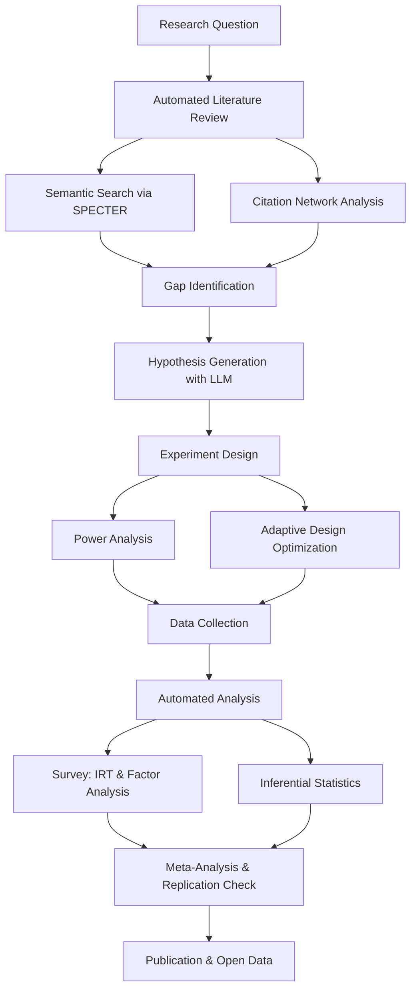
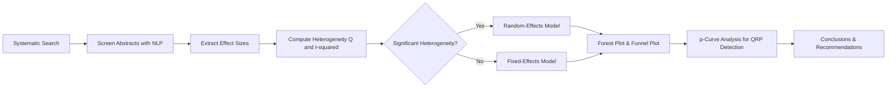

# Psychology Research Automation with AI

## Overview

Psychology research has long grappled with a bottleneck that is both human and structural: the sheer volume of published literature, the complexity of experimental design, and the labor-intensive nature of data analysis. With over 100,000 psychology-related papers published annually across thousands of journals, no individual researcher can maintain comprehensive awareness of even a narrow subfield. Add to this the replication crisis -- where an estimated 50-70% of classic findings fail to replicate -- and the field faces an urgent need for systematic, scalable research tools.

AI is transforming every stage of the psychology research pipeline. At the front end, large language models (LLMs) and semantic search engines automate literature review by parsing abstracts, extracting key findings, and mapping citation networks. In experimental design, machine learning assists with statistical power analysis, optimal stimulus selection, and adaptive testing protocols. For survey research, AI-driven factor analysis and item response theory (IRT) models improve scale construction and validation. Downstream, LLMs can generate novel hypotheses by identifying gaps in existing literature and synthesizing findings across disparate subfields.

Perhaps most consequentially, AI offers concrete tools to address the replication crisis. Automated meta-analysis pipelines can aggregate effect sizes across hundreds of studies, flag questionable research practices (QRPs) such as $p$-hacking and HARKing, and estimate the true effect size distribution for a given phenomenon. These tools do not replace the scientist but amplify the rigor and reach of psychological inquiry.

This lesson covers seven core areas: automated literature review, experiment design assistance, survey analysis with ML, participant screening, hypothesis generation, replication crisis solutions, and meta-analysis automation. Each section includes technical details, working code, and references to real systems in active use.

## Key Concepts

- **Semantic search**: Retrieving papers by meaning rather than keyword match, using dense vector embeddings (e.g., Sentence-BERT, SPECTER).
- **Citation network analysis**: Graph-based methods (PageRank, co-citation clustering) to identify influential papers and emerging research fronts.
- **Statistical power analysis**: Computing the sample size $n$ needed to detect an effect of size $d$ at significance level $\alpha$ with power $1 - \beta$.
- **Item Response Theory (IRT)**: Probabilistic models relating latent traits $\theta$ to item responses, e.g., the two-parameter logistic model: $$P(X_i = 1 | \theta) = \frac{1}{1 + e^{-a_i(\theta - b_i)}}$$ where $a_i$ is discrimination and $b_i$ is difficulty.
- **Factor analysis**: Identifying latent constructs from observed variables, with ML used for rotation selection, model comparison, and cross-validation.
- **Meta-analysis**: Aggregating effect sizes across studies using random-effects models: $$\hat{\mu} = \frac{\sum w_i \hat{\theta}_i}{\sum w_i}, \quad w_i = \frac{1}{\sigma_i^2 + \tau^2}$$
- **Hypothesis generation**: Using LLMs to propose testable predictions from literature gaps, analogical reasoning, or cross-domain transfer.
- **Questionable Research Practices (QRPs)**: $p$-hacking, HARKing (Hypothesizing After Results are Known), and selective reporting, detectable via $p$-curve analysis and statistical forensics.

## Technical Details

### Automated Literature Review

Modern literature review automation relies on two complementary approaches: semantic search and citation network analysis. Semantic search encodes queries and paper abstracts into a shared embedding space using models like SPECTER (trained on scientific citations) or SciBERT. The cosine similarity between query vector $\mathbf{q}$ and document vector $\mathbf{d}$ determines relevance:

$$\text{sim}(\mathbf{q}, \mathbf{d}) = \frac{\mathbf{q} \cdot \mathbf{d}}{||\mathbf{q}|| \, ||\mathbf{d}||}$$

The Semantic Scholar API provides programmatic access to over 200 million papers with metadata, abstracts, citation counts, and embedding-based recommendations. Citation network analysis complements this by using graph algorithms -- co-citation clustering groups papers that are frequently cited together, while bibliographic coupling links papers sharing references.

### Experiment Design Assistance

AI assists experimental design through automated power analysis and optimal design search. For a two-sample $t$-test detecting effect size $d$, the required sample size per group is approximately:

$$n \approx \frac{(z_{1-\alpha/2} + z_{1-\beta})^2 \cdot 2}{d^2}$$

Beyond simple calculations, Bayesian optimization can search over factorial design spaces to find stimulus sets, trial counts, and counterbalancing schemes that maximize statistical power while minimizing participant burden. Adaptive sequential designs use interim analyses to stop data collection early when evidence is conclusive, reducing waste.

### Survey Analysis with ML

Traditional exploratory factor analysis (EFA) requires researchers to choose the number of factors, rotation method, and extraction algorithm. ML automates these decisions via cross-validated parallel analysis, information criteria (BIC, AIC), and automated rotation comparison. IRT models fitted with expectation-maximization or variational inference provide item-level diagnostics: discrimination ($a$), difficulty ($b$), and information functions that reveal where on the latent trait continuum each item is most informative.

### Hypothesis Generation and Replication

LLMs such as GPT-4 and Claude can generate hypotheses by synthesizing patterns across large literature corpora. Prompt engineering techniques include structured prompts that provide a theoretical framework, known findings, and constraints, then ask the model to propose novel, testable predictions. For replication, AI tools perform automated $p$-curve analysis -- if a set of studies contains a true effect, the distribution of significant $p$-values should be right-skewed (clustered near $p = 0$). A uniform or left-skewed distribution suggests $p$-hacking.

## Code Examples

### Automated Literature Search with Semantic Scholar API

```python
import requests
from typing import List, Dict

def search_psychology_papers(
    query: str,
    limit: int = 20,
    fields: str = "title,abstract,citationCount,year,authors"
) -> List[Dict]:
    """Search Semantic Scholar for psychology papers."""
    url = "https://api.semanticscholar.org/graph/v1/paper/search"
    params = {
        "query": query,
        "limit": limit,
        "fields": fields,
        "fieldsOfStudy": "Psychology"
    }
    response = requests.get(url, params=params)
    response.raise_for_status()
    return response.json().get("data", [])

def build_citation_network(paper_ids: List[str]) -> Dict[str, List[str]]:
    """Build a citation adjacency list from Semantic Scholar paper IDs."""
    network = {}
    for pid in paper_ids:
        url = f"https://api.semanticscholar.org/graph/v1/paper/{pid}"
        params = {"fields": "citations.paperId"}
        resp = requests.get(url, params=params)
        if resp.status_code == 200:
            citations = resp.json().get("citations", [])
            network[pid] = [c["paperId"] for c in citations if c["paperId"]]
    return network

# Example: search for replication crisis papers
papers = search_psychology_papers("replication crisis effect size")
for p in papers[:5]:
    print(f"[{p['year']}] {p['title']} (cited {p['citationCount']}x)")
```

### Automated Power Analysis and Design Optimization

```python
import numpy as np
from scipy import stats

def power_analysis_ttest(
    effect_size: float,
    alpha: float = 0.05,
    power: float = 0.80
) -> int:
    """Compute required n per group for a two-sample t-test."""
    z_alpha = stats.norm.ppf(1 - alpha / 2)
    z_beta = stats.norm.ppf(power)
    n = int(np.ceil(2 * ((z_alpha + z_beta) ** 2) / (effect_size ** 2)))
    return n

def bayesian_design_search(
    effect_sizes: np.ndarray,
    n_simulations: int = 1000
) -> Dict[str, float]:
    """Simulate power across a grid of sample sizes for given effect sizes."""
    results = {}
    for n in [20, 50, 100, 200, 500]:
        powers = []
        for d in effect_sizes:
            rejections = 0
            for _ in range(n_simulations):
                group1 = np.random.normal(0, 1, n)
                group2 = np.random.normal(d, 1, n)
                _, p_val = stats.ttest_ind(group1, group2)
                if p_val < 0.05:
                    rejections += 1
            powers.append(rejections / n_simulations)
        results[f"n={n}"] = np.mean(powers)
    return results

# Example: typical small-to-medium effects in psychology
print(f"n per group for d=0.3: {power_analysis_ttest(0.3)}")
print(f"n per group for d=0.5: {power_analysis_ttest(0.5)}")

design_power = bayesian_design_search(np.array([0.2, 0.3, 0.5]))
for k, v in design_power.items():
    print(f"  {k}: average power = {v:.2f}")
```

### Meta-Analysis with Random-Effects Model

```python
import numpy as np

def random_effects_meta(
    effect_sizes: np.ndarray,
    variances: np.ndarray
) -> Dict[str, float]:
    """Compute a DerSimonian-Laird random-effects meta-analysis."""
    weights_fixed = 1.0 / variances
    mu_fixed = np.sum(weights_fixed * effect_sizes) / np.sum(weights_fixed)

    # Estimate between-study variance (tau^2)
    Q = np.sum(weights_fixed * (effect_sizes - mu_fixed) ** 2)
    k = len(effect_sizes)
    c = np.sum(weights_fixed) - np.sum(weights_fixed ** 2) / np.sum(weights_fixed)
    tau2 = max(0, (Q - (k - 1)) / c)

    # Random-effects weights and pooled estimate
    weights_re = 1.0 / (variances + tau2)
    mu_re = np.sum(weights_re * effect_sizes) / np.sum(weights_re)
    se_re = np.sqrt(1.0 / np.sum(weights_re))

    return {
        "pooled_effect": mu_re,
        "se": se_re,
        "tau2": tau2,
        "Q": Q,
        "I2": max(0, (Q - (k - 1)) / Q) if Q > 0 else 0,
        "ci_lower": mu_re - 1.96 * se_re,
        "ci_upper": mu_re + 1.96 * se_re,
    }

# Example: ego depletion meta-analysis (simulated data)
effects = np.array([0.62, 0.45, 0.10, 0.55, 0.30, -0.05, 0.40, 0.25])
variances = np.array([0.04, 0.06, 0.08, 0.05, 0.07, 0.09, 0.05, 0.06])

result = random_effects_meta(effects, variances)
print(f"Pooled effect: {result['pooled_effect']:.3f} "
      f"[{result['ci_lower']:.3f}, {result['ci_upper']:.3f}]")
print(f"Heterogeneity: I² = {result['I2']:.1%}, tau² = {result['tau2']:.4f}")
```

## Diagrams

**Psychology Research Automation Pipeline**



**Meta-Analysis Workflow**



## Applications & Case Studies

- **Semantic Scholar** (Allen Institute for AI): Provides free API access to over 200 million academic papers with AI-powered relevance ranking, citation context extraction, and TLDR summaries. Widely used for automated psychology literature reviews.
- **GRIM and SPRITE tests** (Brown & Heathers, 2017): Statistical forensics tools that detect impossible or implausible summary statistics in published papers. GRIM checks whether reported means are consistent with integer-valued data; SPRITE reconstructs possible distributions.
- **Elicit** (Ought): An AI research assistant that uses LLMs to find relevant papers, extract claims, and synthesize findings. Psychology researchers use it for rapid systematic reviews and evidence mapping.
- **statcheck** (Nuijten et al., 2016): An R package and web app that automatically detects statistical reporting errors in APA-formatted papers, finding that approximately 50% of published psychology articles contain at least one inconsistency.
- **PsyArXiv + OSF** (Center for Open Science): The Open Science Framework hosts preregistrations, data, and materials, enabling AI tools to cross-reference registered hypotheses against reported results to detect HARKing.
- **AutoML for IRT** (Embretson & Reise): Modern implementations use gradient-based optimization and variational autoencoders to fit complex IRT models (multidimensional, nonparametric) to survey data at scale.
- **Research Rabbit**: A citation-based discovery tool that builds visual networks of related papers and recommends new literature based on a researcher's existing library.

## Further Reading

- Semantic Scholar API documentation: https://api.semanticscholar.org/
- Simmons, J. P., Nelson, L. D., & Simonsohn, U. (2011). "False-Positive Psychology." *Psychological Science*, 22(11), 1359-1366.
- Nuijten, M. B. et al. (2016). "The prevalence of statistical reporting errors in psychology (1985-2013)." *Behavior Research Methods*, 48, 1205-1226.
- Open Science Collaboration. (2015). "Estimating the reproducibility of psychological science." *Science*, 349(6251), aac4716.
- van Rooij, I., & Baggio, G. (2021). "Theory before the test: How to build high-verisimilitude explanatory theories in psychological science." *Perspectives on Psychological Science*, 16(4), 756-766.
- Bail, C. A. (2024). "Can Generative AI Improve Social Science?" *Proceedings of the National Academy of Sciences*, 121(21).
- Borsboom, D. et al. (2021). "Network analysis of multivariate data in psychological science." *Nature Reviews Methods Primers*, 1, 58.
