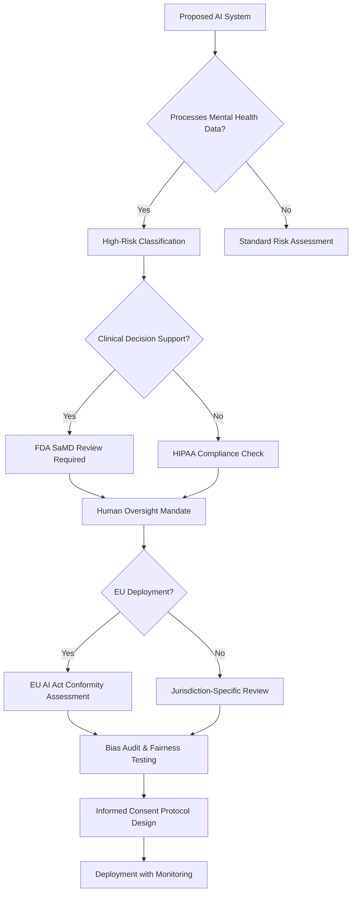
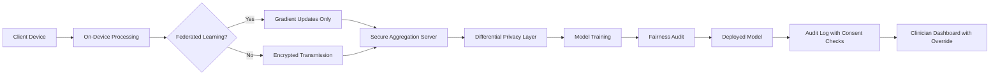

# Ethics, Privacy, and Limits in AI for Psychology

## Overview

The integration of AI into psychological practice and research raises profound ethical questions that extend far beyond standard data science concerns. Mental health data is among the most sensitive information a person can generate -- therapy transcripts, mood logs, cognitive test scores, and behavioral patterns reveal intimate details about thought processes, emotional states, and personal vulnerabilities. When AI systems process this data, the stakes of misuse, breach, or bias are exceptionally high.

Informed consent in AI-assisted therapy presents unique challenges. A client entering therapy may understand that a human clinician will maintain confidentiality, but the implications of their speech being processed by a natural language model, stored on cloud servers, or used to train future systems are far less intuitive. Algorithm aversion -- the well-documented tendency for people to distrust algorithmic judgment even when it outperforms human judgment -- creates an additional barrier: clients may reject beneficial AI tools simply because they are automated, or conversely, may over-trust AI outputs with a veneer of scientific objectivity.

Depersonalization is another critical risk. Psychology fundamentally concerns the individual in context -- their history, relationships, culture, and subjective experience. AI systems that reduce persons to feature vectors or diagnostic probability distributions risk losing the very essence of psychological understanding. Cultural bias compounds this problem: models trained predominantly on Western, educated, industrialized, rich, and democratic (WEIRD) populations may systematically mischaracterize psychological phenomena in other cultural contexts.

The regulatory landscape is rapidly evolving. In the United States, HIPAA governs protected health information but was written before AI existed. The FDA regulates AI-based clinical decision support tools, while the EU AI Act classifies mental health applications as "high risk" requiring rigorous conformity assessments. This lesson examines each of these dimensions in depth, providing practitioners and researchers with the ethical framework needed to deploy AI responsibly in psychological contexts.

## Key Concepts

- **Informed consent**: The ethical and legal requirement that participants or clients understand what data is collected, how AI processes it, and what risks are involved, going beyond traditional consent to cover algorithmic decision-making.
- **HIPAA (Health Insurance Portability and Accountability Act)**: U.S. federal law establishing standards for protected health information (PHI), including psychotherapy notes which receive heightened protection.
- **GDPR (General Data Protection Regulation)**: EU regulation granting data subjects the right to explanation of automated decisions, data portability, and the right to be forgotten.
- **Algorithm aversion**: The empirical finding that people systematically discount algorithmic advice relative to human advice, even when the algorithm is demonstrably more accurate. Formally, if $\hat{y}_A$ is the algorithmic prediction and $\hat{y}_H$ is the human prediction, individuals weight: $$y_{\text{final}} = w \cdot \hat{y}_H + (1 - w) \cdot \hat{y}_A, \quad w > 0.5$$
- **WEIRD bias**: Systematic skew in psychological AI arising from training data dominated by Western, Educated, Industrialized, Rich, and Democratic populations.
- **Therapeutic alliance**: The collaborative bond between therapist and client, measured by scales like the Working Alliance Inventory (WAI), which may be disrupted by AI intermediation.
- **EU AI Act risk classification**: A tiered regulatory framework where AI systems in mental health are classified as "high risk," requiring conformity assessments, transparency obligations, and human oversight.
- **Duty of care**: The legal and ethical obligation of mental health professionals to act in the client's best interest, raising questions about liability when AI contributes to clinical decisions.

## Technical Details

### Data Privacy Architecture for Mental Health AI

Mental health data requires privacy protections beyond standard anonymization. Therapy transcripts contain identifying narratives even without names -- a description of workplace conflict, family dynamics, or trauma history can be re-identifying. Differential privacy offers a mathematical guarantee: for any two adjacent datasets $D$ and $D'$ differing in one individual, a mechanism $\mathcal{M}$ satisfies $\epsilon$-differential privacy if:

$$P[\mathcal{M}(D) \in S] \leq e^{\epsilon} \cdot P[\mathcal{M}(D') \in S]$$

The privacy budget $\epsilon$ controls the trade-off between utility and privacy. For mental health applications, practitioners typically require $\epsilon \leq 1.0$, meaning any individual's data changes the output by at most a factor of $e \approx 2.72$. Federated learning provides an alternative architecture where models train on-device and only gradient updates -- not raw data -- leave the client's device.

### Measuring and Mitigating Cultural Bias

Cultural bias in psychological AI manifests when models trained on one population generalize poorly to another. A depression screening model trained on PHQ-9 responses from North American samples may misclassify somatic presentations of depression common in East Asian populations, where psychological distress is more frequently expressed through physical symptoms. Fairness metrics formalize this concern. Equalized odds requires:

$$P(\hat{Y} = 1 | Y = 1, A = a) = P(\hat{Y} = 1 | Y = 1, A = b)$$

for all demographic groups $a, b$ and both positive and negative outcomes. Calibration across groups demands that the predicted probability matches the true probability within each subgroup. Achieving both simultaneously is generally impossible (the impossibility theorem of Chouldechova, 2017), forcing explicit trade-off decisions.

### Regulatory Compliance Framework

Under HIPAA, psychotherapy notes receive special protection beyond standard PHI -- they cannot be disclosed without explicit patient authorization even for treatment, payment, or operations. The EU AI Act (effective 2024-2026 in phases) classifies AI systems that evaluate emotional states, mental health conditions, or psychological profiles as "high risk," requiring: (1) a quality management system, (2) technical documentation, (3) record-keeping of automated decisions, (4) transparency to users, (5) human oversight mechanisms, and (6) accuracy and robustness benchmarks. The FDA's Digital Health Center of Excellence reviews AI-based Software as a Medical Device (SaMD) for clinical decision support in mental health, using a risk-based framework where higher-risk applications require premarket review.

### Algorithm Aversion and Trust Calibration

Empirical research by Dietvorst et al. (2015) demonstrated that after seeing an algorithm err, people are significantly less likely to use it -- even when it remains superior to human judgment. In mental health contexts, a single misclassification (e.g., failing to flag suicidal ideation) can permanently erode trust. Trust calibration strategies include providing confidence intervals rather than point predictions, allowing users to adjust algorithmic outputs (the "algorithm appreciation" effect), and transparent uncertainty communication.

## Code Examples

### Differential Privacy for Therapy Session Summaries

```python
import numpy as np
from typing import List, Dict

def add_laplace_noise(value: float, sensitivity: float, epsilon: float) -> float:
    """Add calibrated Laplace noise for epsilon-differential privacy."""
    scale = sensitivity / epsilon
    noise = np.random.laplace(0, scale)
    return value + noise

def private_aggregate_phq9(
    scores: List[int],
    epsilon: float = 1.0
) -> Dict[str, float]:
    """Compute differentially private aggregate statistics for PHQ-9 scores.

    PHQ-9 scores range from 0-27. Sensitivity for mean = 27/n.
    """
    n = len(scores)
    true_mean = np.mean(scores)
    true_std = np.std(scores)

    sensitivity_mean = 27.0 / n  # max change from one individual
    sensitivity_std = 27.0 / n   # approximate

    # Split privacy budget between statistics
    eps_mean = epsilon / 2
    eps_std = epsilon / 2

    private_mean = add_laplace_noise(true_mean, sensitivity_mean, eps_mean)
    private_std = add_laplace_noise(true_std, sensitivity_std, eps_std)

    return {
        "n": n,
        "private_mean": np.clip(private_mean, 0, 27),
        "private_std": max(0, private_std),
        "epsilon": epsilon,
        "true_mean": true_mean,  # would NOT be released in practice
    }

# Example: aggregate depression screening scores with privacy
np.random.seed(42)
phq9_scores = np.random.randint(0, 28, size=200).tolist()
result = private_aggregate_phq9(phq9_scores, epsilon=1.0)
print(f"Private mean PHQ-9: {result['private_mean']:.2f} "
      f"(true: {result['true_mean']:.2f})")
print(f"Private std: {result['private_std']:.2f}, epsilon: {result['epsilon']}")
```

### Fairness Audit for a Depression Classifier

```python
import numpy as np
from typing import Dict

def fairness_audit(
    y_true: np.ndarray,
    y_pred: np.ndarray,
    group: np.ndarray
) -> Dict[str, Dict[str, float]]:
    """Audit a binary classifier for fairness across demographic groups.

    Computes true positive rate (TPR), false positive rate (FPR),
    and positive predictive value (PPV) per group.
    """
    groups = np.unique(group)
    metrics = {}

    for g in groups:
        mask = group == g
        y_t = y_true[mask]
        y_p = y_pred[mask]

        tp = np.sum((y_p == 1) & (y_t == 1))
        fp = np.sum((y_p == 1) & (y_t == 0))
        fn = np.sum((y_p == 0) & (y_t == 1))
        tn = np.sum((y_p == 0) & (y_t == 0))

        tpr = tp / (tp + fn) if (tp + fn) > 0 else 0.0
        fpr = fp / (fp + tn) if (fp + tn) > 0 else 0.0
        ppv = tp / (tp + fp) if (tp + fp) > 0 else 0.0

        metrics[str(g)] = {"TPR": tpr, "FPR": fpr, "PPV": ppv}

    # Check equalized odds: TPR and FPR should be similar across groups
    tprs = [m["TPR"] for m in metrics.values()]
    fprs = [m["FPR"] for m in metrics.values()]
    metrics["disparity"] = {
        "max_TPR_gap": max(tprs) - min(tprs),
        "max_FPR_gap": max(fprs) - min(fprs),
    }
    return metrics

# Simulated depression classifier audit across cultural groups
np.random.seed(42)
n = 500
y_true = np.random.binomial(1, 0.3, n)
# Simulate bias: lower sensitivity for group B
group = np.array(["Western"] * 300 + ["Non-Western"] * 200)
y_pred = y_true.copy()
# Introduce systematic misclassification for Non-Western group
non_western_mask = group == "Non-Western"
somatic_cases = non_western_mask & (y_true == 1)
flip_indices = np.where(somatic_cases)[0][:10]
y_pred[flip_indices] = 0  # miss somatic presentations

audit = fairness_audit(y_true, y_pred, group)
for grp, m in audit.items():
    if grp != "disparity":
        print(f"{grp}: TPR={m['TPR']:.3f}, FPR={m['FPR']:.3f}, PPV={m['PPV']:.3f}")
print(f"Disparity: TPR gap={audit['disparity']['max_TPR_gap']:.3f}, "
      f"FPR gap={audit['disparity']['max_FPR_gap']:.3f}")
```

### Consent Tracking System for AI-Assisted Therapy

```python
from dataclasses import dataclass, field
from datetime import datetime
from typing import Optional, List
import json

@dataclass
class AIConsentRecord:
    """Track informed consent for AI components in therapy."""
    client_id: str
    consent_date: str
    ai_components: List[str]  # e.g., ["NLP_session_summary", "mood_tracking"]
    data_retention_days: int
    allows_model_training: bool
    allows_cloud_processing: bool
    human_override_guaranteed: bool
    withdrawal_mechanism: str
    version: str = "1.0"
    withdrawn: bool = False
    withdrawn_date: Optional[str] = None

    def withdraw(self) -> None:
        """Record consent withdrawal -- must trigger data deletion pipeline."""
        self.withdrawn = True
        self.withdrawn_date = datetime.now().isoformat()

    def is_valid_for(self, component: str) -> bool:
        """Check if consent covers a specific AI component."""
        if self.withdrawn:
            return False
        return component in self.ai_components

    def to_audit_log(self) -> str:
        """Generate HIPAA-compliant audit log entry."""
        return json.dumps({
            "client_id": self.client_id,
            "consent_date": self.consent_date,
            "components": self.ai_components,
            "cloud_processing": self.allows_cloud_processing,
            "model_training": self.allows_model_training,
            "withdrawn": self.withdrawn,
            "version": self.version,
        }, indent=2)

# Example usage
consent = AIConsentRecord(
    client_id="C-2024-0847",
    consent_date="2024-11-15",
    ai_components=["NLP_session_summary", "mood_tracking", "PHQ9_scoring"],
    data_retention_days=365,
    allows_model_training=False,
    allows_cloud_processing=False,
    human_override_guaranteed=True,
    withdrawal_mechanism="written_or_verbal_to_clinician"
)

print(f"Consent valid for mood tracking: {consent.is_valid_for('mood_tracking')}")
print(f"Consent valid for voice analysis: {consent.is_valid_for('voice_analysis')}")
print(f"\nAudit log:\n{consent.to_audit_log()}")
```

## Diagrams

**Ethical Risk Assessment Framework for AI in Psychology**



**Data Privacy Architecture for Mental Health AI**



## Applications & Case Studies

- **Woebot** (Woebot Health): An FDA-reviewed AI chatbot delivering CBT-based interventions. Woebot's development involved extensive IRB review, and the system explicitly states it is not a therapist, addressing therapeutic boundary concerns. Clinical trials showed significant reductions in PHQ-9 scores, but raised questions about informed consent when users form emotional attachments to the bot.
- **Crisis Text Line controversy** (2022): The organization faced backlash when it was revealed that anonymized crisis counseling data was shared with Loris.ai to train customer service AI. This case became a landmark example of inadequate informed consent -- texters in crisis did not anticipate their data would train commercial products.
- **Apple Health and mood tracking**: Apple's integration of mental health questionnaires (PHQ-9, GAD-7) into iOS Health raised HIPAA questions, as Apple is not a covered entity. Data stored on-device benefits from hardware encryption, but iCloud syncing introduces cloud privacy risks.
- **Fairness in NLP for suicidal ideation detection** (Ophir et al., 2022): Research showed that NLP models detecting suicidal ideation on social media exhibited differential performance across racial and gender groups, with higher false negative rates for non-white users due to linguistic variation in expressing distress.
- **EU AI Act high-risk classification**: The European Parliament classified emotion recognition systems and AI used for mental health assessment as high-risk (Annex III), requiring conformity assessments before market placement. This directly affects tools like Affectiva, Hume AI, and therapy chatbots operating in the EU.
- **APA Guidelines for AI** (American Psychological Association, 2023): The APA issued guidelines emphasizing that AI tools should augment rather than replace clinical judgment, that psychologists retain ultimate responsibility for treatment decisions, and that cultural competence must be verified for any AI tool used in practice.

## Further Reading

- Dietvorst, B. J., Simmons, J. P., & Massey, C. (2015). "Algorithm aversion: People erroneously avoid algorithms after seeing them err." *Journal of Experimental Psychology: General*, 144(1), 114-126.
- Chouldechova, A. (2017). "Fair prediction with disparate impact: A study of bias in recidivism prediction instruments." *Big Data*, 5(2), 153-163.
- Stoll, J., Muller, J. A., & Trachsel, M. (2020). "Ethical issues in online psychotherapy: A narrative review." *Frontiers in Psychiatry*, 10, 993.
- European Parliament. (2024). "Regulation (EU) 2024/1689 laying down harmonised rules on artificial intelligence (AI Act)."
- U.S. Department of Health and Human Services. (2023). "HIPAA Privacy Rule and Disclosures of Information Relating to Mental Health."
- Thieme, A., Belgrave, D., & Doherty, G. (2020). "Machine learning in mental health: A systematic review of the HCI literature to support the development of effective and implementable ML systems." *ACM Transactions on Computer-Human Interaction*, 27(5), 1-53.
- Henrich, J., Heine, S. J., & Norenzayan, A. (2010). "The weirdest people in the world?" *Behavioral and Brain Sciences*, 33(2-3), 61-83.
