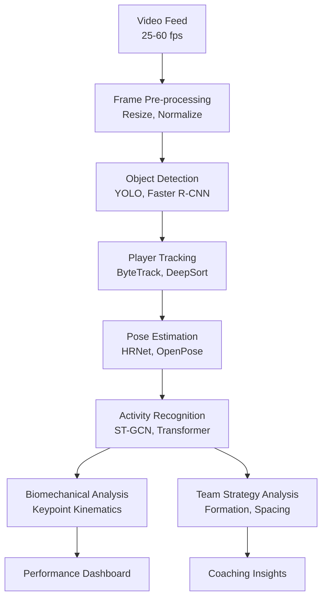

# Introduction to AI for Sports Science

## Overview

Sports science has always sought to measure, analyze, and optimize human athletic performance. What began as stopwatches, film study, and subjective coaching intuition has evolved into a data-driven discipline where AI plays an increasingly central role. From tracking a soccer player's sprint velocity to predicting injury risk before it manifests, AI is transforming how athletes train, teams strategize, and fans engage with sports.

This lesson introduces the intersection of artificial intelligence and sports science — tracing the evolution from manual video analysis to real-time computer vision, from gut-feel training to data-driven periodization, and from reactive coaching to predictive analytics.

---

## The Data Revolution in Sports

### From Film to Bytes

Traditional sports analysis relied on human observers manually logging events. A basketball analyst might spend hours reviewing game footage to count possessions, shooting percentages, and defensive rotations. This approach was labor-intensive, error-prone, and limited in scope.

The proliferation of high-resolution cameras, wearable sensors, and ball-tracking systems has created an unprecedented data deluge:

- **Computer vision systems** capture player positions at 25–60 frames per second across multiple camera angles
- **Wearable devices** (accelerometers, gyroscopes, GPS units) measure physiological signals in real time
- **Ball tracking systems** ( Hawk-Eye, TrackMan) provide precise ball trajectories with millimeter accuracy
- **Environmental sensors** monitor temperature, humidity, and altitude affecting performance

Modern elite sports teams generate terabytes of data per season. AI is essential for making sense of this data flood.

### Key Data Modalities

| Data Type | Examples | AI Application |
|-----------|----------|---------------|
| Video/Computer Vision | Game footage, training video | Pose estimation, tracking |
| Wearable Sensors | Accelerometers, heart rate monitors | Activity classification, fatigue detection |
| Physiological | Lactate, VO₂ max, HRV | Performance modeling, injury risk |
| Environmental | Temperature, altitude, field conditions | Context-aware optimization |
| Strategic | Play diagrams, possession data | Tactical analysis, opponent scouting |

---

## The AI Toolkit for Sports

Several AI subfields converge in sports science applications:

### Computer Vision & Pose Estimation

Convolutional neural networks (CNNs) and pose estimation models (OpenPose, MediaPipe, DeepLabCut) extract player skeletons from video, enabling biomechanical analysis without expensive marker-based systems.

### Time-Series Analysis

Recurrent neural networks (RNNs) and transformers process sequential athlete data to model fatigue accumulation, performance decay, and recovery trajectories.

### Graph Neural Networks

GNNs model team formations and passing networks as graphs, capturing relational structure that CNNs miss.

### Reinforcement Learning

Agents learn optimal strategies through simulation — from game tactics to training load optimization.

### Natural Language Processing

LLMs and sentiment analysis process coaching notes, media coverage, and fan feedback.

---

## Application Domains

### Performance Analysis

AI systems analyze technique biomechanics, workload monitoring, and physiological thresholds to optimize training prescriptions.

### Injury Prevention

Machine learning models predict injury risk by detecting subtle fatigue patterns, asymmetry, and biomechanical stress that precede tissue failure.

### Scouting & Recruitment

Computer vision and predictive models evaluate prospective athletes by analyzing movement patterns, decision-making, and physical attributes independent of human bias.

### Broadcast & Fan Engagement

AI generates automated camera feeds, real-time statistics overlays, and highlight reels from raw game footage.

---

## The Anatomy of a Sports AI System

A typical real-time sports AI pipeline involves:

The system processes video frames through detection, tracking, and pose estimation stages before high-level analysis produces actionable insights for coaches and athletes.

---

## Why This Matters

The convergence of affordable sensors, powerful edge computing, and mature deep learning models has made AI accessible to sports organizations of all sizes. High school football teams now use the same pose estimation technology that professional soccer clubs deploy — democratizing insights that once required expensive laboratory setups.

As we proceed through this track, we'll examine how AI transforms each facet of sports science — from the mathematics of player movement to the ethics of performance surveillance. Each lesson builds on core AI principles while exploring domain-specific challenges unique to sports.

---

## Summary

- Sports generate massive multimodal datasets (video, wearable, physiological)
- AI methods span computer vision, time-series modeling, GNNs, and RL
- Applications include performance optimization, injury prevention, scouting, and fan engagement
- Real-time processing pipelines convert raw sensor data to actionable insights
- The democratization of AI tools is reshaping sports at all levels

---

## What's Next

Lesson 02 dives deep into **player tracking and pose estimation** — the foundational AI technology that makes all subsequent analysis possible. We'll examine the mathematics of multi-camera calibration, the architecture of pose estimation models, and practical considerations for deploying tracking systems in real sporting environments.