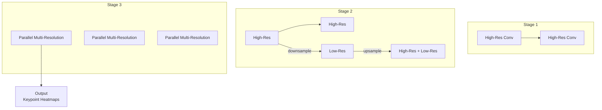

# Player Tracking and Pose Estimation

## Overview

Before any tactical analysis or performance optimization can occur, an AI system must answer a fundamental question: *Where is each player at every moment in time?* Player tracking and pose estimation form the bedrock of modern sports analytics, converting raw video streams into structured spatiotemporal data that higher-level AI systems consume.

This lesson examines the complete pipeline from camera input to tracking output — covering multi-camera calibration, state-of-the-art pose estimation architectures, multi-object tracking algorithms, and the practical challenges of deploying these systems in real sporting environments.

---

## The Tracking Pipeline

A typical player tracking system processes video through several stages:


---

## Camera Calibration

Accurate tracking requires knowing where each camera is in space and how its 2D image coordinates map to real-world positions.

### The Pinhole Camera Model

A camera projects 3D world points onto a 2D image plane. The geometric relationship is described by the **camera projection matrix**:

$$
\mathbf{x} = \mathbf{K} \begin{bmatrix} \mathbf{R} & \mathbf{t} \end{bmatrix} \mathbf{X}_w
$$

where:
- $\mathbf{X}_w$ is a homogeneous 3D point in world coordinates
- $\mathbf{R}$ and $\mathbf{t}$ are the rotation and translation from world to camera coordinates
- $\mathbf{K}$ is the **intrinsic matrix** containing focal lengths $f_x, f_y$, principal point $c_x, c_y$, and lens distortion parameters

### Homography for Planar Motion

Sports field players typically move on a planar surface (the pitch). This allows us to model the mapping between image coordinates and world coordinates as a **homography** (a 2D projective transformation):

$$
\begin{bmatrix} x' \\ y' \\ w' \end{bmatrix} = \begin{bmatrix} h_{11} & h_{12} & h_{13} \\ h_{21} & h_{22} & h_{23} \\ h_{31} & h_{32} & h_{33} \end{bmatrix} \begin{bmatrix} x \\ y \\ 1 \end{bmatrix}
$$

A homography has 8 degrees of freedom (the matrix is defined up to scale). We can estimate it from 4+ correspondences between known field points and their image projections.

### Field Calibration Procedure

1. Detect field lines using deep learning (semantic segmentation)
2. Match detected lines to a known field model
3. Solve for the homography using RANSAC to handle outliers

---

## Pose Estimation Architecture

Pose estimation extracts a skeleton (set of keypoints with confidence scores) from each player in each frame.

### Top-Down vs Bottom-Up

**Top-down** methods first detect all players (object detection), then estimate pose for each detection. This works well when players are clearly separated but struggles with occlusions.

**Bottom-up** methods first detect all keypoints, then group them into player skeletons using associative embeddings. This handles dense scenes better but can have identity switching issues.

### DeepCut: Deep Learning meets Pictorial Structures

The foundational modern approach models pose as a **Pictorial Structure**:

$$
E(\mathbf{l}) = \sum_i D_i(l_i) + \sum_{i,j} P_{ij}(l_i, l_j)
$$

where:
- $D_i(l_i)$ is the detection score for keypoint $i$ at location $l_i$
- $P_{ij}(l_i, l_j)$ is the pairwise potential penalizing inconsistent spatial relationships between keypoints

Deep learning replaces hand-crafted features with learned representations.

### HRNet: Maintaining High Resolution

High-Resolution Network (HRNet) maintains high-resolution feature maps throughout the network rather than progressively downsampling:



HRNet produces heatmaps at multiple scales and fuses them, achieving state-of-the-art accuracy on COCO keypoint detection.

### OpenPose: Real-Time Multi-Person

OpenPose uses Part Affinity Fields (PAFs) — 2D vector fields that encode limb direction and location — to associate keypoints into player skeletons:

$$
L_c^*(p) = \frac{1}{N_c} \sum_{c} \mathbf{v} \cdot L_c^*(p)
$$

where $L_c^*$ represents the PAF for limb class $c$, and $\mathbf{v}$ is the unit vector along the limb direction.

The system performs iterative refinement: detecting keypoint heatmaps, predicting PAFs, and associating them into complete poses.

---

## Multi-Object Tracking

Tracking requires assigning consistent identities to player detections across frames.

### The Tracking Problem

Given detections at each frame $t$: $D_t = \{d_t^1, d_t^2, ..., d_t^{n_t}\}$, we need to produce trajectories $T = \{T_1, T_2, ..., T_k\}$ where each $T_i$ is a sequence of detections belonging to the same player.

### ByteTrack: Detection-Based Tracking

ByteTrack processes all detections (including low-confidence ones) and uses motion information to link tracklets:

```python
class ByteTracker:
    def update(self, detections, frame_id):
        # Associate high confidence detections first
        for threshold in [0.5, 0.3]:
            matched, unmatched_tracks, unmatched_detections = \
                self.association(detections, threshold)

            # Update matched tracks
            for track, det in zip(matched):
                track.update(det)

            # Initialize new tracks from unmatched detections
            for det in unmatched_detections:
                if det.confidence > threshold:
                    self.tracks.append(Track(det))
```

ByteTrack achieved 80+ FPS on MOT17 benchmark while maintaining competitive tracking accuracy.

### Multi-Camera Fusion

When multiple calibrated cameras view the same scene, we can fuse detections to improve accuracy:

```python
def triangulate_position(detections, cameras):
    """
    detections: list of (cam_id, 2D point, confidence)
    cameras: dict of cam_id -> Camera parameters
    Returns: 3D world position (or None if triangulation fails)
    """
    # Construct projection matrices
    P = [cameras[cam_id].K @ cameras[cam_id].RT for cam_id, _, _ in detections]
    points_2d = np.array([pt for _, pt, _ in detections])

    # Triangulate using DLT (Direct Linear Transform)
    A = []
    for i, (P_i, (x, y)) in enumerate(zip(P, points_2d)):
        A.append(x * P_i[2,:] - P_i[0,:])
        A.append(y * P_i[2,:] - P_i[1,:])

    _, _, vt = np.linalg.svd(np.array(A))
    X = vt[-1]
    return X[:3] / X[3]  # Normalize homogeneous coordinates
```

---

## Performance Metrics

Tracking quality is measured by:

### MOTA (Multi-Object Tracking Accuracy)

$$
\text{MOTA} = 1 - \frac{\sum_t (FN_t + FP_t + IDS_t)}{\sum_t GT_t}
$$

where $FN$ = missed detections, $FP$ = false positives, $IDS$ = identity switches.

### IDF1 (ID F1 Score)

The ratio of correctly identified detections over the average number of ground truth and predicted identities:

$$
\text{IDF1} = \frac{2 \sum_t \text{IDTP}_t}{\sum_t \text{IDTP}_t + \text{IDFP}_t + \text{IDFN}_t}
$$

### HOTA (Higher Order Tracking Accuracy)

HOTA decomposes tracking into detection, association, and localization components, providing a more balanced evaluation:

$$
\text{HOTA} = \sqrt{\text{detA} \cdot \text{assocA}}
$$

---

## Practical Challenges

### Occlusion Handling

Players frequently occlude each other. Strategies include:
- **Kalman filtering** for motion prediction when players disappear
- **Re-identification models** (ReID) that recognize players by appearance when they reappear
- **Multi-camera fusion** using epipolar geometry constraints

### Viewpoint Variation

A player captured from directly above looks very different from one captured at ground level. Domain adaptation and view-invariant embeddings help.

### Real-Time Requirements

Sports broadcasting requires low-latency processing. Strategies:
- **TensorRT/ONNX optimization** for inference
- **Temporal smoothing** (e.g., with Kalman filters) to reduce jitter without adding latency
- **Edge deployment** on GPUs embedded in broadcast trucks

---

## Code Example: Player Tracking with YOLO + ByteTrack

```python
from ultralytics import YOLO
from trackers.byte_track import ByteTrack

# Load detection model
detector = YOLO('yolov8x.pt')

# Initialize tracker
tracker = ByteTrack(
    track_thresh=0.6,
    track_buffer=30,
    match_thresh=0.8,
    frame_rate=30
)

def process_frame(frame, frame_id):
    # Detect all players (COCO class 0 = person)
    results = detector(frame, classes=[0], conf=0.5)[0]
    detections = results.boxes

    # Convert to tracker format: [x1, y1, x2, y2, score, class]
    dets = []
    for box in detections:
        x1, y1, x2, y2 = box.xyxy[0].cpu().numpy()
        score = box.conf[0].cpu().numpy()
        dets.append([x1, y1, x2, y2, score, 0])

    # Update tracks
    tracks = tracker.update(np.array(dets), frame_id)

    return tracks

# Process video with tracking
for frame_id, frame in enumerate(video_capture):
    tracks = process_frame(frame, frame_id)
    for track in tracks:
        track_id, bbox, cls_id = track
        # Draw bounding box and ID on frame
        draw_bbox(frame, bbox, track_id)
```

---

## Summary

- Camera calibration transforms 2D image coordinates to 3D world positions via homography
- Pose estimation models (HRNet, OpenPose) extract player skeletons with keypoint heatmaps and part affinity fields
- Multi-object tracking (ByteTrack, DeepSort) assigns consistent identities across frames
- Multi-camera fusion triangulates 3D player positions from multiple views
- Metrics MOTA, IDF1, and HOTA evaluate tracking quality
- Practical challenges include occlusions, viewpoint variation, and real-time requirements

---

## What's Next

Lesson 03 builds on tracking data to analyze **performance, game tactics, and team strategy** — turning raw trajectories into actionable coaching insights.